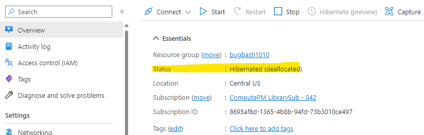
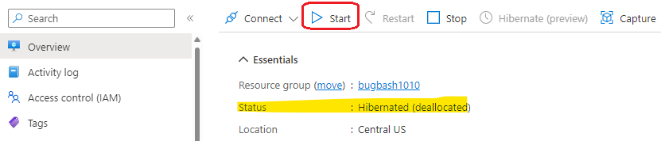
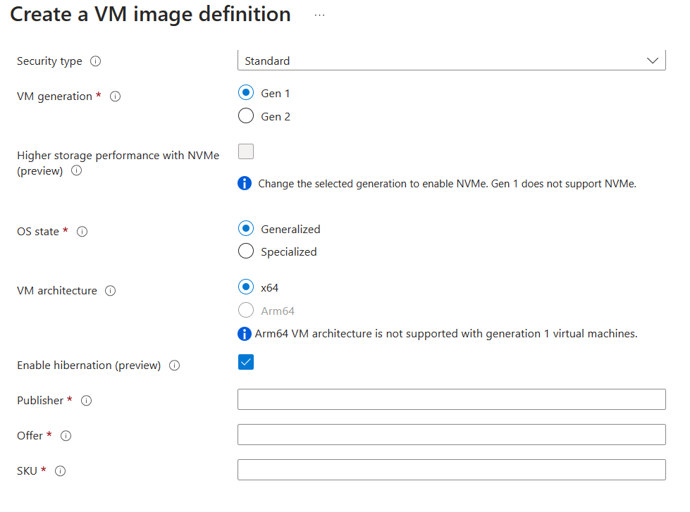

# Hibernating virtual machines overview

**Applies to:** :heavy_check_mark: Linux VMs :heavy_check_mark: Windows VMs

[!INCLUDE [hibernate-resume-intro](../includes/hibernate-resume-intro.md)]

## How hibernation works

When you hibernate a VM, Azure signals the VM's operating system to perform a suspend-to-disk action. Azure stores the memory contents of the VM in the OS disk, then deallocates the VM. When the VM is started again, the memory contents are transferred from the OS disk back into memory. Applications and processes that were previously running in your VM resume from the state prior to hibernation.

Once a VM is in a hibernated state, you aren't billed for the VM usage. Your account is only billed for the storage (OS disk, data disks) and networking resources (IPs, etc.) attached to the VM.

When hibernating a VM:
- Hibernation is triggered on a VM using the Azure portal, CLI, PowerShell, SDKs, or APIs. Azure then signals the guest operating system to perform suspend-to-disk (S4). 
- The VM's memory contents are stored on the OS disk. The VM is then deallocated, releases the lease on the underlying hardware, and is powered off. Refer to VM [states and billing](states-billing.md) for more details on the VM deallocated state.
- Data in the temporary disk isn't persisted.
- The OS disk, data disks, and NICs remain attached to your VM. Any static IPs remain unchanged.
- You aren't billed for the VM usage for a hibernated VM.
- You continue to be billed for the storage and networking resources associated with the hibernated VM.

## Supported configurations
Hibernation support is limited to certain VM sizes and OS versions. Make sure you have a supported configuration before using hibernation.

### Supported Operating systems
Supported operating systems, OS specific limtations, and configuration procedures are listed the OS' documentation section.

[Windows VM hibernation documentation](./windows/hibernate-resume-windows.md)

[Linux VM hibernation documentation](./windows/hibernate-resume-linux.md)

### Supported VM sizes 

VM sizes with up to 32-GB RAM from the following VM series support hibernation.  
- [Dasv5-series](dasv5-dadsv5-series.md) 
- [Dadsv5-series](dasv5-dadsv5-series.md) 
- [Dsv5-series](../virtual-machines/dv5-dsv5-series.md)
- [Ddsv5-series](ddv5-ddsv5-series.md) 

### General limitations
- You can't enable hibernation on existing VMs.
- You can't resize a VM if it has hibernation enabled.
- When a VM is hibernated, you can't attach, detach, or modify any disks or NICs associated with the VM. The VM must instead be moved to a Stop-Deallocated state.
-	When a VM is hibernated, there's no capacity guarantee to ensure that there's sufficient capacity to start the VM later. In the rare case that you encounter capacity issues, you can try starting the VM at a later time. Capacity reservations don't guarantee capacity for hibernated VMs.
-	You can only hibernate a VM using the Azure portal, CLI, PowerShell, SDKs and API. Hibernating the VM using guest OS operations don't result in the VM moving to a hibernated state and the VM continues to be billed.
-	You can't disable hibernation on a VM once enabled.

### Azure feature limitations
-	Ephemeral OS disks
-	Shared disks
-	Availability Sets
-	Virtual Machine Scale Sets Uniform
-	Spot VMs
-	Managed images
-	Azure Backup
-	Capacity reservations

## Prerequisites to use hibernation
- A persistent OS disk large enough to store the contents of the RAM, OS and other applications running on the VM is connected.
- The VM size supports hibernation.
-	The VM OS supports hibernation.
- The Azure VM Agent is installed if you're using the Windows or Linux Hibernate Extensions.
- Hibernation is enabled on your VM when creating the VM.
- If a VM is being created from an OS disk or a Compute Gallery image, then the OS disk or Gallery Image definition supports hibernation. 

## Getting started with hibernation

To hibernate a VM, you must first enable the feature while creating the VM. You can only enable hibernation for a VM on initial creation. You can't enable this feature after the VM is created.

To enable hibernation during VM creation, you can use the Azure portal, CLI, PowerShell, ARM templates and API. 

### [Portal](#tab/enableWithPortal)

To enable hibernation in the Azure portal, check the 'Enable hibernation' box during VM creation.


### [CLI](#tab/enableWithCLI)

To enable hibernation in the Azure CLI, create a VM by running the following [az vm create]() command with ` --enable-hibernation` set to `true`.

```azurecli
 az vm create --resource-group myRG \
   --name myVM \
   --image Win2019Datacenter \
   --public-ip-sku Standard \
   --size Standard_D2s_v5 \
   --enable-hibernation true 
```

### [PowerShell](#tab/enableWithPS)

To enable hibernation when creating a VM with PowerShell, run the following command:

```powershell
New-AzVm ` 
 -ResourceGroupName 'myRG' ` 
 -Name 'myVM' ` 
 -Location 'East US' ` 
 -VirtualNetworkName 'myVnet' ` 
 -SubnetName 'mySubnet' ` 
 -SecurityGroupName 'myNetworkSecurityGroup' ` 
 -PublicIpAddressName 'myPublicIpAddress' ` 
 -Size Standard_D2s_v5 ` 
 -Image Win2019Datacenter ` 
 -HibernationEnabled ` 
 -OpenPorts 80,3389 
```

### [REST](#tab/enableWithREST)

First, [create a VM with hibernation enabled](/rest/api/compute/virtual-machines/create-or-update#create-a-vm-with-hibernationenabled)

```json
PUT https://management.azure.com/subscriptions/{subscription-id}/resourceGroups/myResourceGroup/providers/Microsoft.Compute/virtualMachines/{vm-name}?api-version=2021-11-01
```
Your output should look something like this:

```
{
  "location": "eastus",
  "properties": {
    "hardwareProfile": {
      "vmSize": "Standard_D2s_v5"
    },
    "additionalCapabilities": {
      "hibernationEnabled": true
    },
    "storageProfile": {
      "imageReference": {
        "publisher": "MicrosoftWindowsServer",
        "offer": "WindowsServer",
        "sku": "2019-Datacenter",
        "version": "latest"
      },
      "osDisk": {
        "caching": "ReadWrite",
        "managedDisk": {
          "storageAccountType": "Standard_LRS"
        },
        "name": "vmOSdisk",
        "createOption": "FromImage"
      }
    },
    "networkProfile": {
      "networkInterfaces": [
        {
          "id": "/subscriptions/{subscription-id}/resourceGroups/myResourceGroup/providers/Microsoft.Network/networkInterfaces/{existing-nic-name}",
          "properties": {
            "primary": true
          }
        }
      ]
    },
    "osProfile": {
      "adminUsername": "{your-username}",
      "computerName": "{vm-name}",
      "adminPassword": "{your-password}"
    },
    "diagnosticsProfile": {
      "bootDiagnostics": {
        "storageUri": "http://{existing-storage-account-name}.blob.core.windows.net",
        "enabled": true
      }
    }
  }
}

```
To learn more about REST, check out an [API example](/rest/api/compute/virtual-machines/create-or-update#create-a-vm-with-hibernationenabled)

---

Once you've created a VM with hibernation enabled, you need to configure the guest OS to successfully hibernate your VM. 

## Guest configuration for hibernation

### Linux VMs
To configure hibernation on a Linux guest, check out the [Linux hibernation documentation](./linux/hibernate-resume-linux.md).

### Windows VMs
To configure hibernation on a Windows guest, check out the [Windows hibernation documentation](./windows/hibernate-resume-windows.md).

## View state of hibernated VM 

#### [Portal](#tab/PortalStatCheck)

To view the state of a VM in the portal, check the 'Status' on the overview page. It should report as "Hibernated (deallocated)"



#### [PowerShell](#tab/PSStatCheck)

To view the state of a VM using PowerShell:

```powershell
Get-AzVM -ResourceGroupName "testRG" -Name "testVM" -Status 
```

Your output should look something like this:

```
ResourceGroupName : testRG 
Name              : testVM 
HyperVGeneration  : V1 
Disks[0]          :  
  Name            : testVM_OsDisk_1_d564d424ff9b40c987b5c6636d8ea655 
  Statuses[0]     :  
    Code          : ProvisioningState/succeeded 
    Level         : Info 
    DisplayStatus : Provisioning succeeded 
    Time          : 4/17/2022 2:39:51 AM 
Statuses[0]       :  
  Code            : ProvisioningState/succeeded 
  Level           : Info 
  DisplayStatus   : Provisioning succeeded 
  Time            : 4/17/2022 2:39:51 AM 
Statuses[1]       :  
  Code            : PowerState/deallocated 
  Level           : Info 
  DisplayStatus   : VM deallocated 
Statuses[2]       :  
  Code            : HibernationState/Hibernated 
  Level           : Info 
  DisplayStatus   : VM hibernated 
```

#### [CLI](#tab/CLIStatCheck)

To view the state of a VM using Azure CLI:

```azurecli
az vm get-instance-view -g MyResourceGroup -n myVM
```

Your output should look something like this:
```
{
  "additionalCapabilities": {
    "hibernationEnabled": true,
    "ultraSsdEnabled": null
  },
  "hardwareProfile": {
    "vmSize": "Standard_D2s_v5",
    "vmSizeProperties": null
  },
  "instanceView": {
    "assignedHost": null,
    "bootDiagnostics": null,
    "computerName": null,
    "statuses": [
      {
        "code": "ProvisioningState/succeeded",
        "displayStatus": "Provisioning succeeded",
        "level": "Info",
        "message": null,
        "time": "2022-04-17T02:39:51.122866+00:00"
      },
      {
        "code": "PowerState/deallocated",
        "displayStatus": "VM deallocated",
        "level": "Info",
        "message": null,
        "time": null
      },
      {
        "code": "HibernationState/Hibernated",
        "displayStatus": "VM hibernated",
        "level": "Info",
        "message": null,
        "time": null
      }
    ],
  },
```

#### [REST API](#tab/APIStatCheck)

To view the state of a VM using REST API, run this command:

```json
GET https://management.azure.com/subscriptions/{subscriptionId}/resourceGroups/{resourceGroupName}/providers/Microsoft.Compute/virtualMachines/{vmName}/instanceView?api-version=2020-12-01 
```

Your output should look something like this:

```
"statuses":  
[ 
    { 
      "code": "ProvisioningState/succeeded", 
      "level": "Info", 
      "displayStatus": "Provisioning succeeded", 
      "time": "2019-10-14T21:30:12.8051917+00:00" 
    }, 
    { 
      "code": "PowerState/deallocated", 
      "level": "Info", 
      "displayStatus": "VM deallocated" 
    }, 
   { 
      "code": "HibernationState/Hibernated", 
      "level": "Info", 
      "displayStatus": "VM hibernated" 
    } 
] 
```
---

## Start hibernated VMs 

You can start hibernated VMs just like how you would start a stopped VM. This can be done through the Azure portal, the Azure CLI, PowerShell, or REST API.

### [Portal](#tab/PortalStartHiber)
To start a hibernated VM using the Azure portal, click the 'Start' button on the VM Overview page.



### [CLI](#tab/CLIStartHiber)

To start a hibernated VM using the Azure CLI, run this command:
```azurecli
az vm start -g MyResourceGroup -n MyVm
```

### [PowerShell](#tab/PSStartHiber)

To start a hibernated VM using PowerShell, run this command:

```powershell
Start-AzVM -ResourceGroupName "ExampleRG" -Name "ExampleName"
```

### [REST API](#tab/RESTStartHiber)

To start a hibernated VM using the REST API, run this command:

```json
POST https://management.azure.com/subscriptions/../providers/Microsoft.Compute/virtualMachines/{vmName}/start?api-version=2020-12-01 
```
---

## Deploy hibernation enabled VMs from the Azure Compute Gallery

VMs created from Compute Gallery images can also be enabled for hibernation. Ensure that the OS version associated with your Gallery image supports hibernation on Azure. Refer to the list of supported OS versions.

To create VMs with hibernation enabled using Gallery images, you'll first need to create a new image definition with the hibernation property enabled. Once this feature property is enabled on the Gallery Image definition, you can [create an image version](/azure/virtual-machines/image-version?tabs=portal#create-an-image) and use that image version to create hibernation enabled VMs. 

>[!NOTE]
> For specialized Windows images, the page file location must be set to C: drive in order for Azure to successfully configure your guest OS for hibernation.
> If you're creating an Image version from an existing VM, you should first move the page file to the OS disk and then use the VM as the source for the Image version.

#### [Portal](#tab/PortalImageGallery)
To create an image definition with the hibernation property enabled, select the checkmark for 'Enable hibernation'.




#### [CLI](#tab/CLIImageGallery)
```azurecli
az sig image-definition create --resource-group MyResourceGroup \
--gallery-name MyGallery --gallery-image-definition MyImage \
--publisher GreatPublisher --offer GreatOffer --sku GreatSku \
--os-type linux --os-state Specialized \
--features IsHibernateSupported=true
```

#### [PowerShell](#tab/PSImageGallery)
```powershell
$rgName = "myResourceGroup"
$galleryName = "myGallery"
$galleryImageDefinitionName = "myImage"
$location = "eastus"
$publisherName = "GreatPublisher"
$offerName = "GreatOffer"
$skuName = "GreatSku"
$description = "My gallery"
$IsHibernateSupported = @{Name='IsHibernateSupported';Value='True'} 
$features = @($IsHibernateSupported)
New-AzGalleryImageDefinition -ResourceGroupName $rgName -GalleryName $galleryName -Name $galleryImageDefinitionName -Location $location -Publisher $publisherName -Offer $offerName -Sku $skuName -OsState "Generalized" -OsType "Windows" -Description $description -Feature $features
```
---

## Deploy hibernation enabled VMs from an OS disk 

VMs created from OS disks can also be enabled for hibernation. Ensure that the OS version associated with your OS disk supports hibernation on Azure. Refer to the list of supported OS versions.

To create VMs with hibernation enabled using OS disks, ensure that the OS disk has the hibernation property enabled. Refer to API example to enable this property on OS disks. Once the hibernation property is enabled on the OS disk, you can create hibernation enabled VMs using that OS disk.

```
PATCH https://management.azure.com/subscriptions/{subscription-id}/resourceGroups/myResourceGroup/providers/Microsoft.Compute/disks/myDisk?api-version=2021-12-01

{
  "properties": {
    "supportsHibernation": true
  }
}
```

## Troubleshooting
Refer to the [Hibernate troubleshooting guide](./hibernate-resume-troubleshooting.md) for more information

## FAQs

- What are the charges for using this feature?
    - Once a VM is placed in a hibernated state, you aren't charged for the VM, just like how you aren't charged for VMs in a stop (deallocated) state. You're only charged for the OS disk, data disks and any static IPs associated with the VM.

- Can I enable hibernation on existing VMs?
    - No, you can't enable hibernation on existing VMs. You can only enable hibernation at the time of creating a VM.

- Can I resize a VM with hibernation enabled?
    - No. Once you enable hibernation on a VM, you can't resize the VM. 

- Can I modify a VM once it is in a hibernated state?
    - No, once a VM is in a hibernated state, you can't perform actions like resizing the VM and modifying the disks. Additionally, you can't detach any disks or networking resources that are currently attached to the VM or attach new resources to the VM. You can however stop(deallocate) or delete the VM if you want to detach these resources. 

- What is the difference between stop(deallocating) and hibernating a VM?
    - When you stop(deallocate) a VM, the VM shuts down without persisting the memory contents. You can resize stop(deallocated) VMs and detach/attach disks to the VM.

    - When you hibernate a VM, the memory contents are first persisted in the OS disk, then the VM hibernates. You can't resize VMs in a hibernated state, nor detach/attach disks and networking resources to the VM.

- Can you disable hibernation?
    - No, you can't disable hibernation on a VM. 

- Can I initiate hibernation from within the VM?
    - To hibernate a VM you should use the Azure portal, CLI, PowerShell commands, SDKs and APIs. Triggering hibernation from inside the VM still results in your VM being billed for the compute resources. 

- When a VM is hibernated, is there a capacity assurance at the time of starting the VM?
    - No, there's no capacity assurance for starting hibernated VMs. In rare scenarios if you encounter a capacity issue, then you can try starting the VM at a later time. 

## Next Steps:
- [Learn more about Azure billing](/azure/cost-management-billing/)
- [Learn about Azure Virtual Desktop](../virtual-desktop/overview.md)
- [Look into Azure VM Sizes](sizes.md)
