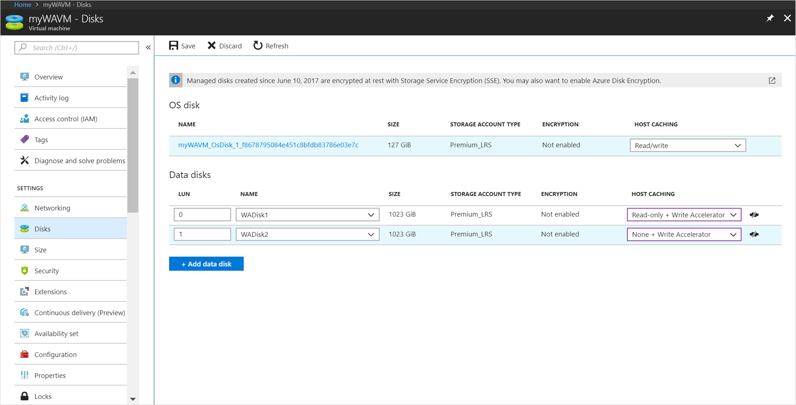

# Enable Write Accelerator

**Applies to:** :heavy_check_mark: Linux VMs :heavy_check_mark: Windows VMs :heavy_check_mark: Flexible scale sets :heavy_check_mark: Uniform scale sets

Write Accelerator is a disk capability for M-Series Virtual Machines (VMs) on Premium Storage with Azure Managed Disks exclusively. As the name states, the purpose of the functionality is to improve the I/O latency of writes against Azure Premium Storage. Write Accelerator is ideally suited where log file updates are required to persist to disk in a highly performant manner for modern databases.

Write Accelerator is generally available for M-series VMs in the Public Cloud.

## Planning for using Write Accelerator

Write Accelerator should be used for the volumes that contain the transaction log or redo logs of a DBMS. It is not recommended to use Write Accelerator for the data volumes of a DBMS as the feature has been optimized to be used against log disks.

Write Accelerator only works in conjunction with [Azure managed disks](https://azure.microsoft.com/services/managed-disks/).

> [!IMPORTANT]
> Enabling Write Accelerator for the operating system disk of the VM will reboot the VM.
>
> To enable Write Accelerator to an existing Azure disk that is NOT part of a volume build out of multiple disks with Windows disk or volume managers, Windows Storage Spaces, Windows Scale-out file server (SOFS), Linux LVM, or MDADM, the workload accessing the Azure disk needs to be shut down. Database applications using the Azure disk MUST be shut down.
>
> If you want to enable or disable Write Accelerator for an existing volume that is built out of multiple Azure Premium Storage disks and striped using Windows disk or volume managers, Windows Storage Spaces, Windows Scale-out file server (SOFS), Linux LVM or MDADM, all disks building the volume must be enabled or disabled for Write Accelerator in separate steps. **Before enabling or disabling Write Accelerator in such a configuration, shut down the Azure VM**.

Enabling Write Accelerator for OS disks should not be necessary for SAP-related VM configurations.

### Restrictions when using Write Accelerator

When using Write Accelerator for an Azure disk/VHD, these restrictions apply:

- The Premium disk caching must be set to 'None' or 'Read Only'. All other caching modes are not supported.
- Snapshots are currently supported for only Write Accelerator-enabled data disks, and not the OS disk. During backup, the Azure Backup service automatically backs up and protects Write Accelerator-enabled data disks attached to the VM.
- Only smaller I/O sizes (<=64 KiB) are taking the accelerated path. In workload situations where data is getting bulk loaded or where the transaction log buffers of the different DBMS are filled to a larger degree before getting persisted to the storage, chances are that the I/O written to disk is not taking the accelerated path.

There are limits of Azure Premium Storage VHDs per VM that can be supported by Write Accelerator. The current limits are:

| VM SKU | Number of Write Accelerator disks | Write Accelerator Disk IOPS per VM |
| --- | --- | --- |
| M416ms_v2, M416s_8_v2, M416s_v2| 16 | 20000 |
| M208ms_v2, M208s_v2| 8 | 10000 |
| M192ids_v2, M192idms_v2, M192is_v2, M192ims_v2, | 16 | 20000 |
| M128ms, M128s, M128ds_v2, M128dms_v2, M128s_v2, M128ms_v2 | 16 | 20000 |
| M64ms, M64ls, M64s, M64ds_v2, M64dms_v2, M64s_v2, M64ms_v2 | 8 | 10000 |
| M32ms, M32ls, M32ts, M32s, M32dms_v2, M32ms_v2 | 4 | 5000 |
| M16ms, M16s | 2 | 2500 |
| M8ms, M8s | 1 | 1250 |

The IOPS limits are per VM and *not* per disk. All Write Accelerator disks share the same IOPS limit per VM. Attached disks cannot exceed the write accelerator IOPS limit for a VM. For an example, even though the attached disks can do 30,000 IOPS, the system does not allow the disks to go above 20,000 IOPS for M416ms_v2.

## Enabling Write Accelerator on a specific disk

The next few sections will describe how Write Accelerator can be enabled on Azure Premium Storage VHDs.

### Prerequisites

The following prerequisites apply to the usage of Write Accelerator at this point in time:

- The disks you want to apply Azure Write Accelerator against need to be [Azure managed disks](https://azure.microsoft.com/services/managed-disks/) on Premium Storage.
- You must be using an M-series VM

## Enabling Azure Write Accelerator using Azure PowerShell

The Azure PowerShell module from version 5.5.0 include the changes to the relevant cmdlets to enable or disable Write Accelerator for specific Azure Premium Storage disks.
In order to enable or deploy disks supported by Write Accelerator, the following PowerShell commands got changed, and extended to accept a parameter for Write Accelerator.

A new switch parameter, **-WriteAccelerator** has been added to the following cmdlets:

- [Set-AzVMOsDisk](/powershell/module/az.compute/set-azvmosdisk)
- [Add-AzVMDataDisk](/powershell/module/az.compute/Add-AzVMDataDisk)
- [Set-AzVMDataDisk](/powershell/module/az.compute/Set-AzVMDataDisk)
- [Add-AzVmssDataDisk](/powershell/module/az.compute/Add-AzVmssDataDisk)

>[!NOTE]
> If enabling Write Accelerator on Virtual Machine Scale Sets using Flexible Orchestration Mode, you need to enable it on each individual instance. 

Not giving the parameter sets the property to false and will deploy disks that have no support by Write Accelerator.

A new switch parameter, **-OsDiskWriteAccelerator** was added to the following cmdlets:

- [Set-AzVmssStorageProfile](/powershell/module/az.compute/Set-AzVmssStorageProfile)

Not specifying the parameter sets the property to false by default, returning disks that don't leverage Write Accelerator.

A new optional Boolean (non-nullable) parameter, **-OsDiskWriteAccelerator** was added to the following cmdlets:

- [Update-AzVM](/powershell/module/az.compute/Update-AzVM)
- [Update-AzVmss](/powershell/module/az.compute/Update-AzVmss)

Specify either $true or $false to control support of Azure Write Accelerator with the disks.

Examples of commands could look like:

```azurepowershell-interactive
New-AzVMConfig | Set-AzVMOsDisk | Add-AzVMDataDisk -Name "datadisk1" | Add-AzVMDataDisk -Name "logdisk1" -WriteAccelerator | New-AzVM

Get-AzVM | Update-AzVM -OsDiskWriteAccelerator $true

New-AzVmssConfig | Set-AzVmssStorageProfile -OsDiskWriteAccelerator | Add-AzVmssDataDisk -Name "datadisk1" -WriteAccelerator:$false | Add-AzVmssDataDisk -Name "logdisk1" -WriteAccelerator | New-AzVmss

Get-AzVmss | Update-AzVmss -OsDiskWriteAccelerator:$false
```

Two main scenarios can be scripted as shown in the following sections.

### Adding a new disk supported by Write Accelerator using PowerShell

You can use this script to add a new disk to your VM. The disk created with this script uses Write Accelerator.

Replace `myVM`, `myWAVMs`, `log001`, size of the disk, and LunID of the disk with values appropriate for your specific deployment.

```azurepowershell-interactive
# Specify your VM Name
$vmName="myVM"
#Specify your Resource Group
$rgName = "myWAVMs"
#data disk name
$datadiskname = "log001"
#LUN Id
$lunid=8
#size
$size=1023
#Pulls the VM info for later
$vm=Get-AzVM -ResourceGroupName $rgname -Name $vmname
#add a new VM data disk
Add-AzVMDataDisk -CreateOption empty -DiskSizeInGB $size -Name $vmname-$datadiskname -VM $vm -Caching None -WriteAccelerator:$true -lun $lunid
#Updates the VM with the disk config - does not require a reboot
Update-AzVM -ResourceGroupName $rgname -VM $vm
```

### Enabling Write Accelerator on an existing Azure disk using PowerShell

You can use this script to enable Write Accelerator on an existing disk. Replace `myVM`, `myWAVMs`, and `test-log001` with values appropriate for your specific deployment. The script adds Write Accelerator to an existing disk where the value for **$newstatus** is set to '$true'. Using the value '$false' will disable Write Accelerator on a given disk.

```azurepowershell-interactive
#Specify your VM Name
$vmName="myVM"
#Specify your Resource Group
$rgName = "myWAVMs"
#data disk name
$datadiskname = "test-log001" 
#new Write Accelerator status ($true for enabled, $false for disabled) 
$newstatus = $true
#Pulls the VM info for later
$vm=Get-AzVM -ResourceGroupName $rgname -Name $vmname
#add a new VM data disk
Set-AzVMDataDisk -VM $vm -Name $datadiskname -Caching None -WriteAccelerator:$newstatus
#Updates the VM with the disk config - does not require a reboot
Update-AzVM -ResourceGroupName $rgname -VM $vm
```

> [!Note]
> Executing the script above will detach the disk specified, enable Write Accelerator against the disk, and then attach the disk again

## Enabling Write Accelerator using the Azure portal

You can enable Write Accelerator via the portal where you specify your disk caching settings:



## Enabling Write Accelerator using the Azure CLI

You can use the [Azure CLI](/cli/azure/) to enable Write Accelerator.

To enable Write Accelerator on an existing disk, use [az vm update](/cli/azure/vm#az-vm-update), you can use the following examples if you replace the diskName, VMName, and ResourceGroup with your own values: `az vm update -g group1 -n vm1 -write-accelerator 1=true`

To attach a disk with Write Accelerator enabled use [az vm disk attach](/cli/azure/vm/disk#az-vm-disk-attach), you can use the following example if you substitute in your own values: `az vm disk attach -g group1 -vm-name vm1 -disk d1 --enable-write-accelerator`

To disable Write Accelerator, use [az vm update](/cli/azure/vm#az-vm-update), setting the properties to false: `az vm update -g group1 -n vm1 -write-accelerator 0=false 1=false`

## Enabling Write Accelerator using REST APIs

To deploy through Azure REST API, you need to install the Azure armclient.

### Install armclient

To run armclient, you need to install it through Chocolatey. You can install it through cmd.exe or PowerShell. Use elevated rights for these commands (“Run as Administrator”).

Using cmd.exe, run the following command: `@"%SystemRoot%\System32\WindowsPowerShell\v1.0\powershell.exe" -NoProfile -InputFormat None -ExecutionPolicy Bypass -Command "iex ((New-Object System.Net.WebClient).DownloadString('https://chocolatey.org/install.ps1'))" && SET "PATH=%PATH%;%ALLUSERSPROFILE%\chocolatey\bin"`

Using PowerShell, run the following command: `Set-ExecutionPolicy Bypass -Scope Process -Force; iex ((New-Object System.Net.WebClient).DownloadString('https://chocolatey.org/install.ps1'))`

Now you can install the armclient by using the following command in either cmd.exe or PowerShell `choco install armclient`

### Getting your current VM configuration

To change the attributes of your disk configuration, you first need to get the current configuration in a JSON file. You can get the current configuration by executing the following command: `armclient GET /subscriptions/<<subscription-ID<</resourceGroups/<<ResourceGroup>>/providers/Microsoft.Compute/virtualMachines/<<virtualmachinename>>?api-version=2017-12-01 > <<filename.json>>`

Replace the terms within '<<   >>' with your data, including the file name the JSON file should have.

The output could look like:

```output
{
  "properties": {
    "vmId": "2444c93e-f8bb-4a20-af2d-1658d9dbbbcb",
    "hardwareProfile": {
      "vmSize": "Standard_M64s"
    },
    "storageProfile": {
      "imageReference": {
        "publisher": "SUSE",
        "offer": "SLES-SAP",
        "sku": "12-SP3",
        "version": "latest"
      },
      "osDisk": {
        "osType": "Linux",
        "name": "mylittlesap_OsDisk_1_754a1b8bb390468e9b4c429b81cc5f5a",
        "createOption": "FromImage",
        "caching": "ReadWrite",
        "managedDisk": {
          "storageAccountType": "Premium_LRS",
          "id": "/subscriptions/XXXXXXXXXXXXXXXXXXXXXXXXXXXXXXXXXXXX/resourceGroups/mylittlesap/providers/Microsoft.Compute/disks/mylittlesap_OsDisk_1_754a1b8bb390468e9b4c429b81cc5f5a"
        },
        "diskSizeGB": 30
      },
      "dataDisks": [
        {
          "lun": 0,
          "name": "data1",
          "createOption": "Attach",
          "caching": "None",
          "managedDisk": {
            "storageAccountType": "Premium_LRS",
            "id": "/subscriptions/XXXXXXXXXXXXXXXXXXXXXXXXXXXXXXXXXXXX/resourceGroups/mylittlesap/providers/Microsoft.Compute/disks/data1"
          },
          "diskSizeGB": 1023
        },
        {
          "lun": 1,
          "name": "log1",
          "createOption": "Attach",
          "caching": "None",
          "managedDisk": {
            "storageAccountType": "Premium_LRS",
            "id": "/subscriptions/XXXXXXXXXXXXXXXXXXXXXXXXXXXXXXXXXXXX/resourceGroups/mylittlesap/providers/Microsoft.Compute/disks/data2"
          },
          "diskSizeGB": 1023
        }
      ]
    },
    "osProfile": {
      "computerName": "mylittlesapVM",
      "adminUsername": "pl",
      "linuxConfiguration": {
        "disablePasswordAuthentication": false
      },
      "secrets": []
    },
    "networkProfile": {
      "networkInterfaces": [
        {
          "id": "/subscriptions/XXXXXXXXXXXXXXXXXXXXXXXXXXXXXXXXXXXX/resourceGroups/mylittlesap/providers/Microsoft.Network/networkInterfaces/mylittlesap518"
        }
      ]
    },
    "diagnosticsProfile": {
      "bootDiagnostics": {
        "enabled": true,
        "storageUri": "https://mylittlesapdiag895.blob.core.windows.net/"
      }
    },
    "provisioningState": "Succeeded"
  },
  "type": "Microsoft.Compute/virtualMachines",
  "location": "westeurope",
  "id": "/subscriptions/XXXXXXXXXXXXXXXXXXXXXXXXXXXXXXXXXXXX/resourceGroups/mylittlesap/providers/Microsoft.Compute/virtualMachines/mylittlesapVM",
  "name": "mylittlesapVM"

```

Next, update the JSON file and to enable Write Accelerator on the disk called 'log1'. This can be accomplished by adding this attribute into the JSON file after the cache entry of the disk.

```JSON
        {
          "lun": 1,
          "name": "log1",
          "createOption": "Attach",
          "caching": "None",
          "writeAcceleratorEnabled": true,
          "managedDisk": {
            "storageAccountType": "Premium_LRS",
            "id": "/subscriptions/XXXXXXXXXXXXXXXXXXXXXXXXXXXXXXXXXXXX/resourceGroups/mylittlesap/providers/Microsoft.Compute/disks/data2"
          },
          "diskSizeGB": 1023
        }
```

Then update the existing deployment with this command: `armclient PUT /subscriptions/<<subscription-ID<</resourceGroups/<<ResourceGroup>>/providers/Microsoft.Compute/virtualMachines/<<virtualmachinename>>?api-version=2017-12-01 @<<filename.json>>`

The output should look like the one below. You can see that Write Accelerator enabled for one disk.

```output
{
  "properties": {
    "vmId": "2444c93e-f8bb-4a20-af2d-1658d9dbbbcb",
    "hardwareProfile": {
      "vmSize": "Standard_M64s"
    },
    "storageProfile": {
      "imageReference": {
        "publisher": "SUSE",
        "offer": "SLES-SAP",
        "sku": "12-SP3",
        "version": "latest"
      },
      "osDisk": {
        "osType": "Linux",
        "name": "mylittlesap_OsDisk_1_754a1b8bb390468e9b4c429b81cc5f5a",
        "createOption": "FromImage",
        "caching": "ReadWrite",
        "managedDisk": {
          "storageAccountType": "Premium_LRS",
          "id": "/subscriptions/XXXXXXXXXXXXXXXXXXXXXXXXXXXXXXXXXXXX/resourceGroups/mylittlesap/providers/Microsoft.Compute/disks/mylittlesap_OsDisk_1_754a1b8bb390468e9b4c429b81cc5f5a"
        },
        "diskSizeGB": 30
      },
      "dataDisks": [
        {
          "lun": 0,
          "name": "data1",
          "createOption": "Attach",
          "caching": "None",
          "managedDisk": {
            "storageAccountType": "Premium_LRS",
            "id": "/subscriptions/XXXXXXXXXXXXXXXXXXXXXXXXXXXXXXXXXXXX/resourceGroups/mylittlesap/providers/Microsoft.Compute/disks/data1"
          },
          "diskSizeGB": 1023
        },
        {
          "lun": 1,
          "name": "log1",
          "createOption": "Attach",
          "caching": "None",
          "writeAcceleratorEnabled": true,
          "managedDisk": {
            "storageAccountType": "Premium_LRS",
            "id": "/subscriptions/XXXXXXXXXXXXXXXXXXXXXXXXXXXXXXXXXXXX/resourceGroups/mylittlesap/providers/Microsoft.Compute/disks/data2"
          },
          "diskSizeGB": 1023
        }
      ]
    },
    "osProfile": {
      "computerName": "mylittlesapVM",
      "adminUsername": "pl",
      "linuxConfiguration": {
        "disablePasswordAuthentication": false
      },
      "secrets": []
    },
    "networkProfile": {
      "networkInterfaces": [
        {
          "id": "/subscriptions/XXXXXXXXXXXXXXXXXXXXXXXXXXXXXXXXXXXX/resourceGroups/mylittlesap/providers/Microsoft.Network/networkInterfaces/mylittlesap518"
        }
      ]
    },
    "diagnosticsProfile": {
      "bootDiagnostics": {
        "enabled": true,
        "storageUri": "https://mylittlesapdiag895.blob.core.windows.net/"
      }
    },
    "provisioningState": "Succeeded"
  },
  "type": "Microsoft.Compute/virtualMachines",
  "location": "westeurope",
  "id": "/subscriptions/XXXXXXXXXXXXXXXXXXXXXXXXXXXXXXXXXXXX/resourceGroups/mylittlesap/providers/Microsoft.Compute/virtualMachines/mylittlesapVM",
  "name": "mylittlesapVM"
```

Once you've made this change, the drive should be supported by Write Accelerator.
