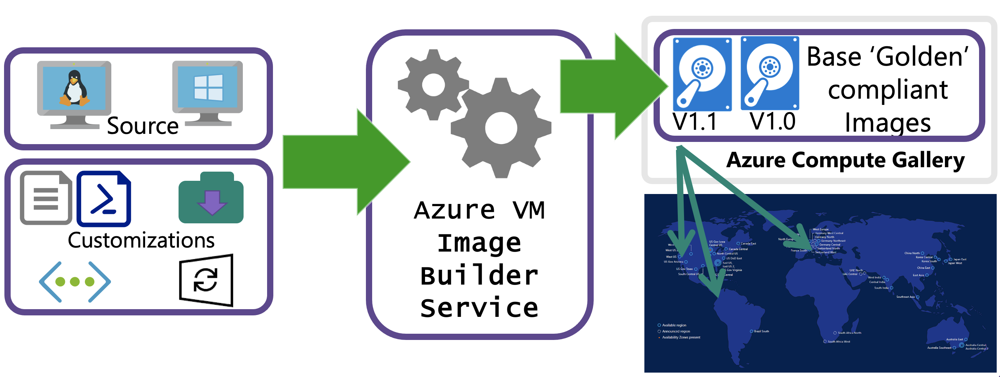

# Azure VM Image Builder overview

**Applies to:** :heavy_check_mark: Linux VMs :heavy_check_mark: Windows VMs :heavy_check_mark: Flexible scale sets :heavy_check_mark: Uniform scale sets

By using standardized virtual machine (VM) images, your organization can more easily migrate to the cloud and help ensure consistency in your deployments. Images ordinarily include predefined security, configuration settings, and any necessary software. Setting up your own imaging pipeline requires time, infrastructure, and many other details. With Azure VM Image Builder, you need only create a configuration that describes your image and submit it to the service, where the image is built and then distributed. 

With VM Image Builder, you can migrate your existing image customization pipeline to Azure as you continue to use existing scripts, commands, and processes. You can integrate your core applications into a VM image, so that your VMs can take on workloads after the images are created. You can even add configurations to build images for Azure Virtual Desktop, as virtual hard discs (VHDs) for use in Azure Stack, or for ease of exporting.

VM Image Builder lets you start with Windows or Linux images either from Azure Marketplace or as existing custom images, and then add your own customizations. You can also specify where you want your resulting images to be hosted in [Azure Compute Gallery](shared-image-galleries.md) (formerly Shared Image Gallery), as managed images or as VHDs.

## Features

Although it's possible to create custom VM images by hand or by other tools, the process can be cumbersome and unreliable. VM Image Builder, which is built on [HashiCorp Packer](https://www.packer.io/), gives you the benefits of a managed service.

### Simplicity

To reduce the complexity of creating VM images, VM Image Builder:

- Removes the need to use complex tooling, processes, and manual steps to create a VM image. VM Image Builder abstracts out all these details and hides Azure-specific requirements, such as the need to generalize the image (Sysprep). And it gives more advanced users the ability to override such requirements.

- Can be integrated with existing image build pipelines for a click-and-go experience. To do so, you can either call VM Image Builder from your pipeline or use an [Azure VM Image Builder service DevOps task (preview)](./linux/image-builder-devops-task.md).

- Can fetch customization data from various sources, which removes the need to collect them all from one place.

- Can be integrated with Compute Gallery, which creates an image management system with which to distribute, replicate, version, and scale images globally. Additionally, you can distribute the same resulting image as a VHD or as one or more managed images, without having to rebuild them from scratch.

### Infrastructure as code

With VM Image Builder, there's no need to manage your long-term infrastructure (for example, storage accounts that hold customization data) or transient infrastructure (for example,  temporary VMs for building images). 

VM Image Builder stores your VM image build artifacts as Azure resources. This feature removes both the need to maintain offline definitions and the risk of environment drifts that are caused by accidental deletions or updates.

### Security

To help keep your images secure, VM Image Builder:

- Enables you to create baseline images (that is, your minimum security and corporate configurations) and allows other departments to customize them further. You can help keep these images secure and compliant by using VM Image Builder to quickly rebuild a golden image that uses the latest patched version of a source image. VM Image Builder also makes it easier for you to build images that meet the Azure Windows security baseline. For more information, see [VM Image Builder - Windows baseline template](https://github.com/Azure/azure-quickstart-templates/tree/master/demos/imagebuilder-windowsbaseline).

- Enables you to fetch your customization artifacts without having to make them publicly accessible. VM Image Builder can use your [Azure Managed Identity](../active-directory/managed-identities-azure-resources/overview.md) to fetch these resources, and you can restrict the privileges of this identity as tightly as required by using Azure role-based access control (Azure RBAC). You can both keep your artifacts secret and prevent tampering by unauthorized actors.

- Securely stores copies of customization artifacts, transient compute and storage resources, and their resulting images within your subscription, because access is controlled by Azure RBAC. This level of security, which also applies to the build VM that's used to create the customized image, helps prevent your customization scripts and files from being copied to an unknown VM in an unknown subscription. And you can achieve a high degree of separation from other customers’ workloads by using [Isolated VM offerings](./isolation.md) for the build VM.

- Enables you to connect VM Image Builder to your existing virtual networks, so that you can communicate with existing configuration servers, such as DSC (desired state configuration pull server), Chef, and Puppet, file shares, or any other routable servers and services.

- Can be configured to assign your user-assigned identities to the VM Image Builder build VM (that is, the VM that the VM Image Builder service creates in your subscription and uses to build and customize the image). You can then use these identities at customization time to access Azure resources, including secrets, in your subscription. There's no need to assign VM Image Builder direct access to those resources.


## Regions

The VM Image Builder service is available in the following regions:  

>[!NOTE]
> You can still distribute images outside these regions.
> 
- East US
- East US 2
- West Central US
- West US
- West US 2
- West US 3
- South Central US
- North Europe
- West Europe
- South East Asia
- Australia Southeast
- Australia East
- UK South
- UK West
- Brazil South
- Canada Central
- Central India
- Central US
- France Central
- Germany West Central
- Japan East
- North Central US
- Norway East
- Switzerland North
- Jio India West
- UAE North
- East Asia
- Korea Central
- South Africa North
- Qatar Central
- USGov Arizona (public preview)
- USGov Virginia (public preview)
- China North 3 (public preview)
- Sweden Central
- Poland Central

To access the Azure VM Image Builder public preview in the Fairfax regions (USGov Arizona and USGov Virginia), you must register the *Microsoft.VirtualMachineImages/FairfaxPublicPreview* feature. To do so, run the following command in either PowerShell or Azure CLI:

### [Azure PowerShell](#tab/azure-powershell)

```azurepowershell-interactive
Register-AzProviderPreviewFeature -ProviderNamespace Microsoft.VirtualMachineImages -Name FairfaxPublicPreview
```

### [Azure CLI](#tab/azure-cli)

```azurecli-interactive
az feature register --namespace Microsoft.VirtualMachineImages --name FairfaxPublicPreview
```
---

To access the Azure VM Image Builder public preview in the China North 3 region, you must register the *Microsoft.VirtualMachineImages/MooncakePublicPreview* feature. To do so, run the following command in either PowerShell or Azure CLI:

### [Azure PowerShell](#tab/azure-powershell)

```azurepowershell-interactive
Register-AzProviderPreviewFeature -ProviderNamespace Microsoft.VirtualMachineImages -Name MooncakePublicPreview
```

### [Azure CLI](#tab/azure-cli)

```azurecli-interactive
az feature register --namespace Microsoft.VirtualMachineImages --name MooncakePublicPreview
```
---

## OS support

VM Image Builder is designed to work with all Azure Marketplace base operating system images.


> [!NOTE]
> You can now use the Azure Image Builder service inside the portal as of March 2023. [Get started](https://ms.portal.azure.com/#create/Microsoft.ImageTemplate) with building and validating custom images inside the portal.

## Confidential VM and Trusted Launch Support

VM Image Builder has extended support for TrustedLaunchSupported and ConfidentialVMSupported images, with certain constraints. Below is the list of constraints:

| SecurityType | Support status |
|--------------|----------------|
| TrustedLaunchSupported | Support as a source image for image builds |
| ConfidentialVMSupported | Support as a source image for image builds |
| TrustedLaunch | Not supported as a source image |
| ConfidentialVM | Not supported as a source image |

> [!NOTE]
> When using TrustedLaunchSupported images, it's important that the source and distribute must both be TrustedLaunchSupported for it to be supported. If the source is normal and the distribute is TrustedLaunchSupported, or if the source is TrustedLaunchSupported and the distribute is normal Gen2, it's not supported.

## How it works

VM Image Builder is a fully managed Azure service that's accessible to Azure resource providers. Resource providers configure it by specifying a source image, a customization to perform, and where the new image is to be distributed. A high-level workflow is illustrated in the following diagram:



You can pass template configurations by using Azure PowerShell, the Azure CLI, or Azure Resource Manager templates, or by using a VM Image Builder DevOps task. When you submit the configuration to the service, Azure creates an *image template resource*. When the image template resource is created, a *staging resource group* is created in your subscription, in the following format: `IT_\<DestinationResourceGroup>_\<TemplateName>_\(GUID)`. The staging resource group contains files and scripts, which are referenced in the File, Shell, and PowerShell customization in the ScriptURI property.

To run the build, you invoke `Run` on the VM Image Builder template resource. The service then deploys additional resources for the build, such as a VM, network, disk, and network adapter. 

If you build an image without using an existing virtual network, VM Image Builder also deploys a public IP and network security group, and it connects to the build VM by using Secure Shell (SSH) or Windows Remote Management (WinRM) protocol. 

If you select an existing virtual network, the service is deployed via Azure Private Link, and a public IP address isn't required. For more information, see [VM Image Builder networking overview](./linux/image-builder-networking.md).

When the build finishes, all resources are deleted, except for the staging resource group and the storage account. You can remove them by deleting the image template resource, or you can leave them in place to run the build again.

For multiple examples, step-by-step guides, configuration templates, and solutions, go to the [VM Image Builder GitHub repository](https://github.com/azure/azvmimagebuilder).

### Move support

The image template resource is immutable, and it contains links to resources and the staging resource group. Therefore, this resource type doesn't support being moved. 

If you want to move the image template resource, either make sure that you have a copy of the configuration template or, if you don't have a copy, extract the existing configuration from the resource. Then, create a new image template resource in the new resource group with a new name, and delete the previous image template resource. 

## Permissions
When you register for the VM Image Builder service, you're granting the service permission to create, manage, and delete a staging resource group, which is prefixed with `IT_*`. And you have rights to add to it any resources that are required for the image build. This happens because a VM Image Builder service principal name is made available in your subscription after you've registered successfully.

To allow VM Image Builder to distribute images to either the managed images or Compute Gallery, you need to create an Azure user-assigned identity that has permissions to read and write images. If you're accessing Azure Storage, you'll need permissions to read private and public containers.

In API version 2021-10-01 and later, VM Image Builder supports adding Azure user-assigned identities to the build VM to enable scenarios where you need to authenticate with services such as Azure Key Vault in your subscription.

For more information about permissions, see 
* [Configure VM Image Builder permissions by using PowerShell](./linux/image-builder-permissions-powershell.md)
* [Configure VM Image Builder permissions by using the Azure CLI](./linux/image-builder-permissions-cli.md)
* [Create a VM Image Builder template](./linux/image-builder-json.md#identity) 

## Costs
You'll incur some compute, networking, and storage costs when you create, build, and store images by using VM Image Builder. These costs are similar to those that you incur when you create custom images manually. Your resources are charged at your Azure rates. 

During the image-creation process, files are downloaded and stored in the `IT_<DestinationResourceGroup>_<TemplateName>` resource group, which incurs a small storage cost. If you don't want to keep these files, delete the image template after you've built the image.
 
VM Image Builder creates a VM by using the default Standard_D1_v2 VM size for Gen1 images and Standard_D2ds_v4 for Gen2 images, along with the storage and networking that's needed for the VM. These resources last for the duration of the build process and are deleted after VM Image Builder has finished creating the image. 
 
VM Image Builder distributes the image to your chosen regions, which might incur network egress charges.

## Hyper-V generation
VM Image Builder currently supports creating Hyper-V Gen1 and Gen2 images in a Compute Gallery and as managed images or VHDs. Keep in mind that the distributed image is always in the same generation as the provided image. 

For Gen2 images, ensure that you're using the correct SKU. For example, the SKU for an Ubuntu Server 18.04 Gen2 image would be 18_04-lts-gen2. The SKU for an Ubuntu Server 18.04 Gen1 image would be 18.04-lts.

Here's how to find SKUs that are based on the image publisher:

```azurecli-interactive
# Find all Gen2 SKUs published by Microsoft Windows Desktop
az vm image list --publisher MicrosoftWindowsDesktop --sku g2 --output table --all

# Find all Gen2 SKUs published by Canonical
az vm image list --publisher Canonical --sku gen2 --output table --all
```

For more information about Azure VM images that support Gen2, see [Gen2 VM images in Azure Marketplace](./generation-2.md).

## Next steps 
 
To try out VM Image Builder, see the articles about building [Linux](./linux/image-builder.md) or [Windows](./windows/image-builder.md) images.
