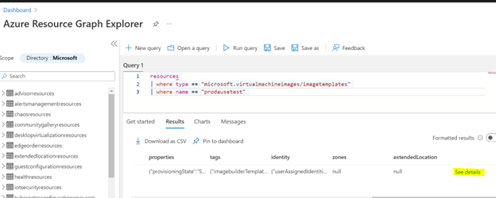

# Resiliency in Azure Image Builder

This article describes reliability support in Azure Image Builder, and covers both regional resiliency with availability zones. For a more detailed overview of reliability in Azure, see [Azure reliability](/azure/architecture/framework/resiliency/overview).

Azure Image Builder (AIB) is a regional service with cluster serving single regions. The AIB regional setup keeps data and resources within the regional boundary. AIB as a service doesn't do fail over for cluster and SQL database for region down scenario.

## Availability zone support

Azure availability zones are at least three physically separate groups of datacenters within each Azure region. Datacenters within each zone are equipped with independent power, cooling, and networking infrastructure. In the event of a local zone failure, availability zones are designed so that if the one zone is affected. Regional services, capacity, and high availability are supported by the remaining two zones.  Failures can range from software and hardware failures to events such as earthquakes, floods, and fires. Tolerance to failures is achieved with redundancy and logical isolation of Azure services. For more detailed information on availability zones in Azure, see [Regions and availability zones](/azure/availability-zones/az-overview).

Azure availability zones-enabled services are designed to provide the right level of reliability and flexibility. They can be configured in two ways. They can be either zone redundant, with automatic replication across zones, or zonal, with instances pinned to a specific zone. You can also combine these approaches. For more information on zonal vs. zone-redundant architecture, see [Build solutions with availability zones](/azure/architecture/high-availability/building-solutions-for-high-availability).

Azure Image Builder has [availability zones](/azure/availability-zones/az-overview#availability-zones) (AZ) for resources supporting AZ, which provides recovery in case of local failures in a region.

The following [Azure Marketplace images](/azure/virtual-machines/image-builder-overview#os-support) are also supported for Azure Image Builder.

### Prerequisites

As Azure Image Builder (AIB) is a regional service with a cluster serving in a single region, you must protect your system from region failure by creating an image builder template and replicate related resources across different regions. 

### SLA improvements

Azure Image Builder doesn't have an official SLA at this time.

#### Create a resource with availability zone enabled

Get started by creating an Azure Image Builder [Linux](/azure/virtual-machines/linux/image-builder) or [Windows](/azure/virtual-machines/windows/image-builder) image and be sure to specify the appropriate geographic `location` variable to a region close to your users.

> [!NOTE]
> You will also need to replicate your linked resources (VNet, scripts, source image, etc) into your target regions as well.

### Zonal failover support

At this time, Azure Image Builder doesn't have zone selection when creating an image builder template. However, you can refer to the general documentation for [Azure VM failover](/azure/site-recovery/azure-to-azure-tutorial-failover-failback) between availability zones.

### Fault tolerance
To prepare for availability zone failure, you can create image builder templates in multiple regions. Two regions are the recommended minimum. Refer to the current list of [available regions](/azure/virtual-machines/image-builder-overview#regions) in Azure Image Builder when creating your templates.

### Zone down experience

During a zone-wide outage scenario for Azure Image Builder(AIB), customers will see their AIB build failed. Expect to see the usual [provisioning failure](/azure/virtual-machines/linux/image-builder-troubleshoot#the-resource-operation-finished-with-a-terminal-provisioning-state-of-failed) error when an AIB outage occurs.

#### Zone outage preparation and recovery

Customers should expect to be notified on the Azure Image Builder service status within a 6 hour window.
Once Azure Image Builder is back online, the service will pick up all previous builds and rerun them. As the service reruns, it also creates a new resource group *IT_RG* for AIB specifically.

Image template submission errors currently don't have an error log, so it's recommended to follow the [troubleshooting](/azure/virtual-machines/linux/image-builder-troubleshoot#troubleshoot-image-template-submission-errors) steps if submission errors are present during a zone outage.

### Low-latency design

To ensure fast and easy recovery for your Azure Image Builder, it's recommended to run an image template in region pairs or multiple regions when designing your Image Builder solution. You'll also want to replicate resources from the start when you're setting up your image templates.

>[!IMPORTANT]
>By opting out of zone-aware deployment, you forego protection from isolation of underlying faults. Use of SKUs that don't support availability zones or opting out from availability zone configuration forces reliance on resources that don't obey zone placement and separation (including underlying dependencies of these resources). These resources shouldn't be expected to survive zone-down scenarios. Solutions that leverage such resources should define a disaster recovery strategy and configure a recovery of the solution in another region.

### Safe deployment techniques

For safe deployment techniques using Azure Image Builder (AIB), you can use Virtual Machine Scale Sets (VMSS) for your image versions when targeting one-zone-at-a-time for your deployments and application upgrades. Behind the scenes, the AIB service uses Azure Kubernetes Service (AKS) clusters, which include multi-node deployments, auto-scaling, and self-healing.

Before proceeding with upgrading your image builder templates, ensure you follow the troubleshooting [prerequisites](/azure/virtual-machines/linux/image-builder-troubleshoot#prerequisites) when creating a new build.

### Availability zone redeployment and migration

For availability zone redeployment and migration for Azure Image Builder, the general recommendation would be to create prior image templates in different regions. Refer to [template creation](/azure/virtual-machines/linux/image-builder-json) and for more information, see the supported template [locations](/azure/virtual-machines/linux/image-builder-json#location).

## Disaster recovery: cross-region failover

In the event of a region-wide disaster, Azure can provide protection from regional or large geography disasters with disaster recovery by making use of another region. For more information on Azure disaster recovery architecture, see [Azure to Azure disaster recovery architecture](/azure/site-recovery/azure-to-azure-architecture.md).

To ensure fast and easy recovery for Azure Image Builder (AIB), it's recommended to run an image template in region pairs or multiple regions when designing your AIB solution. You'll also want to replicate resources from the start when you're setting up your image templates.

### Cross-region disaster recovery in multi-region geography

Microsoft will be responsible for outage detection, notifications, and support in the event of disaster recovery scenarios for Azure Image Builder. Customers will need to set up disaster recovery for the control plane (service side) and data plane.

#### Outage detection, notification, and management

Microsoft will send a notification if there's an outage for the Azure Image Builder (AIB) Service. The common outage symptom includes image templates getting 500 errors when attempting to run. Customers can review Azure Image Builder outage notifications and status updates through [support request management.](/azure/azure-portal/supportability/how-to-manage-azure-support-request)

#### Set up disaster recovery and outage detection

Customers are responsible for setting up disaster recovery for their Azure Image Builder (AIB) environment, as there isn't a region failover at the AIB service side. Both the control plane (service side) and data plane will need to configure by the customer.

The high level guidelines include creating a AIB resource in another region close by and replicating your resources. For more information, see the [supported regions](/azure/virtual-machines/image-builder-overview#regions) and what resources are involved in [AIB]( /azure/virtual-machines/image-builder-overviewl#how-it-works) creation.

### Single-region geography disaster recovery

On supporting single-region geography for Azure Image Builder, the challenge will be to get the image template resource since the region isn't available. For those cases, customers can either maintain a copy of an image template locally or can use [Azure Resource Graph](/azure/governance/resource-graph/) from the Azure portal or Azure CLI to get an Image template resource.

Below are instructions on how to get an image template resource using Resource Graph from the Azure portal:

1. Go to the search bar in Azure portal and search for *resource graph explorer*.

    

1. Use the search bar on the far left to search resource by type and name to see how the details will give you properties of the image template. The *See details* option on the bottom right will show the image template's properties attribute and tags separately. Template name, location, ID, and tenant ID can be used to get the correct image template resource.

    

### Capacity and proactive disaster recovery resiliency

Microsoft and its customers operate under the Shared responsibility model. This means that for customer-enabled DR (customer-responsible services), the customer must address DR for any service they deploy and control. To ensure that recovery is proactive, customers should always pre-deploy secondaries because there's no guarantee of capacity at time of impact for those who haven't pre-allocated.

When planning where to replicate a template, consider:

- AIB region availability:
    - Choose [AIB supported regions](/azure/virtual-machines/image-builder-overview#regions) close to your users.
    - AIB continually expands into new regions.
- Azure paired regions:
    - For your geographic area, choose two regions paired together.
    - Recovery efforts for paired regions where prioritization is needed.

## Additional guidance

In regards to customer data processing information, refer to the Azure Image Builder [data residency](/azure/virtual-machines/linux/image-builder-json#data-residency) details.

## Next steps

> [!div class="nextstepaction"]
> [Resiliency in Azure](/azure/availability-zones/overview)
> [Enable Azure VM disaster recovery between availability zones](/azure/site-recovery/azure-to-azure-how-to-enable-zone-to-zone-disaster-recovery)
> [Azure Image Builder overview](/azure/virtual-machines/image-builder-overview)