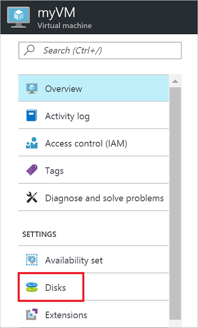
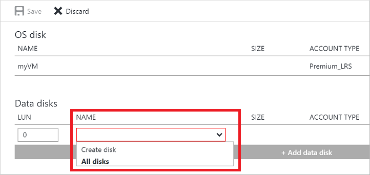
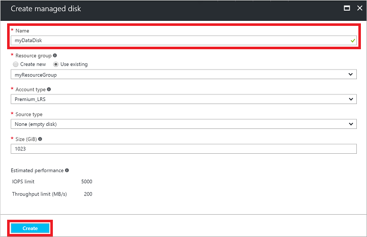
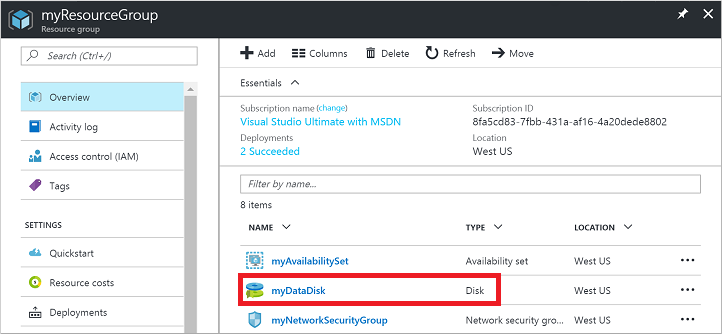
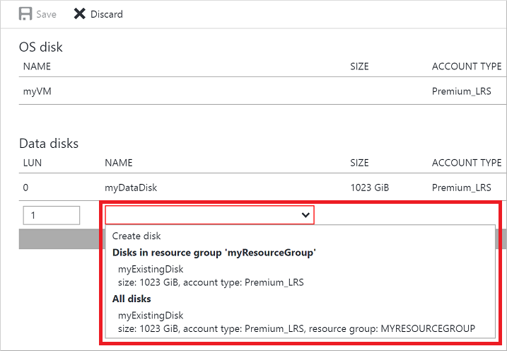
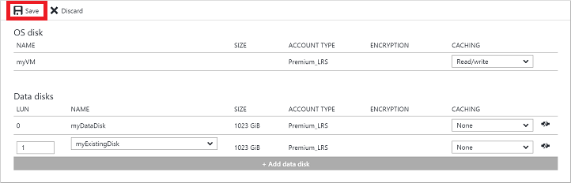

# Use the portal to attach a data disk to a Linux VM 
This article shows you how to attach both new and existing disks to a Linux virtual machine through the Azure portal. You can also [attach a data disk to a Windows VM in the Azure portal](../windows/attach-managed-disk-portal.md?toc=%2fazure%2fvirtual-machines%2fwindows%2ftoc.json). 

Before you attach disks to your VM, review these tips:

* The size of the virtual machine controls how many data disks you can attach. For details, see [Sizes for virtual machines](sizes.md?toc=%2fazure%2fvirtual-machines%2flinux%2ftoc.json).
* Disks attached to virtual machines are actually .vhd files stored in Azure. For details, see our [Introduction to managed disks](managed-disks-overview.md?toc=%2fazure%2fvirtual-machines%2flinux%2ftoc.json).
* After attaching the disk, you need to [connect to the Linux VM to mount the new disk](#connect-to-the-linux-vm-to-mount-the-new-disk).


## Find the virtual machine
1. Sign in to the [Azure portal](https://portal.azure.com/).
2. On the left menu, click **Virtual Machines**.
3. Select the virtual machine from the list.
4. To the Virtual machines page, in **Essentials**, click **Disks**.
   
    


## Attach a new disk

1. On the **Disks** pane, click **+ Add data disk**.
2. Click the drop-down menu for **Name** and select **Create disk**:

    

3. Enter a name for your managed disk. Review the default settings, update as necessary, and then click **Create**.
   
   

4. Click **Save** to create the managed disk and update the VM configuration:

   

5. After Azure creates the disk and attaches it to the virtual machine, the new disk is listed in the virtual machine's disk settings under **Data Disks**. As managed disks are a top-level resource, the disk appears at the root of the resource group:

   

## Attach an existing disk
1. On the **Disks** pane, click **+ Add data disk**.
2. Click the drop-down menu for **Name** to view a list of existing managed disks accessible to your Azure subscription. Select the managed disk to attach:

   

3. Click **Save** to attach the existing managed disk and update the VM configuration:
   
   

4. After Azure attaches the disk to the virtual machine, it's listed in the virtual machine's disk settings under **Data Disks**.

## Connect to the Linux VM to mount the new disk
To partition, format, and mount your new disk so your Linux VM can use it, SSH into your VM. For more information, see [How to use SSH with Linux on Azure](mac-create-ssh-keys.md). The following example connects to a VM with the public DNS entry of *mypublicdns.westus.cloudapp.azure.com* with the username *azureuser*: 

```bash
ssh azureuser@mypublicdns.westus.cloudapp.azure.com
```

Once connected to your VM, you're ready to attach a disk. First, find the disk using `dmesg` (the method you use to discover your new disk may vary). The following example uses dmesg to filter on *SCSI* disks:

```bash
dmesg | grep SCSI
```

The output is similar to the following example:

```bash
[    0.294784] SCSI subsystem initialized
[    0.573458] Block layer SCSI generic (bsg) driver version 0.4 loaded (major 252)
[    7.110271] sd 2:0:0:0: [sda] Attached SCSI disk
[    8.079653] sd 3:0:1:0: [sdb] Attached SCSI disk
[ 1828.162306] sd 5:0:0:0: [sdc] Attached SCSI disk
```

Here, *sdc* is the disk that we want. 

### Partition a new disk
If you are using an existing disk that contains data, skip to mounting the disk. If you are attaching a new disk, you need to partition the disk.

Partition the disk with `fdisk`. If the disk size is 2 tebibytes (TiB) or larger then you must use GPT partitioning, you can use `parted` to perform GPT partitioning. If disk size is under 2TiB, then you can use either MBR or GPT partitioning. Make it a primary disk on partition 1, and accept the other defaults. The following example starts the `fdisk` process on */dev/sdc*:

```bash
sudo fdisk /dev/sdc
```

Use the `n` command to add a new partition. In this example, we also choose `p` for a primary partition and accept the rest of the default values. The output will be similar to the following example:

```bash
Device contains neither a valid DOS partition table, nor Sun, SGI or OSF disklabel
Building a new DOS disklabel with disk identifier 0x2a59b123.
Changes will remain in memory only, until you decide to write them.
After that, of course, the previous content won't be recoverable.

Warning: invalid flag 0x0000 of partition table 4 will be corrected by w(rite)

Command (m for help): n
Partition type:
   p   primary (0 primary, 0 extended, 4 free)
   e   extended
Select (default p): p
Partition number (1-4, default 1): 1
First sector (2048-10485759, default 2048):
Using default value 2048
Last sector, +sectors or +size{K,M,G} (2048-10485759, default 10485759):
Using default value 10485759
```

Print the partition table by typing `p` and then use `w` to write the table to disk and exit. The output should look similar to the following example:

```bash
Command (m for help): p

Disk /dev/sdc: 5368 MB, 5368709120 bytes
255 heads, 63 sectors/track, 652 cylinders, total 10485760 sectors
Units = sectors of 1 * 512 = 512 bytes
Sector size (logical/physical): 512 bytes / 512 bytes
I/O size (minimum/optimal): 512 bytes / 512 bytes
Disk identifier: 0x2a59b123

   Device Boot      Start         End      Blocks   Id  System
/dev/sdc1            2048    10485759     5241856   83  Linux

Command (m for help): w
The partition table has been altered!

Calling ioctl() to re-read partition table.
Syncing disks.
```

Now, write a file system to the partition with the `mkfs` command. Specify your filesystem type and the device name. The following example creates an *ext4* filesystem on the */dev/sdc1* partition that was created in the preceding steps:

```bash
sudo mkfs -t ext4 /dev/sdc1
```

The output is similar to the following example:

```bash
mke2fs 1.42.9 (4-Feb-2014)
Discarding device blocks: done
Filesystem label=
OS type: Linux
Block size=4096 (log=2)
Fragment size=4096 (log=2)
Stride=0 blocks, Stripe width=0 blocks
327680 inodes, 1310464 blocks
65523 blocks (5.00%) reserved for the super user
First data block=0
Maximum filesystem blocks=1342177280
40 block groups
32768 blocks per group, 32768 fragments per group
8192 inodes per group
Superblock backups stored on blocks:
    32768, 98304, 163840, 229376, 294912, 819200, 884736
Allocating group tables: done
Writing inode tables: done
Creating journal (32768 blocks): done
Writing superblocks and filesystem accounting information: done
```
### Mount the disk
Create a directory to mount the file system using `mkdir`. The following example creates a directory at */datadrive*:

```bash
sudo mkdir /datadrive
```

Use `mount` to then mount the filesystem. The following example mounts the */dev/sdc1* partition to the */datadrive* mount point:

```bash
sudo mount /dev/sdc1 /datadrive
```

To ensure that the drive is remounted automatically after a reboot, it must be added to the */etc/fstab* file. It is also highly recommended that the UUID (Universally Unique IDentifier) is used in */etc/fstab* to refer to the drive rather than just the device name (such as, */dev/sdc1*). If the OS detects a disk error during boot, using the UUID avoids the incorrect disk being mounted to a given location. Remaining data disks would then be assigned those same device IDs. To find the UUID of the new drive, use the `blkid` utility:

```bash
sudo -i blkid
```

The output looks similar to the following example:

```bash
/dev/sda1: UUID="11111111-1b1b-1c1c-1d1d-1e1e1e1e1e1e" TYPE="ext4"
/dev/sdb1: UUID="22222222-2b2b-2c2c-2d2d-2e2e2e2e2e2e" TYPE="ext4"
/dev/sdc1: UUID="33333333-3b3b-3c3c-3d3d-3e3e3e3e3e3e" TYPE="ext4"
```

> [!NOTE]
> Improperly editing the **/etc/fstab** file could result in an unbootable system. If unsure, refer to the distribution's documentation for information on how to properly edit this file. It is also recommended that a backup of the /etc/fstab file is created before editing.

Next, open the */etc/fstab* file in a text editor as follows:

```bash
sudo vi /etc/fstab
```

In this example, use the UUID value for the */dev/sdc1* device that was created in the previous steps, and the mountpoint of */datadrive*. Add the following line to the end of the */etc/fstab* file:

```bash
UUID=33333333-3b3b-3c3c-3d3d-3e3e3e3e3e3e   /datadrive   ext4   defaults,nofail   1   2
```

> [!NOTE]
> Later removing a data disk without editing fstab could cause the VM to fail to boot. Most distributions provide either the *nofail* and/or *nobootwait* fstab options. These options allow a system to boot even if the disk fails to mount at boot time. Consult your distribution's documentation for more information on these parameters.
> 
> The *nofail* option ensures that the VM starts even if the filesystem is corrupt or the disk does not exist at boot time. Without this option, you may encounter behavior as described in [Cannot SSH to Linux VM due to FSTAB errors](https://blogs.msdn.microsoft.com/linuxonazure/2016/07/21/cannot-ssh-to-linux-vm-after-adding-data-disk-to-etcfstab-and-rebooting/)

### TRIM/UNMAP support for Linux in Azure
Some Linux kernels support TRIM/UNMAP operations to discard unused blocks on the disk. This feature is primarily useful in standard storage to inform Azure that deleted pages are no longer valid and can be discarded, and can save money if you create large files and then delete them.

There are two ways to enable TRIM support in your Linux VM. As usual, consult your distribution for the recommended approach:

* Use the `discard` mount option in */etc/fstab*, for example:

    ```bash
    UUID=33333333-3b3b-3c3c-3d3d-3e3e3e3e3e3e   /datadrive   ext4   defaults,discard   1   2
    ```
* In some cases, the `discard` option may have performance implications. Alternatively, you can run the `fstrim` command manually from the command line, or add it to your crontab to run regularly:
  
    **Ubuntu**
  
    ```bash
    sudo apt-get install util-linux
    sudo fstrim /datadrive
    ```
  
    **RHEL/CentOS**

    ```bash
    sudo yum install util-linux
    sudo fstrim /datadrive
    ```

## Next steps
You can also [attach a data disk](add-disk.md) using the Azure CLI.
