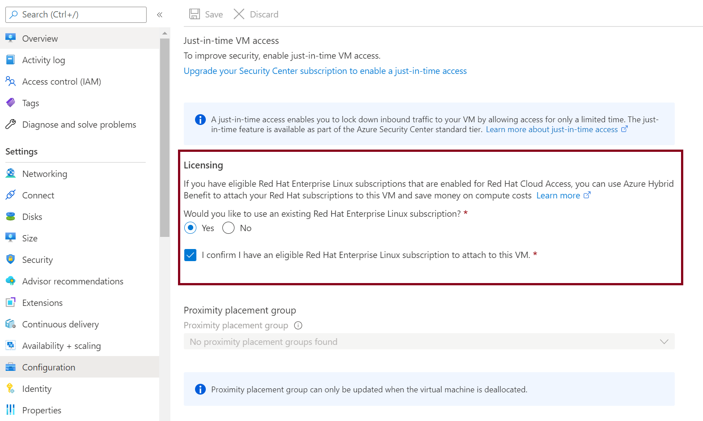
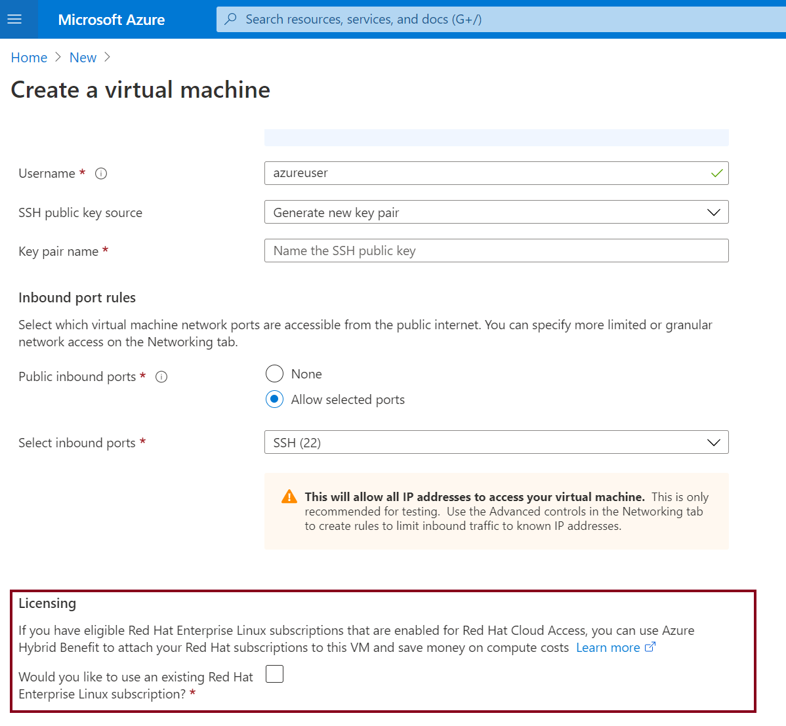
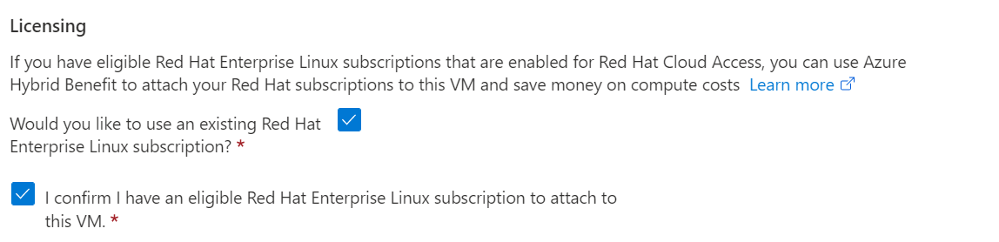
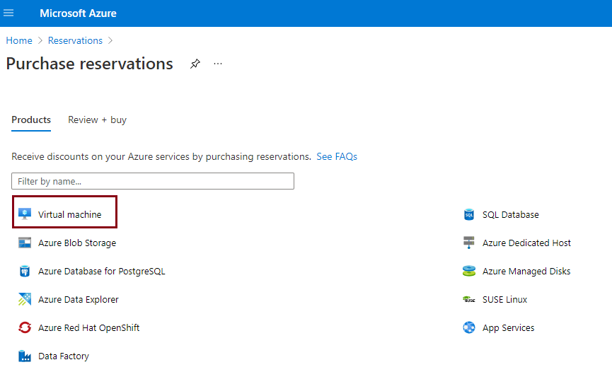

# Azure Hybrid Benefit for Red Hat Enterprise Linux (RHEL) and SUSE Linux Enterprise Server (SLES) virtual machines

## What is Azure Hybrid Benefit?

Azure Hybrid Benefit (AHB) for Linux lets you easily switch the software subscription model for your VM. You can remove licensing cost by bringing your Red Hat and SUSE Linux subscriptions directly to Azure, or utilize a model where you pay for subscriptions as you use them. This article defines 'BYOS' and 'PAYG' licensing models, compares the benefits of each model, and shows how you can use the Azure Hybrid Benefit to switch between the two at any point. This process applies to Virtual Machine Scale Sets, Spot Virtual Machines, and custom images. It allows for seamless bi-directional conversions between the two models.

Customers may see savings estimated to up to 76% with Azure Hybrid Benefit for Linux. Savings estimates are based on one standard D2s v3 Azure VM with RHEL or SLES subscription in the East US region running at a pay-as-you-go rate vs a reduced rate for a 3-year reserved instance plan. Based on Azure pricing as of October 2022. Prices subject to change. Actual savings may vary based on location, instance type, or usage.

## Defining Pay-as-you-go (PAYG) and Bring-your-own-subscription (BYOS)

In Azure, there are two main licensing pricing options: 'pay-as-you-go' (PAYG) and 'bring-your-own-subscription' (BYOS). 'PAYG' is a pricing option where you pay for the resources you use on an hourly or monthly basis. You only pay for what you use and can scale up or down as needed. On the other hand, 'BYOS' is a licensing option where you can use your existing licenses for certain software, in this case RHEL and SLES, on Azure virtual machines. You can use your existing licenses and don't have to purchase new ones for use in Azure.

:::image type="content" source="./media/ahb-linux/azure-hybrid-benefit-compare.png" alt-text="Diagram that shows the use of Azure Hybrid Benefit to switch Linux virtual machines between pay-as-you-go and bring-your-own-subscription.":::

> [!NOTE]
> Virtual machines deployed from PAYG images or VMs converted from BYOS models incur *both* an infrastructure fee and a software fee. If you have your own license, use Azure Hybrid Benefit to convers from a PAYG to BYOS model.

You can use Azure Hybrid Benefit to switch back to pay-as-you-go billing at any time.


## Which Linux virtual machines qualify for Azure Hybrid Benefit?

Azure dedicated host instances and SQL hybrid benefits aren't eligible for Azure Hybrid Benefit if you already use Azure Hybrid Benefit with Linux virtual machines.

## Getting started with Azure Hybrid Benefit

# [Red Hat (RHEL) PAYG to BYOS conversion](#tab/rhelpayg)

Azure Hybrid Benefit for converting PAYG virtual machines to BYOS for RHEL is available to Red Hat customers who meet the following criteria:

- Have active or unused RHEL subscriptions that are eligible for use in Azure
- Have correctly enabled one or more of their subscriptions for use in Azure with the [Red Hat Cloud Access](https://www.redhat.com/en/technologies/cloud-computing/cloud-access) program

Bring your own subscription to Red Hat:

1. Enable one or more of your eligible RHEL subscriptions for use in Azure using the [Red Hat Cloud Access customer interface](https://access.redhat.com/management/cloud).The Azure subscriptions that you provide during the Red Hat Cloud Access enablement process then have access to Azure Hybrid Benefit

1. Apply Azure Hybrid Benefit to any RHEL pay-as-you-go virtual machines that you deploy in Azure Marketplace pay-as-you-go images. You can use the Azure portal or the Azure CLI to enable Azure Hybrid Benefit.

1. Follow the recommended [next steps](https://access.redhat.com/articles/5419341) to configure update sources for your RHEL virtual machines and for RHEL subscription compliance guidelines.

# [SUSE (SLES) PAYG to BYOS conversion](#tab/slespayg)

Azure Hybrid Benefit for pay-as-you-go virtual machines for SUSE is available to customers who have:

- Unused SUSE subscriptions that are eligible to use in Azure.
- One or more active SUSE subscriptions to use on-premises that should be moved to Azure.
- Purchased subscriptions that they activated in the SUSE Customer Center to use in Azure.

> [!IMPORTANT]
> Ensure that you select the correct subscription to use in Azure.

To start using Azure Hybrid Benefit for SUSE:

1. Register the subscription that you purchased from SUSE or a SUSE distributor with the [SUSE Customer Center](https://scc.suse.com).
2. Activate the subscription in the SUSE Customer Center.
3. Register your virtual machines that are receiving Azure Hybrid Benefit with the SUSE Customer Center to get the updates from the SUSE Customer Center.

---

### Enable AHB in the Azure portal

In the Azure portal, you can enable Azure Hybrid Benefit on existing virtual machines or on new virtual machines at the time that you create them.

#### Convert to BYOS on an existing virtual machine in the Azure portal

To enable Azure Hybrid Benefit on an existing virtual machine:

1. Go to the [Azure portal](https://portal.azure.com/).
1. Open the virtual machine page on which you want to apply the conversion.
1. Go to **Configuration** > **Licensing**. To enable the Azure Hybrid Benefit conversion, select **Yes**, and then select the confirmation checkbox.



#### Convert to BYOS in the Azure portal

To enable Azure Hybrid Benefit when you create a virtual machine, use the following procedure. (The SUSE workflow is the same as the RHEL example shown here.)

1. Go to the [Azure portal](https://portal.azure.com/).
1. Go to **Create a virtual machine**.

   
1. In the **Licensing** section, select the checkbox that asks if you want to use an existing RHEL subscription and the checkbox to confirm that your subscription is eligible.

   
1. Create a virtual machine by following the next set of instructions.
1. On the **Configuration** pane, confirm that the option is enabled. 

   

### Convert to BYOS using the Azure CLI

You can use the `az vm update` command to update existing virtual machines. 

* For RHEL virtual machines, run the command with a `--license-type` parameter of `RHEL_BYOS`.
```azurecli
# This will enable BYOS on a RHEL virtual machine using Azure Hybrid Benefit
az vm update -g myResourceGroup -n myVmName --license-type RHEL_BYOS
```

* For SLES virtual machines, run the command with a `--license-type` parameter of `SLES_BYOS`.
```azurecli
# This will enable BYOS on a SLES virtual machine
az vm update -g myResourceGroup -n myVmName --license-type SLES_BYOS
```

#### Convert to PAYG using the Azure CLI

If the system was originally a PAYG image and you want to return the VM to a PAYG model, use a `--license-type` value of `None`. For example:

```azurecli
# This will enable PAYG on a virtual machine using Azure Hybrid Benefit
az vm update -g myResourceGroup -n myVmName --license-type None
```

If you have a BYOS and want to convert the VM to PAYG, use a `--license-type` value that covers the VM needs as described futher in this article. For example, for RHEL systems you can use any of the following:  RHEL_BASE, RHEL_EUS, RHEL_SAPAPPS, RHEL_SAPHA, RHEL_BASEAPAPPS or RHEL_BASESAPHA. 

#### Convert multiple VM license models simultaneously using the Azure CLI

To switch the licensing model on a large number of virtual machines, you can use the `--ids` parameter in the Azure CLI:

```azurecli
# This will enable BYOS on a RHEL virtual machine. In this example, ids.txt is an
# existing text file that contains a delimited list of resource IDs corresponding
# to the virtual machines using Azure Hybrid Benefit
az vm update -g myResourceGroup -n myVmName --license-type RHEL_BYOS --ids $(cat ids.txt)
```

The following examples show two methods of getting a list of resource IDs: one at the resource group level, and one at the subscription level.

```azurecli
# To get a list of all the resource IDs in a resource group:
$(az vm list -g MyResourceGroup --query "[].id" -o tsv)

# To get a list of all the resource IDs of virtual machines in a subscription:
az vm list -o json | jq '.[] | {Virtual MachineName: .name, ResourceID: .id}'
```

### Use AHB when creating a new VM

In addition to applying Azure Hybrid Benefit to existing pay-as-you-go virtual machines, you can invoke it at the time of virtual machine creation. Benefits of doing so are threefold:

- You can provision both PAYG and BYOS virtual machines by using the same image and process.
- It enables future licensing mode changes. These changes aren't available with a BYOS-only image or if you bring your own virtual machine.
- The virtual machine is connected to Red Hat Update Infrastructure (RHUI) by default, to help keep it up to date and secure. You can change the updated mechanism after deployment at any time.

### Check the licensing model of an AHB enabled VM

You can view the Azure Hybrid Benefit status of a virtual machine by using the Azure CLI or by using Azure Instance Metadata Service.

### Check licensing model using the Azure CLI

You can use the `az vm get-instance-view` command to check the status. Look for a `licenseType` field in the response. If the `licenseType` field exists and the value is `RHEL_BYOS` or `SLES_BYOS`, your virtual machine has Azure Hybrid Benefit enabled.

```azurecli
az vm get-instance-view -g MyResourceGroup -n MyVm
```

### Check the licensing model of an AHB enabled VM using Azure Instance Metadata Service

From within the virtual machine itself, you can query the attested metadata in Azure Instance Metadata Service to determine the virtual machine's `licenseType` value. A `licenseType` value of `RHEL_BYOS` or `SLES_BYOS` indicates that your virtual machine has Azure Hybrid Benefit enabled. [Learn more about attested metadata](./instance-metadata-service.md#attested-data).

### AHB for reserved instance VMs

[Azure reservations](../../cost-management-billing/reservations/save-compute-costs-reservations.md) (Azure Reserved Virtual Machine Instances) help you save money by committing to one-year or three-year plans for multiple products. Azure Hybrid Benefit for pay-as-you-go virtual machines is available for reserved instances.

If you've purchased compute costs at a discounted rate by using reserved instances, you can apply Azure Hybrid Benefit on the licensing costs for RHEL and SUSE on top of it. The steps to apply Azure Hybrid Benefit for a reserved instance remain exactly same as they are for a regular virtual machine.



>[!NOTE]
>If you've already purchased reservations for RHEL or SUSE pay-as-you-go software on Azure Marketplace, please wait for the reservation tenure to finish before using Azure Hybrid Benefit for pay-as-you-go virtual machines.

## Red Hat (RHEL) VMs with Azure Hybrid Benefit

# [Red Hat (RHEL) BYOS to PAYG](#tab/rhelbyos)

To start using Azure Hybrid Benefit for Red Hat:

1. Install the `AHBForRHEL` extension on the virtual machine on which you want to apply the Azure Hybrid Benefit BYOS benefit. You can do this installation via the Azure CLI or PowerShell.

1. Depending on the software updates that you want, change the license type to a relevant value. Here are the available license type values and the software updates associated with them:

    | License type  | Software updates  | Allowed virtual machines|  
    |---|---|---|
    | RHEL_BASE  | Installs Red Hat regular/base repositories on your virtual machine. | RHEL BYOS virtual machines, RHEL custom image virtual machines|
    | RHEL_EUS | Installs Red Hat Extended Update Support (EUS) repositories on your virtual machine. | RHEL BYOS virtual machines, RHEL custom image virtual machines|
    | RHEL_SAPAPPS  | Installs RHEL for SAP Business Apps repositories on your virtual machine. | RHEL BYOS virtual machines, RHEL custom image virtual machines|
    | RHEL_SAPHA | Installs RHEL for SAP with High Availability (HA) repositories on your virtual machine. | RHEL BYOS virtual machines, RHEL custom image virtual machines|
    | RHEL_BASESAPAPPS | Installs RHEL regular/base SAP Business Apps repositories on your virtual machine. | RHEL BYOS virtual machines, RHEL custom image virtual machines|
    | RHEL_BASESAPHA | Installs regular/base RHEL for SAP with HA repositories on your virtual machine.| RHEL BYOS virtual machines, RHEL custom image virtual machines|

1. Wait one hour for the extension to read the license type value and install the repositories.

   > [!NOTE]
   > If the extension isn't running by itself, you can run it on demand.

1. You should now be connected to Azure Red Hat Update. The relevant repositories are installed on your machine.  

1. If you want to switch back to the bring-your-own-subscription model,  just change the license type to `None` and run the extension. This action removes all Red Hat Update Infrastructure (RHUI) repositories from your virtual machine and stops the billing.

> [!Note]
> In the unlikely event that the extension can't install repositories or there are any other issues, switch the license type back to empty and reach out to Microsoft support. This ensures that you don't get billed for software updates.  

# [SUSE (SLES) BYOS to PAYG](#tab/slesbyos)

To start using Azure Hybrid Benefit for SLES virtual machines:

1. Install the `AHBForSLES` extension on the SLES virtual machine.
1. Change the license type to the value that reflects the software updates you want. Here are the available license type values and the software updates associated with them:

    | License type  | Software updates  | Allowed virtual machines|  
    |---|---|---|
    | SLES | Installs SLES Standard repositories on your virtual machine. | SLES BYOS virtual machines, SLES custom image virtual machines|
    | SLES_SAP | Installs SLES SAP repositories on your virtual machine. | SLES SAP BYOS virtual machines, SLES custom image virtual machines|
    | SLES_HPC | Installs SLES High Performance Computing repositories on your virtual machine. | SLES HPC BYOS virtual machines, SLES custom image virtual machines|

1. Wait five minutes for the extension to read the license type value and install the repositories.

   > [!NOTE]
   > If the extension isn't running by itself, you can run it on demand.

1. You should now be connected to the SUSE public cloud update infrastructure on Azure. The relevant repositories are installed on your machine.

1. If you want to switch back to the bring-your-own-subscription model,  just change the license type to `None` and run the extension. This action removes all repositories from your virtual machine and stops the billing.

After you successfully install the `AHBForSLES` extension, you can use the `az vm update` command to update the existing license type on your running virtual machines. For SLES virtual machines, run the command and set the `--license-type` parameter to one of the following license types: `SLES`, `SLES_SAP`, or `SLES_HPC`.

---

### Converting a VM license model using the Azure CLI

# [RHEL](#tab/rhelEnablebyos)

1. Install the Azure Hybrid Benefit extension on a running virtual machine. You can use the Azure portal or use the following command via the Azure CLI:

    ```azurecli
    az vm extension set -n AHBForRHEL --publisher Microsoft.Azure.AzureHybridBenefit --vm-name myVMName --resource-group myResourceGroup
    ```

1. After the extension is installed successfully, change the license type based on what you need:

    ```azurecli
    # This will enable Azure Hybrid Benefit to fetch software updates for RHEL base/regular repositories
    az vm update -g myResourceGroup -n myVmName --license-type RHEL_BASE
    
    # This will enable Azure Hybrid Benefit to fetch software updates for RHEL EUS repositories
    az vm update -g myResourceGroup -n myVmName --license-type RHEL_EUS
    
    # This will enable Azure Hybrid Benefit to fetch software updates for RHEL SAP APPS repositories
    az vm update -g myResourceGroup -n myVmName --license-type RHEL_SAPAPPS
    
    # This will enable Azure Hybrid Benefit to fetch software updates for RHEL SAP HA repositories
    az vm update -g myResourceGroup -n myVmName --license-type RHEL_SAPHA
    
    # This will enable Azure Hybrid Benefit to fetch software updates for RHEL BASE SAP APPS repositories
    az vm update -g myResourceGroup -n myVmName --license-type RHEL_BASESAPAPPS
    
    # This will enable Azure Hybrid Benefit to fetch software updates for RHEL BASE SAP HA repositories
    az vm update -g myResourceGroup -n myVmName --license-type RHEL_BASESAPHA

    ```

1. Wait five minutes for the extension to read the license type value and install the repositories.

1. You should now be connected to Red Hat Update Infrastructure. The relevant repositories are installed on your machine. You can validate the installation by running the following command on your virtual machine:

    ```bash
    sudo yum repolist
    ```

1. If the extension isn't running by itself, you can try the following command on the virtual machine:

    ```bash
    sudo systemctl start azure-hybrid-benefit.service
    ```

1. You can use the following command in your RHEL virtual machine to get the current status of the service:

    ```bash
    sudo ahb-service -status
    ```

# [SLES](#tab/slesEnablebyos)

1. Install the Azure Hybrid Benefit extension on a running virtual machine. You can use the Azure portal or use the following command via the Azure CLI:

    ```azurecli
    az vm extension set -n AHBForSLES --publisher SUSE.AzureHybridBenefit --vm-name myVMName --resource-group myResourceGroup
    ```

1. After the extension is installed successfully, change the license type based on what you need:

    ```azurecli
    # This will enable Azure Hybrid Benefit to fetch software updates for SLES Standard repositories
    az vm update -g myResourceGroup -n myVmName --license-type SLES

    # This will enable Azure Hybrid Benefit to fetch software updates for SLES SAP repositories
    az vm update -g myResourceGroup -n myVmName --license-type SLES_SAP

    # This will enable Azure Hybrid Benefit to fetch software updates for SLES HPC repositories
    az vm update -g myResourceGroup -n myVmName --license-type SLES_HPC
    ```

1. Wait five minutes for the extension to read the license type value and install the repositories.

1. You should now be connected to the SUSE public cloud update infrastructure on Azure. The relevant repositories are installed on your machine. You can verify this change by running the following command to list SUSE repositories on your virtual machine:

    ```bash
    sudo zypper repos
    ```

---

## SUSE (SLES) VMs with Azure Hybrid Benefit

After you successfully install the `AHBForSLES` extension, you can use the `az vm update` command to update the existing license type on your running virtual machines. For SLES virtual machines, run the command and set the `--license-type` parameter to one of the following license types: `SLES`, `SLES_SAP`, or `SLES_HPC`.

### Enable PAYG using the Azure CLI

1. Ensure that the Azure Hybrid Benefit extension is installed on your virtual machine.
1. To disable Azure Hybrid Benefit, use the following command:

    ```azurecli
    # This will enable PAYG on a virtual machine
    az vm update -g myResourceGroup -n myVmName --license-type None
    ```

### Check licensing model of a virtual machine

1. Ensure that the Azure Hybrid Benefit extension is installed.
1. In the Azure CLI or Azure Instance Metadata Service, run the following command:

    ```azurecli
    az vm get-instance-view -g MyResourceGroup -n MyVm
    ```

1. Look for a `licenseType` field in the response. If the `licenseType` field exists and the value is one of the following, your virtual machine has Azure Hybrid Benefit enabled:

- For RHEL: `RHEL_BASE`, `RHEL_EUS`, `RHEL_SAPAPPS`, `RHEL_SAPHA`, `RHEL_BASESAPAPPS`, or `RHEL_BASESAPHA`.
- For SLES: `SLES`, `SLES_SAP`, or `SLES_HPC`

## Compliance

# [Red Hat compliance](#tab/rhelcompliance)

Customers who use Azure Hybrid Benefit for pay-as-you-go RHEL virtual machines agree to the standard [legal terms](http://www.redhat.com/licenses/cloud_CSSA/Red_Hat_Cloud_Software_Subscription_Agreement_for_Microsoft_Azure.pdf) and [privacy statement](http://www.redhat.com/licenses/cloud_CSSA/Red_Hat_Privacy_Statement_for_Microsoft_Azure.pdf) associated with the Azure Marketplace RHEL offers.

Customers who use Azure Hybrid Benefit for pay-as-you-go RHEL virtual machines have three options for providing software updates and patches to those virtual machines:

- [Red Hat Update Infrastructure](../workloads/redhat/redhat-rhui.md) (default option)
- Red Hat Satellite Server
- Red Hat Subscription Manager

Customers can use RHUI as the main update source for Azure Hybrid Benefit for pay-as-you-go RHEL virtual machines without attaching subscriptions. Customers who choose the RHUI option are responsible for ensuring RHEL subscription compliance.

Customers who choose either Red Hat Satellite Server or Red Hat Subscription Manager should remove the RHUI configuration and then attach a cloud-access-enabled RHEL subscription to Azure Hybrid Benefit for PAYG RHEL virtual machines.  

For more information about Red Hat subscription compliance, software updates, and sources for Azure Hybrid Benefit for pay-as-you-go RHEL virtual machines, see the [Red Hat article about using RHEL subscriptions with Azure Hybrid Benefit](https://access.redhat.com/articles/5419341).

Customers who use Azure Hybrid Benefit BYOS to PAYG capability for RHEL agree to the standard [legal terms](http://www.redhat.com/licenses/cloud_CSSA/Red_Hat_Cloud_Software_Subscription_Agreement_for_Microsoft_Azure.pdf) and [privacy statement](http://www.redhat.com/licenses/cloud_CSSA/Red_Hat_Privacy_Statement_for_Microsoft_Azure.pdf) associated with the Azure Marketplace RHEL offerings.

# [SUSE compliance](#tab/slescompliance)

To use Azure Hybrid Benefit for pay-as-you-go SLES virtual machines, and to get information about moving from SLES pay-as-you-go to BYOS or moving from SLES BYOS to pay-as-you-go, see [SUSE Linux Enterprise and Azure Hybrid Benefit](https://aka.ms/suse-ahb).

Customers who use Azure Hybrid Benefit for pay-as-you-go SLES virtual machines need to move the cloud update infrastructure to one of three options that provide software updates and patches to those virtual machines:

- [SUSE Customer Center](https://scc.suse.com)
- SUSE Manager
- SUSE Repository Mirroring Tool

If you use Azure Hybrid Benefit BYOS to PAYG capability for SLES and want more information about moving from SLES pay-as-you-go to BYOS, or moving from SLES BYOS to pay-as-you-go, see [Azure Hybrid Benefit Support](https://aka.ms/suse-ahb) on the SUSE website.

---

## Frequently asked questions

- **Q: Can I use a license type of RHEL_BYOS with a SLES image, or vice versa?**

    - A: No, you can't. Trying to enter a license type that incorrectly matches the distribution running on your virtual machine won't update any billing metadata. But if you accidentally enter the wrong license type, updating your virtual machine again to the correct license type still enables Azure Hybrid Benefit.

- **Q: I've registered with Red Hat Cloud Access but still can't enable Azure Hybrid Benefit on my RHEL virtual machines. What should I do?**

    - A: It might take some time for your Red Hat Cloud Access subscription registration to propagate from Red Hat to Azure. If you still see the error after one business day, contact Microsoft support.

- **Q: I've deployed a virtual machine by using a RHEL BYOS "golden image." Can I convert the billing on this image from BYOS to pay-as-you-go?**

    - A: Yes, you can use Azure Hybrid Benefit for BYOS virtual machines to do this. Learn more about this capability.

- **Q: I've uploaded my own RHEL or SLES image from on-premises (via Azure Migrate, Azure Site Recovery, or otherwise) to Azure. Can I convert the billing on these images from BYOS to pay-as-you-go?**

    - A: Yes, you can use Azure Hybrid Benefit for BYOS virtual machines to do this. Learn more about this capability.

- **Q: I've uploaded my own RHEL or SLES image from on-premises (via Azure Migrate, Azure Site Recovery, or otherwise) to Azure. Do I need to do anything to benefit from Azure Hybrid Benefit?**

    - A: No, you don't. RHEL or SLES images that you upload are already considered BYOS, and you're charged only for Azure infrastructure costs. You're responsible for RHEL subscription costs, just as you are for your on-premises environments.

- **Q: Can I use Azure Hybrid Benefit for pay-as-you-go virtual machines for Azure Marketplace RHEL and SLES SAP images?**

    - A: Yes. You can use the license type of RHEL_BYOS for RHEL virtual machines and SLES_BYOS for conversions of virtual machines deployed from Azure Marketplace RHEL and SLES SAP images.

- **Q: Can I use Azure Hybrid Benefit for pay-as-you-go virtual machines on Virtual Machine Scale Sets for RHEL and SLES?**

    - A: Yes. Azure Hybrid Benefit on Virtual Machine Scale Sets for RHEL and SLES is available to all users. Learn more about this benefit and how to use it.

- **Q: Can I use Azure Hybrid Benefit for pay-as-you-go virtual machines on reserved instances for RHEL and SLES?**

    - A: Yes. Azure Hybrid Benefit for pay-as-you-go virtual machines on reserved instances for RHEL and SLES is available to all users.

- **Q: Can I use Azure Hybrid Benefit for pay-as-you-go virtual machines on a virtual machine deployed for SQL Server on RHEL images?**

    - A: No, you can't. There's no plan for supporting these virtual machines.

- **Q: Can I use Azure Hybrid Benefit on my RHEL for Virtual Datacenters subscription?**

    - A: No. RHEL for Virtual Datacenters isn't supported on Azure at all, including Azure Hybrid Benefit.

## Next steps

* [Learn how to create and update virtual machines and add license types (RHEL_BYOS, SLES_BYOS) for Azure Hybrid Benefit by using the Azure CLI](/cli/azure/vm)
* [Learn about Azure Hybrid Benefit on Virtual Machine Scale Sets for RHEL and SLES and how to use it](../../virtual-machine-scale-sets/azure-hybrid-benefit-linux.md)
