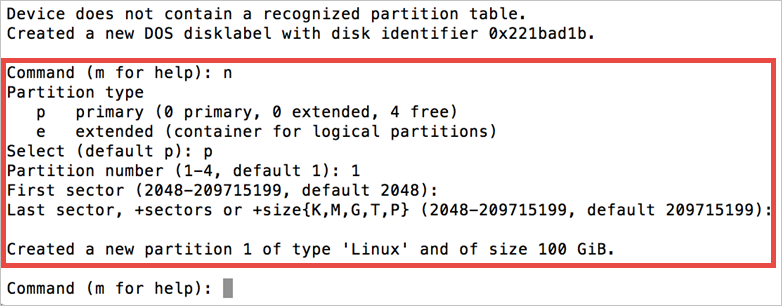
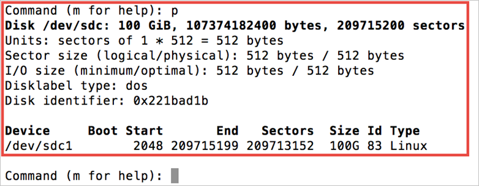
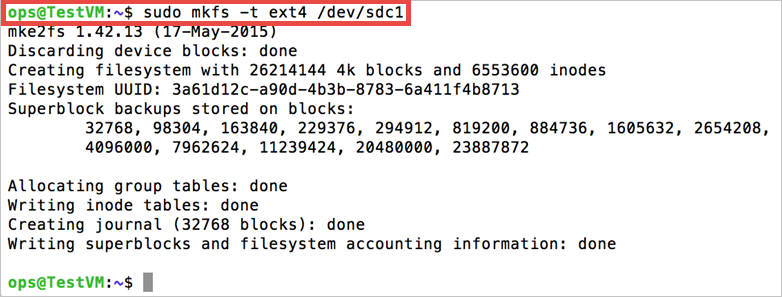
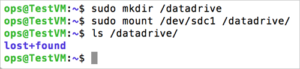

# How to Attach a Data Disk to a Linux Virtual Machine
> [!IMPORTANT] 
> Azure has two different deployment models for creating and working with resources: [Resource Manager and Classic](../../../resource-manager-deployment-model.md). This article covers using the Classic deployment model. Microsoft recommends that most new deployments use the Resource Manager model. See how to [attach a data disk using the Resource Manager deployment model](../add-disk.md?toc=%2fazure%2fvirtual-machines%2flinux%2ftoc.json).

You can attach both empty disks and disks that contain data to your Azure VMs. Both types of disks are .vhd files that reside in an Azure storage account. As with adding any disk to a Linux machine, after you attach the disk you need to initialize and format it so it's ready for use. This article details attaching both empty disks and disks already containing data to your VMs, as well as how to then initialize and format a new disk.

> [!NOTE]
> It's a best practice to use one or more separate disks to store a virtual machine's data. When you create an Azure virtual machine, it has an operating system disk and a temporary disk. **Do not use the temporary disk to store persistent data.** As the name implies, it provides temporary storage only. It offers no redundancy or backup because it doesn't reside in Azure storage.
> The temporary disk is typically managed by the Azure Linux Agent and automatically mounted to **/mnt/resource** (or **/mnt** on Ubuntu images). On the other hand, a data disk might be named by the Linux kernel something like `/dev/sdc`, and you need to partition, format, and mount this resource. See the [Azure Linux Agent User Guide][Agent] for details.
> 
> 

[!INCLUDE [howto-attach-disk-windows-linux](../../../../includes/howto-attach-disk-linux.md)]

## Initialize a new data disk in Linux
1. SSH to your VM. For more information, see [How to log on to a virtual machine running Linux][Logon].
2. Next you need to find the device identifier for the data disk to initialize. There are two ways to do that:
   
    a) Grep for SCSI devices in the logs, such as in the following command:
   
    ```bash
    sudo grep SCSI /var/log/messages
    ```
   
    For recent Ubuntu distributions, you may need to use `sudo grep SCSI /var/log/syslog` because logging to `/var/log/messages` might be disabled by default.
   
    You can find the identifier of the last data disk that was added in the messages that are displayed.
   
    
   
    OR
   
    b) Use the `lsscsi` command to find out the device id. `lsscsi` can be installed by either `yum install lsscsi` (on Red Hat based distributions) or `apt-get install lsscsi` (on Debian based distributions). You can find the disk you are looking for by its *lun* or **logical unit number**. For example, the *lun* for the disks you attached can be easily seen from `azure vm disk list <virtual-machine>` as:

    ```azurecli
    azure vm disk list myVM
    ```

    The output is similar to the following:

    ```azurecli
    info:    Executing command vm disk list
    + Fetching disk images
    + Getting virtual machines
    + Getting VM disks
    data:    Lun  Size(GB)  Blob-Name                         OS
    data:    ---  --------  --------------------------------  -----
    data:         30        myVM-2645b8030676c8f8.vhd  Linux
    data:    0    100       myVM-76f7ee1ef0f6dddc.vhd
    info:    vm disk list command OK
    ```
   
    Compare this data with the output of `lsscsi` for the same sample virtual machine:
   
    ```bash
    [1:0:0:0]    cd/dvd  Msft     Virtual CD/ROM   1.0   /dev/sr0
    [2:0:0:0]    disk    Msft     Virtual Disk     1.0   /dev/sda
    [3:0:1:0]    disk    Msft     Virtual Disk     1.0   /dev/sdb
    [5:0:0:0]    disk    Msft     Virtual Disk     1.0   /dev/sdc
    ```
   
    The last number in the tuple in each row is the *lun*. See `man lsscsi` for more information.
3. At the prompt, type the following command to create your device:
   
    ```bash
    sudo fdisk /dev/sdc
    ```

4. When prompted, type **n** to create a partition.

    

5. When prompted, type **p** to make the partition the primary partition. Type **1** to make it the first partition, and then type enter to accept the default value for the cylinder. On some systems, it can show the default values of the first and the last sectors, instead of the cylinder. You can choose to accept these defaults.

    


6. Type **p** to see the details about the disk that is being partitioned.

    


7. Type **w** to write the settings for the disk.

    

8. Now you can create the file system on the new partition. Append the partition number to the device ID (in the following example `/dev/sdc1`). The following example creates an ext4 partition on /dev/sdc1:
   
    ```bash
    sudo mkfs -t ext4 /dev/sdc1
    ```
   
    
   
   > [!NOTE]
   > SuSE Linux Enterprise 11 systems only support read-only access for ext4 file systems. For these systems, it is recommended to format the new file system as ext3 rather than ext4.

9. Make a directory to mount the new file system, as follows:
   
    ```bash
    sudo mkdir /datadrive
    ```

10. Finally you can mount the drive, as follows:
   
    ```bash
    sudo mount /dev/sdc1 /datadrive
    ```
   
    The data disk is now ready to use as **/datadrive**.
   
    

11. Add the new drive to /etc/fstab:
   
    To ensure the drive is remounted automatically after a reboot it must be added to the /etc/fstab file. In addition, it is highly recommended that the UUID (Universally Unique IDentifier) is used in /etc/fstab to refer to the drive rather than just the device name (i.e. /dev/sdc1). Using the UUID avoids the incorrect disk being mounted to a given location if the OS detects a disk error during boot and any remaining data disks then being assigned those device IDs. To find the UUID of the new drive, you can use the **blkid** utility:
   
    ```bash
    sudo -i blkid
    ```
   
    The output looks similar to the following example:
   
    ```bash
    /dev/sda1: UUID="11111111-1b1b-1c1c-1d1d-1e1e1e1e1e1e" TYPE="ext4"
    /dev/sdb1: UUID="22222222-2b2b-2c2c-2d2d-2e2e2e2e2e2e" TYPE="ext4"
    /dev/sdc1: UUID="33333333-3b3b-3c3c-3d3d-3e3e3e3e3e3e" TYPE="ext4"
    ```

    > [!NOTE]
    > Improperly editing the **/etc/fstab** file could result in an unbootable system. If unsure, refer to the distribution's documentation for information on how to properly edit this file. It is also recommended that a backup of the /etc/fstab file is created before editing.

    Next, open the **/etc/fstab** file in a text editor:

    ```bash
    sudo vi /etc/fstab
    ```

    In this example, we use the UUID value for the new **/dev/sdc1** device that was created in the previous steps, and the mountpoint **/datadrive**. Add the following line to the end of the **/etc/fstab** file:

    ```sh
    UUID=33333333-3b3b-3c3c-3d3d-3e3e3e3e3e3e   /datadrive   ext4   defaults,nofail   1   2
    ```

    Or, on systems based on SuSE Linux you may need to use a slightly different format:

    ```sh
    /dev/disk/by-uuid/33333333-3b3b-3c3c-3d3d-3e3e3e3e3e3e   /datadrive   ext3   defaults,nofail   1   2
    ```

    > [!NOTE]
    > The `nofail` option ensures that the VM starts even if the filesystem is corrupt or the disk does not exist at boot time. Without this option, you may encounter behavior as described in [Cannot SSH to Linux VM due to FSTAB errors](https://blogs.msdn.microsoft.com/linuxonazure/2016/07/21/cannot-ssh-to-linux-vm-after-adding-data-disk-to-etcfstab-and-rebooting/).

    You can now test that the file system is mounted properly by unmounting and then remounting the file system, i.e. using the example mount point `/datadrive` created in the earlier steps:

    ```bash
    sudo umount /datadrive
    sudo mount /datadrive
    ```

    If the `mount` command produces an error, check the /etc/fstab file for correct syntax. If additional data drives or partitions are created, enter them into /etc/fstab separately as well.

    Make the drive writable by using this command:

    ```bash
    sudo chmod go+w /datadrive
    ```

    > [!NOTE]
    > Subsequently removing a data disk without editing fstab could cause the VM to fail to boot. If this is a common occurrence, most distributions provide either the `nofail` and/or `nobootwait` fstab options that allow a system to boot even if the disk fails to mount at boot time. Consult your distribution's documentation for more information on these parameters.

### TRIM/UNMAP support for Linux in Azure
Some Linux kernels support TRIM/UNMAP operations to discard unused blocks on the disk. These operations are primarily useful in standard storage to inform Azure that deleted pages are no longer valid and can be discarded. Discarding pages can save cost if you create large files and then delete them.

There are two ways to enable TRIM support in your Linux VM. As usual, consult your distribution for the recommended approach:

* Use the `discard` mount option in `/etc/fstab`, for example:

    ```sh
    UUID=33333333-3b3b-3c3c-3d3d-3e3e3e3e3e3e   /datadrive   ext4   defaults,discard   1   2
    ```

* In some cases the `discard` option may have performance implications. Alternatively, you can run the `fstrim` command manually from the command line, or add it to your crontab to run regularly:
  
    **Ubuntu**
  
    ```bash
    sudo apt-get install util-linux
    sudo fstrim /datadrive
    ```
  
    **RHEL/CentOS**
  
    ```bash
    sudo yum install util-linux
    sudo fstrim /datadrive
    ```

## Troubleshooting
[!INCLUDE [virtual-machines-linux-lunzero](../../../../includes/virtual-machines-linux-lunzero.md)]

## Next Steps
You can read more about using your Linux VM in the following articles:

* [How to log on to a virtual machine running Linux][Logon]
* [How to detach a disk from a Linux virtual machine](detach-disk.md)
* [Using the Azure CLI with the Classic deployment model](https://docs.microsoft.com/cli/azure/get-started-with-az-cli2)
* [Configure RAID on a Linux VM in Azure](../configure-raid.md)
* [Configure LVM on a Linux VM in Azure](../configure-lvm.md)

<!--Link references-->
[Agent]:../agent-user-guide.md
[Logon]:../mac-create-ssh-keys.md
