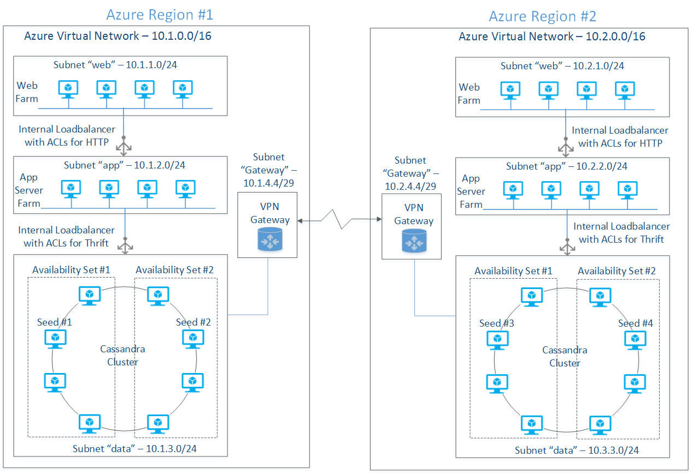

# Run a Cassandra cluster on Linux in Azure with Node.js

> [!IMPORTANT] 
> Azure has two different deployment models for creating and working with resources: [Resource Manager and Classic](../../../resource-manager-deployment-model.md). This article covers using the Classic deployment model. Microsoft recommends that most new deployments use the Resource Manager model. See Resource Manager templates for [Datastax Enterprise](https://azure.microsoft.com/documentation/templates/datastax) and [Spark cluster and Cassandra on CentOS](https://azure.microsoft.com/documentation/templates/spark-and-cassandra-on-centos/).

## Overview
Microsoft Azure is an open cloud platform that runs both Microsoft and non-Microsoft software which includes operating systems, application servers, messaging middleware as well as SQL and NoSQL databases from both commercial and open source models. Building resilient services on public clouds including Azure requires careful planning and deliberate architecture for both applications servers as well storage layers. Cassandra’s distributed storage architecture naturally helps in building highly available systems that are fault tolerant for cluster failures. Cassandra is a cloud scale NoSQL database maintained by Apache Software Foundation at cassandra.apache.org. Cassandra is written in Java. So it runs on both on Windows and Linux platforms.

The focus of this article is to show Cassandra deployment on Ubuntu as a single and multi-data center cluster that uses Azure Virtual Machines and Virtual Networks. The cluster deployment for production optimized workloads is out of scope of this article as it requires multi-disk node configuration, appropriate ring topology design and data modeling to support the needed replication, data consistency, throughput and high availability requirements.

This article takes a fundamental approach to show what is involved in building the Cassandra cluster compared Docker, Chef or Puppet which can make the infrastructure deployment a lot easier.  

## The Deployment Models
Microsoft Azure networking allows the deployment of isolated private clusters, the access of which can be restricted to attain fine grained network security.  Since this article is about showing the Cassandra deployment at a fundamental level, it doesn't focus on the consistency level and the optimal storage design for throughput. Here is the list of networking requirements for the hypothetical cluster:

* External systems can’t access Cassandra database from within or outside Azure
* Cassandra cluster has to be behind a load balancer for thrift traffic
* Deploy Cassandra nodes in two groups in each data center for an enhanced cluster availability
* Lock down the cluster so that only application server farm has access to the database directly
* No public networking endpoints other than SSH
* Each Cassandra node needs a fixed internal IP address

Cassandra can be deployed to a single Azure region or to multiple regions based on the distributed nature of the workload. You can use a multi-region deployment model to serve end users closer to a particular geography through the same Cassandra infrastructure. Cassandra’s built-in node replication takes care of the synchronization of multi-master writes originating from multiple data centers and presents a consistent view of the data to applications. Multi-region deployment can also help with the risk mitigation of the broader Azure service outages. Cassandra’s tunable consistency and replication topology helps in meeting diverse RPO needs of applications.

### Single Region Deployment
Let's start with a single region deployment and harvest the learnings in creating a multi-region model. Azure virtual networking is used to create isolated subnets so that the network security requirements mentioned above can be met.  The process described in creating the single region deployment uses Ubuntu 14.04 LTS and Cassandra 2.08. However, the process can easily be adopted to the other Linux variants. The following are some of the systemic characteristics of the single region deployment.  

**High Availability:** The Cassandra nodes shown in the Figure 1 are deployed to two availability sets so that the nodes are spread between multiple fault domains for high availability. VMs annotated with each availability set is mapped to 2 fault domains. Azure uses the concept of fault domain to manage unplanned down time (for example hardware or software failures). The concept of upgrade domain (for example host or guest OS patching/upgrades, application upgrades) is used for managing scheduled down time. Please see [Disaster Recovery and High Availability for Azure Applications](http://msdn.microsoft.com/library/dn251004.aspx) for the role of fault and upgrade domains in attaining high availability.

Figure 1: Single region deployment

Note that at the time of this writing, Azure doesn’t allow the explicit mapping of a group of VMs to a specific fault domain; consequently, even with the deployment model shown in Figure 1, it is statistically probable that all the virtual machines may be mapped to two fault domains instead of four.

**Load Balancing Thrift Traffic:** Thrift client libraries inside the web server connect to the cluster through an internal load balancer. This requires the process of adding the internal load balancer to the “data” subnet (refer Figure 1) in the context of the cloud service hosting the Cassandra cluster. Once the internal load balancer is defined, each node requires the load balanced endpoint to be added with the annotations of a load balanced set with previously defined load balancer name. See [Azure Internal Load Balancing ](../../../load-balancer/load-balancer-internal-overview.md)for more details.

**Cluster Seeds:** It is important to select the most highly available nodes for seeds as the new nodes communicate with seed nodes to discover the topology of the cluster. One node from each availability set is designated as seed nodes to avoid single point of failure.

**Replication Factor and Consistency Level:** Cassandra’s build-in high-availability and data durability is characterized by the Replication Factor (RF - number of copies of each row stored on the cluster) and Consistency Level (number of replicas to be read/written before returning the result to the caller). Replication factor is specified during the KEYSPACE (similar to a relational database) creation whereas the consistency level is specified while issuing the CRUD query. See Cassandra documentation at [Configuring for Consistency](https://docs.datastax.com/en/cassandra/3.0/cassandra/dml/dmlConfigConsistency.html) for consistency details and the formula for quorum computation.

Cassandra supports two types of data integrity models – Consistency and Eventual Consistency; the Replication Factor and Consistency Level together determine if the data is consistent as soon as a write operation is complete or eventually consistent. For example, specifying QUORUM as the Consistency Level always ensures data Consistency while any consistency level, below the number of replicas to be written as needed to attain QUORUM (for example ONE) results in data being eventually consistent.

The 8-node cluster shown above, with a replication factor of 3 and QUORUM (2 nodes are read or written for consistency) read/write consistency level, can survive the theoretical loss of at the most 1 node per replication group before the application start noticing the failure. This assumes that all the key spaces have well balanced read/write requests.  The following are the parameters used for the deployed cluster:

Single region Cassandra cluster configuration:

| Cluster Parameter | Value | Remarks |
| --- | --- | --- |
| Number of Nodes (N) |8 |Total number of nodes in the cluster |
| Replication Factor (RF) |3 |Number of replicas of a given row |
| Consistency Level (Write) |QUORUM[(RF/2) +1) = 2] The result of the formula is rounded down |Writes at the most 2 replicas before the response is sent to the caller; 3rd replica is written in an eventually consistent manner. |
| Consistency Level (Read) |QUORUM [(RF/2) +1= 2] The result of the formula is rounded down |Reads 2 replicas before sending response to the caller. |
| Replication Strategy |NetworkTopologyStrategy see [Data Replication](https://docs.datastax.com/en/cassandra/3.0/cassandra/architecture/archDataDistributeAbout.html) in Cassandra documentation for more information |Understands the deployment topology and places replicas on nodes so that all the replicas don’t end up on the same rack |
| Snitch |GossipingPropertyFileSnitch see [Switches](https://docs.datastax.com/en/cassandra/3.0/cassandra/architecture/archSnitchesAbout.html) in Cassandra documentation for more information |NetworkTopologyStrategy uses a concept of snitch to understand the topology. GossipingPropertyFileSnitch gives better control in mapping each node to data center and rack. The cluster then uses gossip to propagate this information. This is much simpler in dynamic IP setting relative to PropertyFileSnitch |

**Azure Considerations for Cassandra Cluster:** Microsoft Azure Virtual Machines capability uses Azure Blob storage for disk persistence; Azure Storage saves three replicas of each disk for high durability. That means each row of data inserted into a Cassandra table is already stored in three replicas. So data consistency is already taken care of even if the Replication Factor (RF) is 1. The main problem with Replication Factor being 1 is that the application experiences downtime even if a single Cassandra node fails. However, if a node is down for the problems (for example hardware, system software failures) recognized by Azure Fabric Controller, it provisions a new node in its place using the same storage drives. Provisioning a new node to replace the old one may take a few minutes.  Similarly for planned maintenance activities like guest OS changes, Cassandra upgrades and application changes Azure Fabric Controller performs rolling upgrades of the nodes in the cluster.  Rolling upgrades also may take down a few nodes at a time and hence the cluster may experience brief downtime for a few partitions. However, the data isn't lost due to the built-in Azure Storage redundancy.  

For systems deployed to Azure that doesn’t require high availability (for example around 99.9 which is equivalent to 8.76 hrs/year; see [High Availability](http://en.wikipedia.org/wiki/High_availability) for details) you may be able to run with RF=1 and Consistency Level=ONE.  For applications with high availability requirements, RF=3 and Consistency Level=QUORUM tolerates the down time of one of the nodes one of the replicas. RF=1 in traditional deployments (for example on-premises) can’t be used due to the possible data loss resulting from problems like disk failures.   

## Multi-region Deployment
Cassandra’s data-center-aware replication and consistency model described above helps with the multi-region deployment without the need for any external tooling. This is different from the traditional relational databases where the setup for database mirroring for multi-master writes can be complex. Cassandra in a multi-region setup can help with the usage scenarios including the scenarios:

**Proximity based deployment:** Multi-tenant applications, with clear mapping of tenant users -to-region, can be benefited by the multi-region cluster’s low latencies. For example, a learning management systems for educational institutions can deploy a distributed cluster in East US and West US regions to serve the respective campuses for transactional as well as analytics. The data can be locally consistent at the time reads and writes and can be eventually consistent across both the regions. There are other examples like media distribution, e-commerce and anything and everything that serves geo concentrated user base is a good use case for this deployment model.

**High Availability:** Redundancy is a key factor in attaining high availability of software and hardware; see Building Reliable Cloud Systems on Microsoft Azure for details. On Microsoft Azure, the only reliable way of achieving true redundancy is by deploying a multi-region cluster. Applications can be deployed in an active-active or active-passive mode and if one of the regions is down, Azure Traffic Manager can redirect traffic to the active region.  With the single region deployment, if the availability is 99.9, a two-region deployment can attain an availability of 99.9999 computed by the formula: (1-(1-0.999) * (1-0.999))*100); see the above paper for details.

**Disaster Recovery:** Multi-region Cassandra cluster, if properly designed, can withstand catastrophic data center outages. If one region is down, the application deployed to other regions can start serving the end users. Like any other business continuity implementations, the application has to be tolerant for some data loss resulting from the data in the asynchronous pipeline. However, Cassandra makes the recovery much swifter than the time taken by traditional database recovery processes. Figure 2 shows the typical multi-region deployment model with eight nodes in each region. Both regions are mirror images of each other for the same of symmetry; real world designs depend on the workload type (for example transactional or analytical), RPO, RTO, data consistency and availability requirements.

Figure 2: Multi-region Cassandra deployment

### Network Integration
Sets of virtual machines deployed to private networks located on two regions communicates with each other using a VPN tunnel. The VPN tunnel connects two software gateways provisioned during the network deployment process. Both regions have similar network architecture in terms of “web” and “data” subnets; Azure networking allows the creation of as many subnets as needed and apply ACLs as needed by network security. While designing the cluster topology, inter data center communication latency and the economic impact of the network traffic need to be considered.

### Data Consistency for Multi-Data Center Deployment
Distributed deployments need to be aware of the cluster topology impact on throughput and high availability. The RF and Consistency Level need to be selected in such way that the quorum doesn’t depend on the availability of all the data centers.
For a system that needs high consistency, a LOCAL_QUORUM for consistency level (for reads and writes) makes sure that the local reads and writes are satisfied from the local nodes while data is replicated asynchronously to the remote data centers.  Table 2 summarizes the configuration details for the multi-region cluster outlined later in the write up.

**Two-region Cassandra cluster configuration**

| Cluster Parameter | Value | Remarks |
| --- | --- | --- |
| Number of Nodes (N) |8 + 8 |Total number of nodes in the cluster |
| Replication Factor (RF) |3 |Number of replicas of a given row |
| Consistency Level (Write) |LOCAL_QUORUM [(sum(RF)/2) +1) = 4] The result of the formula is rounded down |2 nodes is written to the first data center synchronously; the additional 2 nodes needed for quorum is written asynchronously to the 2nd data center. |
| Consistency Level (Read) |LOCAL_QUORUM ((RF/2) +1) = 2 The result of the formula is rounded down |Read requests are satisfied from only one region; 2 nodes are read before the response is sent back to the client. |
| Replication Strategy |NetworkTopologyStrategy see [Data Replication](https://docs.datastax.com/en/cassandra/3.0/cassandra/architecture/archDataDistributeAbout.html) in Cassandra documentation for more information |Understands the deployment topology and places replicas on nodes so that all the replicas don’t end up on the same rack |
| Snitch |GossipingPropertyFileSnitch see [Snitches](https://docs.datastax.com/en/cassandra/3.0/cassandra/architecture/archSnitchesAbout.html) in Cassandra documentation for more information |NetworkTopologyStrategy uses a concept of snitch to understand the topology. GossipingPropertyFileSnitch gives better control in mapping each node to data center and rack. The cluster then uses gossip to propagate this information. This is much simpler in dynamic IP setting relative to PropertyFileSnitch |

## THE SOFTWARE CONFIGURATION
The following software versions are used during the deployment:

<table>
<tr><th>Software</th><th>Source</th><th>Version</th></tr>
<tr><td>JRE    </td><td>[JRE 8](http://www.oracle.com/technetwork/java/javase/downloads/server-jre8-downloads-2133154.html) </td><td>8U5</td></tr>
<tr><td>JNA    </td><td>[JNA](https://github.com/twall/jna) </td><td> 3.2.7</td></tr>
<tr><td>Cassandra</td><td>[Apache Cassandra 2.0.8](http://www.apache.org/dist/cassandra/)</td><td> 2.0.8</td></tr>
<tr><td>Ubuntu    </td><td>[Microsoft Azure](https://azure.microsoft.com/) </td><td>14.04 LTS</td></tr>
</table>

You must manually accept the Oracle license when you download JRE. So, to simplify the deployment, download all the required software to the desktop. Then upload it to the Ubuntu template image to create as a precursor to the cluster deployment.

Download the above software into a well-known download directory (for example %TEMP%/downloads on Windows or ~/Downloads on most Linux distributions or Mac) on the local computer.

### CREATE UBUNTU VM
In this step of the process, you create Ubuntu image with the pre-requisite software so that the image can be reused for provisioning several Cassandra nodes.  

#### STEP 1: Generate SSH key pair
Azure needs an X509 public key that is either PEM or DER encoded at the provisioning time. Generate a public/private key pair using the instructions located at How to Use SSH with Linux on Azure. If you plan to use putty.exe as an SSH client either on Windows or Linux, you have to convert the PEM encoded RSA private key to PPK format using puttygen.exe. The instructions for this can be found in the above web page.

#### STEP 2: Create Ubuntu template VM
To create the template VM, log into the Azure portal and use the following sequence: Click NEW, COMPUTE, VIRTUAL MACHINE, FROM GALLERY, UBUNTU, Ubuntu Server 14.04 LTS, and then click the right arrow. For a tutorial that describes how to create a Linux VM, see Create a Virtual Machine Running Linux.

Enter the following information on the “Virtual machine configuration” screen #1:

<table>
<tr><th>FIELD NAME              </td><td>       FIELD VALUE               </td><td>         REMARKS                </td><tr>
<tr><td>VERSION RELEASE DATE    </td><td> Select a date from the drop down</td><td></td><tr>
<tr><td>VIRTUAL MACHINE NAME    </td><td> cass-template                   </td><td> This is the hostname of the VM </td><tr>
<tr><td>TIER                     </td><td> STANDARD                           </td><td> Leave the default              </td><tr>
<tr><td>SIZE                     </td><td> A1                              </td><td>Select the VM based on the IO needs; for this purpose leave the default </td><tr>
<tr><td> NEW USER NAME             </td><td> localadmin                       </td><td> "admin" is a reserved user name in Ubuntu 12.xx and after</td><tr>
<tr><td> AUTHENTICATION         </td><td> Click check box                 </td><td>Check if you want to secure with an SSH key </td><tr>
<tr><td> CERTIFICATE             </td><td> file name of the public key certificate </td><td> Use the public key generated previously</td><tr>
<tr><td> New Password    </td><td> strong password </td><td> </td><tr>
<tr><td> Confirm Password    </td><td> strong password </td><td></td><tr>
</table>

Enter the following information on the “Virtual machine configuration” screen #2:

<table>
<tr><th>FIELD NAME             </th><th> FIELD VALUE                       </th><th> REMARKS                                 </th></tr>
<tr><td> CLOUD SERVICE    </td><td> Create a new cloud service    </td><td>Cloud service is a container compute resources like virtual machines</td></tr>
<tr><td> CLOUD SERVICE DNS NAME    </td><td>ubuntu-template.cloudapp.net    </td><td>Give a machine agnostic load balancer name</td></tr>
<tr><td> REGION/AFFINITY GROUP/VIRTUAL NETWORK </td><td>    West US    </td><td> Select a region from which your web applications access the Cassandra cluster</td></tr>
<tr><td>STORAGE ACCOUNT </td><td>    Use default    </td><td>Use the default storage account  or a pre-created storage account in a particular region</td></tr>
<tr><td>AVAILABILITY SET </td><td>    None </td><td>    Leave it blank</td></tr>
<tr><td>ENDPOINTS    </td><td>Use default </td><td>    Use the default SSH configuration </td></tr>
</table>

Click right arrow, leave the defaults on the screen #3. Click the “check” button to complete the VM provisioning process. After a few minutes, the VM with the name “ubuntu-template” should be in a “running” status.

### INSTALL THE NECESSARY SOFTWARE
#### STEP 1: Upload tarballs
Using scp or pscp, copy the previously downloaded software to ~/downloads directory using the following command format:

##### pscp server-jre-8u5-linux-x64.tar.gz localadmin@hk-cas-template.cloudapp.net:/home/localadmin/downloads/server-jre-8u5-linux-x64.tar.gz
Repeat the above command for JRE as well as for the Cassandra bits.

#### STEP 2: Prepare the directory structure and extract the archives
Log into the VM and create the directory structure and extract software as a super user using the bash script below:

    #!/bin/bash
    CASS_INSTALL_DIR="/opt/cassandra"
    JRE_INSTALL_DIR="/opt/java"
    CASS_DATA_DIR="/var/lib/cassandra"
    CASS_LOG_DIR="/var/log/cassandra"
    DOWNLOADS_DIR="~/downloads"
    JRE_TARBALL="server-jre-8u5-linux-x64.tar.gz"
    CASS_TARBALL="apache-cassandra-2.0.8-bin.tar.gz"
    SVC_USER="localadmin"

    RESET_ERROR=1
    MKDIR_ERROR=2

    reset_installation ()
    {
       rm -rf $CASS_INSTALL_DIR 2> /dev/null
       rm -rf $JRE_INSTALL_DIR 2> /dev/null
       rm -rf $CASS_DATA_DIR 2> /dev/null
       rm -rf $CASS_LOG_DIR 2> /dev/null
    }
    make_dir ()
    {
       if [ -z "$1" ]
       then
          echo "make_dir: invalid directory name"
          exit $MKDIR_ERROR
       fi

       if [ -d "$1" ]
       then
          echo "make_dir: directory already exists"
          exit $MKDIR_ERROR
       fi

       mkdir $1 2>/dev/null
       if [ $? != 0 ]
       then
          echo "directory creation failed"
          exit $MKDIR_ERROR
       fi
    }

    unzip()
    {
       if [ $# == 2 ]
       then
          tar xzf $1 -C $2
       else
          echo "archive error"
       fi

    }

    if [ -n "$1" ]
    then
       SVC_USER=$1
    fi

    reset_installation
    make_dir $CASS_INSTALL_DIR
    make_dir $JRE_INSTALL_DIR
    make_dir $CASS_DATA_DIR
    make_dir $CASS_LOG_DIR

    #unzip JRE and Cassandra
    unzip $HOME/downloads/$JRE_TARBALL $JRE_INSTALL_DIR
    unzip $HOME/downloads/$CASS_TARBALL $CASS_INSTALL_DIR

    #Change the ownership to the service credentials

    chown -R $SVC_USER:$GROUP $CASS_DATA_DIR
    chown -R $SVC_USER:$GROUP $CASS_LOG_DIR
    echo "edit /etc/profile to add JRE to the PATH"
    echo "installation is complete"

If you paste this script into vim window, make sure to remove the carriage return (‘\r”) using the following command:

    tr -d '\r' <infile.sh >outfile.sh

#### Step 3: Edit etc/profile
Append the following at the end:

    JAVA_HOME=/opt/java/jdk1.8.0_05
    CASS_HOME= /opt/cassandra/apache-cassandra-2.0.8
    PATH=$PATH:$HOME/bin:$JAVA_HOME/bin:$CASS_HOME/bin
    export JAVA_HOME
    export CASS_HOME
    export PATH

#### Step 4: Install JNA for production systems
Use the following command sequence:
The following command installs jna-3.2.7.jar and jna-platform-3.2.7.jar to /usr/share.java directory
sudo apt-get install libjna-java

Create symbolic links in $CASS_HOME/lib directory so that Cassandra startup script can find these jars:

    ln -s /usr/share/java/jna-3.2.7.jar $CASS_HOME/lib/jna.jar

    ln -s /usr/share/java/jna-platform-3.2.7.jar $CASS_HOME/lib/jna-platform.jar

#### Step 5: Configure cassandra.yaml
Edit cassandra.yaml on each VM to reflect configuration needed by all the virtual machines [you tweak this configuration during the actual provisioning]:

<table>
<tr><th>Field Name   </th><th> Value  </th><th>    Remarks </th></tr>
<tr><td>cluster_name </td><td>    “CustomerService”    </td><td> Use the name that reflects your deployment</td></tr>
<tr><td>listen_address    </td><td>[leave it blank]    </td><td> Delete “localhost” </td></tr>
<tr><td>rpc_addres   </td><td>[leave it blank]    </td><td> Delete “localhost” </td></tr>
<tr><td>seeds    </td><td>"10.1.2.4, 10.1.2.6, 10.1.2.8"    </td><td>List of  all the IP addresses which are designated as seeds.</td></tr>
<tr><td>endpoint_snitch </td><td> org.apache.cassandra.locator.GossipingPropertyFileSnitch </td><td> This is used by the NetworkTopologyStrateg for inferring the data center and the rack of the VM</td></tr>
</table>

#### Step 6: Capture the VM image
Log into the virtual machine using the hostname (hk-cas-template.cloudapp.net) and the SSH private key previously created. See How to Use SSH with Linux on Azure for details on how to log in using the command ssh or putty.exe.

Execute the following sequence of actions to capture the image:

##### 1. Deprovision
Use the command “sudo waagent –deprovision+user” to remove Virtual Machine instance specific information. See for [How to Capture a Linux Virtual Machine](capture-image-classic.md) to Use as a Template more details on the image capture process.

##### 2: Shut down the VM
Make sure that the virtual machine is highlighted and click the SHUTDOWN link from the bottom command bar.

##### 3: Capture the image
Make sure that the virtual machine is highlighted and click the CAPTURE link from the bottom command bar. In the next screen, give an IMAGE NAME (for example hk-cas-2-08-ub-14-04-2014071), appropriate IMAGE DESCRIPTION, and click the “check” mark to finish the CAPTURE process.

This process takes a few seconds and the image should be available in MY IMAGES section of the image gallery. The source VM is automatically deleted after the image is successfully captured. 

## Single Region Deployment Process
**Step 1: Create the Virtual Network**
Log into the Azure portal and create a virtual network (classic) with the attributes shown in the following table. See [Create a virtual network (classic) using the Azure portal](../../../virtual-network/virtual-networks-create-vnet-classic-pportal.md) for detailed steps of the process.      

<table>
<tr><th>VM Attribute Name</th><th>Value</th><th>Remarks</th></tr>
<tr><td>Name</td><td>vnet-cass-west-us</td><td></td></tr>
<tr><td>Region</td><td>West US</td><td></td></tr>
<tr><td>DNS Servers</td><td>None</td><td>Ignore this as we are not using a DNS Server</td></tr>
<tr><td>Address Space</td><td>10.1.0.0/16</td><td></td></tr>    
<tr><td>Starting IP</td><td>10.1.0.0</td><td></td></tr>    
<tr><td>CIDR </td><td>/16 (65531)</td><td></td></tr>
</table>

Add the following subnets:

<table>
<tr><th>Name</th><th>Starting IP</th><th>CIDR</th><th>Remarks</th></tr>
<tr><td>web</td><td>10.1.1.0</td><td>/24 (251)</td><td>Subnet for the web farm</td></tr>
<tr><td>data</td><td>10.1.2.0</td><td>/24 (251)</td><td>Subnet for the database nodes</td></tr>
</table>

Data and Web subnets can be protected through network security groups the coverage of which is out of scope for this article.  

**Step 2: Provision Virtual Machines**
Using the image created previously, you create the following virtual machines in the cloud server “hk-c-svc-west” and bind them to the respective subnets as shown below:

<table>
<tr><th>Machine Name    </th><th>Subnet    </th><th>IP Address    </th><th>Availability set</th><th>DC/Rack</th><th>Seed?</th></tr>
<tr><td>hk-c1-west-us    </td><td>data    </td><td>10.1.2.4    </td><td>hk-c-aset-1    </td><td>dc =WESTUS rack =rack1 </td><td>Yes</td></tr>
<tr><td>hk-c2-west-us    </td><td>data    </td><td>10.1.2.5    </td><td>hk-c-aset-1    </td><td>dc =WESTUS rack =rack1    </td><td>No </td></tr>
<tr><td>hk-c3-west-us    </td><td>data    </td><td>10.1.2.6    </td><td>hk-c-aset-1    </td><td>dc =WESTUS rack =rack2    </td><td>Yes</td></tr>
<tr><td>hk-c4-west-us    </td><td>data    </td><td>10.1.2.7    </td><td>hk-c-aset-1    </td><td>dc =WESTUS rack =rack2    </td><td>No </td></tr>
<tr><td>hk-c5-west-us    </td><td>data    </td><td>10.1.2.8    </td><td>hk-c-aset-2    </td><td>dc =WESTUS rack =rack3    </td><td>Yes</td></tr>
<tr><td>hk-c6-west-us    </td><td>data    </td><td>10.1.2.9    </td><td>hk-c-aset-2    </td><td>dc =WESTUS rack =rack3    </td><td>No </td></tr>
<tr><td>hk-c7-west-us    </td><td>data    </td><td>10.1.2.10    </td><td>hk-c-aset-2    </td><td>dc =WESTUS rack =rack4    </td><td>Yes</td></tr>
<tr><td>hk-c8-west-us    </td><td>data    </td><td>10.1.2.11    </td><td>hk-c-aset-2    </td><td>dc =WESTUS rack =rack4    </td><td>No </td></tr>
<tr><td>hk-w1-west-us    </td><td>web    </td><td>10.1.1.4    </td><td>hk-w-aset-1    </td><td>                       </td><td>N/A</td></tr>
<tr><td>hk-w2-west-us    </td><td>web    </td><td>10.1.1.5    </td><td>hk-w-aset-1    </td><td>                       </td><td>N/A</td></tr>
</table>

Creation of the above list of VMs requires the following process:

1. Create an empty cloud service in a particular region
2. Create a VM from the previously captured image and attach it to the virtual network created previously; repeat this for all the VMs
3. Add an internal load balancer to the cloud service and attach it to the “data” subnet
4. For each VM created previously, add a load balanced endpoint for thrift traffic through a load balanced set connected to the previously created internal load balancer

The above process can be executed using Azure portal; use a Windows machine (use a VM on Azure if you don't have access to a Windows machine), use the following PowerShell script to provision all 8 VMs automatically.

**List 1: PowerShell script for provisioning virtual machines**

        #Tested with Azure Powershell - November 2014
        #This powershell script deployes a number of VMs from an existing image inside an Azure region
        #Import your Azure subscription into the current Powershell session before proceeding
        #The process: 1. create Azure Storage account, 2. create virtual network, 3.create the VM template, 2. create a list of VMs from the template

        #fundamental variables - change these to reflect your subscription
        $country="us"; $region="west"; $vnetName = "your_vnet_name";$storageAccount="your_storage_account"
        $numVMs=8;$prefix = "hk-cass";$ilbIP="your_ilb_ip"
        $subscriptionName = "Azure_subscription_name";
        $vmSize="ExtraSmall"; $imageName="your_linux_image_name"
        $ilbName="ThriftInternalLB"; $thriftEndPoint="ThriftEndPoint"

        #generated variables
        $serviceName = "$prefix-svc-$region-$country"; $azureRegion = "$region $country"

        $vmNames = @()
        for ($i=0; $i -lt $numVMs; $i++)
        {
           $vmNames+=("$prefix-vm"+($i+1) + "-$region-$country" );
        }

        #select an Azure subscription already imported into Powershell session
        Select-AzureSubscription -SubscriptionName $subscriptionName -Current
        Set-AzureSubscription -SubscriptionName $subscriptionName -CurrentStorageAccountName $storageAccount

        #create an empty cloud service
        New-AzureService -ServiceName $serviceName -Label "hkcass$region" -Location $azureRegion
        Write-Host "Created $serviceName"

        $VMList= @()   # stores the list of azure vm configuration objects
        #create the list of VMs
        foreach($vmName in $vmNames)
        {
           $VMList += New-AzureVMConfig -Name $vmName -InstanceSize ExtraSmall -ImageName $imageName |
           Add-AzureProvisioningConfig -Linux -LinuxUser "localadmin" -Password "Local123" |
           Set-AzureSubnet "data"
        }

        New-AzureVM -ServiceName $serviceName -VNetName $vnetName -VMs $VMList

        #Create internal load balancer
        Add-AzureInternalLoadBalancer -ServiceName $serviceName -InternalLoadBalancerName $ilbName -SubnetName "data" -StaticVNetIPAddress "$ilbIP"
        Write-Host "Created $ilbName"
        #Add the thrift endpoint to the internal load balancer for all the VMs
        foreach($vmName in $vmNames)
        {
            Get-AzureVM -ServiceName $serviceName -Name $vmName |
                Add-AzureEndpoint -Name $thriftEndPoint -LBSetName "ThriftLBSet" -Protocol tcp -LocalPort 9160 -PublicPort 9160 -ProbePort 9160 -ProbeProtocol tcp -ProbeIntervalInSeconds 10 -InternalLoadBalancerName $ilbName |
                Update-AzureVM

            Write-Host "created $vmName"     
        }

**Step 3: Configure Cassandra on each VM**

Log into the VM and perform the following:

* Edit $CASS_HOME/conf/cassandra-rackdc.properties to specify the data center and rack properties:
  
       dc =EASTUS, rack =rack1
* Edit cassandra.yaml to configure seed nodes as below:
  
       Seeds: "10.1.2.4,10.1.2.6,10.1.2.8,10.1.2.10"

**Step 4: Start the VMs and test the cluster**

Log into one of the nodes (for example hk-c1-west-us) and run the following command to see the status of the cluster:

       nodetool –h 10.1.2.4 –p 7199 status

You should see the display similar to the one below for an 8-node cluster:

<table>
<tr><th>Status</th><th>Address    </th><th>Load    </th><th>Tokens    </th><th>Owns </th><th>Host ID    </th><th>Rack</th></tr>
<tr><th>UN    </td><td>10.1.2.4     </td><td>87.81 KB    </td><td>256    </td><td>38.0%    </td><td>Guid (removed)</td><td>rack1</td></tr>
<tr><th>UN    </td><td>10.1.2.5     </td><td>41.08 KB    </td><td>256    </td><td>68.9%    </td><td>Guid (removed)</td><td>rack1</td></tr>
<tr><th>UN    </td><td>10.1.2.6     </td><td>55.29 KB    </td><td>256    </td><td>68.8%    </td><td>Guid (removed)</td><td>rack2</td></tr>
<tr><th>UN    </td><td>10.1.2.7     </td><td>55.29 KB    </td><td>256    </td><td>68.8%    </td><td>Guid (removed)</td><td>rack2</td></tr>
<tr><th>UN    </td><td>10.1.2.8     </td><td>55.29 KB    </td><td>256    </td><td>68.8%    </td><td>Guid (removed)</td><td>rack3</td></tr>
<tr><th>UN    </td><td>10.1.2.9     </td><td>55.29 KB    </td><td>256    </td><td>68.8%    </td><td>Guid (removed)</td><td>rack3</td></tr>
<tr><th>UN    </td><td>10.1.2.10     </td><td>55.29 KB    </td><td>256    </td><td>68.8%    </td><td>Guid (removed)</td><td>rack4</td></tr>
<tr><th>UN    </td><td>10.1.2.11     </td><td>55.29 KB    </td><td>256    </td><td>68.8%    </td><td>Guid (removed)</td><td>rack4</td></tr>
</table>

## Test the Single Region Cluster
Use the following steps to test the cluster:

1. Using the Powershell command Get-AzureInternalLoadbalancer commandlet, obtain the IP address of the internal load balancer (for example  10.1.2.101). The syntax of the command is shown below: Get-AzureLoadbalancer –ServiceName "hk-c-svc-west-us” [displays the details of the internal load balancer along with its IP address]
2. Log into the web farm VM (for example hk-w1-west-us) using Putty or ssh
3. Execute $CASS_HOME/bin/cqlsh 10.1.2.101 9160
4. Use the following CQL commands to verify if the cluster is working:
   
     CREATE KEYSPACE customers_ks WITH REPLICATION = { 'class' : 'SimpleStrategy', 'replication_factor' : 3 };
     USE customers_ks;
     CREATE TABLE Customers(customer_id int PRIMARY KEY, firstname text, lastname text);
     INSERT INTO Customers(customer_id, firstname, lastname) VALUES(1, 'John', 'Doe');
     INSERT INTO Customers(customer_id, firstname, lastname) VALUES (2, 'Jane', 'Doe');
   
     SELECT * FROM Customers;

You should see something like the following results:

<table>
  <tr><th> customer_id </th><th> firstname </th><th> lastname </th></tr>
  <tr><td> 1 </td><td> John </td><td> Doe </td></tr>
  <tr><td> 2 </td><td> Jane </td><td> Doe </td></tr>
</table>

The keyspace created in step 4 uses SimpleStrategy with a  replication_factor of 3. SimpleStrategy is recommended for single data center deployments whereas NetworkTopologyStrategy for multi-data center deployments. A replication_factor of 3 gives tolerance for node failures.

## Multi-Region Deployment Process
You leverage the single region deployment completed and repeat the same process for installing the second region. The key difference between the single and multiple region deployment is the VPN tunnel setup for inter-region communication; you start with the network installation, provision the VMs and configure Cassandra.

### Step 1: Create the Virtual Network at the 2nd Region
Log into the Azure portal and create a Virtual Network with the attributes show in the table. See [Configure a Cloud-Only Virtual Network in the Azure portal](../../../virtual-network/virtual-networks-create-vnet-classic-pportal.md) for detailed steps of the process.      

<table>
<tr><th>Attribute Name    </th><th>Value    </th><th>Remarks</th></tr>
<tr><td>Name    </td><td>vnet-cass-east-us</td><td></td></tr>
<tr><td>Region    </td><td>East US</td><td></td></tr>
<tr><td>DNS Servers        </td><td></td><td>Ignore this as we are not using a DNS Server</td></tr>
<tr><td>Configure a point-to-site VPN</td><td></td><td>        Ignore this</td></tr>
<tr><td>Configure a site-to-site VPN</td><td></td><td>        Ignore this</td></tr>
<tr><td>Address Space    </td><td>10.2.0.0/16</td><td></td></tr>
<tr><td>Starting IP    </td><td>10.2.0.0    </td><td></td></tr>
<tr><td>CIDR    </td><td>/16 (65531)</td><td></td></tr>
</table>

Add the following subnets:

<table>
<tr><th>Name    </th><th>Starting IP    </th><th>CIDR    </th><th>Remarks</th></tr>
<tr><td>web    </td><td>10.2.1.0    </td><td>/24 (251)    </td><td>Subnet for the web farm</td></tr>
<tr><td>data    </td><td>10.2.2.0    </td><td>/24 (251)    </td><td>Subnet for the database nodes</td></tr>
</table>

### Step 2: Create Local Networks
A Local Network in Azure virtual networking is a proxy address space that maps to a remote site including a private cloud or another Azure region. This proxy address space is bound to a remote gateway for routing network to the right networking destinations. See [Configure a VNet to VNet Connection](../../../vpn-gateway/virtual-networks-configure-vnet-to-vnet-connection.md) for the instructions on establishing VNET-to-VNET connection.

Create two local networks per the following details:

| Network Name | VPN Gateway Address | Address Space | Remarks |
| --- | --- | --- | --- |
| hk-lnet-map-to-east-us |23.1.1.1 |10.2.0.0/16 |While creating the Local Network give a placeholder gateway address. The real gateway address is filled once the gateway is created. Make sure the address space exactly matches the respective remote VNET; in this case the VNET created in the East US region. |
| hk-lnet-map-to-west-us |23.2.2.2 |10.1.0.0/16 |While creating the Local Network give a placeholder gateway address. The real gateway address is filled once the gateway is created. Make sure the address space exactly matches the respective remote VNET; in this case the VNET created in the West US region. |

### Step 3: Map “Local” network to the respective VNETs
From the Azure portal, select each vnet, click “Configure”, check “Connect to the local network”, and select the Local Networks per the following details:

| Virtual Network | Local Network |
| --- | --- |
| hk-vnet-west-us |hk-lnet-map-to-east-us |
| hk-vnet-east-us |hk-lnet-map-to-west-us |

### Step 4: Create Gateways on VNET1 and VNET2
From the dashboard of both the virtual networks, click CREATE GATEWAY to trigger the VPN gateway provisioning process. After a few minutes the dashboard of each virtual network should display the actual gateway address.

### Step 5: Update “Local” networks with the respective “Gateway” addresses
Edit both the local networks to replace the placeholder gateway IP address with the real IP address of the just provisioned gateways. Use the following mapping:

<table>
<tr><th>Local Network    </th><th>Virtual Network Gateway</th></tr>
<tr><td>hk-lnet-map-to-east-us </td><td>Gateway of hk-vnet-west-us</td></tr>
<tr><td>hk-lnet-map-to-west-us </td><td>Gateway of hk-vnet-east-us</td></tr>
</table>

### Step 6: Update the shared key
Use the following Powershell script to update the IPSec key of each VPN gateway [use the sake key for both the gateways]:
Set-AzureVNetGatewayKey -VNetName hk-vnet-east-us -LocalNetworkSiteName hk-lnet-map-to-west-us -SharedKey D9E76BKK
Set-AzureVNetGatewayKey -VNetName hk-vnet-west-us -LocalNetworkSiteName hk-lnet-map-to-east-us -SharedKey D9E76BKK

### Step 7: Establish the VNET-to-VNET connection
From the Azure portal, use the “DASHBOARD” menu of both the virtual networks to establish gateway-to-gateway connection. Use the “CONNECT” menu items in the bottom toolbar. After a few minutes the dashboard should display the connection details graphically.

### Step 8: Create the virtual machines in region #2
Create the Ubuntu image as described in region #1 deployment by following the same steps or copy the image VHD file to the Azure storage account located in region #2 and create the image. Use this image and create the following list of virtual machines into a new cloud service hk-c-svc-east-us:

| Machine Name | Subnet | IP Address | Availability set | DC/Rack | Seed? |
| --- | --- | --- | --- | --- | --- |
| hk-c1-east-us |data |10.2.2.4 |hk-c-aset-1 |dc =EASTUS rack =rack1 |Yes |
| hk-c2-east-us |data |10.2.2.5 |hk-c-aset-1 |dc =EASTUS rack =rack1 |No |
| hk-c3-east-us |data |10.2.2.6 |hk-c-aset-1 |dc =EASTUS rack =rack2 |Yes |
| hk-c5-east-us |data |10.2.2.8 |hk-c-aset-2 |dc =EASTUS rack =rack3 |Yes |
| hk-c6-east-us |data |10.2.2.9 |hk-c-aset-2 |dc =EASTUS rack =rack3 |No |
| hk-c7-east-us |data |10.2.2.10 |hk-c-aset-2 |dc =EASTUS rack =rack4 |Yes |
| hk-c8-east-us |data |10.2.2.11 |hk-c-aset-2 |dc =EASTUS rack =rack4 |No |
| hk-w1-east-us |web |10.2.1.4 |hk-w-aset-1 |N/A |N/A |
| hk-w2-east-us |web |10.2.1.5 |hk-w-aset-1 |N/A |N/A |

Follow the same instructions as region #1 but use 10.2.xxx.xxx address space.

### Step 9: Configure Cassandra on each VM
Log into the VM and perform the following:

1. Edit $CASS_HOME/conf/cassandra-rackdc.properties to specify the data center and rack properties in the format:
    dc =EASTUS
    rack =rack1
2. Edit cassandra.yaml to configure seed nodes:
    Seeds: "10.1.2.4,10.1.2.6,10.1.2.8,10.1.2.10,10.2.2.4,10.2.2.6,10.2.2.8,10.2.2.10"

### Step 10: Start Cassandra
Log into each VM and start Cassandra in the background by running the following command:
$CASS_HOME/bin/cassandra

## Test the Multi-Region Cluster
By now Cassandra has been deployed to 16 nodes with 8 nodes in each Azure region. These nodes are in the same cluster by virtue of the common cluster name and the seed node configuration. Use the following process to test the cluster:

### Step 1: Get the internal load balancer IP for both the regions using PowerShell
* Get-AzureInternalLoadbalancer -ServiceName "hk-c-svc-west-us"
* Get-AzureInternalLoadbalancer -ServiceName "hk-c-svc-east-us"  
  
    Note the IP addresses (for example west - 10.1.2.101, east - 10.2.2.101) displayed.

### Step 2: Execute the following in the west region after logging into hk-w1-west-us
1. Execute $CASS_HOME/bin/cqlsh 10.1.2.101 9160
2. Execute the following CQL commands:
   
     CREATE KEYSPACE customers_ks
     WITH REPLICATION = { 'class' : 'NetworkToplogyStrategy', 'WESTUS' : 3, 'EASTUS' : 3};
     USE customers_ks;
     CREATE TABLE Customers(customer_id int PRIMARY KEY, firstname text, lastname text);
     INSERT INTO Customers(customer_id, firstname, lastname) VALUES(1, 'John', 'Doe');
     INSERT INTO Customers(customer_id, firstname, lastname) VALUES (2, 'Jane', 'Doe');
     SELECT * FROM Customers;

You should see a display like the one below:

| customer_id | firstname | Lastname |
| --- | --- | --- |
| 1 |John |Doe |
| 2 |Jane |Doe |

### Step 3: Execute the following in the east region after logging into hk-w1-east-us:
1. Execute $CASS_HOME/bin/cqlsh 10.2.2.101 9160
2. Execute the following CQL commands:
   
     USE customers_ks;
     CREATE TABLE Customers(customer_id int PRIMARY KEY, firstname text, lastname text);
     INSERT INTO Customers(customer_id, firstname, lastname) VALUES(1, 'John', 'Doe');
     INSERT INTO Customers(customer_id, firstname, lastname) VALUES (2, 'Jane', 'Doe');
     SELECT * FROM Customers;

You should see the same display as seen for the West region:

| customer_id | firstname | Lastname |
| --- | --- | --- |
| 1 |John |Doe |
| 2 |Jane |Doe |

Execute a few more inserts and see that those get replicated to west-us part of the cluster.

## Test Cassandra Cluster from Node.js
Using one of the Linux VMs created in the "web" tier previously, you execute a simple Node.js script to read the previously inserted data

**Step 1: Install Node.js and Cassandra Client**

1. Install Node.js and npm
2. Install node package "cassandra-client" using npm
3. Execute the following script at the shell prompt which displays the json string of the retrieved data:
   
        var pooledCon = require('cassandra-client').PooledConnection;
        var ksName = "custsupport_ks";
        var cfName = "customers_cf";
        var hostList = ['internal_loadbalancer_ip:9160'];
        var ksConOptions = { hosts: hostList,
                             keyspace: ksName, use_bigints: false };
   
        function createKeyspace(callback){
           var cql = 'CREATE KEYSPACE ' + ksName + ' WITH strategy_class=SimpleStrategy AND strategy_options:replication_factor=1';
           var sysConOptions = { hosts: hostList,  
                                 keyspace: 'system', use_bigints: false };
           var con = new pooledCon(sysConOptions);
           con.execute(cql,[],function(err) {
           if (err) {
             console.log("Failed to create Keyspace: " + ksName);
             console.log(err);
           }
           else {
             console.log("Created Keyspace: " + ksName);
             callback(ksConOptions, populateCustomerData);
           }
           });
           con.shutdown();
        }
   
        function createColumnFamily(ksConOptions, callback){
          var params = ['customers_cf','custid','varint','custname',
                        'text','custaddress','text'];
          var cql = 'CREATE COLUMNFAMILY ? (? ? PRIMARY KEY,? ?, ? ?)';
        var con =  new pooledCon(ksConOptions);
          con.execute(cql,params,function(err) {
              if (err) {
                 console.log("Failed to create column family: " + params[0]);
                 console.log(err);
              }
              else {
                 console.log("Created column family: " + params[0]);
                 callback();
              }
          });
          con.shutdown();
        }
   
        //populate Data
        function populateCustomerData() {
           var params = ['John','Infinity Dr, TX', 1];
           updateCustomer(ksConOptions,params);
   
           params = ['Tom','Fermat Ln, WA', 2];
           updateCustomer(ksConOptions,params);
        }
   
        //update also inserts the record if none exists
        function updateCustomer(ksConOptions,params)
        {
          var cql = 'UPDATE customers_cf SET custname=?,custaddress=? where custid=?';
          var con = new pooledCon(ksConOptions);
          con.execute(cql,params,function(err) {
              if (err) console.log(err);
              else console.log("Inserted customer : " + params[0]);
          });
          con.shutdown();
        }
   
        //read the two rows inserted above
        function readCustomer(ksConOptions)
        {
          var cql = 'SELECT * FROM customers_cf WHERE custid IN (1,2)';
          var con = new pooledCon(ksConOptions);
          con.execute(cql,[],function(err,rows) {
              if (err)
                 console.log(err);
              else
                 for (var i=0; i<rows.length; i++)
                    console.log(JSON.stringify(rows[i]));
            });
           con.shutdown();
        }
   
        //exectue the code
        createKeyspace(createColumnFamily);
        readCustomer(ksConOptions)

## Conclusion
Microsoft Azure is a flexible platform that allows the running of both Microsoft as well as open source software as demonstrated by this exercise. Highly available Cassandra clusters can be deployed on a single data center through the spreading of the cluster nodes across multiple fault domains. Cassandra clusters can also be deployed across multiple geographically distant Azure regions for disaster proof systems. Azure and Cassandra together enables the construction of highly scalable, highly available and disaster recoverable cloud services needed by today's internet scale services.  

## References
* [http://cassandra.apache.org](http://cassandra.apache.org)
* [http://www.datastax.com](http://www.datastax.com)
* [http://www.nodejs.org](http://www.nodejs.org)

