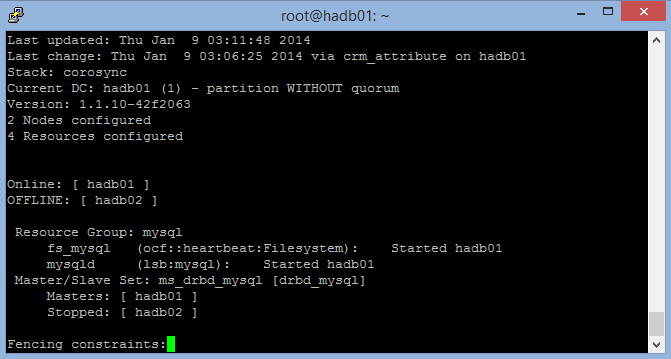

# Use load-balanced sets to clusterize MySQL on Linux
> [!IMPORTANT]
> Azure has two different deployment models for creating and working with resources: [Azure Resource Manager](../../../resource-manager-deployment-model.md) and classic. This article covers using the classic deployment model. Microsoft recommends that most new deployments use the Resource Manager model. A [Resource Manager template](https://azure.microsoft.com/documentation/templates/mysql-replication/) is available if you need to deploy a MySQL cluster.

This article explores and illustrates the different approaches available to deploy highly available Linux-based services on Microsoft Azure, exploring MySQL Server high availability as a primer. A video illustrating this approach is available on [Channel 9](http://channel9.msdn.com/Blogs/Open/Load-balancing-highly-available-Linux-services-on-Windows-Azure-OpenLDAP-and-MySQL).

We will outline a shared-nothing, two-node, single-master MySQL high availability solution based on DRBD, Corosync, and Pacemaker. Only one node runs MySQL at a time. Reading and writing from the DRBD resource is also limited to only one node at a time.

There's no need for a VIP solution like LVS, because you'll use load-balanced sets in Microsoft Azure to provide round-robin functionality and endpoint detection, removal, and graceful recovery of the VIP. The VIP is a globally routable IPv4 address assigned by Microsoft Azure when you first create the cloud service.

There are other possible architectures for MySQL, including NBD Cluster, Percona, Galera, and several middleware solutions, including at least one available as a VM on [VM Depot](http://vmdepot.msopentech.com). As long as these solutions can replicate on unicast vs. multicast or broadcast and don't rely on shared storage or multiple network interfaces, the scenarios should be easy to deploy on Microsoft Azure.

These clustering architectures can be extended to other products like PostgreSQL and OpenLDAP in a similar fashion. For example, this load-balancing procedure with shared nothing was successfully tested with multi-master OpenLDAP, and you can watch it on our Channel 9 blog.

## Get ready
You need the following resources and abilities:

  - A Microsoft Azure account with a valid subscription, able to create at least two VMs (XS was used in this example)
  - A network and a subnet
  - An affinity group
  - An availability set
  - The ability to create VHDs in the same region as the cloud service and attach them to the Linux VMs

### Tested environment
* Ubuntu 13.10
  * DRBD
  * MySQL Server
  * Corosync and Pacemaker

### Affinity group
Create an affinity group for the solution by signing in to the Azure classic portal, selecting **Settings**, and creating an affinity group. Allocated resources created later will be assigned to this affinity group.

### Networks
A new network is created, and a subnet is created inside the network. This example uses a 10.10.10.0/24 network with only one /24 subnet inside.

### Virtual machines
The first Ubuntu 13.10 VM is created by using an Endorsed Ubuntu Gallery image and is called `hadb01`. A new cloud service is created in the process, called hadb. This name illustrates the shared, load-balanced nature that the service will have when more resources are added. The creation of `hadb01` is uneventful and completed by using the portal. An endpoint for SSH is automatically created, and the new network is selected. Now you can create an availability set for the VMs.

After the first VM is created (technically, when the cloud service is created), create the second VM, `hadb02`. For the second VM, use Ubuntu 13.10 VM from the Gallery by using the portal, but use an existing cloud service, `hadb.cloudapp.net`, instead of creating a new one. The network and availability set should be automatically selected. An SSH endpoint will be created, too.

After both VMs have been created, take note of the SSH port for `hadb01` (TCP 22) and `hadb02` (automatically assigned by Azure).

### Attached storage
Attach a new disk to both VMs and create 5-GB disks in the process. The disks are hosted in the VHD container in use for your main operating system disks. After disks are created and attached, there is no need to restart Linux because the kernel will see the new device. This device is usually `/dev/sdc`. Check `dmesg` for the output.

On each VM, create a partition by using `cfdisk` (primary, Linux partition) and write the new partition table. Do not create a file system on this partition.

## Set up the cluster
Use APT to install Corosync, Pacemaker, and DRBD on both Ubuntu VMs. To do so with `apt-get`, run the following code:

    sudo apt-get install corosync pacemaker drbd8-utils.

Do not install MySQL at this time. Debian and Ubuntu installation scripts will initialize a MySQL data directory on `/var/lib/mysql`, but because the directory will be superseded by a DRBD file system, you need to install MySQL later.

Verify (by using `/sbin/ifconfig`) that both VMs are using addresses in the 10.10.10.0/24 subnet and that they can ping each other by name. You can also use `ssh-keygen` and `ssh-copy-id` to make sure both VMs can communicate via SSH without requiring a password.

### Set up DRBD
Create a DRBD resource that uses the underlying `/dev/sdc1` partition to produce a `/dev/drbd1` resource that can be formatted by using ext3 and used in both primary and secondary nodes.

1. Open `/etc/drbd.d/r0.res` and copy the following resource definition on both VMs:

        resource r0 {
          on `hadb01` {
            device  /dev/drbd1;
            disk   /dev/sdc1;
            address  10.10.10.4:7789;
            meta-disk internal;
          }
          on `hadb02` {
            device  /dev/drbd1;
            disk   /dev/sdc1;
            address  10.10.10.5:7789;
            meta-disk internal;
          }
        }

2. Initialize the resource by using `drbdadm` on both VMs:

        sudo drbdadm -c /etc/drbd.conf role r0
        sudo drbdadm up r0

3. On the primary VM (`hadb01`), force ownership (primary) of the DRBD resource:

        sudo drbdadm primary --force r0

If you examine the contents of /proc/drbd (`sudo cat /proc/drbd`) on both VMs, you should see `Primary/Secondary` on `hadb01` and `Secondary/Primary` on `hadb02`, consistent with the solution at this point. The 5-GB disk is synchronized over the 10.10.10.0/24 network at no charge to customers.

After the disk is synchronized, you can create the file system on `hadb01`. For testing purposes, we used ext2, but the following code will create an ext3 file system:

    mkfs.ext3 /dev/drbd1

### Mount the DRBD resource
You're now ready to mount the DRBD resources on `hadb01`. Debian and derivatives use `/var/lib/mysql` as MySQL's data directory. Because you haven't installed MySQL, create the directory and mount the DRBD resource. To perform this option, run the following code on `hadb01`:

    sudo mkdir /var/lib/mysql
    sudo mount /dev/drbd1 /var/lib/mysql

## Set up MySQL
Now you're ready to install MySQL on `hadb01`:

    sudo apt-get install mysql-server

For `hadb02`, you have two options. You can install mysql-server, which will create /var/lib/mysql, fill it with a new data directory, and then remove the contents. To perform this option, run the following code on `hadb02`:

    sudo apt-get install mysql-server
    sudo service mysql stop
    sudo rm –rf /var/lib/mysql/*

The second option is to failover to `hadb02` and then install mysql-server there. Installation scripts will notice the existing installation and won't touch it.

Run the following code on `hadb01`:

    sudo drbdadm secondary –force r0

Run the following code on `hadb02`:

    sudo drbdadm primary –force r0
    sudo apt-get install mysql-server

If you don't plan to failover DRBD now, the first option is easier although arguably less elegant. After you set this up, you can start working on your MySQL database. Run the following code on `hadb02` (or whichever one of the servers is active, according to DRBD):

    mysql –u root –p
    CREATE DATABASE azureha;
    CREATE TABLE things ( id SERIAL, name VARCHAR(255) );
    INSERT INTO things VALUES (1, "Yet another entity");
    GRANT ALL ON things.\* TO root;

> [!WARNING]
> This last statement effectively disables authentication for the root user in this table. This should be replaced by your production-grade GRANT statements and is included only for illustrative purposes.

If you want to make queries from outside the VMs (which is the purpose of this guide), you also need to enable networking for MySQL. On both VMs, open `/etc/mysql/my.cnf` and go to `bind-address`. Change the address from 127.0.0.1 to 0.0.0.0. After saving the file, issue a `sudo service mysql restart` on your current primary.

### Create the MySQL load-balanced set
Go back to the portal, go to `hadb01`, and choose **Endpoints**. To create an endpoint, choose MySQL (TCP 3306) from the drop-down list and select **Create new load balanced set**. Name the load-balanced endpoint `lb-mysql`. Set **Time** to 5 seconds, minimum.

After you create the endpoint, go to `hadb02`, choose **Endpoints**, and create an endpoint. Choose `lb-mysql`, and then select MySQL from the drop-down list. You can also use the Azure CLI for this step.

You now have everything you need for manual operation of the cluster.

### Test the load-balanced set
Tests can be performed from an outside machine by using any MySQL client, or by using certain applications, like phpMyAdmin running as an Azure website. In this case, you used MySQL's command-line tool on another Linux box:

    mysql azureha –u root –h hadb.cloudapp.net –e "select * from things;"

### Manually failing over
You can simulate failovers by shutting down MySQL, switching DRBD's primary, and starting MySQL again.

To perform this task, run the following code on hadb01:

    service mysql stop && umount /var/lib/mysql ; drbdadm secondary r0

Then, on hadb02:

    drbdadm primary r0 ; mount /dev/drbd1 /var/lib/mysql && service mysql start

After you fail over manually, you can repeat your remote query and it should work perfectly.

## Set up Corosync
Corosync is the underlying cluster infrastructure required for Pacemaker to work. For Heartbeat (and other methodologies like Ultramonkey), Corosync is a split of the CRM functionalities, while Pacemaker remains more similar to Heartbeat in functionality.

The main constraint for Corosync on Azure is that Corosync prefers multicast over broadcast over unicast communications, but Microsoft Azure networking only supports unicast.

Fortunately, Corosync has a working unicast mode. The only real constraint is that because all nodes are not communicating among themselves, you need to define the nodes in your configuration files, including their IP addresses. We can use the Corosync example files for Unicast and change bind address, node lists, and logging directories (Ubuntu uses `/var/log/corosync` while the example files use `/var/log/cluster`), and enable quorum tools.

> [!NOTE]
> Use the following `transport: udpu` directive and the manually defined IP addresses for both nodes.

Run the following code on `/etc/corosync/corosync.conf` for both nodes:

    totem {
      version: 2
      crypto_cipher: none
      crypto_hash: none
      interface {
        ringnumber: 0
        bindnetaddr: 10.10.10.0
        mcastport: 5405
        ttl: 1
      }
      transport: udpu
    }

    logging {
      fileline: off
      to_logfile: yes
      to_syslog: yes
      logfile: /var/log/corosync/corosync.log
      debug: off
      timestamp: on
      logger_subsys {
        subsys: QUORUM
        debug: off
        }
      }

    nodelist {
      node {
        ring0_addr: 10.10.10.4
        nodeid: 1
      }

      node {
        ring0_addr: 10.10.10.5
        nodeid: 2
      }
    }

    quorum {
      provider: corosync_votequorum
    }

Copy this configuration file on both VMs and start Corosync in both nodes:

    sudo service start corosync

Shortly after starting the service, the cluster should be established in the current ring, and quorum should be constituted. We can check this functionality by reviewing logs or by running the following code:

    sudo corosync-quorumtool –l

You will see output similar to the following image:

## Set up Pacemaker
Pacemaker uses the cluster to monitor for resources, define when primaries go down, and switch those resources to secondaries. Resources can be defined from a set of available scripts or from LSB (init-like) scripts, among other choices.

We want Pacemaker to "own" the DRBD resource, the mount point, and the MySQL service. If Pacemaker can turn on and off DRBD, mount and unmount it, and then start and stop MySQL in the right order when something bad happens with the primary, setup is complete.

When you first install Pacemaker, your configuration should be simple enough, something like:

    node $id="1" hadb01
      attributes standby="off"
    node $id="2" hadb02
      attributes standby="off"

1. Check the configuration by running `sudo crm configure show`.
2. Then create a file (like `/tmp/cluster.conf`) with the following resources:

        primitive drbd_mysql ocf:linbit:drbd \
              params drbd_resource="r0" \
              op monitor interval="29s" role="Master" \
              op monitor interval="31s" role="Slave"

        ms ms_drbd_mysql drbd_mysql \
              meta master-max="1" master-node-max="1" \
                clone-max="2" clone-node-max="1" \
                notify="true"

        primitive fs_mysql ocf:heartbeat:Filesystem \
              params device="/dev/drbd/by-res/r0" \
              directory="/var/lib/mysql" fstype="ext3"

        primitive mysqld lsb:mysql

        group mysql fs_mysql mysqld

        colocation mysql_on_drbd \
               inf: mysql ms_drbd_mysql:Master

        order mysql_after_drbd \
               inf: ms_drbd_mysql:promote mysql:start

        property stonith-enabled=false

        property no-quorum-policy=ignore

3. Load the file into the configuration. You only need to do this in one node.

        sudo crm configure
          load update /tmp/cluster.conf
          commit
          exit

4. Make sure that Pacemaker starts at boot in both nodes:

        sudo update-rc.d pacemaker defaults

5. By using `sudo crm_mon –L`, verify that one of your nodes has become the master for the cluster and is running all the resources. You can use mount and ps to check that the resources are running.

The following screenshot shows `crm_mon` with one node stopped (exit by selecting Ctrl+C):

This screenshot shows both nodes, one master and one slave:

## Testing
You're ready for an automatic failover simulation. There are two ways to do this: soft and hard.

The soft way uses the cluster's shutdown function: ``crm_standby -U `uname -n` -v on``. If you use this on the master, the slave takes over. Remember to set this back to off. If you don't, crm_mon will show one node on standby.

The hard way is shutting down the primary VM (hadb01) via the portal or by changing the runlevel on the VM (that is, halt, shutdown). This helps Corosync and Pacemaker by signaling that the master's going down. You can test this (useful for maintenance windows), but you can also force the scenario by freezing the VM.

## STONITH
It should be possible to issue a VM shutdown via the Azure CLI in lieu of a STONITH script that controls a physical device. You can use `/usr/lib/stonith/plugins/external/ssh` as a base and enable STONITH in the cluster's configuration. Azure CLI should be globally installed, and the publish settings and profile should be loaded for the cluster's user.

Sample code for the resource is available on [GitHub](https://github.com/bureado/aztonith). Change the cluster's configuration by adding the following to `sudo crm configure`:

    primitive st-azure stonith:external/azure \
      params hostlist="hadb01 hadb02" \
      clone fencing st-azure \
      property stonith-enabled=true \
      commit

> [!NOTE]
> The script doesn't perform up/down checks. The original SSH resource had 15 ping checks, but recovery time for an Azure VM might be more variable.

## Limitations
The following limitations apply:

* The linbit DRBD resource script that manages DRBD as a resource in Pacemaker uses `drbdadm down` when shutting down a node, even if the node is just going on standby. This is not ideal because the slave will not be synchronizing the DRBD resource while the master gets writes. If the master does not fail graciously, the slave can take over an older file system state. There are two potential ways of solving this:
  * Enforcing a `drbdadm up r0` in all cluster nodes via a local (not clusterized) watchdog
  * Editing the linbit DRBD script, making sure that `down` is not called in `/usr/lib/ocf/resource.d/linbit/drbd`
* The load balancer needs at least five seconds to respond, so applications should be cluster-aware and be more tolerant of timeout. Other architectures, like in-app queues and query middlewares, can also help.
* MySQL tuning is necessary to ensure that writing is done at a manageable pace and caches are flushed to disk as frequently as possible to minimize memory loss.
* Write performance is dependent in VM interconnect in the virtual switch because this is the mechanism used by DRBD to replicate the device.
