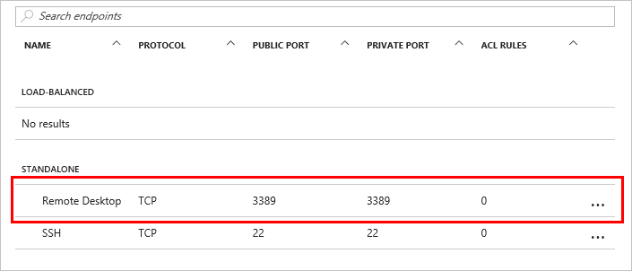
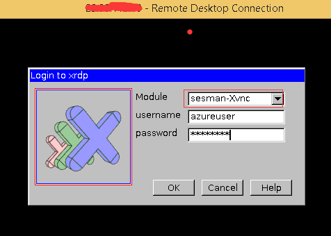

# Using Remote Desktop to connect to a Microsoft Azure Linux VM
> [!IMPORTANT] 
> Azure has two different deployment models for creating and working with resources: [Resource Manager and Classic](../../../resource-manager-deployment-model.md). This article covers using the Classic deployment model. Microsoft recommends that most new deployments use the Resource Manager model.

## Overview
RDP (Remote Desktop Protocol) is a proprietary protocol used for Windows. How can we use RDP to connect to a Linux VM (virtual machine) remotely?

This guidance will give you the answer! It will help you to install and config xrdp on your Microsoft Azure Linux VM, which lets you connect to it with Remote Desktop from a Windows machine. We will use Linux VM running Ubuntu or OpenSUSE as the example in this guidance.

The xrdp tool is an open source RDP server that allows you to connect your Linux server with Remote Desktop from a Windows machine. RDP has better performance than VNC (Virtual Network Computing). VNC renders using JPEG-quality graphics and can be slow, whereas RDP is fast and crystal clear.

> [!NOTE]
> You must already have an Microsoft Azure VM running Linux. To create and set up a Linux VM, see the [Azure Linux VM tutorial](createportal.md).
> 
> 

## Create an endpoint for Remote Desktop
We will use the default endpoint 3389 for Remote Desktop in this doc. Set up 3389 endpoint as `Remote Desktop` to your Linux VM like below:

If you don't know how to set up an endpoint for your VM, see [this guidance](setup-endpoints.md).

## Install Gnome Desktop
Connect to your Linux VM through `putty`, and install `Gnome Desktop`.

For Ubuntu, use:

    #sudo apt-get update
    #sudo apt-get install ubuntu-desktop

For OpenSUSE, use:

    #sudo zypper install gnome-session

## Install xrdp
For Ubuntu, use:

    #sudo apt-get install xrdp

For OpenSUSE, use:

> [!NOTE]
> Update the OpenSUSE version with the version you are using in the following command. The example below is for `OpenSUSE 13.2`.
> 
> 

    #sudo zypper in http://download.opensuse.org/repositories/X11:/RemoteDesktop/openSUSE_13.2/x86_64/xrdp-0.9.0git.1401423964-2.1.x86_64.rpm
    #sudo zypper install tigervnc xorg-x11-Xvnc xterm remmina-plugin-vnc

## Start xrdp and set xdrp service at boot-up
For OpenSUSE, use:

    #sudo systemctl start xrdp
    #sudo systemctl enable xrdp

For Ubuntu, xrdp will be started and eanbled at boot-up automatically after installation.

## Using xfce if you are using an Ubuntu version later than Ubuntu 12.04LTS
Because the current version of xrdp does not support Gnome Desktop for  Ubuntu versions later than Ubuntu 12.04LTS, we will use `xfce` Desktop instead.

To install `xfce`, use this command:

    #sudo apt-get install xubuntu-desktop

Then enable `xfce` using this command:

    #echo xfce4-session >~/.xsession

Edit the config file `/etc/xrdp/startwm.sh`:

    #sudo vi /etc/xrdp/startwm.sh   

Add the line `xfce4-session` before the line `/etc/X11/Xsession`.

To restart the xrdp service, use this:

    #sudo service xrdp restart

## Connect your Linux VM from a Windows machine
In a Windows machine, start the Remote Desktop client and input your Linux VM DNS name. Or go to the Dashboard of your VM in the Azure portal and click `Connect` to connect your Linux VM. In that case, you see the login window:

Log in with the user name and password of your Linux VM.

## Next
For more information about using xrdp, see [http://www.xrdp.org/](http://www.xrdp.org/).
