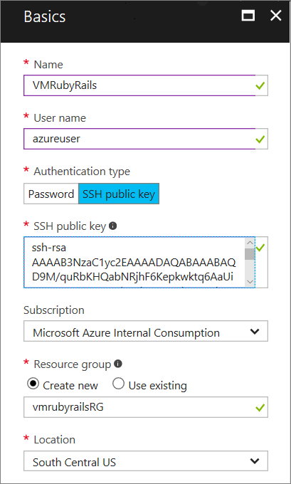
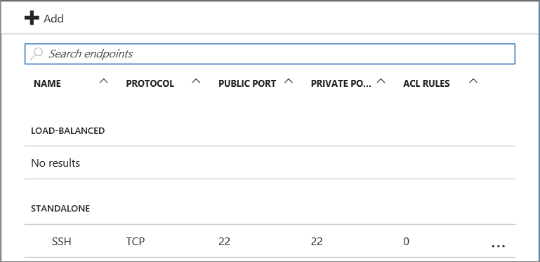
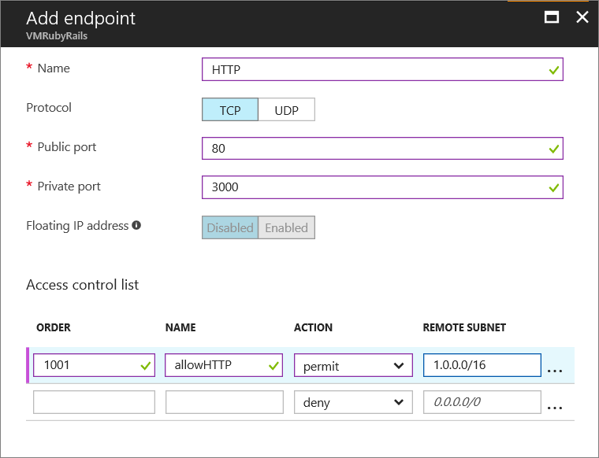

# Ruby on Rails Web application on an Azure VM
This tutorial shows how to host a Ruby on Rails website on Azure using a Linux virtual machine.  

This tutorial was validated using Ubuntu Server 14.04 LTS. If you use a different Linux distribution, you might need to modify the steps to install Rails.

> [!IMPORTANT]
> Azure has two different deployment models for creating and working with resources:  [Resource Manager and classic](../../../azure-resource-manager/resource-manager-deployment-model.md).  This article covers using the classic deployment model. Microsoft recommends that most new deployments use the Resource Manager model.
>
>

## Create an Azure VM
Start by creating an Azure VM with a Linux image.

To create the VM, you can use the Azure portal or the Azure Command-Line Interface (CLI).

### Azure portal
1. Sign into the [Azure portal](https://portal.azure.com)
2. Click **New**, then type "Ubuntu Server 14.04" in the search box. Click the entry returned by the search. For the deployment model, select **Classic**, then click "Create".
3. In the Basics blade, supply values for the required fields: Name (for the VM), User name, Authentication type and the corresponding credentials, Azure subscription, Resource group, and Location.

   

4. After the VM is provisioned, click on the VM name, and click **Endpoints** in the **Settings** category. Find the SSH endpoint, listed under **Standalone**.

   

### Azure CLI
Follow the steps in [Create a Virtual Machine Running Linux][vm-instructions].

After the VM is provisioned, you can get the SSH endpoint by running the following command:

    azure vm endpoint list <vm-name>  

## Install Ruby on Rails
1. Use SSH to connect to the VM.
2. From the SSH session, use the following commands to install Ruby on the VM:

        sudo apt-get update -y
        sudo apt-get upgrade -y

        sudo apt-add-repository ppa:brightbox/ruby-ng
        sudo apt-get update
        sudo apt-get install ruby2.4

        > [!TIP]
        > The brightbox repository contains the current Ruby distribution.

    The installation may take a few minutes. When it completes, use the following command to verify that Ruby is installed:

        ruby -v

3. Use the following command to install Rails:

        sudo gem install rails --no-rdoc --no-ri -V

    Use the --no-rdoc and --no-ri flags to skip installing the documentation, which is faster.
    This command will likely take a long time to execute, so adding the -V will display information about the installation progress.

## Create and run an app
While still logged in via SSH, run the following commands:

    rails new myapp
    cd myapp
    rails server -b 0.0.0.0 -p 3000

The [new](http://guides.rubyonrails.org/command_line.html#rails-new) command creates a new Rails app. The [server](http://guides.rubyonrails.org/command_line.html#rails-server) command starts the WEBrick web server that comes with Rails. (For production use, you would probably want to use a different server, such as Unicorn or Passenger.)

You should see output similar to the following.

    => Booting WEBrick
    => Rails 4.2.1 application starting in development on http://0.0.0.0:3000
    => Run `rails server -h` for more startup options
    => Ctrl-C to shutdown server
    [2015-06-09 23:34:23] INFO  WEBrick 1.3.1
    [2015-06-09 23:34:23] INFO  ruby 1.9.3 (2013-11-22) [x86_64-linux]
    [2015-06-09 23:34:23] INFO  WEBrick::HTTPServer#start: pid=27766 port=3000

## Add an endpoint
1. Go to the [Azure portal][https://portal.azure.com] and select your VM.

2. Select **ENDPOINTS** in the **Settings** along the left edge the page.

3. Click **ADD** at the top of the page.

4. In the **Add endpoint** dialog page, enter the following information:

   * **Name**: HTTP
   * **Protocol**: TCP
   * **Public port**: 80
   * **Private port**: 3000
   * **Floating PI address**: Disabled
   * **Access control list - Order**: 1001, or another value that sets the priority of this access rule.
   * **Access control list - Name**: allowHTTP
   * **Access control list - Action**: permit
   * **Access control list - Remote subnet**: 1.0.0.0/16

     This endpoint  has a public port of 80 that will route traffic to the private port of 3000, where the Rails server is listening. The access control list rule allows public traffic on port 80.

     

5. Click OK to save the endpoint.

6. A message should appear that states **Saving virtual machine endpoint**. Once this message disappears, the endpoint is active. You may now test your application by navigating to the DNS name of your virtual machine. The website should appear similar to the following:

    ![default rails page][default-rails-cloud]

## Next steps
In this tutorial, you did most of the steps manually. In a production environment, you would write your app on a development machine and deploy it to the Azure VM. Also, most production environments host the Rails application in conjunction with another server process such as Apache or NginX, which handles request routing to multiple instances of the Rails application and serving static resources. For more information, see http://rubyonrails.org/deploy/.

To learn more about Ruby on Rails, visit the [Ruby on Rails Guides][rails-guides].

To use Azure services from your Ruby application, see:

* [Store unstructured data using blobs][blobs]
* [Store key/value pairs using tables][tables]
* [Serve high bandwidth content with the Content Delivery Network][cdn-howto]

<!-- WA.com links -->
[blobs]:../../../storage/storage-ruby-how-to-use-blob-storage.md
[cdn-howto]:https://azure.microsoft.com/develop/ruby/app-services/
[tables]:../../../storage/storage-ruby-how-to-use-table-storage.md
[vm-instructions]:createportal.md

<!-- External Links -->
[rails-guides]:http://guides.rubyonrails.org/
[sqlite3]:http://www.sqlite.org/

<!-- Images -->

[default-rails-cloud]:./media/virtual-machines-linux-classic-ruby-rails-web-app/basicrailscloud.png
[vmlist]:./media/virtual-machines-linux-classic-ruby-rails-web-app/vmlist.png
[endpoints]:./media/virtual-machines-linux-classic-ruby-rails-web-app/endpoints.png
[new-endpoint]:./media/virtual-machines-linux-classic-ruby-rails-web-app/newendpoint.png
[new-endpoint1]:./media/virtual-machines-linux-classic-ruby-rails-web-app/newendpoint1.png
