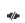

# How to detach a data disk from a Linux virtual machine

When you no longer need a data disk that's attached to a virtual machine, you can easily detach it. This removes the disk from the virtual machine, but doesn't remove it from storage. In this article, we are working with an Ubuntu LTS 16.04 distribution. If you are using a different distribution, the instructions for unmounting the disk might be different.

> [!WARNING]
> If you detach a disk it is not automatically deleted. If you have subscribed to Premium storage, you will continue to incur storage charges for the disk. For more information, see [Pricing and Billing when using Premium Storage](../windows/premium-storage.md#pricing-and-billing). 
> 
> 

If you want to use the existing data on the disk again, you can reattach it to the same virtual machine, or another one.  


## Connect to the VM to unmount the disk

Before you can detach the disk using either CLI or the portal, you need to unmount the disk and removed references to if from your fstab file.

Connect to the VM. In this example, the public IP address of the VM is *10.0.1.4* with the username *azureuser*: 

```bash
ssh azureuser@10.0.1.4
```

First, find the data disk that you want to detach. The following example uses dmesg to filter on SCSI disks:

```bash
dmesg | grep SCSI
```

The output is similar to the following example:

```bash
[    0.294784] SCSI subsystem initialized
[    0.573458] Block layer SCSI generic (bsg) driver version 0.4 loaded (major 252)
[    7.110271] sd 2:0:0:0: [sda] Attached SCSI disk
[    8.079653] sd 3:0:1:0: [sdb] Attached SCSI disk
[ 1828.162306] sd 5:0:0:0: [sdc] Attached SCSI disk
```

Here, *sdc* is the disk that we want to detach. You also should grab the UUID of the disk.

```bash
sudo -i blkid
```

The output looks similar to the following example:

```bash
/dev/sda1: UUID="11111111-1b1b-1c1c-1d1d-1e1e1e1e1e1e" TYPE="ext4"
/dev/sdb1: UUID="22222222-2b2b-2c2c-2d2d-2e2e2e2e2e2e" TYPE="ext4"
/dev/sdc1: UUID="33333333-3b3b-3c3c-3d3d-3e3e3e3e3e3e" TYPE="ext4"
```


Edit the */etc/fstab* file to remove references to the disk. 

> [!NOTE]
> Improperly editing the **/etc/fstab** file could result in an unbootable system. If unsure, refer to the distribution's documentation for information on how to properly edit this file. It is also recommended that a backup of the /etc/fstab file is created before editing.

Open the */etc/fstab* file in a text editor as follows:

```bash
sudo vi /etc/fstab
```

In this example, the following line needs to be deleted from the */etc/fstab* file:

```bash
UUID=33333333-3b3b-3c3c-3d3d-3e3e3e3e3e3e   /datadrive   ext4   defaults,nofail   1   2
```

Use `umount` to unmount the disk. The following example unmounts the */dev/sdc1* partition from the */datadrive* mount point:

```bash
sudo umount /dev/sdc1 /datadrive
```


## Detach a data disk using Azure CLI 

This example detaches the *myDataDisk* disk from VM named *myVM* in *myResourceGroup*.

```azurecli
az vm disk detach \
    -g myResourceGroup \
	--vm-name myVm \
	-n myDataDisk
```

The disk stays in storage but is no longer attached to a virtual machine.


## Detach a data disk using the portal

1. In the left menu, select **Virtual Machines**.
2. Select the virtual machine that has the data disk you want to detach and click **Stop** to deallocate the VM.
3. In the virtual machine pane, select **Disks**.
4. At the top of the **Disks** pane, select **Edit**.
5. In the **Disks** pane, to the far right of the data disk that you would like to detach, click the  detach button.
5. After the disk has been removed, click Save on the top of the pane.
6. In the virtual machine pane, click **Overview** and then click the **Start** button at the top of the pane to restart the VM.

The disk stays in storage but is no longer attached to a virtual machine.


## Next steps
If you want to reuse the data disk, you can just [attach it to another VM](add-disk.md?toc=%2fazure%2fvirtual-machines%2flinux%2ftoc.json).

