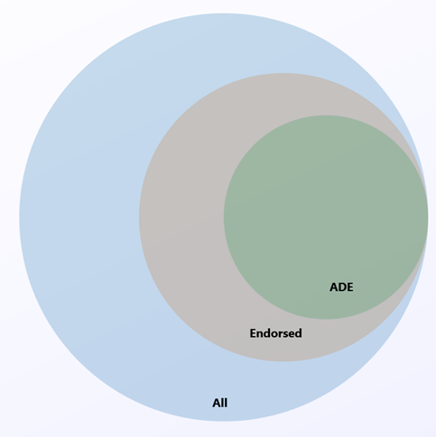

# Azure Disk Encryption for Linux VMs 

Azure Disk Encryption helps protect and safeguard your data to meet your organizational security and compliance commitments. It uses the [DM-Crypt](https://en.wikipedia.org/wiki/Dm-crypt) feature of Linux to provide volume encryption for the OS and data disks of Azure virtual machines (VMs), and is integrated with [Azure Key Vault](../../key-vault/index.yml) to help you control and manage the disk encryption keys and secrets. 

If you use [Azure Security Center](../../security-center/index.yml), you're alerted if you have VMs that aren't encrypted. The alerts show as High Severity and the recommendation is to encrypt these VMs.


> [!WARNING]
> - If you have previously used Azure Disk Encryption with Azure AD to encrypt a VM, you must continue to use this option to encrypt your VM. See [Azure Disk Encryption with Azure AD (previous release)](disk-encryption-overview-aad.md) for details. 
> - Certain recommendations might increase data, network, or compute resource usage, resulting in additional license or subscription costs. You must have a valid active Azure subscription to create resources in Azure in the supported regions.
> - Currently Generation 2 VMs do not support Azure Disk Encryption. See [Support for Generation 2 VMs on Azure](https://docs.microsoft.com/azure/virtual-machines/windows/generation-2) for details.

You can learn the fundamentals of Azure Disk Encryption for Linux in just a few minutes with the [Create and encrypt a Linux VM with Azure CLI quickstart](disk-encryption-cli-quickstart.md) or the [Create and encrypt a Linux VM with Azure PowerShell quickstart](disk-encryption-powershell-quickstart.md).

## Supported VMs and operating systems

### Supported VMs

Linux VMs are available in a [range of sizes](sizes.md). Azure Disk Encryption is not available on [Basic, A-series VMs](https://azure.microsoft.com/pricing/details/virtual-machines/series/), or on virtual machines that do not meet these minimum memory requirements:

| Virtual machine | Minimum memory requirement |
|--|--|
| Linux VMs when only encrypting data volumes| 2 GB |
| Linux VMs when encrypting both data and OS volumes, and where the root (/) file system usage is 4GB or less | 8 GB |
| Linux VMs when encrypting both data and OS volumes, and where the root (/) file system usage is greater than 4GB | The root file system usage * 2. For instance, a 16 GB of root file system usage requires at least 32GB of RAM |

Once the OS disk encryption process is complete on Linux virtual machines, the VM can be configured to run with less memory. 

Azure Disk Encryption is also available for VMs with premium storage.

Azure Disk Encryption is not available on [Generation 2 VMs](generation-2.md#generation-1-vs-generation-2-capabilities)) and [Lsv2-series VMs](../lsv2-series.md)). For more exceptions, see [Azure Disk Encryption: Unsupported scenarios](disk-encryption-linux.md#unsupported-scenarios).

### Supported operating systems

Azure Disk Encryption is supported on a subset of the [Azure-endorsed Linux distributions](endorsed-distros.md), which is itself a subset of all Linux server possible distributions.



Linux server distributions that are not endorsed by Azure do not support Azure Disk Encryption; of those that are endorsed, only the following distributions and versions support Azure Disk Encryption:

| Publisher | Offer | SKU | URN | Volume type supported for encryption |
| --- | --- |--- | --- |
| Canonical | Ubuntu | 18.04-LTS | Canonical:UbuntuServer:18.04-LTS:latest | OS and data disk |
| Canonical | Ubuntu 18.04 | 18.04-DAILY-LTS | Canonical:UbuntuServer:18.04-DAILY-LTS:latest | OS and data disk |
| Canonical | Ubuntu 16.04 | 16.04-DAILY-LTS | Canonical:UbuntuServer:16.04-DAILY-LTS:latest | OS and data disk |
| Canonical | Ubuntu 14.04.5</br>[with Azure tuned kernel updated to 4.15 or later](disk-encryption-troubleshooting.md) | 14.04.5-LTS | Canonical:UbuntuServer:14.04.5-LTS:latest | OS and data disk |
| Canonical | Ubuntu 14.04.5</br>[with Azure tuned kernel updated to 4.15 or later](disk-encryption-troubleshooting.md) | 14.04.5-DAILY-LTS | Canonical:UbuntuServer:14.04.5-DAILY-LTS:latest | OS and data disk |
| RedHat | RHEL 7.7 | 7.7 | RedHat:RHEL:7.7:latest | OS and data disk (see note below) |
| RedHat | RHEL 7.7 | 7-RAW | RedHat:RHEL:7-RAW:latest | OS and data disk (see note below) |
| RedHat | RHEL 7.7 | 7-LVM | RedHat:RHEL:7-LVM:latest | OS and data disk (see note below) |
| RedHat | RHEL 7.6 | 7.6 | RedHat:RHEL:7.6:latest | OS and data disk (see note below) |
| RedHat | RHEL 7.5 | 7.5 | RedHat:RHEL:7.5:latest | OS and data disk (see note below) |
| RedHat | RHEL 7.4 | 7.4 | RedHat:RHEL:7.4:latest | OS and data disk (see note below) |
| RedHat | RHEL 7.3 | 7.3 | RedHat:RHEL:7.3:latest | OS and data disk (see note below) |
| RedHat | RHEL 7.2 | 7.2 | RedHat:RHEL:7.2:latest | OS and data disk (see note below) |
| RedHat | RHEL 6.8 | 6.8 | RedHat:RHEL:6.8:latest | Data disk (see note below) |
| RedHat | RHEL 6.7 | 6.7 | RedHat:RHEL:6.7:latest | Data disk (see note below) |
| OpenLogic | CentOS 7.7 | 7.7 | OpenLogic:CentOS:7.7:latest | OS and data disk |
| OpenLogic | CentOS 7.7 | 7-LVM | OpenLogic:CentOS:7-LVM:latest | OS and data disk |
| OpenLogic | CentOS 7.6 | 7.6 | OpenLogic:CentOS:7.6:latest | OS and data disk |
| OpenLogic | CentOS 7.5 | 7.5 | OpenLogic:CentOS:7.5:latest | OS and data disk |
| OpenLogic | CentOS 7.4 | 7.4 | OpenLogic:CentOS:7.4:latest | OS and data disk |
| OpenLogic | CentOS 7.3 | 7.3 | OpenLogic:CentOS:7.3:latest | OS and data disk |
| OpenLogic | CentOS 7.2n | 7.2n | OpenLogic:CentOS:7.2n:latest | OS and data disk |
| OpenLogic | CentOS 7.1 | 7.1 | OpenLogic:CentOS:7.1:latest | Data disk only |
| OpenLogic | CentOS 7.0 | 7.0 | OpenLogic:CentOS:7.0:latest | Data disk only |
| OpenLogic | CentOS 6.8 | 6.8 | OpenLogic:CentOS:6.8:latest | Data disk only |
| SUSE | openSUSE 42.3 | 42.3 | SUSE:openSUSE-Leap:42.3:latest | Data disk only |
| SUSE | SLES 12-SP4 | 12-SP4 | SUSE:SLES:12-SP4:latest | Data disk only |
| SUSE | SLES HPC 12-SP3 | 12-SP3 | SUSE:SLES-HPC:12-SP3:latest | Data disk only |

> [!NOTE]
> The new Azure Disk Encryption implementation is supported for RHEL OS and data disk for RHEL7 Pay-As-You-Go images.  
>
> ADE is also supported for RHEL Bring-Your-Own-Subscription Gold Images, but only **after** the subscription has been registered . For more information, see [Red Hat Enterprise Linux Bring-Your-Own-Subscription Gold Images in Azure](../workloads/redhat/byos.md#encrypt-red-hat-enterprise-linux-bring-your-own-subscription-gold-images)

## Additional VM requirements

Azure Disk Encryption requires the dm-crypt and vfat modules to be present on the system. Removing or disabling vfat from the default image will prevent the system from reading the key volume and obtaining the key needed to unlock the disks on subsequent reboots. System hardening steps that remove the vfat module from the system are not compatible with Azure Disk Encryption. 

Before enabling encryption, the data disks to be encrypted must be properly listed in /etc/fstab. Use the "nofail" option when creating entries, and choose a persistent block device name (as device names in the "/dev/sdX" format may not be associated with the same disk across reboots, particularly after encryption; for more detail on this behavior, see: [Troubleshoot Linux VM device name changes](troubleshoot-device-names-problems.md)).

Make sure the /etc/fstab settings are configured properly for mounting. To configure these settings, run the mount -a command or reboot the VM and trigger the remount that way. Once that is complete, check the output of the lsblk command to verify that the drive is still mounted. 

- If the /etc/fstab file doesn't mount the drive properly before enabling encryption, Azure Disk Encryption won't be able to mount it properly.
- The Azure Disk Encryption process will move the mount information out of /etc/fstab and into its own configuration file as part of the encryption process. Don't be alarmed to see the entry missing from /etc/fstab after data drive encryption completes.
- Before starting encryption, be sure to stop all services and processes that could be writing to mounted data disks and disable them, so that they do not restart automatically after a reboot. These could keep files open on these partitions, preventing the encryption procedure to remount them, causing failure of the encryption. 
- After reboot, it will take time for the Azure Disk Encryption process to mount the newly encrypted disks. They won't be immediately available after a reboot. The process needs time to start, unlock, and then mount the encrypted drives before being available for other processes to access. This process may take more than a minute after reboot depending on the system characteristics.

Here is an example of the commands used to mount the data disks and create the necessary /etc/fstab entries:

```bash
UUID0="$(blkid -s UUID -o value /dev/disk/azure/scsi1/lun0)"
UUID1="$(blkid -s UUID -o value /dev/disk/azure/scsi1/lun1)"
mkdir /data0
mkdir /data1
echo "UUID=$UUID0 /data0 ext4 defaults,nofail 0 0" >>/etc/fstab
echo "UUID=$UUID1 /data1 ext4 defaults,nofail 0 0" >>/etc/fstab
mount -a
```
## Networking requirements

To enable the Azure Disk Encryption feature, the Linux VMs must meet the following network endpoint configuration requirements:
  - To get a token to connect to your key vault, the Linux VM must be able to connect to an Azure Active Directory endpoint, \[login.microsoftonline.com\].
  - To write the encryption keys to your key vault, the Linux VM must be able to connect to the key vault endpoint.
  - The Linux VM must be able to connect to an Azure storage endpoint that hosts the Azure extension repository and an Azure storage account that hosts the VHD files.
  -  If your security policy limits access from Azure VMs to the Internet, you can resolve the preceding URI and configure a specific rule to allow outbound connectivity to the IPs. For more information, see [Azure Key Vault behind a firewall](../../key-vault/general/access-behind-firewall.md).  

## Encryption key storage requirements  

Azure Disk Encryption requires an Azure Key Vault to control and manage disk encryption keys and secrets. Your key vault and VMs must reside in the same Azure region and subscription.

For details, see [Creating and configuring a key vault for Azure Disk Encryption](disk-encryption-key-vault.md).

## Terminology
The following table defines some of the common terms used in Azure disk encryption documentation:

| Terminology | Definition |
| --- | --- |
| Azure Key Vault | Key Vault is a cryptographic, key management service that's based on Federal Information Processing Standards (FIPS) validated hardware security modules. These standards help to safeguard your cryptographic keys and sensitive secrets. For more information, see the [Azure Key Vault](https://azure.microsoft.com/services/key-vault/) documentation and [Creating and configuring a key vault for Azure Disk Encryption](disk-encryption-key-vault.md). |
| Azure CLI | [The Azure CLI](/cli/azure/install-azure-cli) is optimized for managing and administering Azure resources from the command line.|
| DM-Crypt |[DM-Crypt](https://gitlab.com/cryptsetup/cryptsetup/wikis/DMCrypt) is the Linux-based, transparent disk-encryption subsystem that's used to enable disk encryption on Linux VMs. |
| Key encryption key (KEK) | The asymmetric key (RSA 2048) that you can use to protect or wrap the secret. You can provide a hardware security module (HSM)-protected key or software-protected key. For more information, see the [Azure Key Vault](https://azure.microsoft.com/services/key-vault/) documentation and [Creating and configuring a key vault for Azure Disk Encryption](disk-encryption-key-vault.md). |
| PowerShell cmdlets | For more information, see [Azure PowerShell cmdlets](/powershell/azure/overview). |


## Next steps

- [Quickstart - Create and encrypt a Linux VM with Azure CLI ](disk-encryption-cli-quickstart.md)
- [Quickstart - Create and encrypt a Linux VM with Azure Powershell](disk-encryption-powershell-quickstart.md)
- [Azure Disk Encryption scenarios on Linux VMs](disk-encryption-linux.md)
- [Azure Disk Encryption prerequisites CLI script](https://github.com/ejarvi/ade-cli-getting-started)
- [Azure Disk Encryption prerequisites PowerShell script](https://github.com/Azure/azure-powershell/tree/master/src/Compute/Compute/Extension/AzureDiskEncryption/Scripts)
- [Creating and configuring a key vault for Azure Disk Encryption](disk-encryption-key-vault.md)


