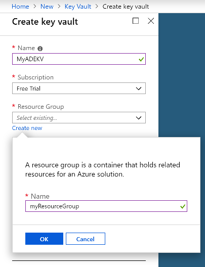
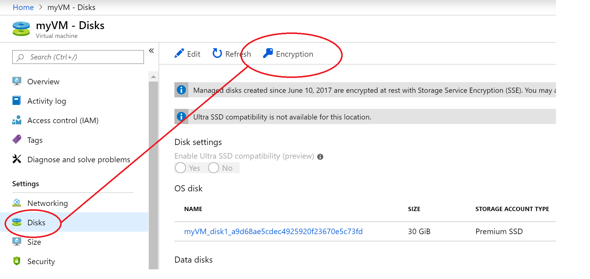

# Quickstart: Create and encrypt a virtual machine with the Azure portal

Azure virtual machines (VMs) can be created through the Azure portal. The Azure portal is a browser-based user interface to create VMs and their associated resources. In this quickstart you will use the Azure portal to deploy a Linux virtual machine (VM) running Ubuntu 18.04 LTS, create a key vault for the storage of encryption keys, and encrypt the VM.

If you don't have an Azure subscription, create a [free account](https://azure.microsoft.com/free/?WT.mc_id=A261C142F) before you begin.

## Sign in to Azure

Sign in to the [Azure portal](https://portal.azure.com).

## Create a key vault

1. Select the **Create a resource** option on the upper left-hand corner of the Azure portal
1. In the Search box, enter **Key Vault**.
1. From the results list, select **Key Vault**.
1. On the Key Vault section, select **Create**.
1. On the **Create key vault** screen, choose a unique name for your new key vault.

    > [!Important]
    > Each Key Vault must have a unique name. The following example creates a Key Vault named *myADEKV*, but you must name yours something different.

1. Select  a **Subscription**.
1.  Under **Resource group**, select **Create new**. In the pop-up, type *myResourceGroup* for the name of the resource group and then choose **OK**. 

    

1. In the **Location** pull-down menu, choose **East US**.
1. Leave the other options to their defaults.
1. Select "Access Polices", which will take you to a new screen.
1. Select the checkbox next to "Enable access to Azure Disk Encryption for volume encryption.

    

1. At the bottom of the Access Policies screen, click "Review + Create".
1. After reviewing, click "Create".

## Create a virtual machine

1. Choose **Create a resource** in the upper left corner of the Azure portal.

1. In the New page, under Popular, select **Ubuntu Server 18.04 LTS**.
1. In the **Basics** tab, under **Project details**, make sure the correct subscription is selected.
1. For **Resource group**, select the resource group you created when making your key vault above (e.g., **myResourceGroup**).
1. For **Virtual machine name**, enter *MyVM*.
1. For **Region**, select the same region you used when making your key vault above (e.g., **East US**).
1. Make sure the **Size** is *Standard D2s v3*.
1. Under **Administrator account**, select **Password**. Enter a user name and a password.
    
1. Select the "Management" tab and verify that you have a Diagnostics Storage Account. If you have no storage accounts, select "Create New", give your new account a name, and select "Ok"
    
1. Click "Review + Create".
1. On the **Create a virtual machine** page, you can see the details about the VM you are about to create. When you are ready, select **Create**.

It will take a few minutes for your VM to be deployed. When the deployment is finished, move on to the next section.

## Encrypt the virtual machine

1. When the VM deployment is complete, select **Go to resource**.
1. On the left-hand sidebar, select **Disks**.
1. On the Disks screen, select **Encryption**. 

    

1. On the encryption screen, under **Disks to encrypt**, choose **OS and data disks**.
1. Under **Encryption settings**, click "Select a key vault and key for encryption".
1. In the right-hand sidebar, select the name of the key vault you created earlier as the value for **Key vault**, and click **Select**.

    
1. At the top of the encryption screen, click "Save". A popup will warn you that the VM will reboot. Click **Yes**.

## Clean up resources

When no longer needed, you can delete the resource group, virtual machine, and all related resources. To do so, select the resource group for the virtual machine, select Delete, then confirm the name of the resource group to delete.

## Next steps

In this quickstart, you created a Key Vault that was enable for encryption keys, created a virtual machine, and enabled the virtual machine for encryption.  

> [!div class="nextstepaction"]
> [Azure Disk Encryption overview](disk-encryption-overview.md)
