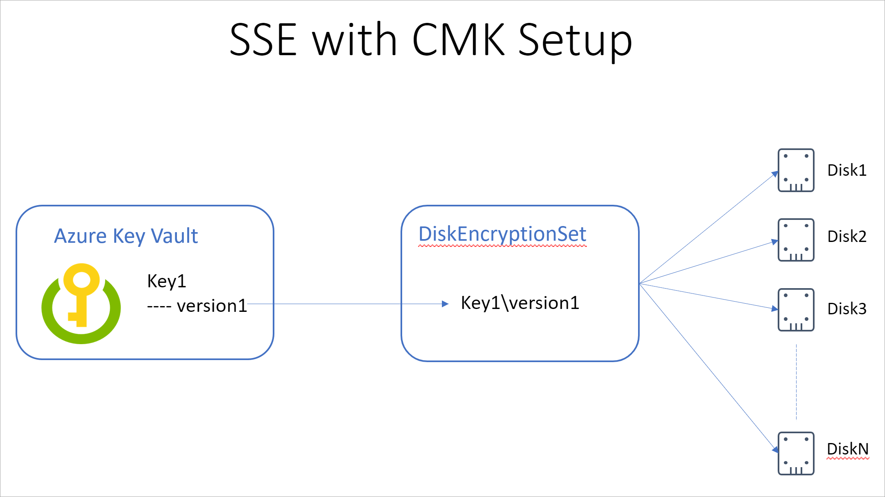
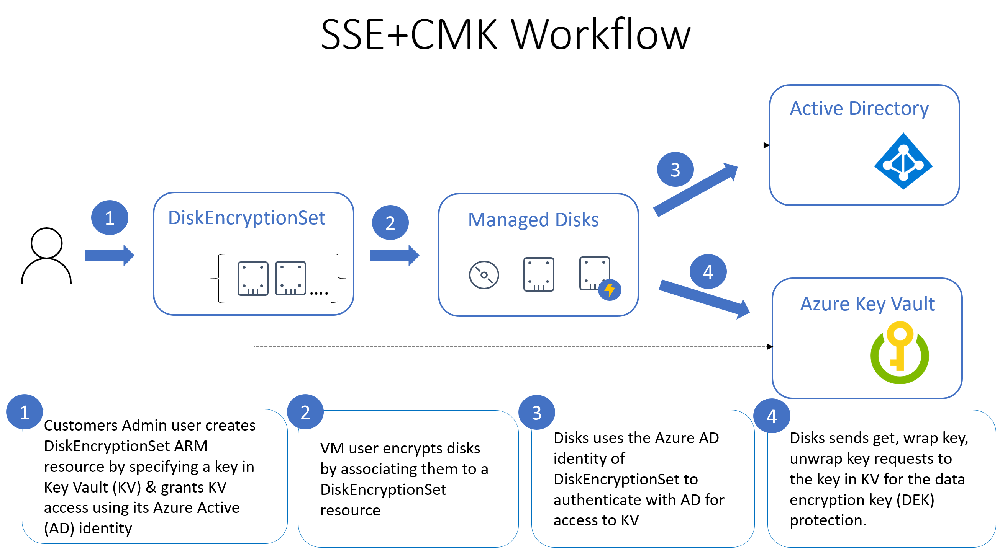

# Azure Storage encryption for data at rest

Azure Storage automatically encrypts your data when persisting it to the cloud. Encryption protects your data and to help you to meet your organizational security and compliance commitments. Data in Azure Storage is encrypted and decrypted transparently using 256-bit [AES encryption](https://en.wikipedia.org/wiki/Advanced_Encryption_Standard), one of the strongest block ciphers available, and is FIPS 140-2 compliant. Azure Storage encryption is similar to BitLocker encryption on Windows.

Azure Storage encryption is enabled for all new and existing managed disks and cannot be disabled. Because your data is secured by default, you don't need to modify your code or applications to take advantage of Azure Storage encryption.

Managed disks are encrypted regardless of their disk type. All Azure Storage redundancy options support encryption, and all copies of a storage account are encrypted. All object metadata is also encrypted.

Encryption does not affect performance. There is no additional cost for Azure Storage encryption.

For more information about the cryptographic modules underlying Azure Storage encryption, see [Cryptography API: Next Generation](https://docs.microsoft.com/windows/desktop/seccng/cng-portal).

## About encryption key management

You can rely on Microsoft-managed keys for the encryption of your managed disk, or you can manage encryption with your own keys. If you choose to manage encryption with your own keys, you can specify a *customer-managed key* to use for encrypting and decrypting all data in the storage account. A customer-managed key is used to encrypt all data in your managed disk.

The following sections describe each of the options for key management in greater detail.

## Microsoft-managed keys

By default, your managed disk uses Microsoft-managed encryption keys.

## Customer-managed keys

You can choose to manage Azure Storage encryption at the level of each managed disk, with your own keys. When you specify a customer-managed key at the level of the managed disk, that key is used to encrypt and decrypt all data in the managed disk.  Customer-managed keys offer greater flexibility to create, rotate, disable, and revoke access controls. You can also audit the encryption keys used to protect your data.



You must use Azure Key Vault to store your customer-managed keys. You can either create your own keys and store them in a key vault, or you can use the Azure Key Vault APIs to generate keys. The storage account and the key vault must be in the same region, but they can be in different subscriptions. For more information about Azure Key Vault, see [What is Azure Key Vault?](../../key-vault/key-vault-overview.md).

This diagram shows how Azure Storage uses Azure Active Directory and Azure Key Vault to make requests using the customer-managed key:



The following list explains the numbered steps in the diagram:

1. An administrator creates keyvault resources using an encryption key of their choice.
1. That administrator creates a disk encryption set, 
1. That administrator can then associate each disk encryption set with the azure keyvault encryption key.
1. The administrator can assign a rule, that every managed disk in the subscription must use a disk encryption set.
1. Now, when regular users in that subscription create a managed disk, the disk encryption set is automatically assigned.
1. When a disk encryption set is assigned to a managed disk, a managed identity is created in Azure active directory (AD).
1. These managed identities handle authentication and access to the managed disk, using the key that you provided to Azure keyvault.
1. For read/write operations, requests are sent to Azure Key Vault to wrap and unwrap the encryption key in order to perform encryption and decryption operations.
1. When a managed disk is associated with a disk encryption set, Azure AD creates the associated managed identities for authentication with the managed disk.

1. An Azure Key Vault admin grants permissions to encryption keys to the managed identity that's associated with the storage account.
2. An Azure Storage admin configures encryption with a customer-managed key for the storage account.
3. Azure Storage uses the managed identity that's associated with the storage account to authenticate access to Azure Key Vault via Azure Active Directory.
4. Azure Storage wraps the account encryption key with the customer key in Azure Key Vault.
5. For read/write operations, Azure Storage sends requests to Azure Key Vault to wrap and unwrap the account encryption key to perform encryption and decryption operations.

To revoke access to customer-managed keys on the storage account, see [Azure Key Vault PowerShell](https://docs.microsoft.com/powershell/module/azurerm.keyvault/) and [Azure Key Vault CLI](https://docs.microsoft.com/cli/azure/keyvault). Revoking access effectively blocks access to all data in the storage account, as the encryption key is inaccessible by Azure Storage.

### Setting up your Azure Key Vault

1.	Create an instance of Azure Key Vault and encryption key

```powershell
$keyVault = New-AzKeyVault -Name myKeyVaultName ` 
-ResourceGroupName myRGName ` 
-Location centraluseuap ` 
-EnableSoftDelete ` 
-EnablePurgeProtection 
 
$key = Add-AzKeyVaultKey -VaultName $keyVault.VaultName ` 
-Name myKeyName ` 
-Destination Software `  
```

1.	Create an instance of a new resource type called as DiskEncryptionSet which represents a CMK. 

```powershell
New-AzResourceGroupDeployment -ResourceGroupName myRGName ` 
  -TemplateUri "https://raw.githubusercontent.com/ramankumarlive/manageddiskscmkpreview/master/CreateDiskEncryptionSet.json" ` 
  -diskEncryptionSetName "myDiskEncryptionSet1" ` 
  -keyVaultId "/subscriptions/mySubscriptionId/resourceGroups/myRGName/providers/Microsoft.KeyVault/vaults/myKeyVaultName" ` 
  -keyVaultKeyUrl "https://myKeyVaultName.vault.azure.net/keys/myKeyName/403445136dee4a57af7068cab08f7d42" ` 
  -region "WestCentralUS"
```

1.	Grant DataEncryptionSet resource access to the key vault

```powershell
$identity = Get-AzADServicePrincipal -DisplayName myDiskEncryptionSet1  
 
Set-AzKeyVaultAccessPolicy ` 
    -VaultName $keyVault.VaultName ` 
    -ObjectId $identity.Id ` 
    -PermissionsToKeys wrapkey,unwrapkey,get 
 
New-AzRoleAssignment ` 
    -ObjectId $identity.Id ` 
    -RoleDefinitionName "Reader" ` 
    -ResourceName $keyVault.VaultName ` 
    -ResourceType "Microsoft.KeyVault/vaults" ` 
    -ResourceGroupName myRGName `  
```

> [!IMPORTANT]
> Customer-managed keys rely on managed identities for Azure resources, a feature of Azure Active Directory (Azure AD). When you configure customer-managed keys, a managed identity is automatically assigned to your resources under the covers. If you subsequently move the subscription, resource group, or managed disk from one Azure AD directory to another, the managed identity associated with the storage account is not transferred to the new tenant, so customer-managed keys may no longer work. For more information, see **Transferring a subscription between Azure AD directories** in [FAQs and known issues with managed identities for Azure resources](../../active-directory/managed-identities-azure-resources/known-issues.md#transferring-a-subscription-between-azure-ad-directories).  

## Azure Storage encryption versus disk encryption

With Azure Storage encryption, all Azure Storage accounts and the resources they contain are encrypted, including the page blobs that back Azure virtual machine disks. Additionally, Azure virtual machine disks may be encrypted with [Azure Disk Encryption](../../security/azure-security-disk-encryption-overview.md). Azure Disk Encryption uses industry-standard [BitLocker](https://docs.microsoft.com/windows/security/information-protection/bitlocker/bitlocker-overview) on Windows and [DM-Crypt](https://en.wikipedia.org/wiki/Dm-crypt) on Linux to provide operating system-based encryption solutions that are integrated with Azure Key Vault.

## Next steps

- [What is Azure Key Vault?](../../key-vault/key-vault-overview.md)