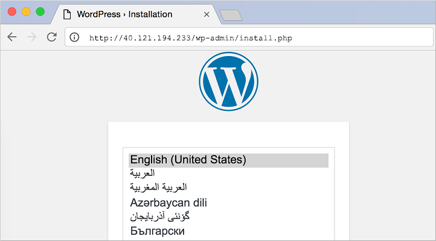

# Get started with Docker and Compose to define and run a multi-container application in Azure
With [Compose](https://github.com/docker/compose), you use a simple text file to define an application consisting of multiple Docker containers. You then spin up your application in a single command that does everything to deploy your defined environment. As an example, this article shows you how to quickly set up a WordPress blog with a backend MariaDB SQL database on an Ubuntu VM. You can also use Compose to set up more complex applications.

This article was last tested on 2/14/2019 using the [Azure Cloud Shell](https://shell.azure.com/bash) and the [Azure CLI](https://docs.microsoft.com/cli/azure/install-azure-cli) version 2.0.58.

## Create Docker host with Azure CLI
Install the latest [Azure CLI](/cli/azure/install-az-cli2) and log in to an Azure account using [az login](/cli/azure/reference-index).

First, create a resource group for your Docker environment with [az group create](/cli/azure/group). The following example creates a resource group named *myResourceGroup* in the *eastus* location:

```azurecli-interactive
az group create --name myDockerGroup --location eastus
```

Create a file named *cloud-init.txt* and paste the following configuration. Enter `sensible-editor cloud-init.txt` to create the file and see a list of available editors. 

```yaml
#include https://get.docker.com
```

Now create a VM with [az vm create](/cli/azure/vm#az-vm-create). Use the `--custom-data` parameter to pass in your cloud-init config file. Provide the full path to the *cloud-init.txt* config if you saved the file outside of your present working directory. The following example creates a VM named *myDockerVM* and opens port 80 to web traffic.

```azurecli-interactive
az vm create \
    --resource-group myDockerGroup \
    --name myDockerVM \
    --image UbuntuLTS \
    --admin-username azureuser \
    --generate-ssh-keys \
    --custom-data cloud-init.txt
az vm open-port --port 80 \
    --resource-group myDockerGroup \
	--name myDockerVM
```

It takes a few minutes for the VM to be created, the packages to install, and the app to start. There are background tasks that continue to run after the Azure CLI returns you to the prompt. When the VM has been created, take note of the `publicIpAddress` displayed by the Azure CLI. 

                 

## Install Compose


SSH to your new Docker host VM. Provide your own IP address.

```bash
ssh azureuser@10.10.111.11
```

Install Compose on the VM.

```bash
sudo apt install docker-compose
```


## Create a docker-compose.yml configuration file
Create a `docker-compose.yml` configuration file to define the Docker containers to run on the VM. The file specifies the image to run on each container, necessary environment variables and dependencies, ports, and the links between containers. For details on yml file syntax, see [Compose file reference](https://docs.docker.com/compose/compose-file/).

Create a *docker-compose.yml* file. Use your favorite text editor to add some data to the file. The following example creates the file with a prompt for `sensible-editor` to pick an editor that you wish to use.

```bash
sensible-editor docker-compose.yml
```

Paste the following example into your Docker Compose file. This configuration uses images from the [DockerHub Registry](https://registry.hub.docker.com/_/wordpress/) to install WordPress (the open source blogging and content management system) and a linked backend MariaDB SQL database. Enter your own *MYSQL_ROOT_PASSWORD*.

```yml
wordpress:
  image: wordpress
  links:
    - db:mysql
  ports:
    - 80:80

db:
  image: mariadb
  environment:
    MYSQL_ROOT_PASSWORD: <your password>
```

## Start the containers with Compose
In the same directory as your *docker-compose.yml* file, run the following command (depending on your environment, you might need to run `docker-compose` using `sudo`):

```bash
sudo docker-compose up -d
```

This command starts the Docker containers specified in *docker-compose.yml*. It takes a minute or two for this step to complete. You'll see output similar to the following:

```
Creating wordpress_db_1...
Creating wordpress_wordpress_1...
...
```


To verify that the containers are up, type `sudo docker-compose ps`. You should see something like:

```
        Name                       Command               State         Ports
-----------------------------------------------------------------------------------
azureuser_db_1          docker-entrypoint.sh mysqld      Up      3306/tcp
azureuser_wordpress_1   docker-entrypoint.sh apach ...   Up      0.0.0.0:80->80/tcp
```

You can now connect to WordPress directly on the VM on port 80. Open a web browser and enter the IP address name of your VM. You should now see the WordPress start screen, where you can complete the installation and get started with the application.



## Next steps
* Check out the [Compose command-line reference](https://docs.docker.com/compose/reference/) and [user guide](https://docs.docker.com/compose/) for more examples of building and deploying multi-container apps.
* Use an Azure Resource Manager template, either your own or one contributed from the [community](https://azure.microsoft.com/documentation/templates/), to deploy an Azure VM with Docker and an application set up with Compose. For example, the [Deploy a WordPress blog with Docker](https://github.com/Azure/azure-quickstart-templates/tree/master/docker-wordpress-mysql) template uses Docker and Compose to quickly deploy WordPress with a MySQL backend on an Ubuntu VM.
* Try integrating Docker Compose with a Docker Swarm cluster. See
  [Using Compose with Swarm](https://docs.docker.com/compose/swarm/) for scenarios.

