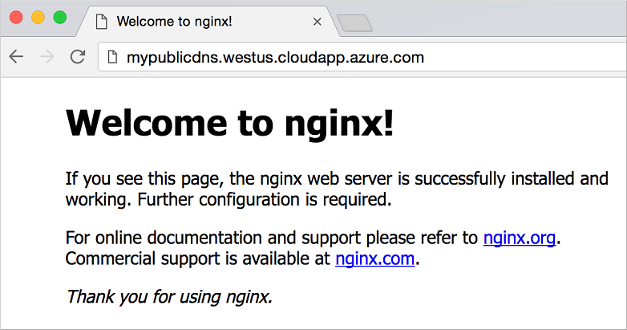

# Create a Docker environment in Azure using the Docker VM extension

Docker is a popular container management and imaging platform that allows you to quickly work with containers on Linux. In Azure, there are various ways you can deploy Docker according to your needs. This article focuses on using the Docker VM extension and Azure Resource Manager templates with the Azure CLI. 

> [!WARNING]
> The Azure Docker VM extension for Linux is deprecated and will be retired November 2018.
> The extension merely installs Docker, so alternatives such as cloud-init or the Custom Script Extension are a better way to install the Docker version of choice. For more information on how to use cloud-init, see [Customize a Linux VM with cloud-init](tutorial-automate-vm-deployment.md).

## Azure Docker VM extension overview
The Azure Docker VM extension installs and configures the Docker daemon, Docker client, and Docker Compose in your Linux virtual machine (VM). By using the Azure Docker VM extension, you have more control and features than simply using Docker Machine or creating the Docker host yourself. These additional features, such as [Docker Compose](https://docs.docker.com/compose/overview/), make the Azure Docker VM extension suited for more robust developer or production environments.

For more information about the different deployment methods, including using Docker Machine and Azure Container Services, see the following articles:

* To quickly prototype an app, you can create a single Docker host using [Docker Machine](docker-machine.md).
* To build production-ready, scalable environments that provide additional scheduling and management tools, you can deploy a [Kubernetes](../../container-service/kubernetes/index.yml) or [Docker Swarm](../../container-service/dcos-swarm/index.yml) cluster on Azure Container Services.


## Deploy a template with the Azure Docker VM extension
Let's use an existing quickstart template to create an Ubuntu VM that uses the Azure Docker VM extension to install and configure the Docker host. You can view the template here: [Simple deployment of an Ubuntu VM with Docker](https://github.com/Azure/azure-quickstart-templates/tree/master/docker-simple-on-ubuntu). You need the latest [Azure CLI](/cli/azure/install-az-cli2) installed and logged in to an Azure account using [az login](/cli/azure/reference-index#az_login).

First, create a resource group with [az group create](/cli/azure/group#az_group_create). The following example creates a resource group named *myResourceGroup* in the *eastus* location:

```azurecli
az group create --name myResourceGroup --location eastus
```

Next, deploy a VM with [az group deployment create](/cli/azure/group/deployment#az_group_deployment_create) that includes the Azure Docker VM extension from [this Azure Resource Manager template on GitHub](https://github.com/Azure/azure-quickstart-templates/tree/master/docker-simple-on-ubuntu). When prompted, provide your own unique values for *newStorageAccountName*, *adminUsername*, *adminPassword*, and *dnsNameForPublicIP*:

```azurecli
az group deployment create --resource-group myResourceGroup \
    --template-uri https://raw.githubusercontent.com/Azure/azure-quickstart-templates/master/docker-simple-on-ubuntu/azuredeploy.json
```

It takes a few minutes for the deployment to finish.


## Deploy your first NGINX container
To view details of your VM, including the DNS name, use [az vm show](/cli/azure/vm#az_vm_show):

```azurecli
az vm show \
    --resource-group myResourceGroup \
    --name myDockerVM \
    --show-details \
    --query [fqdns] \
    --output tsv
```

SSH to your new Docker host. Provide your own username and DNS name from the preceding steps:

```bash
ssh azureuser@mypublicdns.eastus.cloudapp.azure.com
```

Once logged in to the Docker host, let's run an NGINX container:

```bash
sudo docker run -d -p 80:80 nginx
```

The output is similar to the following example as the NGINX image is downloaded and a container started:

```bash
Unable to find image 'nginx:latest' locally
latest: Pulling from library/nginx
efd26ecc9548: Pull complete
a3ed95caeb02: Pull complete
a48df1751a97: Pull complete
8ddc2d7beb91: Pull complete
Digest: sha256:2ca2638e55319b7bc0c7d028209ea69b1368e95b01383e66dfe7e4f43780926d
Status: Downloaded newer image for nginx:latest
b6ed109fb743a762ff21a4606dd38d3e5d35aff43fa7f12e8d4ed1d920b0cd74
```

Check the status of the containers running on your Docker host as follows:

```bash
sudo docker ps
```

The output is similar to the following example, showing that the NGINX container is running and TCP ports 80 and 443 and being forwarded:

```bash
CONTAINER ID        IMAGE               COMMAND                  CREATED              STATUS              PORTS                         NAMES
b6ed109fb743        nginx               "nginx -g 'daemon off"   About a minute ago   Up About a minute   0.0.0.0:80->80/tcp, 443/tcp   adoring_payne
```

To see your container in action, open up a web browser and enter the DNS name of your Docker host:



## Azure Docker VM extension template reference
The previous example uses an existing quickstart template. You can also deploy the Azure Docker VM extension with your own Resource Manager templates. To do so, add the following to your Resource Manager templates, defining the `vmName` of your VM appropriately:

```json
{
  "type": "Microsoft.Compute/virtualMachines/extensions",
  "name": "[concat(variables('vmName'), '/DockerExtension'))]",
  "apiVersion": "2015-05-01-preview",
  "location": "[parameters('location')]",
  "dependsOn": [
    "[concat('Microsoft.Compute/virtualMachines/', variables('vmName'))]"
  ],
  "properties": {
    "publisher": "Microsoft.Azure.Extensions",
    "type": "DockerExtension",
    "typeHandlerVersion": "1.*",
    "autoUpgradeMinorVersion": true,
    "settings": {},
    "protectedSettings": {}
  }
}
```

You can find more detailed walkthrough on using Resource Manager templates by reading [Azure Resource Manager overview](../../azure-resource-manager/resource-group-overview.md).

## Next steps
You may wish to [configure the Docker daemon TCP port](https://docs.docker.com/engine/reference/commandline/dockerd/#/bind-docker-to-another-hostport-or-a-unix-socket), understand [Docker security](https://docs.docker.com/engine/security/security/), or deploy containers using [Docker Compose](https://docs.docker.com/compose/overview/). For more information on the Azure Docker VM Extension itself, see the [GitHub project](https://github.com/Azure/azure-docker-extension/).

Read more information about the additional Docker deployment options in Azure:

* [Use Docker Machine with the Azure driver](docker-machine.md)  
* [Get Started with Docker and Compose to define and run a multi-container application on an Azure virtual machine](docker-compose-quickstart.md).
* [Deploy an Azure Container Service cluster](../../container-service/dcos-swarm/container-service-deployment.md)

