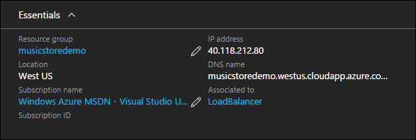
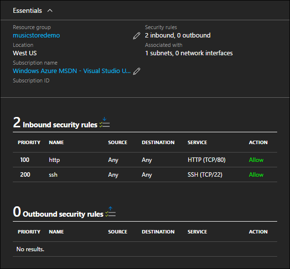

# Access and security in Azure Resource Manager templates for Linux VMs

Applications hosted in Azure likely need to be access over the internet or a VPN / Express Route connection with Azure. With the Music Store application sample, the web site is made available on the internet with a public IP address. With access established, connections to the application and access to the virtual machine resources themselves should be secured. This access security is provided with a Network Security Group. 

This document details how the Music Store application is secured in the sample Azure Resource Manager template. All dependencies and unique configurations are highlighted. For the best experience, pre-deploy an instance of the solution to your Azure subscription and work along with the Azure Resource Manager template. The complete template can be found here – [Music Store Deployment on Ubuntu](https://github.com/Microsoft/dotnet-core-sample-templates/tree/master/dotnet-core-music-linux). 

## Public IP Address
To provide public access to an Azure resource, a public IP address resource can be used. Public IP address can be configured with a static or dynamic IP address. If a dynamic address is used, and the virtual machine is stopped and deallocated, the addresses is removed. When the machine is started again, it may be assigned a different public IP address. To prevent an IP address from changing, a reserved IP address can be used. 

A Public IP Address can be added to an Azure Resource Manager template using the Visual Studio Add New Resource Wizard, or by inserting valid JSON into a template. 

Follow this link to see the JSON sample within the Resource Manager template – [Public IP Address](https://github.com/Microsoft/dotnet-core-sample-templates/blob/master/dotnet-core-music-linux/azuredeploy.json#L121).

```json
{
  "apiVersion": "2015-06-15",
  "type": "Microsoft.Network/publicIPAddresses",
  "name": "[variables('publicipaddressName')]",
  "location": "[resourceGroup().location]",
  "tags": {
    "displayName": "public-ip-front"
  },
  "properties": {
    "publicIPAllocationMethod": "Dynamic",
    "dnsSettings": {
      "domainNameLabel": "[parameters('publicipaddressDnsName')]"
    }
  }
}
```

A Public IP Address can be associated with a Virtual Network Adapter, or a Load Balancer. In this example, because the Music Store website is load balanced across several virtual machines, the Public IP Address is attached to the Load Balancer.

Follow this link to see the JSON sample within the Resource Manager template – [Public IP Address association with Load Balancer](https://github.com/Microsoft/dotnet-core-sample-templates/blob/master/dotnet-core-music-linux/azuredeploy.json#L208).

```json
"frontendIPConfigurations": [
  {
    "properties": {
      "publicIPAddress": {
        "id": "[resourceId('Microsoft.Network/publicIPAddresses', variables('publicipaddressName'))]"
      }
    },
    "name": "LoadBalancerFrontend"
  }
]
```

The public IP Address as seen from the Azure portal. Notice that the public IP address is associated to a load balancer and not a virtual machine. Network load balancers are detailed in the next document of this series.



For more information on Azure Public IP Addresses, see [IP addresses in Azure](../../virtual-network/virtual-network-ip-addresses-overview-arm.md).

## Network Security Group
Once access has been established to Azure resources, this access should be limited. For Azure virtual machines, secure access is accomplished using a network security group. With the Music Store application sample, all access to the virtual machine is restricted except for over port 80 for http access, and port 22 for SSH access. A Network Security Group can be added to an Azure Resource Manager template using the Visual Studio Add New Resource Wizard, or by inserting valid JSON into a template.

Follow this link to see the JSON sample within the Resource Manager template – [Network Security Group](https://github.com/Microsoft/dotnet-core-sample-templates/blob/master/dotnet-core-music-linux/azuredeploy.json#L68).

```json
{
  "apiVersion": "2015-05-01-preview",
  "type": "Microsoft.Network/networkSecurityGroups",
  "name": "[variables('nsgfront')]",
  "location": "[resourceGroup().location]",
  "tags": {
    "displayName": "nsg-front"
  },
  "properties": {
    "securityRules": [
      {
        "name": "http",
        "properties": {
          "description": "http endpoint",
          "protocol": "Tcp",
          "sourcePortRange": "*",
          "destinationPortRange": "80",
          "sourceAddressPrefix": "*",
          "destinationAddressPrefix": "*",
          "access": "Allow",
          "priority": 100,
          "direction": "Inbound"
        }
      },
      ........<truncated> 
    ]
  }
}
```

In this example, the network security group is associate with the subnet object declared in the Virtual Network resource. 

Follow this link to see the JSON sample within the Resource Manager template – [Network Security Group association with Virtual Network](https://github.com/Microsoft/dotnet-core-sample-templates/blob/master/dotnet-core-music-linux/azuredeploy.json#L158).

```json
"subnets": [
  {
    "name": "[variables('subnetName')]",
    "properties": {
      "addressPrefix": "10.0.0.0/24",
      "networkSecurityGroup": {
        "id": "[resourceId('Microsoft.Network/networkSecurityGroups', variables('networkSecurityGroup'))]"
      }
    }
  }
```

Here is what the network security group looks like from the Azure portal. Notice that an NSG can be associate with a subnet and / or network interface. In this case, the NSG is associated to a subnet. In this configuration, the inbound rules apply to all virtual machines connected to the subnet.



For in-depth information on Network Security Groups, see [What is a Network Security Group](https://azure.microsoft.com/documentation/articles/virtual-networks-nsg/).

## Next step
<hr>

[Step 3 - Availability and Scale in Azure Resource Manager Templates](dotnet-core-4-availability-scale.md?toc=%2fazure%2fvirtual-machines%2flinux%2ftoc.json)

