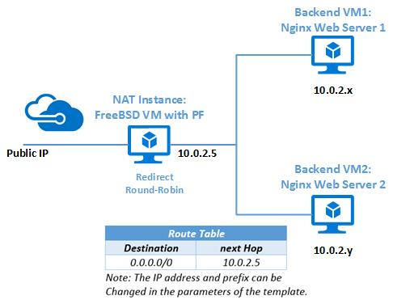

# How to use FreeBSD's Packet Filter to create a secure firewall in Azure
This article introduces how to deploy a NAT firewall using FreeBSD’s Packer Filter through Azure Resource Manager template for common web server scenario.

## What is PF?
PF (Packet Filter, also written pf) is a BSD licensed stateful packet filter, a central piece of software for firewalling. PF has since evolved quickly and now has several advantages over other available firewalls. Network Address Translation (NAT) is in PF since day one, then packet scheduler and active queue management have been integrated into PF, by integrating the ALTQ and making it configurable through PF's configuration. Features such as pfsync and CARP for failover and redundancy, authpf for session authentication, and ftp-proxy to ease firewalling the difficult FTP protocol, have also extended PF. In short, PF is a powerful and feature-rich firewall. 

## Get started
If you are interested in setting up a secure firewall in the cloud for your web servers, then let’s get started. You can also apply the scripts used in this Azure Resource Manager template to set up your networking topology.
The Azure Resource Manager template set up a FreeBSD virtual machine that performs NAT /redirection using PF and two FreeBSD virtual machines with the Nginx web server installed and configured. In addition to performing NAT for the two web servers egress traffic, the NAT/redirection virtual machine intercepts HTTP requests and redirect them to the two web servers in round-robin fashion. The VNet uses the private non-routable IP address space 10.0.0.2/24 and you can modify the parameters of the template. The Azure Resource Manager template also defines a route table for the whole VNet, which is a collection of individual routes used to override Azure default routes based on the destination IP address. 


    
### Deploy through Azure CLI
You need the latest [Azure CLI](/cli/azure/install-az-cli2) installed and logged in to an Azure account using [az login](/cli/azure/reference-index). Create a resource group with [az group create](/cli/azure/group). The following example creates a resource group name `myResourceGroup` in the `West US` location.

```azurecli
az group create --name myResourceGroup --location westus
```

Next, deploy the template pf-freebsd-setup with [az group deployment create](/cli/azure/group/deployment). Download azuredeploy.parameters.json under the same path and define your own resource values, such as `adminPassword`, `networkPrefix`, and `domainNamePrefix`. 

```azurecli
az group deployment create --resource-group myResourceGroup --name myDeploymentName \
    --template-uri https://raw.githubusercontent.com/Azure/azure-quickstart-templates/master/pf-freebsd-setup/azuredeploy.json \
    --parameters '@azuredeploy.parameters.json' --verbose
```

After about five minutes, you will get the information of `"provisioningState": "Succeeded"`. Then you can ssh to the frontend VM (NAT) or access Nginx web server in a browser using the public IP address or FQDN of the frontend VM (NAT). The following example lists FQDN and public IP address that assigned to the frontend VM (NAT) in the `myResourceGroup` resource group. 

```azurecli
az network public-ip list --resource-group myResourceGroup
```
    
## Next steps
Do you want to set up your own NAT in Azure? Open Source, free but powerful? Then PF is a good choice. By using the template pf-freebsd-setup, you only need five minutes to set up a NAT firewall with round-robin load balancing using FreeBSD's PF in Azure for common web server scenario. 

If you want to learn the offering of FreeBSD in Azure, refer to [introduction to FreeBSD on Azure](freebsd-intro-on-azure.md).

If you want to know more about PF, refer to [FreeBSD handbook](https://www.freebsd.org/doc/handbook/firewalls-pf.html) or [PF-User's Guide](https://www.freebsd.org/doc/handbook/firewalls-pf.html).
