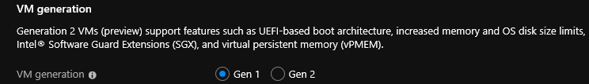

# Support for generation 2 VMs on Azure

Support for generation 2 virtual machines (VMs) is now available on Azure. You can't change a virtual machine's generation after you've created it, so review the considerations on this page before you choose a generation.

Generation 2 VMs support key features that aren't supported in generation 1 VMs. These features include increased memory, Intel Software Guard Extensions (Intel SGX), and virtualized persistent memory (vPMEM). Generation 2 VMs running on-premises, have some features that aren't supported in Azure yet. For more information, see the [Features and capabilities](#features-and-capabilities) section.

Generation 2 VMs use the new UEFI-based boot architecture rather than the BIOS-based architecture used by generation 1 VMs. Compared to generation 1 VMs, generation 2 VMs might have improved boot and installation times. For an overview of generation 2 VMs and some of the differences between generation 1 and generation 2, see [Should I create a generation 1 or 2 virtual machine in Hyper-V?](https://docs.microsoft.com/windows-server/virtualization/hyper-v/plan/should-i-create-a-generation-1-or-2-virtual-machine-in-hyper-v).

## Generation 2 VM sizes

Generation 1 VMs are supported by all VM sizes in Azure (except for Mv2-series VMs). Azure now offers generation 2 support for the following selected VM series:

* [B-series](https://docs.microsoft.com/azure/virtual-machines/linux/b-series-burstable)
* [DCsv2-series](../dcv2-series.md)
* [DSv2-series](../dv2-dsv2-series.md) and [Dsv3-series](../dv3-dsv3-series.md)
* [Esv3-series](../ev3-esv3-series.md)
* [Fsv2-series](../fsv2-series.md)
* [GS-series](https://docs.microsoft.com/azure/virtual-machines/linux/sizes-previous-gen#gs-series)
* [HB-series](../hb-series.md)
* [HC-series](../hc-series.md)
* [Ls-series](https://docs.microsoft.com/azure/virtual-machines/linux/sizes-previous-gen#ls-series) and [Lsv2-series](../lsv2-series.md)
* [M-series](../m-series.md)
* [Mv2-series](../mv2-series.md)<sup>1</sup>
* [NCv2-series](../ncv2-series.md) and [NCv3-series](../ncv3-series.md)
* [ND-series](../nd-series.md)
* [NVv3-series](../nvv3-series.md)

<sup>1</sup> Mv2-series does not support Generation 1 VM images and only support a subset of Generation 2 images. Please see [Mv2-series documentation](https://docs.microsoft.com/azure/virtual-machines/mv2-series) for details.

## Generation 2 VM images in Azure Marketplace

Generation 2 VMs support the following Marketplace images:

* Windows Server 2019, 2016, 2012 R2, 2012
* Windows 10
* SUSE Linux Enterprise Server 15 SP1
* SUSE Linux Enterprise Server 12 SP4
* Ubuntu Server 16.04, 18.04, 19.04, 19.10 
* RHEL 8.1, 8.0, 7.7, 7.6, 7.5, 7.4, 7.0
* Cent OS 8.1, 8.0, 7.7, 7.6, 7.5, 7.4
* Oracle Linux 7.7, 7.7-CI

## On-premises vs. Azure generation 2 VMs

Azure doesn't currently support some of the features that on-premises Hyper-V supports for generation 2 VMs.

| Generation 2 feature                | On-premises Hyper-V | Azure |
|-------------------------------------|---------------------|-------|
| Secure boot                         | :heavy_check_mark:  | :x:   |
| Shielded VM                         | :heavy_check_mark:  | :x:   |
| vTPM                                | :heavy_check_mark:  | :x:   |
| Virtualization-based security (VBS) | :heavy_check_mark:  | :x:   |
| VHDX format                         | :heavy_check_mark:  | :x:   |

## Features and capabilities

### Generation 1 vs. generation 2 features

| Feature | Generation 1 | Generation 2 |
|---------|--------------|--------------|
| Boot             | PCAT         | UEFI |
| Disk controllers | IDE          | SCSI |
| VM sizes         | All VM sizes | Only VMs that support premium storage |

### Generation 1 vs. generation 2 capabilities

| Capability | Generation 1 | Generation 2 |
|------------|--------------|--------------|
| OS disk > 2 TB                    | :x:                | :heavy_check_mark: |
| Custom disk/image/swap OS         | :heavy_check_mark: | :heavy_check_mark: |
| Virtual machine scale set support | :heavy_check_mark: | :heavy_check_mark: |
| Azure Site Recovery               | :heavy_check_mark: | :heavy_check_mark: |
| Backup/restore                    | :heavy_check_mark: | :heavy_check_mark: |
| Shared image gallery              | :heavy_check_mark: | :heavy_check_mark: |
| Azure disk encryption             | :heavy_check_mark: | :x:                |

## Creating a generation 2 VM

### Marketplace image

In the Azure portal or Azure CLI, you can create generation 2 VMs from a Marketplace image that supports UEFI boot.

#### Azure portal

Below are the steps to create a generation 2 (Gen2) VM in Azure portal.

1. Sign in to the Azure portal at https://portal.azure.com.
1. Select **Create a resource**.
1. Click **See all** from the Azure Marketplace on the left.
1. Select an image which supports Gen2.
1. Click **Create**.
1. In the **Advanced** tab, under the **VM generation** section, select the **Gen 2** option.
1. In the **Basics** tab, Under **Instance details**, go to **Size** and open the **Select a VM size** blade.
1. Select a [supported generation 2 VM](#generation-2-vm-sizes).
1. Go through the [Azure portal creation flow](quick-create-portal.md) to finish creating the VM.



#### PowerShell

You can also use PowerShell to create a VM by directly referencing the generation 1 or generation 2 SKU.

For example, use the following PowerShell cmdlet to get a list of the SKUs in the `WindowsServer` offer.

```powershell
Get-AzVMImageSku -Location westus2 -PublisherName MicrosoftWindowsServer -Offer WindowsServer
```

If you're creating a VM with Windows Server 2012 as the OS, then you will select either the generation 1 (BIOS) or generation 2 (UEFI) VM SKU, which look like this:

```powershell
2012-Datacenter
2012-datacenter-gensecond
```

See the [Features and capabilities](#features-and-capabilities) section for a current list of supported Marketplace images.

#### Azure CLI

Alternatively, you can use the Azure CLI to see any available generation 2 images, listed by **Publisher**.

```azurecli
az vm image list --publisher Canonical --sku gen2 --output table --all
```

### Managed image or managed disk

You can create a generation 2 VM from a managed image or managed disk in the same way you would create a generation 1 VM.

### Virtual machine scale sets

You can also create generation 2 VMs by using virtual machine scale sets. In the Azure CLI, use Azure scale sets to create generation 2 VMs.

## Frequently asked questions

* **Are generation 2 VMs available in all Azure regions?**  
    Yes. But not all [generation 2 VM sizes](#generation-2-vm-sizes) are available in every region. The availability of the generation 2 VM depends on the availability of the VM size.

* **Is there a price difference between generation 1 and generation 2 VMs?**  
    No.

* **I have a .vhd file from my on-premises generation 2 VM. Can I use that .vhd file to create a generation 2 VM in Azure?**
  Yes, you can bring your generation 2 .vhd file to Azure and use that to create a generation 2 VM. Use the following steps to do so:
    1. Upload the .vhd to a storage account in the same region where you'd like to create your VM.
    1. Create a managed disk from the .vhd file. Set the Hyper-V Generation property to V2. The following PowerShell commands set Hyper-V Generation property when creating managed disk.

        ```powershell
        $sourceUri = 'https://xyzstorage.blob.core.windows.net/vhd/abcd.vhd'. #<Provide location to your uploaded .vhd file>
        $osDiskName = 'gen2Diskfrmgenvhd'  #<Provide a name for your disk>
        $diskconfig = New-AzDiskConfig -Location '<location>' -DiskSizeGB 127 -AccountType Standard_LRS -OsType Windows -HyperVGeneration "V2" -SourceUri $sourceUri -CreateOption 'Import'
        New-AzDisk -DiskName $osDiskName -ResourceGroupName '<Your Resource Group>' -Disk $diskconfig
        ```

    1. Once the disk is available, create a VM by attaching this disk. The VM created will be a generation 2 VM.
    When the generation 2 VM is created, you can optionally generalize the image of this VM. By generalizing the image you can use it to create multiple VMs.

* **How do I increase the OS disk size?**  
  OS disks larger than 2 TB are new to generation 2 VMs. By default, OS disks are smaller than 2 TB for generation 2 VMs. You can increase the disk size up to a recommended maximum of 4 TB. Use the Azure CLI or the Azure portal to increase the OS disk size. For information about how to expand disks programmatically, see [Resize a disk](expand-disks.md).

  To increase the OS disk size from the Azure portal:

  1. In the Azure portal, go to the VM properties page.
  1. To shut down and deallocate the VM, select the **Stop** button.
  1. In the **Disks** section, select the OS disk you want to increase.
  1. In the **Disks** section, select **Configuration**, and update the **Size** to the value you want.
  1. Go back to the VM properties page and **Start** the VM.

  You might see a warning for OS disks larger than 2 TB. The warning doesn't apply to generation 2 VMs. However, OS disk sizes larger than 4 TB are *not recommended.*

* **Do generation 2 VMs support accelerated networking?**  
    Yes. For more information, see [Create a VM with accelerated networking](../../virtual-network/create-vm-accelerated-networking-cli.md).

* **Is VHDX supported on generation 2?**  
    No, generation 2 VMs support only VHD.

* **Do generation 2 VMs support Azure Ultra Disk Storage?**  
    Yes.

* **Can I migrate a VM from generation 1 to generation 2?**  
    No, you can't change the generation of a VM after you create it. If you need to switch between VM generations, create a new VM of a different generation.

* **Why is my VM size not enabled in the size selector when I try to create a Gen2 VM?**

    This may be solved by doing the following:

    1. Verify that the **VM generation** property is set to **Gen 2** in the **Advanced** tab.
    1. Verify you are searching for a [VM size which supports Gen2 VMs](#generation-2-vm-sizes).

## Next steps

* Learn about [generation 2 virtual machines in Hyper-V](https://docs.microsoft.com/windows-server/virtualization/hyper-v/plan/should-i-create-a-generation-1-or-2-virtual-machine-in-hyper-v).
