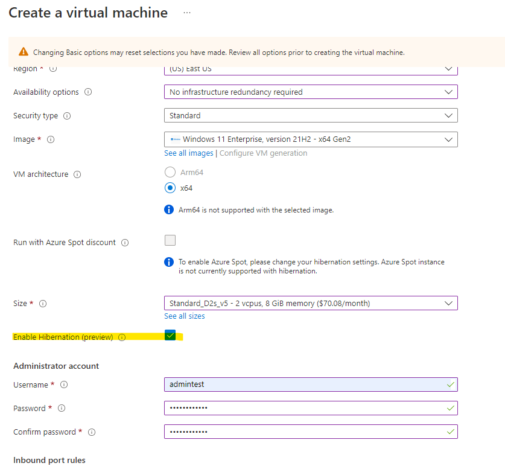

# Hibernating Linux virtual machines

**Applies to:** :heavy_check_mark: Linux VMs

[!INCLUDE [hibernate-resume-intro](../includes/hibernate-resume-intro.md)]

## How hibernation works
To learn how hibernation works, check out the [hibernation overview](../hibernate-resume.md).

## Supported configurations
Hibernation support is limited to certain VM sizes and OS versions. Make sure you have a supported configuration before using hibernation.

### Supported Linux distros
The following Linux operating systems support hibernation:

- Ubuntu 22.04 LTS
- Ubuntu 20.04 LTS
- Ubuntu 18.04 LTS
- Debian 11
- Debian 10 (with backports kernel)

### Prerequisites and configuration limitations
-	Hibernation isn't supported with Trusted Launch for Linux VMs  

For general limitations, Azure feature limitations supported VM sizes, and feature prerequisites check out the ["Supported configurations" section in the hibernation overview](../hibernate-resume.md#supported-configurations).

## Creating a Linux VM with hibernation enabled

To hibernate a VM, you must first enable the feature while creating the VM. You can only enable hibernation for a VM on initial creation. You can't enable this feature after the VM is created.

To enable hibernation during VM creation, you can use the Azure portal, CLI, PowerShell, ARM templates and API. 

### [Portal](#tab/enableWithPortal)

To enable hibernation in the Azure portal, check the 'Enable hibernation' box during VM creation.




### [CLI](#tab/enableWithCLI)

To enable hibernation in the Azure CLI, create a VM by running the following [az vm create]() command with ` --enable-hibernation` set to `true`.

```azurecli
 az vm create --resource-group myRG \
   --name myVM \
   --image Win2019Datacenter \
   --public-ip-sku Standard \
   --size Standard_D2s_v5 \
   --enable-hibernation true 
```

### [PowerShell](#tab/enableWithPS)

To enable hibernation when creating a VM with PowerShell, run the following command:

```powershell
New-AzVm ` 
 -ResourceGroupName 'myRG' ` 
 -Name 'myVM' ` 
 -Location 'East US' ` 
 -VirtualNetworkName 'myVnet' ` 
 -SubnetName 'mySubnet' ` 
 -SecurityGroupName 'myNetworkSecurityGroup' ` 
 -PublicIpAddressName 'myPublicIpAddress' ` 
 -Size Standard_D2s_v5 ` 
 -Image Win2019Datacenter ` 
 -HibernationEnabled ` 
 -OpenPorts 80,3389 
```

### [REST](#tab/enableWithREST)

First, [create a VM with hibernation enabled](/rest/api/compute/virtual-machines/create-or-update#create-a-vm-with-hibernationenabled)

```json
PUT https://management.azure.com/subscriptions/{subscription-id}/resourceGroups/myResourceGroup/providers/Microsoft.Compute/virtualMachines/{vm-name}?api-version=2021-11-01
```
Your output should look something like this:

```
{
  "location": "eastus",
  "properties": {
    "hardwareProfile": {
      "vmSize": "Standard_D2s_v5"
    },
    "additionalCapabilities": {
      "hibernationEnabled": true
    },
    "storageProfile": {
      "imageReference": {
        "publisher": "MicrosoftWindowsServer",
        "offer": "WindowsServer",
        "sku": "2019-Datacenter",
        "version": "latest"
      },
      "osDisk": {
        "caching": "ReadWrite",
        "managedDisk": {
          "storageAccountType": "Standard_LRS"
        },
        "name": "vmOSdisk",
        "createOption": "FromImage"
      }
    },
    "networkProfile": {
      "networkInterfaces": [
        {
          "id": "/subscriptions/{subscription-id}/resourceGroups/myResourceGroup/providers/Microsoft.Network/networkInterfaces/{existing-nic-name}",
          "properties": {
            "primary": true
          }
        }
      ]
    },
    "osProfile": {
      "adminUsername": "{your-username}",
      "computerName": "{vm-name}",
      "adminPassword": "{your-password}"
    },
    "diagnosticsProfile": {
      "bootDiagnostics": {
        "storageUri": "http://{existing-storage-account-name}.blob.core.windows.net",
        "enabled": true
      }
    }
  }
}

```
To learn more about REST, check out an [API example](/rest/api/compute/virtual-machines/create-or-update#create-a-vm-with-hibernationenabled)

---

Once you've created a VM with hibernation enabled, you need to configure the guest OS to successfully hibernate your VM. 

## Configuring hibernation in the guest OS

After ensuring that your VM configuration is supported, you can enable hibernation on your Linux VM using one of two options: 

**Option 1**: LinuxHibernateExtension 

**Option 2**: hibernation-setup-tool

### LinuxHibernateExtension

> [!NOTE]
> If you've already installed the hibernation-setup-tool you do not need to install the LinuxHibernateExtension. These are redundant methods to enable hibernation on a Linux VM.

When you create a Hibernation-enabled VM via the Azure portal, the LinuxHibernationExtension is automatically installed on the VM. 

If the extension is missing, you can [manually install the LinuxHibernateExtension](/cli/azure/azure-cli-extensions-overview) on your Linux VM to configure the guest OS for hibernation. 

>[!NOTE]
> Azure extensions are currently disabled by default for Debian images. To re-enable extensions, [check the Linux hibernation troubleshooting guide](../linux/hibernate-resume-troubleshooting-linux.md#azure-extensions-disabled-on-debian-images).

#### [CLI](#tab/cliLHE)
    
To install LinuxHibernateExtension with the Azure CLI, run the following command:

```azurecli
az vm extension set -n LinuxHibernateExtension --publisher Microsoft.CPlat.Core --version 1.0 \    --vm-name MyVm --resource-group MyResourceGroup --enable-auto-upgrade true
```

#### [PowerShell](#tab/powershellLHE)

To install LinuxHibernateExtension with PowerShell, run the following command:

```powershell
Set-AzVMExtension -Publisher Microsoft.CPlat.Core -ExtensionType LinuxHibernateExtension -VMName <VMName> -ResourceGroupName <RGNAME> -Name "LinuxHibernateExtension" -Location <Location> -TypeHandlerVersion 1.0
```  
---

### Hibernation-setup-tool 

> [!NOTE]
> If you've already installed the LinuxHibernateExtension you do not need to install the ibernation-setup-tool. These are redundant methods to enable hibernation on a Linux VM.

You can install the hibernation-setup-tool package on your Linux VM from Microsoft’s Linux software repository at [packages.microsoft.com](https://packages.microsoft.com).

To use the Linux software repository, follow the instructions at [Linux package repository for Microsoft software](/windows-server/administration/Linux-Package-Repository-for-Microsoft-Software#ubuntu).

#### [Ubuntu 18.04 (Bionic)](#tab/Ubuntu18HST) 

To use the repository in Ubuntu 18.04, open git bash and run this command:

```bash
curl -sSL https://packages.microsoft.com/keys/microsoft.asc | sudo apt-key add -

sudo apt-add-repository https://packages.microsoft.com/ubuntu/18.04/prod

sudo apt-get update
```

#### [Ubuntu 20.04 (Focal)](#tab/Ubuntu20HST) 

To use the repository in Ubuntu 20.04, open git bash and run this command:

```bash
curl -sSL https://packages.microsoft.com/keys/microsoft.asc | sudo tee etc/apt/trusted.gpg.d/microsoft.asc

sudo apt-add-repository https://packages.microsoft.com/ubuntu/20.04/prod

sudo apt-get update
```
---


To install the package, run this command in git bash:
```bash
sudo apt-get install hibernation-setup-tool
```

Once the package installs successfully, your Linux guest OS is configured for hibernation. You can also create a new Azure Compute Gallery Image from this VM and use the image to create VMs. VMs created with this image have the hibernation package preinstalled, simplifying your VM creation experience. 


[!INCLUDE [hibernate-resume-platform-instructions](../includes/hibernate-resume-platform-instructions.md)]

## Troubleshooting
Refer to the [Hibernate troubleshooting guide](../hibernate-resume-troubleshooting.md) and the [Linux VM hibernation troubleshooting guide](./hibernate-resume-troubleshooting-linux.md) for more information.

## FAQs
Refer to the [Hibernate FAQs](../hibernate-resume.md#faqs) for more information.

## Next Steps:
- [Learn more about Azure billing](/azure/cost-management-billing/)
- [Look into Azure VM Sizes](../sizes.md)
