# Configure LVM and RAID on encrypted devices

This article is a step-by-step process for how to perform Logical Volume Management (LVM) and RAID on encrypted devices. The process applies to the following environments:

- Linux distributions
    - RHEL 7.6+
    - Ubuntu 18.04+
    - SUSE 12+
- Azure Disk Encryption single-pass extension
- Azure Disk Encryption dual-pass extension


## Scenarios

The procedures in this article support the following scenarios:  

- Configure LVM on top of encrypted devices (LVM-on-crypt)
- Configure RAID on top of encrypted devices (RAID-on-crypt)

After the underlying device or devices are encrypted, then you can create the LVM or RAID structures on top of that encrypted layer. 

The physical volumes (PVs) are created on top of the encrypted layer. The physical volumes are used to create the volume group. You create the volumes and add the required entries on /etc/fstab. 

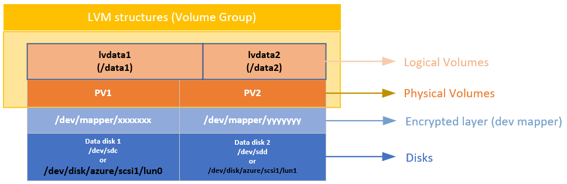

In a similar way, the RAID device is created on top of the encrypted layer on the disks. A file system is created on top of the RAID device and added to /etc/fstab as a regular device.

## Considerations

We recommend that you use LVM-on-crypt. RAID is an option when LVM can't be used because of specific application or environment limitations.

You'll use the **EncryptFormatAll** option. For more information about this option, see [Use the EncryptFormatAll feature for data disks on Linux VMs](https://docs.microsoft.com/azure/virtual-machines/linux/disk-encryption-linux#use-encryptformatall-feature-for-data-disks-on-linux-vms).

Although you can use this method when you're also encrypting the OS, we're just encrypting data drives here.

The procedures assume that you already reviewed the prerequisites in [Azure Disk Encryption scenarios on Linux VMs](https://docs.microsoft.com/azure/virtual-machines/linux/disk-encryption-linux) and in [Quickstart: Create and encrypt a Linux VM with the Azure CLI](https://docs.microsoft.com/azure/virtual-machines/linux/disk-encryption-cli-quickstart).

The Azure Disk Encryption dual-pass version is on a deprecation path and should no longer be used on new encryptions.

## General steps

When you're using the "on-crypt" configurations, use the process outlined in the following procedures.

>[!NOTE] 
>We're using variables throughout the article. Replace the values accordingly.

### Deploy a VM 
The following commands are optional, but we recommend that you apply them on a newly deployed virtual machine (VM).

PowerShell:

```powershell
New-AzVm -ResourceGroupName ${RGNAME} `
-Name ${VMNAME} `
-Location ${LOCATION} `
-Size ${VMSIZE} `
-Image ${OSIMAGE} `
-Credential ${creds} `
-Verbose
```
Azure CLI:

```bash
az vm create \
-n ${VMNAME} \
-g ${RGNAME} \
--image ${OSIMAGE} \
--admin-username ${username} \
--admin-password ${password} \
-l ${LOCATION} \
--size ${VMSIZE} \
-o table
```
### Attach disks to the VM
Repeat the following commands for `$N` number of new disks that you want to attach to the VM.

PowerShell:

```powershell
$storageType = 'Standard_LRS'
$dataDiskName = ${VMNAME} + '_datadisk0'
$diskConfig = New-AzDiskConfig -SkuName $storageType -Location $LOCATION -CreateOption Empty -DiskSizeGB 5
$dataDisk1 = New-AzDisk -DiskName $dataDiskName -Disk $diskConfig -ResourceGroupName ${RGNAME}
$vm = Get-AzVM -Name ${VMNAME} -ResourceGroupName ${RGNAME} 
$vm = Add-AzVMDataDisk -VM $vm -Name $dataDiskName -CreateOption Attach -ManagedDiskId $dataDisk1.Id -Lun 0
Update-AzVM -VM ${VM} -ResourceGroupName ${RGNAME}
```

Azure CLI:

```bash
az vm disk attach \
-g ${RGNAME} \
--vm-name ${VMNAME} \
--name ${VMNAME}datadisk1 \
--size-gb 5 \
--new \
-o table
```

### Verify that the disks are attached to the VM
PowerShell:
```powershell
$VM = Get-AzVM -ResourceGroupName ${RGNAME} -Name ${VMNAME}
$VM.StorageProfile.DataDisks | Select-Object Lun,Name,DiskSizeGB
```
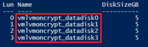

Azure CLI:

```bash
az vm show -g ${RGNAME} -n ${VMNAME} --query storageProfile.dataDisks -o table
```
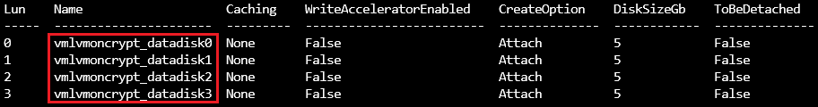

Portal:

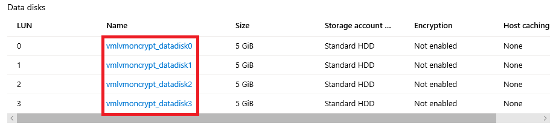

OS:

```bash
lsblk 
```
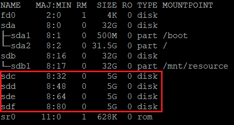

### Configure the disks to be encrypted
This configuration is done at the operating system level. The corresponding disks are configured for a traditional encryption through Azure Disk Encryption:

- File systems are created on top of the disks.
- Temporary mount points are created to mount the file systems.
- File systems are configured on /etc/fstab to be mounted at boot time.

Check the device letter assigned to the new disks. In this example, we're using four data disks.

```bash
lsblk 
```


### Create a file system on top of each disk
This command iterates the creation of an ext4 file system on each disk defined on the "in" part of the "for" cycle.

```bash
for disk in c d e f; do echo mkfs.ext4 -F /dev/sd${disk}; done |bash
```
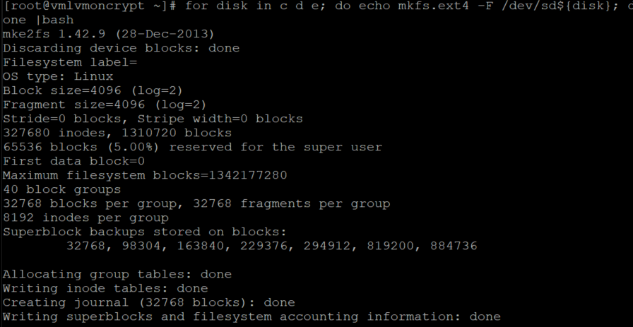

Find the universally unique identifier (UUID) of the file systems that you recently created, create a temporary folder, add the corresponding entries on /etc/fstab, and mount all the file systems.

This command also iterates on each disk defined on the "in" part of the "for" cycle:

```bash
for disk in c d e f; do diskuuid="$(blkid -s UUID -o value /dev/sd${disk})"; \
mkdir /tempdata${disk}; \
echo "UUID=${diskuuid} /tempdata${disk} ext4 defaults,nofail 0 0" >> /etc/fstab; \
mount -a; \
done
``` 

### Verify that the disks are mounted properly
```bash
lsblk
```
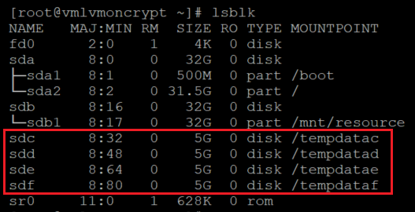

Also verify that the disks are configured:

```bash
cat /etc/fstab
```
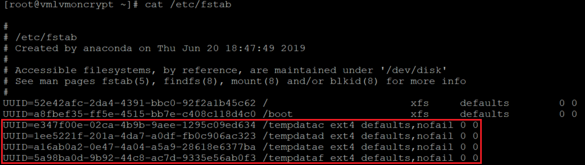

### Encrypt the data disks
PowerShell using a key encryption key (KEK):

```powershell
$sequenceVersion = [Guid]::NewGuid() 
Set-AzVMDiskEncryptionExtension -ResourceGroupName $RGNAME `
-VMName ${VMNAME} `
-DiskEncryptionKeyVaultUrl $diskEncryptionKeyVaultUrl `
-DiskEncryptionKeyVaultId $KeyVaultResourceId `
-KeyEncryptionKeyUrl $keyEncryptionKeyUrl `
-KeyEncryptionKeyVaultId $KeyVaultResourceId `
-VolumeType 'DATA' `
-EncryptFormatAll `
-SequenceVersion $sequenceVersion `
-skipVmBackup;
```

Azure CLI using a KEK:

```bash
az vm encryption enable \
--resource-group ${RGNAME} \
--name ${VMNAME} \
--disk-encryption-keyvault ${KEYVAULTNAME} \
--key-encryption-key ${KEYNAME} \
--key-encryption-keyvault ${KEYVAULTNAME} \
--volume-type "DATA" \
--encrypt-format-all \
-o table
```
### Verify the encryption status

Continue to the next step only when all the disks are encrypted.

PowerShell:

```powershell
Get-AzVmDiskEncryptionStatus -ResourceGroupName ${RGNAME} -VMName ${VMNAME}
```
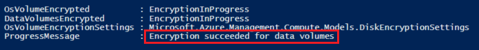

Azure CLI:

```bash
az vm encryption show -n ${VMNAME} -g ${RGNAME} -o table
```
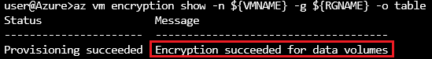

Portal:

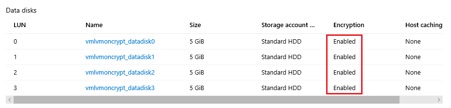

OS level:

```bash
lsblk
```
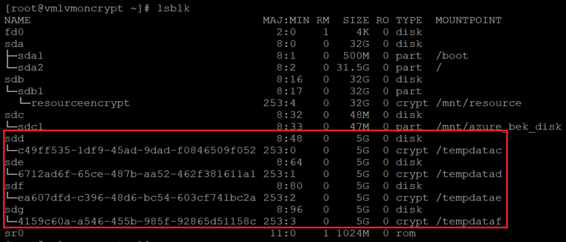

The extension will add the file systems to /var/lib/azure_disk_encryption_config/azure_crypt_mount (an old encryption) or to /etc/crypttab (new encryptions).

>[!NOTE] 
>Do not modify any of these files.

This file will take care of activating these disks during the boot process so that LVM or RAID can use them later. 

Don't worry about the mount points on this file. Azure Disk Encryption will lose the ability to get the disks mounted as a normal file system after we create a physical volume or a RAID device on top of those encrypted devices. (This will remove the file system format that we used during the preparation process.)

### Remove the temporary folders and temporary fstab entries
You unmount the file systems on the disks that will be used as part of LVM.

```bash
for disk in c d e f; do unmount /tempdata${disk}; done
```
And remove the /etc/fstab entries:

```bash
vi /etc/fstab
```
### Verify that the disks are not mounted and that the entries on /etc/fstab were removed

```bash
lsblk
```
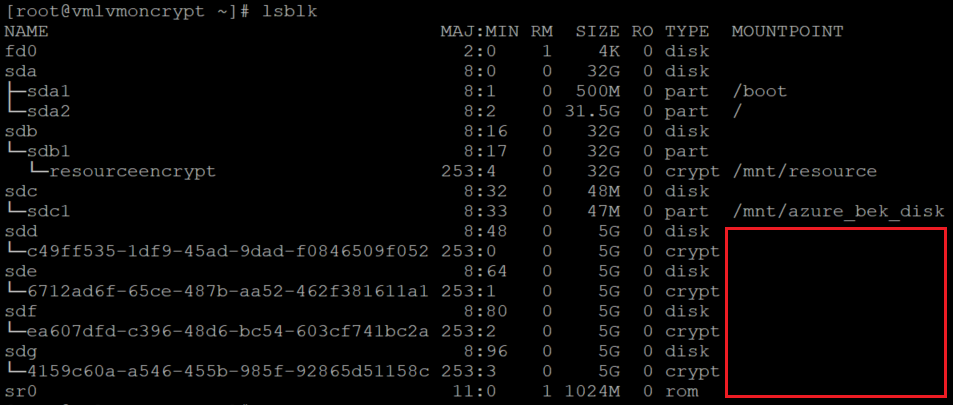

And verify that the disks are configured:
```bash
cat /etc/fstab
```
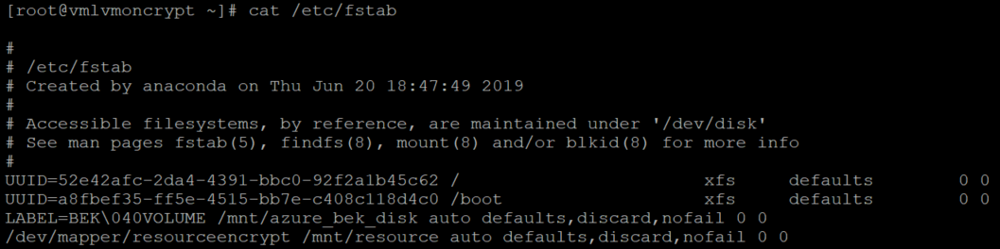

## Steps for LVM-on-crypt
Now that the underlying disks are encrypted, you can create the LVM structures.

Instead of using the device name, use the /dev/mapper paths for each of the disks to create a physical volume (on the crypt layer on top of the disk, not on the disk itself).

### Configure LVM on top of the encrypted layers
#### Create the physical volumes
You'll get a warning that asks if it's OK to wipe out the file system signature. Continue by entering **y**, or use **echo "y"** as shown:

```bash
echo "y" | pvcreate /dev/mapper/c49ff535-1df9-45ad-9dad-f0846509f052
echo "y" | pvcreate /dev/mapper/6712ad6f-65ce-487b-aa52-462f381611a1
echo "y" | pvcreate /dev/mapper/ea607dfd-c396-48d6-bc54-603cf741bc2a
echo "y" | pvcreate /dev/mapper/4159c60a-a546-455b-985f-92865d51158c
```
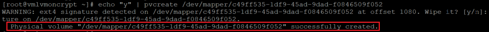

>[!NOTE] 
>The /dev/mapper/device names here need to be replaced for your actual values based on the output of **lsblk**.

#### Verify the information for physical volumes
```bash
pvs
```


#### Create the volume group
Create the volume group by using the same devices already initialized:

```bash
vgcreate vgdata /dev/mapper/
```

### Check the information for the volume group

```bash
vgdisplay -v vgdata
```
```bash
pvs
```
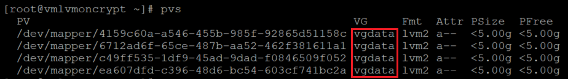

#### Create logical volumes

```bash
lvcreate -L 10G -n lvdata1 vgdata
lvcreate -L 7G -n lvdata2 vgdata
``` 

#### Check the created logical volumes

```bash
lvdisplay
lvdisplay vgdata/lvdata1
lvdisplay vgdata/lvdata2
```
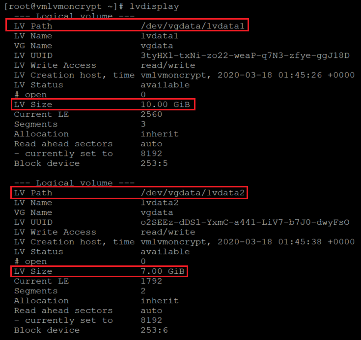

#### Create file systems on top of the structures for logical volumes

```bash
echo "yes" | mkfs.ext4 /dev/vgdata/lvdata1
echo "yes" | mkfs.ext4 /dev/vgdata/lvdata2
```

#### Create the mount points for the new file systems

```bash
mkdir /data0
mkdir /data1
```

#### Add the new file systems to /etc/fstab and mount them

```bash
echo "/dev/mapper/vgdata-lvdata1 /data0 ext4 defaults,nofail 0 0" >>/etc/fstab
echo "/dev/mapper/vgdata-lvdata2 /data1 ext4 defaults,nofail 0 0" >>/etc/fstab
mount -a
```

#### Verify that the new file systems are mounted

```bash
lsblk -fs
df -h
```
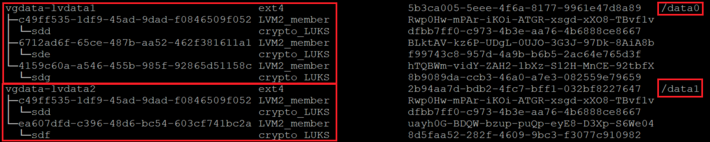

On this variation of **lsblk**, we're listing the devices showing the dependencies in reverse order. This option helps to identify the devices grouped by the logical volume instead of the original /dev/sd[disk] device names.

It's important to make sure that the **nofail** option is added to the mount point options of the LVM volumes created on top of a device encrypted through Azure Disk Encryption. It prevents the OS from getting stuck during the boot process (or in maintenance mode).

If you don't use the **nofail** option:

- The OS will never get into the stage where Azure Disk Encryption is started and the data disks are unlocked and mounted. 
- The encrypted disks will be unlocked at the end of the boot process. The LVM volumes and file systems will be automatically mounted until Azure Disk Encryption unlocks them. 

You can test rebooting the VM and validate that the file systems are also automatically getting mounted after boot time. This process might take several minutes, depending on the number and sizes of file systems.

#### Reboot the VM and verify after reboot

```bash
shutdown -r now
```
```bash
lsblk
df -h
```
## Steps for RAID-on-crypt
Now that the underlying disks are encrypted, you can continue to create the RAID structures. The process is the same as the one for LVM, but instead of using the device name, use the /dev/mapper paths for each disk.

#### Configure RAID on top of the encrypted layer of the disks
```bash
mdadm --create /dev/md10 \
--level 0 \
--raid-devices=4 \
/dev/mapper/c49ff535-1df9-45ad-9dad-f0846509f052 \
/dev/mapper/6712ad6f-65ce-487b-aa52-462f381611a1 \
/dev/mapper/ea607dfd-c396-48d6-bc54-603cf741bc2a \
/dev/mapper/4159c60a-a546-455b-985f-92865d51158c
```
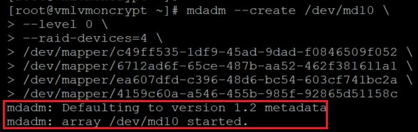

>[!NOTE] 
>The /dev/mapper/device names here need to be replaced with your actual values, based on the output of **lsblk**.

### Check/monitor RAID creation
```bash
watch -n1 cat /proc/mdstat
mdadm --examine /dev/mapper/[]
mdadm --detail /dev/md10
```
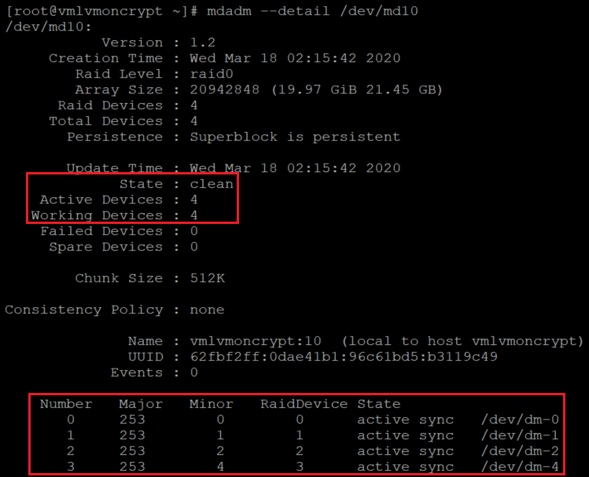

### Create a file system on top of the new RAID device
```bash
mkfs.ext4 /dev/md10
```

Create a new mount point for the file system, add the new file system to /etc/fstab, and mount it:

```bash
for device in md10; do diskuuid="$(blkid -s UUID -o value /dev/${device})"; \
mkdir /raiddata; \
echo "UUID=${diskuuid} /raiddata ext4 defaults,nofail 0 0" >> /etc/fstab; \
mount -a; \
done
```

Verify that the new file system is mounted:

```bash
lsblk -fs
df -h
```
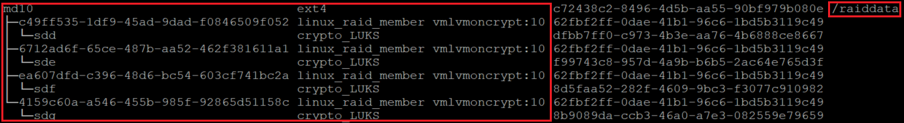

It's important to make sure that the **nofail** option is added to the mount point options of the RAID volumes created on top of a device encrypted through Azure Disk Encryption. It prevents the OS from getting stuck during the boot process (or in maintenance mode).

If you don't use the **nofail** option:

- The OS will never get into the stage where Azure Disk Encryption is started and the data disks are unlocked and mounted.
- The encrypted disks will be unlocked at the end of the boot process. The RAID volumes and file systems will be automatically mounted until Azure Disk Encryption unlocks them.

You can test rebooting the VM and validate that the file systems are also automatically getting mounted after boot time. This process might take several minutes, depending on the number and sizes of file systems.

```bash
shutdown -r now
```

And when you can log in:

```bash
lsblk
df -h
```
## Next steps

- [Azure Disk Encryption troubleshooting](disk-encryption-troubleshooting.md)

