# How to resize logical volume management devices that use Azure Disk Encryption

**Applies to:** :heavy_check_mark: Linux VMs :heavy_check_mark: Flexible scale sets 

In this article, you'll learn how to resize data disks that use Azure Disk Encryption. To resize the disks, you'll use logical volume management (LVM) on Linux. The steps apply to multiple scenarios.

You can use this resizing process in the following environments:

- Linux distributions:
    - Red Hat Enterprise Linux (RHEL) 7 or later
    - Ubuntu 18.04 or later
    - SUSE 12 or later
- Azure Disk Encryption versions:
    - Single-pass extension
    - Dual-pass extension

## Prerequisites

This article assumes that you have:

- An existing LVM configuration. For more information, see [Configure LVM on a Linux VM](/previous-versions/azure/virtual-machines/linux/configure-lvm).

- Disks that are already encrypted by Azure Disk Encryption. For more information, see [Configure LVM and RAID on encrypted devices](how-to-configure-lvm-raid-on-crypt.md).

- Experience using Linux and LVM.

- Experience using */dev/disk/scsi1/* paths for data disks on Azure. For more information, see [Troubleshoot Linux VM device name problems](/troubleshoot/azure/virtual-machines/troubleshoot-device-names-problems).

## Scenarios

The procedures in this article apply to the following scenarios:

- Traditional LVM and LVM-on-crypt configurations
- Traditional LVM encryption
- LVM-on-crypt

### Traditional LVM and LVM-on-crypt configurations

Traditional LVM and LVM-on-crypt configurations extend a logical volume (LV) when the volume group (VG) has available space.

### Traditional LVM encryption

In traditional LVM encryption, LVs are encrypted. The whole disk isn't encrypted.

By using traditional LVM encryption, you can:

- Extend the LV when you add a new physical volume (PV).
- Extend the LV when you resize an existing PV.

### LVM-on-crypt

The recommended method for disk encryption is LVM-on-encrypt. This method encrypts the entire disk, not just the LV.

By using LVM-on-crypt, you can:

- Extend the LV when you add a new PV.
- Extend the LV when you resize an existing PV.

> [!NOTE]
> We don't recommend mixing traditional LVM encryption and LVM-on-crypt on the same VM.

The following sections provide examples of how to use LVM and LVM-on-crypt. The examples use preexisting values for disks, PVs, VGs, LVs, file systems, universally unique identifiers (UUIDs), and mount points. Replace these values with your own values to fit your environment.

#### Extend an LV when the VG has available space

The traditional way to resize LVs is to extend an LV when the VG has space available. You can use this method for nonencrypted disks, traditional LVM-encrypted volumes, and LVM-on-crypt configurations.

1. Verify the current size of the file system that you want to increase:

    ```bash
    df -h /mountpoint
    ```

    

2. Verify that the VG has enough space to increase the LV:

    ```bash
    sudo vgs
    ```

    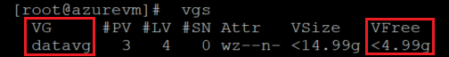

    You can also use `vgdisplay`:

    ```bash
    sudo vgdisplay vgname
    ```

    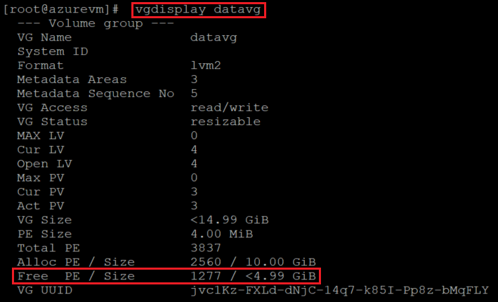

3. Identify which LV needs to be resized:

    ```bash
    sudo lsblk
    ```

    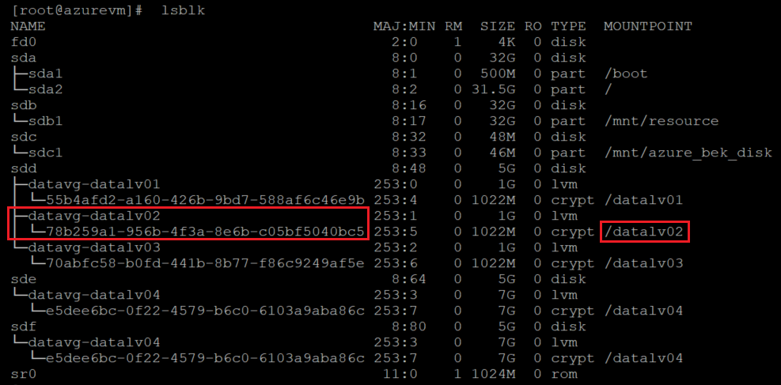

    For LVM-on-crypt, the difference is that this output shows that the encrypted layer is at the disk level.

    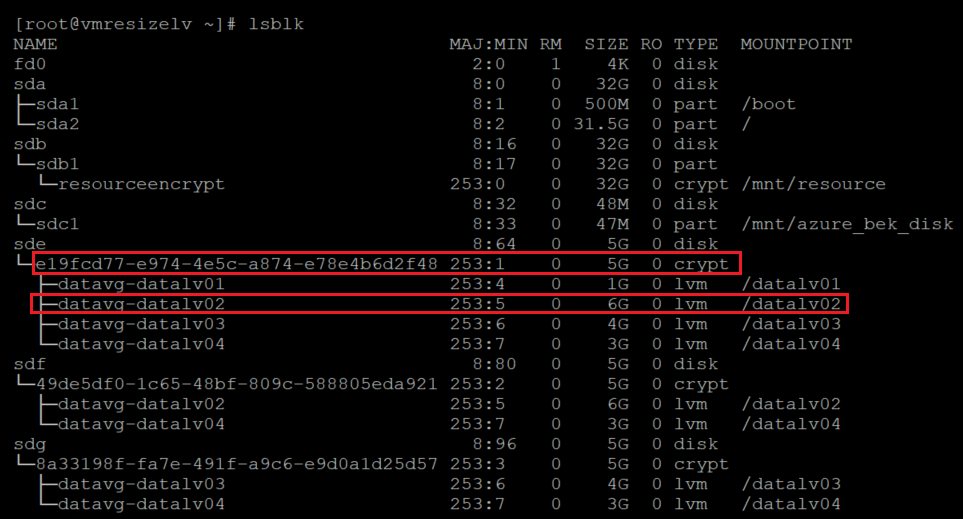

4. Check the LV size:

    ```bash
    sudo lvdisplay lvname
    ```

    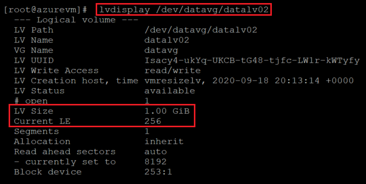

5. Increase the LV size by using `-r` to resize the file system online:

    ```bash
    sudo lvextend -r -L +2G /dev/vgname/lvname
    ```

    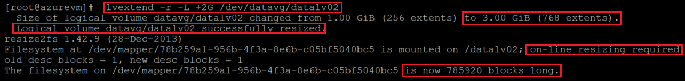

6. Verify the new sizes for the LV and the file system:

    ```bash
    df -h /mountpoint
    ```

    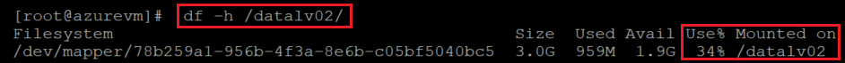

    The size output indicates that the LV and file system were successfully resized.

You can check the LV information again to confirm the changes at the level of the LV:

```bash
sudo lvdisplay lvname
```

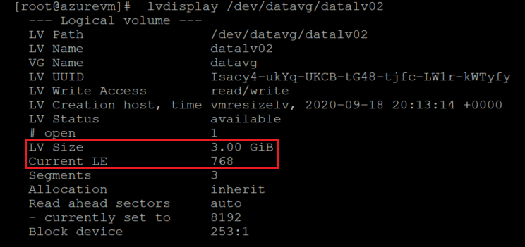

#### Extend a traditional LVM volume by adding a new PV

When you need to add a new disk to increase the VG size, extend your traditional LVM volume by adding a new PV.

1. Verify the current size of the file system that you want to increase:

    ```bash
    df -h /mountpoint
    ```

    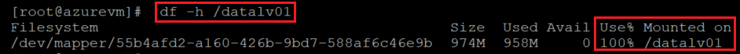

2. Verify the current PV configuration:

    ```bash
    sudo pvs
    ```

    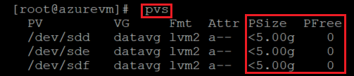

3. Check the current VG information:

    ```bash
    sudo vgs
    ```

    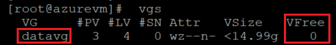

4. Check the current disk list. Identify data disks by checking the devices in */dev/disk/azure/scsi1/*.

    ```bash
    sudo ls -l /dev/disk/azure/scsi1/
    ```

    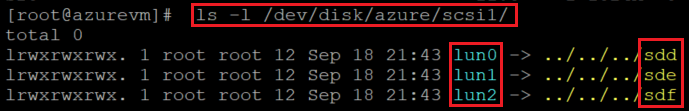

5. Check the output of `lsblk`:

    ```bash
    sudo lsbk
    ```

    

6. Attach the new disk to the VM by following the instructions in [Attach a data disk to a Linux VM](attach-disk-portal.md).

7. Check the disk list, and notice the new disk.

    ```bash
    sudo ls -l /dev/disk/azure/scsi1/
    ```

    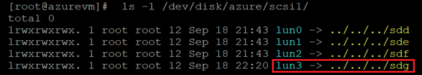

    ```bash
    sudo lsbk
    ```

    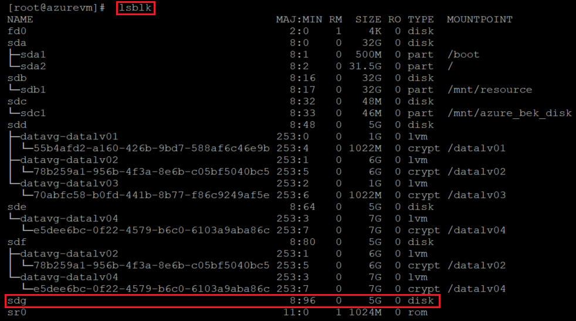

8. Create a new PV on top of the new data disk:

    ```bash
    sudo pvcreate /dev/newdisk
    ```

    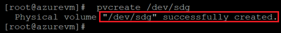

    This method uses the whole disk as a PV without a partition. Alternatively, you can use `fdisk` to create a partition and then use that partition for `pvcreate`.

9. Verify that the PV was added to the PV list:

    ```bash
    sudo pvs
    ```

    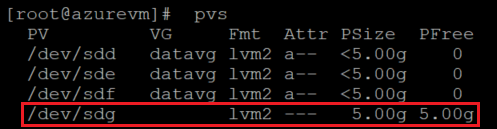

10. Extend the VG by adding the new PV to it:

    ```bash
    sudo vgextend vgname /dev/newdisk
    ```

    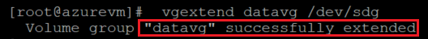

11. Check the new VG size:

    ```bash
    sudo vgs
    ```

    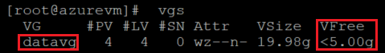

12. Use `lsblk` to identify the LV that needs to be resized:

    ```bash
    sudo lsblk
    ```

    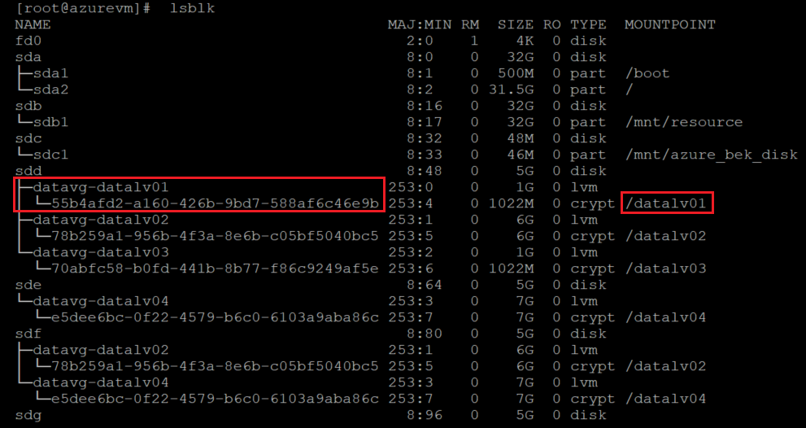

13. Extend the LV size by using `-r` to increase the file system online:

    ```bash
    sudo lvextend -r -L +2G /dev/vgname/lvname
    ```

    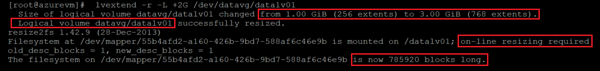 

14. Verify the new sizes of the LV and file system:

    ```bash
    df -h /mountpoint
    ```

    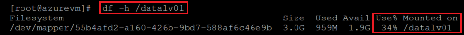

    >[!IMPORTANT]
    >When Azure Data Encryption is used on traditional LVM configurations, the encrypted layer is created at the LV level, not at the disk level.
    >
    >At this point, the encrypted layer is expanded to the new disk. The actual data disk has no encryption settings at the platform level, so its encryption status isn't updated.
    >
    >These are some of the reasons why LVM-on-crypt is the recommended approach. 

15. Check the encryption information from the portal:

    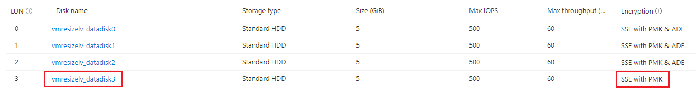

    To update the encryption settings on the disk, add a new LV and enable the extension on the VM.

16. Add a new LV, create a file system on it, and add it to `/etc/fstab`.

17. Set the encryption extension again. This time you'll stamp the encryption settings on the new data disk at the platform level. Here's a CLI example:

    ```azurecliazurecli-interactive
    az vm encryption enable -g ${RGNAME} --name ${VMNAME} --disk-encryption-keyvault "<your-unique-keyvault-name>"
    ```

18. Check the encryption information from the portal:

    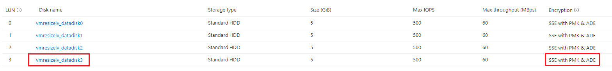

After the encryption settings are updated, you can delete the new LV. Also delete the entry from the `/etc/fstab` and `/etc/crypttab` that you created.

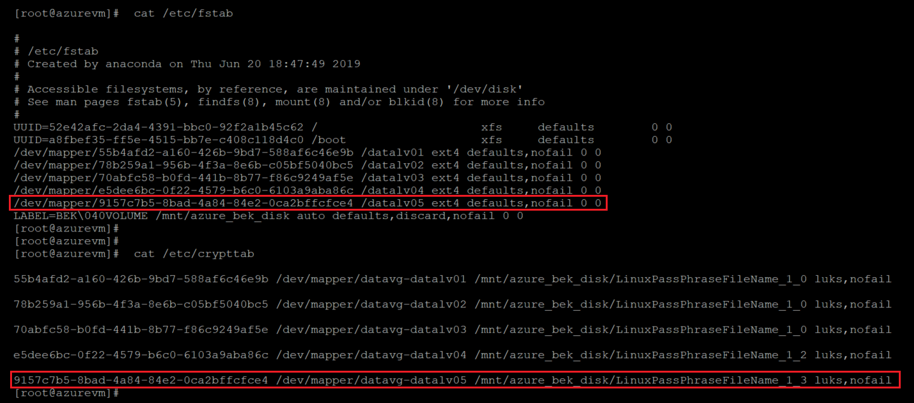

Follow these steps to finish cleaning up:

1. Unmount the LV:

    ```bash
    sudo umount /mountpoint
    ```

1. Close the encrypted layer of the volume:

    ```bash
    sudo cryptsetup luksClose /dev/vgname/lvname
    ```

1. Delete the LV:

    ```bash
    sudo lvremove /dev/vgname/lvname
    ```

#### Extend a traditional LVM volume by resizing an existing PV

Im some scenarios, your limitations might require you to resize an existing disk. Here's how:

1. Identify your encrypted disks:

    ```bash
    sudo ls -l /dev/disk/azure/scsi1/
    ```

    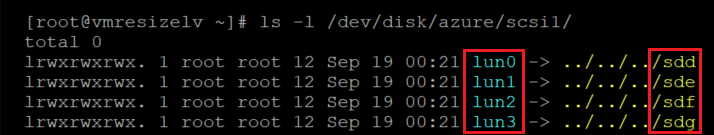

    ```bash
    sudo lsblk -fs
    ```

    

2. Check the PV information:

    ```bash
    sudo pvs
    ```

    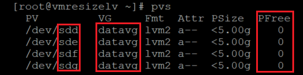

    The results in the image show that all of the space on all of the PVs is currently used.

3. Check the VG information:

    ```bash
    sudo vgs
    sudo vgdisplay -v vgname
    ```

    

4. Check the disk sizes. You can use `fdisk` or `lsblk` to list the drive sizes.

    ```bash
    for disk in `sudo ls -l /dev/disk/azure/scsi1/* | awk -F/ '{print $NF}'` ; do echo "sudo fdisk -l /dev/${disk} | grep ^Disk "; done | bash

    sudo lsblk -o "NAME,SIZE"
    ```

    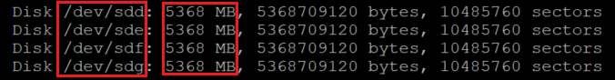

    Here we identified which PVs are associated with which LVs by using `lsblk -fs`. You can identify the associations by running `lvdisplay`.

    ```bash
    sudo lvdisplay --maps VG/LV
    sudo lvdisplay --maps datavg/datalv1
    ```

    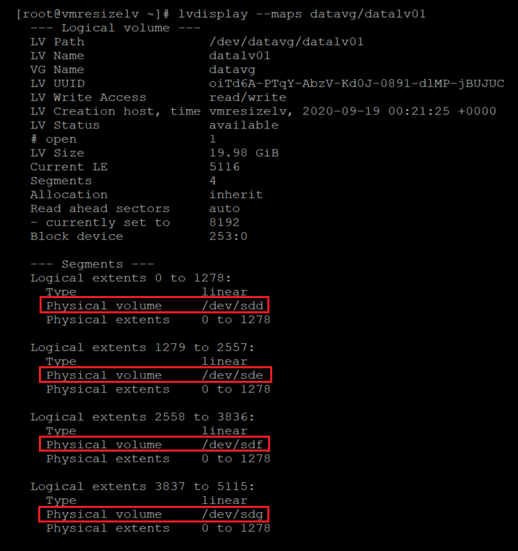

    In this case, all four data drives are part of the same VG and a single LV. Your configuration might differ.

5. Check the current file system utilization:

    ```bash
    df -h /datalvm*
    ```

    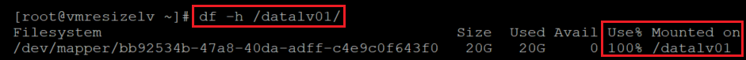

6. Resize the data disks by following the instructions in [Expand an Azure managed disk](expand-disks.md#expand-an-azure-managed-disk). You can use the portal, the CLI, or PowerShell.

    >[!IMPORTANT]
    >You can't resize virtual disks while the VM is running. Deallocate your VM for this step.

7. Start the VM and check the new sizes by using `fdisk`.

    ```bash
    for disk in `sudo ls -l /dev/disk/azure/scsi1/* | awk -F/ '{print $NF}'` ; do echo "sudo fdisk -l /dev/${disk} | grep ^Disk "; done | bash

    sudo lsblk -o "NAME,SIZE"
    ```

    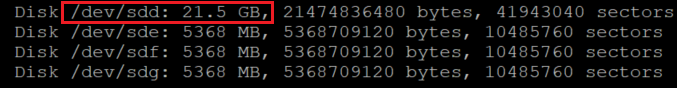

    In this case, `/dev/sdd` was resized from 5 G to 20 G.

8. Check the current PV size:

    ```bash
    sudo pvdisplay /dev/resizeddisk
    ```

    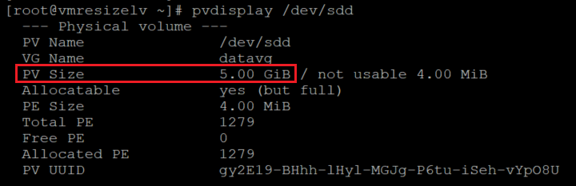

    Even though the disk was resized, the PV still has the previous size.

9. Resize the PV:

    ```bash
    sudo pvresize /dev/resizeddisk
    ```

    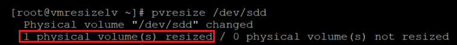


10. Check the PV size:

    ```bash
    sudo pvdisplay /dev/resizeddisk
    ```

    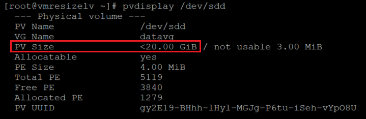

    Apply the same procedure for all of the disks that you want to resize.

11. Check the VG information.

    ```bash
    sudo vgdisplay vgname
    ```

    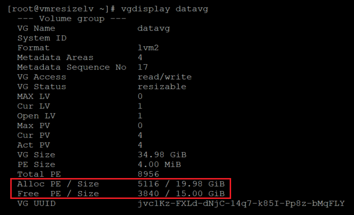

    The VG now has enough space to be allocated to the LVs.

12. Resize the LV:

    ```bash
    sudo lvresize -r -L +5G vgname/lvname
    sudo lvresize -r -l +100%FREE /dev/datavg/datalv01
    ```

    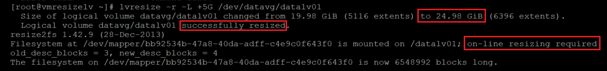

13. Check the size of the file system:

    ```bash
    df -h /datalvm2
    ```

    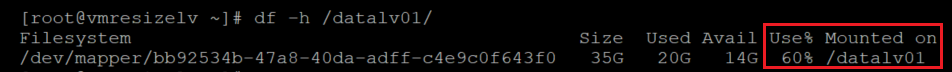

#### Extend an LVM-on-crypt volume by adding a new PV

You can also extend an LVM-on-crypt volume by adding a new PV. This method closely follows the steps in [Configure LVM and RAID on encrypted devices](how-to-configure-lvm-raid-on-crypt.md#general-steps). See the sections that explain how to add a new disk and set it up in an LVM-on-crypt configuration.

You can use this method to add space to an existing LV. Or you can create new VGs or LVs.

1. Verify the current size of your VG:

    ```bash
    sudo vgdisplay vgname
    ```

    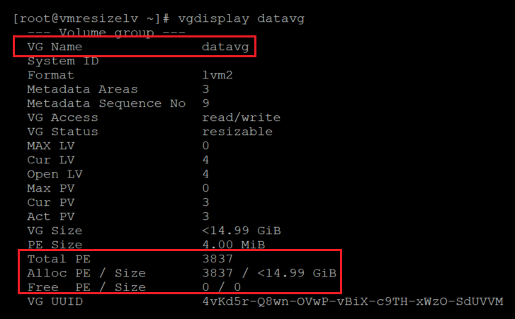

2. Verify the size of the file system and LV that you want to expand:

    ```bash
    sudo lvdisplay /dev/vgname/lvname
    ```

    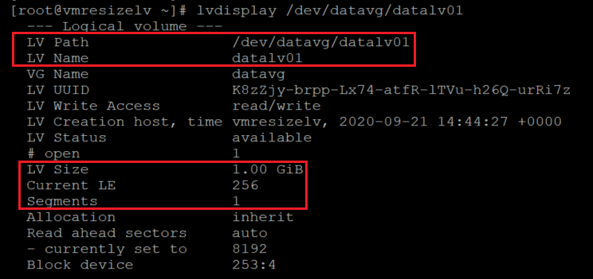

    ```bash
    df -h mountpoint
    ```

    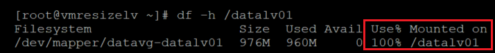

3. Add a new data disk to the VM and identify it.

    Before you add the new disk, check the disks:

    ```bash
    sudo fdisk -l | egrep ^"Disk /"
    ```

    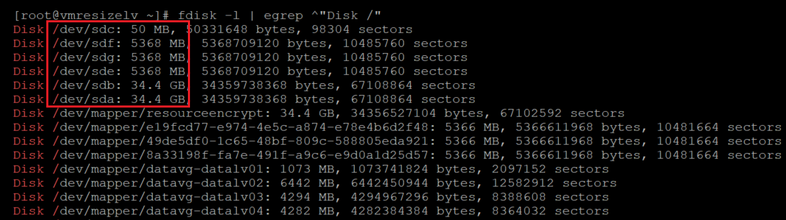

    Here's another way to check the disks before you add the new disk:

    ```bash
    sudo lsblk
    ```

    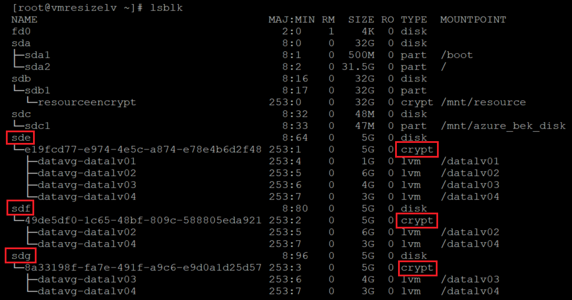

    To add the new disk, you can use PowerShell, the Azure CLI, or the Azure portal. For more information, see [Attach a data disk to a Linux VM](attach-disk-portal.md).

    The kernel name scheme applies to the newly added device. A new drive is normally assigned the next available letter. In this case, the added disk is `sdd`.

4. Check the disks to make sure the new disk has been added:

    ```bash
    sudo fdisk -l | egrep ^"Disk /"
    ```

    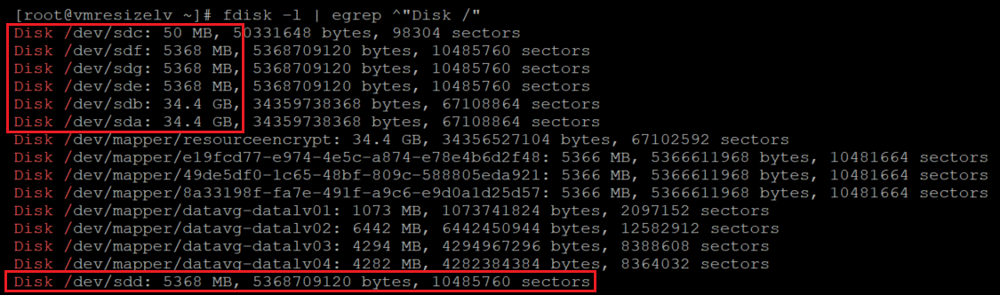

    ```bash
    sudo lsblk
    ```

    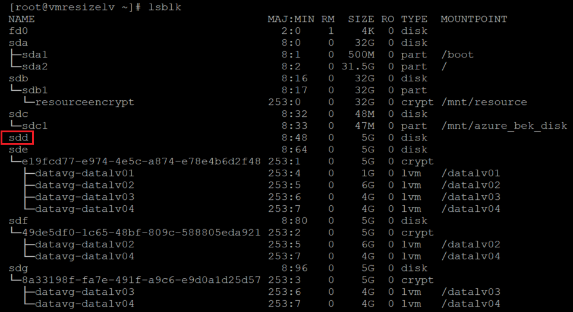

5. Create a file system on top of the recently added disk. Match the disk to the linked devices on `/dev/disk/azure/scsi1/`.

    ```bash
    sudo ls -la /dev/disk/azure/scsi1/
    ```

    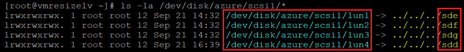

    ```bash
    sudo mkfs.ext4 /dev/disk/azure/scsi1/${disk}
    ```

    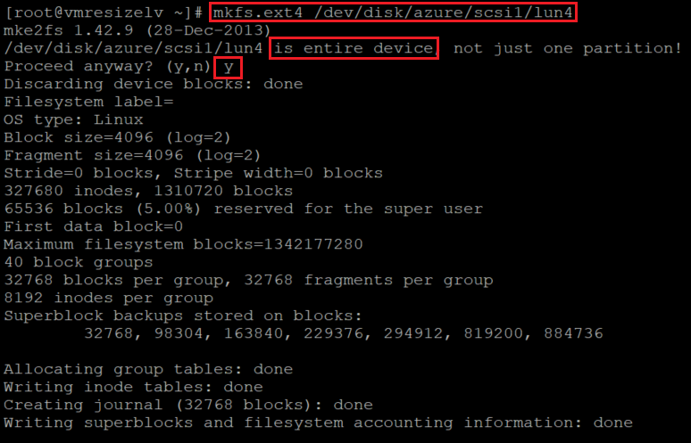

6. Create a temporary mount point for the new added disk:

    ```bash
    newmount=/data4
    sudo mkdir ${newmount}
    ```

7. Add the recently created file system to `/etc/fstab`.

    ```bash
    sudo blkid /dev/disk/azure/scsi1/lun4| awk -F\" '{print "UUID="$2" '${newmount}' "$4" defaults,nofail 0 0"}' >> /etc/fstab
    ```

8. Mount the newly created file system:

    ```bash
    sudo mount -a
    ```

9. Verify that the new file system is mounted:

    ```bash
    df -h
    ```

    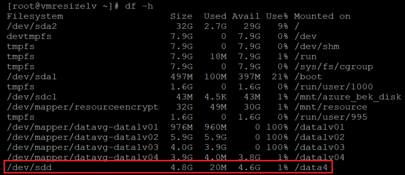

    ```bash
    sudo lsblk
    ```

    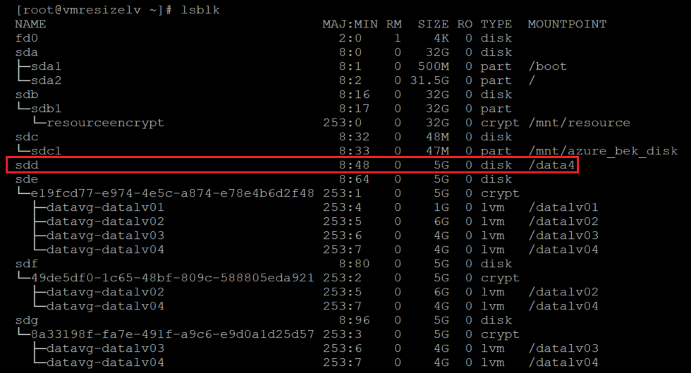

10. Restart the encryption that you previously started for data drives.

    >[!TIP]
    >For LVM-on-crypt, we recommend that you use `EncryptFormatAll`. Otherwise, you might see a double encryption while you set additional disks.
    >
    >For more information, see [Configure LVM and RAID on encrypted devices](how-to-configure-lvm-raid-on-crypt.md).

    Here's an example:

    ```azurecli-interactive
    az vm encryption enable \
    --resource-group ${RGNAME} \
    --name ${VMNAME} \
    --disk-encryption-keyvault ${KEYVAULTNAME} \
    --key-encryption-key ${KEYNAME} \
    --key-encryption-keyvault ${KEYVAULTNAME} \
    --volume-type "DATA" \
    --encrypt-format-all \
    -o table
    ```

    When the encryption finishes, you see a crypt layer on the newly added disk:

    ```bash
    sudo lsblk
    ```

    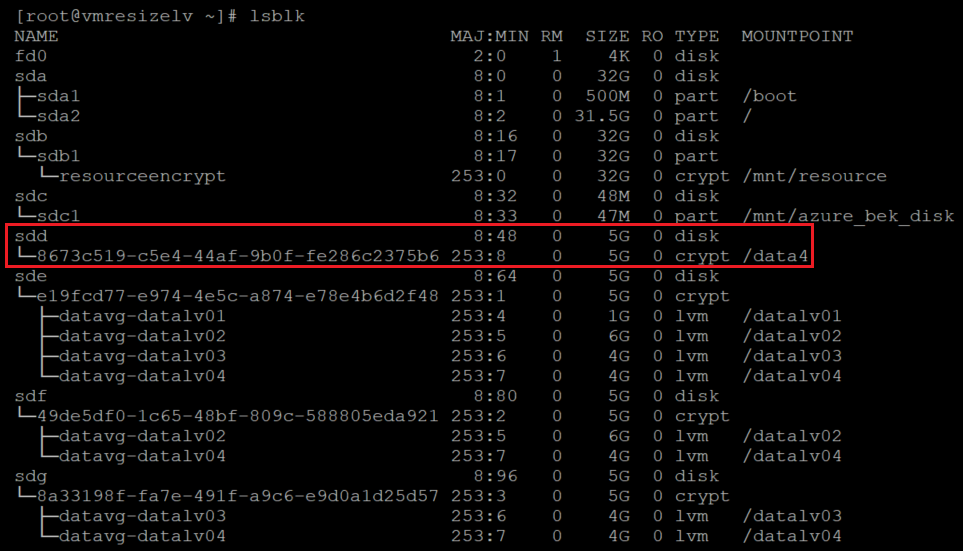

11. Unmount the encrypted layer of the new disk:

    ```bash
    sudo umount ${newmount}
    ```

12. Check the current PV information:

    ```bash
    sudo pvs
    ```

    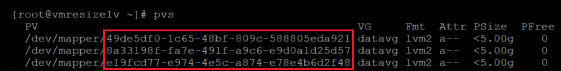

13. Create a PV on top of the encrypted layer of the disk. Take the device name from the previous `lsblk` command. Add a `/dev/` mapper in front of the device name to create the PV:

    ```bash
    sudo pvcreate /dev/mapper/mapperdevicename
    ```

    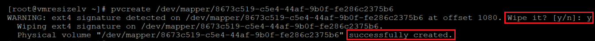

    You see a warning about wiping the current `ext4 fs` signature. This warning is expected. Answer this question with `y`.

14. Verify that the new PV was added to the LVM configuration:

    ```bash
    sudo pvs
    ```

    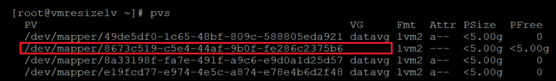

15. Add the new PV to the VG that you need to increase.

    ```bash
    sudo vgextend vgname /dev/mapper/nameofhenewpv
    ```

    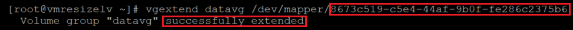

16. Verify the new size and free space of the VG:

    ```bash
    sudo vgdisplay vgname
    ```

    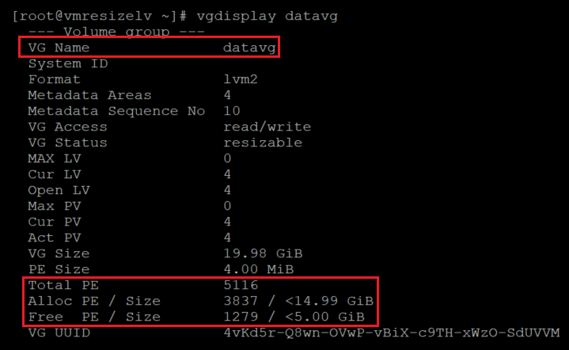

    Note the increase of the `Total PE` count and the `Free PE / Size`.

17. Increase the size of the LV and the file system. Use the `-r` option on `lvextend`. In this example, we're adding the total available space in the VG to the given LV.

    ```bash
    sudo lvextend -r -l +100%FREE /dev/vgname/lvname
    ```

    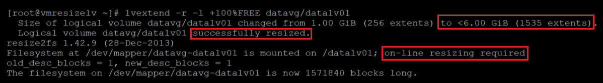

Follow the next steps to verify your changes.

1. Verify the size of the LV:

    ```bash
    sudo lvdisplay /dev/vgname/lvname
    ```

    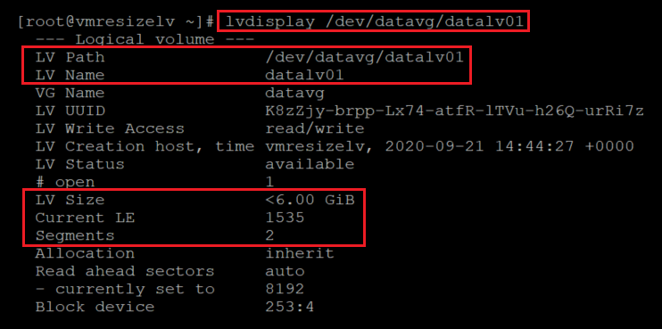

1. Verify the new size of the file system:

    ```bash
    df -h /mountpoint
    ```

    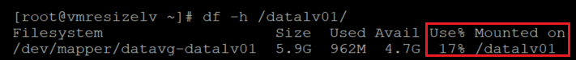

1. Verify that the LVM layer is on top of the encrypted layer:

    ```bash
    sudo lsblk
    ```

    

    If you use `lsblk` without options, then you see the mount points multiple times. The command sorts by device and LVs. 

    You might want to use `lsblk -fs`. In this command, `-fs` reverses the sort order so that the mount points are shown once. The disks are shown multiple times.

    ```bash
    sudo lsblk -fs
    ```

    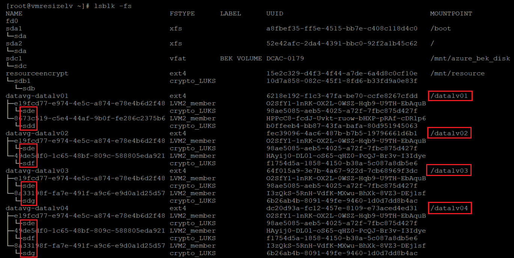

#### Extend an LVM on a crypt volume by resizing an existing PV

1. Identify your encrypted disks:

    ```bash
    sudo lsblk
    ```

    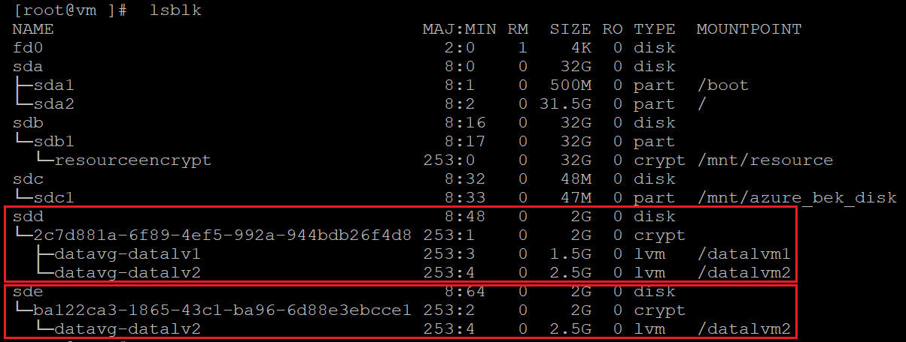

    ```bash
    sudo lsblk -s
    ```

    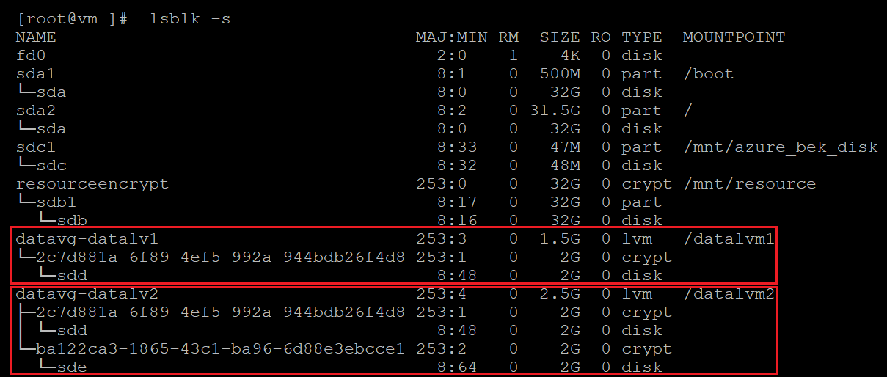

2. Check your PV information:

    ```bash
    sudo pvs
    ```

    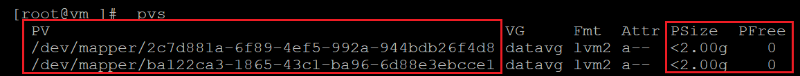

3. Check your VG information:

    ```bash
    sudo vgs
    ```

    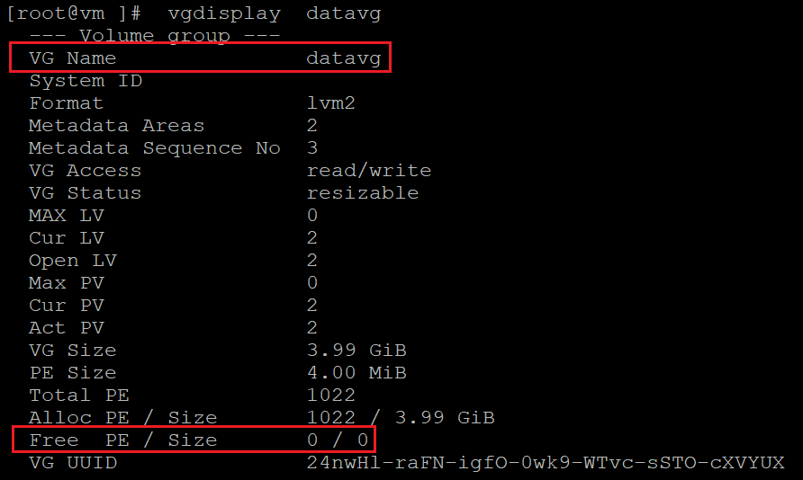

4. Check your LV information:

    ```bash
    sudo lvs
    ```

    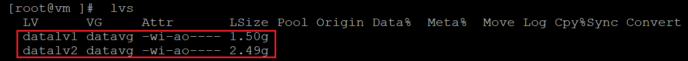

5. Check the file system utilization:

    ```bash
    df -h /mountpoint(s)
    ```

    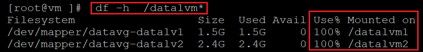

6. Check the sizes of your disks:

    ```bash
    sudo fdisk
    sudo fdisk -l | egrep ^"Disk /"
    sudo lsblk
    ```

    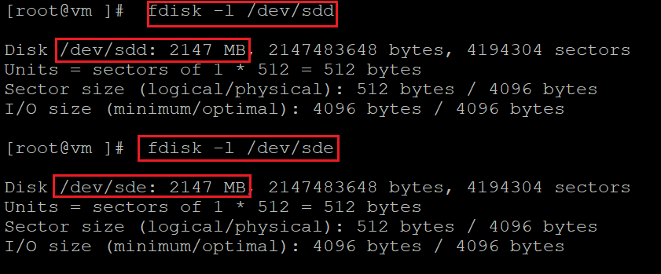

7. Resize the data disk. You can use the portal, CLI, or PowerShell. For more information, see the disk-resize section in [Expand virtual hard disks on a Linux VM](expand-disks.md#expand-an-azure-managed-disk). 

    >[!IMPORTANT]
    >You can't resize virtual disks while the VM is running. Deallocate your VM for this step.

8. Check your disks sizes:

    ```bash
    sudo fdisk
    sudo fdisk -l | egrep ^"Disk /"
    sudo lsblk
    ```

    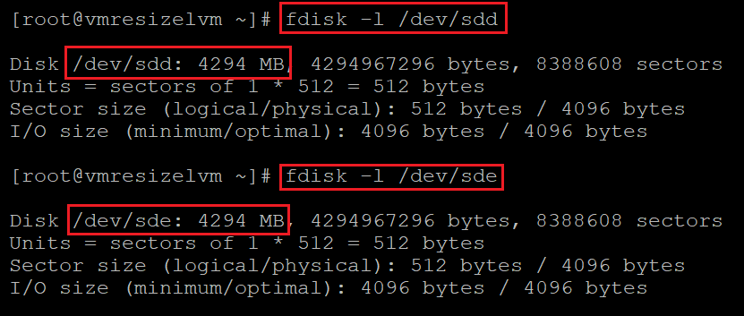

    In this case, both disks were resized from 2 GB to 4 GB. But the size of the file system, LV, and PV remain the same.

9. Check the current PV size. Remember that on LVM-on-crypt, the PV is the `/dev/mapper/` device, not the `/dev/sd*` device.

    ```bash
    sudo pvdisplay /dev/mapper/devicemappername
    ```

    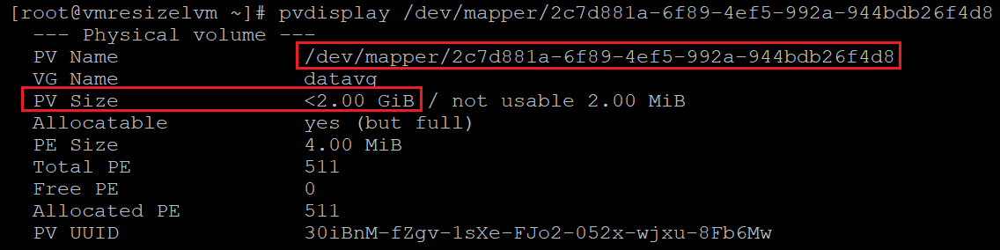

10. Resize the PV:

    ```bash
    sudo pvresize /dev/mapper/devicemappername
    ```

    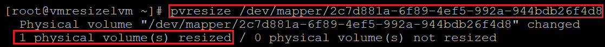

11. Check the new PV size:

    ```bash
    sudo pvdisplay /dev/mapper/devicemappername
    ```

    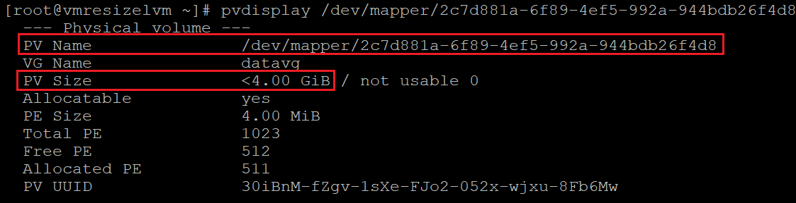

12. Resize the encrypted layer on the PV:

    ```bash
    sudo cryptsetup resize /dev/mapper/devicemappername
    ```

    Apply the same procedure for all of the disks that you want to resize.

13. Check your VG information:

    ```bash
    sudo vgdisplay vgname
    ```

    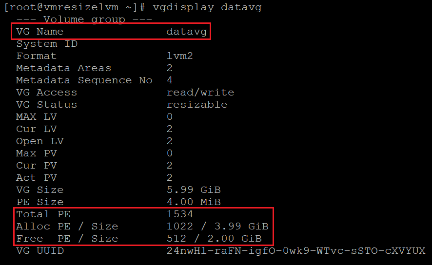

    The VG now has enough space to be allocated to the LVs.

14. Check the LV information:

    ```bash
    sudo lvdisplay vgname/lvname
    ```

    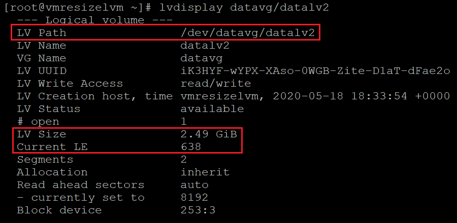

15. Check the file system utilization:

    ```bash
    df -h /mountpoint
    ```

    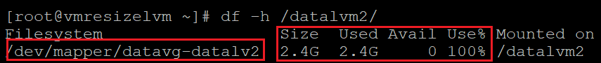

16. Resize the LV:

    ```bash
    sudo lvresize -r -L +2G /dev/vgname/lvname
    ```

    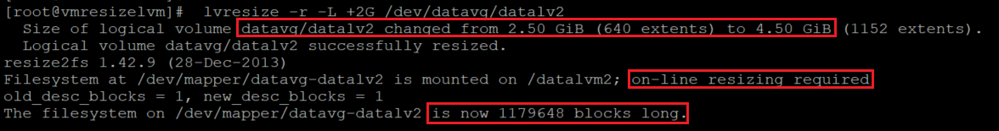

    Here we use the `-r` option to also resize the file system.

17. Check the LV information:

    ```bash
    sudo lvdisplay vgname/lvname
    ```

    

18. Check the file system utilization:

    ```bash
    df -h /mountpoint
    ```

    

Apply the same resizing procedure to any other LV that requires it.

## Next steps

[Troubleshoot Azure Disk Encryption](disk-encryption-troubleshooting.md)
