# Verify encryption status for Linux 

**Applies to:** :heavy_check_mark: Linux VMs :heavy_check_mark: Flexible scale sets 

The scope of this article is to validate the encryption status of a virtual machine by using different methods: the Azure portal, PowerShell, the Azure CLI, or the operating system of the virtual machine (VM). 

You can validate the encryption status during or after the encryption, by either:

- Checking the disks attached to a particular VM. 
- Querying the encryption settings on each disk, whether the disk is attached or unattached.

This scenario applies for Azure Disk Encryption dual-pass and single-pass extensions. Linux distributions are the only environment for this scenario.

>[!NOTE] 
>We're using variables throughout the article. Replace the values accordingly.

## Portal

In the Azure portal, inside the **Extensions** section, select the Azure Disk Encryption extension in the list. The information for **Status message** indicates the current encryption status:

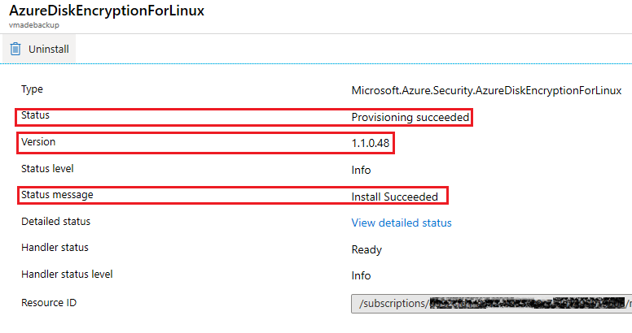

In the list of extensions, you'll see the corresponding Azure Disk Encryption extension version. Version 0.x corresponds to Azure Disk Encryption dual pass, and version 1.x corresponds to Azure Disk Encryption single pass.

You can get more details by selecting the extension and then selecting **View detailed status**. The detailed status of the encryption process appears in JSON format.


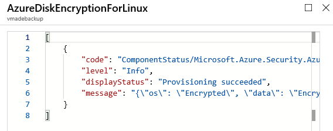

Another way to validate the encryption status is by looking at the **Disk settings** section.

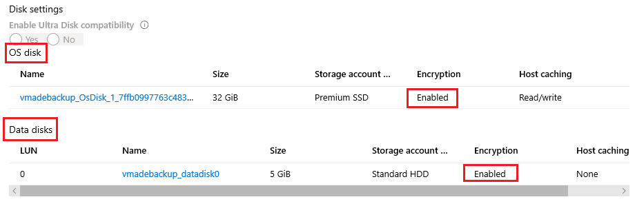

>[!NOTE] 
> This status means the disks have encryption settings stamped, not that they were actually encrypted at the OS level.
>
> By design, the disks are stamped first and encrypted later. If the encryption process fails, the disks may end up stamped but not encrypted. 
>
> To confirm if the disks are truly encrypted, you can double check the encryption of each disk at the OS level.

## PowerShell

You can validate the *general* encryption status of an encrypted VM by using the following PowerShell commands:

```azurepowershell-interactive
   $VMNAME="VMNAME"
   $RGNAME="RGNAME"
   Get-AzVmDiskEncryptionStatus -ResourceGroupName  ${RGNAME} -VMName ${VMNAME}
```
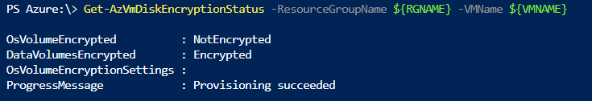

You can capture the encryption settings from each disk by using the following PowerShell commands.

### Single pass
In a single pass, the encryption settings are stamped on each of the disks (OS and data). You can capture the encryption settings for an OS disk in a single pass as follows:

```azurepowershell-interactive
$RGNAME = "RGNAME"
$VMNAME = "VMNAME"

$VM = Get-AzVM -Name ${VMNAME} -ResourceGroupName ${RGNAME}  
 $Sourcedisk = Get-AzDisk -ResourceGroupName ${RGNAME} -DiskName $VM.StorageProfile.OsDisk.Name
 Write-Host "============================================================================================================================================================="
 Write-Host "Encryption Settings:"
 Write-Host "============================================================================================================================================================="
 Write-Host "Enabled:" $Sourcedisk.EncryptionSettingsCollection.Enabled
 Write-Host "Version:" $Sourcedisk.EncryptionSettingsCollection.EncryptionSettingsVersion
 Write-Host "Source Vault:" $Sourcedisk.EncryptionSettingsCollection.EncryptionSettings.DiskEncryptionKey.SourceVault.Id
 Write-Host "Secret URL:" $Sourcedisk.EncryptionSettingsCollection.EncryptionSettings.DiskEncryptionKey.SecretUrl
 Write-Host "Key URL:" $Sourcedisk.EncryptionSettingsCollection.EncryptionSettings.KeyEncryptionKey.KeyUrl
 Write-Host "============================================================================================================================================================="
```


If the disk doesn't have encryption settings stamped, the output will be empty:

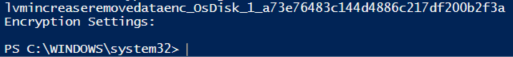

Use the following commands to capture encryption settings for data disks:

```azurepowershell-interactive
$RGNAME = "RGNAME"
$VMNAME = "VMNAME"

$VM = Get-AzVM -Name ${VMNAME} -ResourceGroupName ${RGNAME}
 clear
 foreach ($i in $VM.StorageProfile.DataDisks|ForEach-Object{$_.Name})
 {
 Write-Host "============================================================================================================================================================="
 Write-Host "Encryption Settings:"
 Write-Host "============================================================================================================================================================="
 Write-Host "Checking Disk:" $i
 $Disk=(Get-AzDisk -ResourceGroupName ${RGNAME} -DiskName $i)
 Write-Host "Encryption Enable: " $Sourcedisk.EncryptionSettingsCollection.Enabled
 Write-Host "Encryption KeyEncryptionKey: " $Sourcedisk.EncryptionSettingsCollection.EncryptionSettings.KeyEncryptionKey.KeyUrl;
 Write-Host "Encryption DiskEncryptionKey: " $Sourcedisk.EncryptionSettingsCollection.EncryptionSettings.DiskEncryptionKey.SecretUrl;
 Write-Host "============================================================================================================================================================="
 }
```
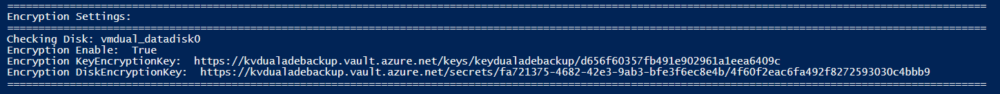

### Dual pass
In a dual pass, the encryption settings are stamped in the VM model and not on each individual disk.

To verify that the encryption settings were stamped in a dual pass, use the following commands:

```azurepowershell-interactive
$RGNAME = "RGNAME"
$VMNAME = "VMNAME"

$vm = Get-AzVm -ResourceGroupName ${RGNAME} -Name ${VMNAME};
$Sourcedisk = Get-AzDisk -ResourceGroupName ${RGNAME} -DiskName $VM.StorageProfile.OsDisk.Name
clear
Write-Host "============================================================================================================================================================="
Write-Host "Encryption Settings:"
Write-Host "============================================================================================================================================================="
Write-Host "Enabled:" $Sourcedisk.EncryptionSettingsCollection.Enabled
Write-Host "Version:" $Sourcedisk.EncryptionSettingsCollection.EncryptionSettingsVersion
Write-Host "Source Vault:" $Sourcedisk.EncryptionSettingsCollection.EncryptionSettings.DiskEncryptionKey.SourceVault.Id
Write-Host "Secret URL:" $Sourcedisk.EncryptionSettingsCollection.EncryptionSettings.DiskEncryptionKey.SecretUrl
Write-Host "Key URL:" $Sourcedisk.EncryptionSettingsCollection.EncryptionSettings.KeyEncryptionKey.KeyUrl
Write-Host "============================================================================================================================================================="
```
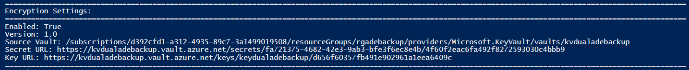

### Unattached disks

Check the encryption settings for disks that aren't attached to a VM.

### Managed disks

```azurepowershell-interactive
$Sourcedisk = Get-AzDisk -ResourceGroupName ${RGNAME} -DiskName ${TARGETDISKNAME}
Write-Host "============================================================================================================================================================="
Write-Host "Encryption Settings:"
Write-Host "============================================================================================================================================================="
Write-Host "Enabled:" $Sourcedisk.EncryptionSettingsCollection.Enabled
Write-Host "Version:" $Sourcedisk.EncryptionSettingsCollection.EncryptionSettingsVersion
Write-Host "Source Vault:" $Sourcedisk.EncryptionSettingsCollection.EncryptionSettings.DiskEncryptionKey.SourceVault.Id
Write-Host "Secret URL:" $Sourcedisk.EncryptionSettingsCollection.EncryptionSettings.DiskEncryptionKey.SecretUrl
Write-Host "Key URL:" $Sourcedisk.EncryptionSettingsCollection.EncryptionSettings.KeyEncryptionKey.KeyUrl
Write-Host "============================================================================================================================================================="
```

## Azure CLI

You can validate the *general* encryption status of an encrypted VM by using the following Azure CLI commands:

```azurecli-interactive
VMNAME="VMNAME"
RGNAME="RGNAME"
az vm encryption show --name ${VMNAME} --resource-group ${RGNAME} --query "substatus"
```

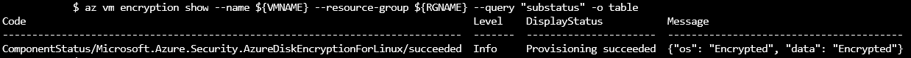

### Single pass

You can validate the encryption settings for each disk by using the following Azure CLI commands:

```azurecli-interactive
az vm encryption show -g ${RGNAME} -n ${VMNAME} --query "disks[*].[name, statuses[*].displayStatus]"  -o table
```

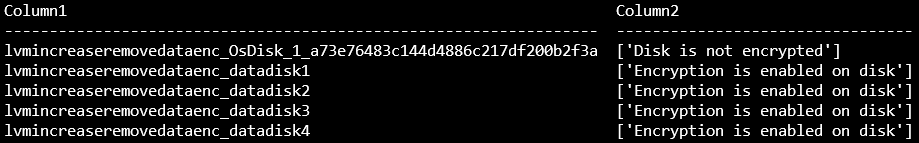

>[!IMPORTANT]
> If the disk doesn't have encryption settings stamped, you'll see the text **Disk is not encrypted**.

Use the following commands to get detailed status and encryption settings.

OS disk:

```azurecli-interactive
RGNAME="RGNAME"
VMNAME="VNAME"

disk=`az vm show -g ${RGNAME} -n ${VMNAME} --query storageProfile.osDisk.name -o tsv`
for disk in $disk; do \
echo "============================================================================================================================================================="
echo -ne "Disk Name: "; az disk show -g ${RGNAME} -n ${disk} --query name -o tsv; \
echo -ne "Encryption Enabled: "; az disk show -g ${RGNAME} -n ${disk} --query encryptionSettingsCollection.enabled -o tsv; \
echo -ne "Version: "; az disk show -g ${RGNAME} -n ${TARGETDISKNAME} --query encryptionSettingsCollection.encryptionSettingsVersion -o tsv; \
echo -ne "Disk Encryption Key: "; az disk show -g ${RGNAME} -n ${disk} --query encryptionSettingsCollection.encryptionSettings[].diskEncryptionKey.secretUrl -o tsv; \
echo -ne "key Encryption Key: "; az disk show -g ${RGNAME} -n ${disk} --query encryptionSettingsCollection.encryptionSettings[].keyEncryptionKey.keyUrl -o tsv; \
echo "============================================================================================================================================================="
done
```

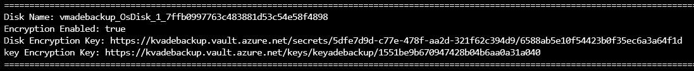

Data disks:

```azurecli-interactive
RGNAME="RGNAME"
VMNAME="VMNAME"
az vm encryption show --name ${VMNAME} --resource-group ${RGNAME} --query "substatus"

for disk in `az vm show -g ${RGNAME} -n ${VMNAME} --query storageProfile.dataDisks[].name -o tsv`; do \
echo "============================================================================================================================================================="; \
echo -ne "Disk Name: "; az disk show -g ${RGNAME} -n ${disk} --query name -o tsv; \
echo -ne "Encryption Enabled: "; az disk show -g ${RGNAME} -n ${disk} --query encryptionSettingsCollection.enabled -o tsv; \
echo -ne "Version: "; az disk show -g ${RGNAME} -n ${TARGETDISKNAME} --query encryptionSettingsCollection.encryptionSettingsVersion -o tsv; \
echo -ne "Disk Encryption Key: "; az disk show -g ${RGNAME} -n ${disk} --query encryptionSettingsCollection.encryptionSettings[].diskEncryptionKey.secretUrl -o tsv; \
echo -ne "key Encryption Key: "; az disk show -g ${RGNAME} -n ${disk} --query encryptionSettingsCollection.encryptionSettings[].keyEncryptionKey.keyUrl -o tsv; \
echo "============================================================================================================================================================="
done
```

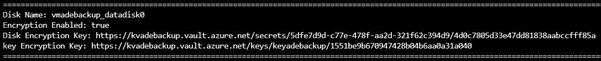

### Dual pass

```azurecli-interactive
az vm encryption show --name ${VMNAME} --resource-group ${RGNAME} -o table
```

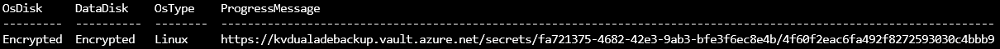

You can also check the encryption settings on the VM Model Storage profile of the OS disk:

```azurecli-interactive
disk=`az vm show -g ${RGNAME} -n ${VMNAME} --query storageProfile.osDisk.name -o tsv`
for disk in $disk; do \
echo "============================================================================================================================================================="; \
echo -ne "Disk Name: "; az disk show -g ${RGNAME} -n ${disk} --query name -o tsv; \
echo -ne "Encryption Enabled: "; az disk show -g ${RGNAME} -n ${disk} --query encryptionSettingsCollection.enabled -o tsv; \
echo -ne "Version: "; az disk show -g ${RGNAME} -n ${TARGETDISKNAME} --query encryptionSettingsCollection.encryptionSettingsVersion -o tsv; \
echo -ne "Disk Encryption Key: "; az disk show -g ${RGNAME} -n ${disk} --query encryptionSettingsCollection.encryptionSettings[].diskEncryptionKey.secretUrl -o tsv; \
echo -ne "key Encryption Key: "; az disk show -g ${RGNAME} -n ${disk} --query encryptionSettingsCollection.encryptionSettings[].keyEncryptionKey.keyUrl -o tsv; \
echo "============================================================================================================================================================="
done
```

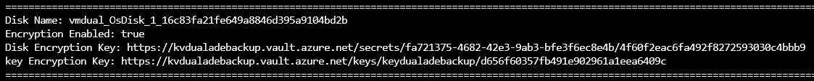

### Unattached disks

Check the encryption settings for disks that aren't attached to a VM.

### Managed disks

```azurecli-interactive
RGNAME="RGNAME"
TARGETDISKNAME="DISKNAME"
echo "============================================================================================================================================================="
echo -ne "Disk Name: "; az disk show -g ${RGNAME} -n ${TARGETDISKNAME} --query name -o tsv; \
echo -ne "Encryption Enabled: "; az disk show -g ${RGNAME} -n ${TARGETDISKNAME} --query encryptionSettingsCollection.enabled -o tsv; \
echo -ne "Version: "; az disk show -g ${RGNAME} -n ${TARGETDISKNAME} --query encryptionSettingsCollection.encryptionSettingsVersion -o tsv; \
echo -ne "Disk Encryption Key: "; az disk show -g ${RGNAME} -n ${TARGETDISKNAME} --query encryptionSettingsCollection.encryptionSettings[].diskEncryptionKey.secretUrl -o tsv; \
echo -ne "key Encryption Key: "; az disk show -g ${RGNAME} -n ${TARGETDISKNAME} --query encryptionSettingsCollection.encryptionSettings[].keyEncryptionKey.keyUrl -o tsv; \
echo "============================================================================================================================================================="
```

### Unmanaged disks

Unmanaged disks are VHD files that are stored as page blobs in Azure storage accounts.

To get the details for a specific disk, you need to provide:

- The ID of the storage account that contains the disk.
- A connection string for that particular storage account.
- The name of the container that stores the disk.
- The disk name.

This command lists all the IDs for all your storage accounts:

```azurecli-interactive
az storage account list --query [].[id] -o tsv
```

The storage account IDs are listed in the following form:

/subscriptions/\<subscription id>/resourceGroups/\<resource group name>/providers/Microsoft.Storage/storageAccounts/\<storage account name>

Select the appropriate ID and store it on a variable:

```azurecli-interactive
id="/subscriptions/<subscription id>/resourceGroups/<resource group name>/providers/Microsoft.Storage/storageAccounts/<storage account name>"
```

This command gets the connection string for one particular storage account and stores it on a variable:

```azurecli-interactive
ConnectionString=$(az storage account show-connection-string --ids $id --query connectionString -o tsv)
```

The following command lists all the containers under a storage account:

```azurecli-interactive
az storage container list --connection-string $ConnectionString --query [].[name] -o tsv
```

The container used for disks is normally named "vhds."

Store the container name on a variable:

```azurecli-interactive
ContainerName="name of the container"
```

Use this command to list all the blobs on a particular container:

```azurecli-interactive
az storage blob list -c ${ContainerName} --connection-string $ConnectionString --query [].[name] -o tsv
```

Choose the disk that you want to query and store its name on a variable:

```azurecli-interactive
DiskName="diskname.vhd"
```

Query the disk encryption settings:

```azurecli-interactive
az storage blob show -c ${ContainerName} --connection-string ${ConnectionString} -n ${DiskName} --query metadata.DiskEncryptionSettings
```

## Operating system

Validate if the data disk partitions are encrypted (and the OS disk isn't).

When a partition or disk is encrypted, it's displayed as a **crypt** type. When it's not encrypted, it's displayed as a **part/disk** type.

```bash
sudo lsblk
```

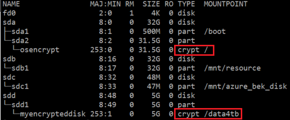

You can get more details by using the following **lsblk** variant. 

You'll see a **crypt** type layer that is mounted by the extension. The following example shows logical volumes and normal disks having **crypto\_LUKS FSTYPE**.

```bash
sudo lsblk -o NAME,TYPE,FSTYPE,LABEL,SIZE,RO,MOUNTPOINT
```

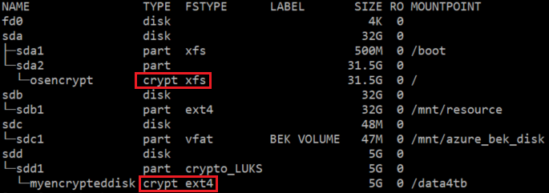

As an extra step, you can validate if the data disk has any keys loaded:

```bash
sudo cryptsetup luksDump /dev/VGNAME/LVNAME
```

```bash
sudo cryptsetup luksDump /dev/sdd1
```

And you can check which **dm** devices are listed as **crypt**:

```bash
sudo dmsetup ls --target crypt
```

## Next steps

- [Azure Disk Encryption troubleshooting](disk-encryption-troubleshooting.md)
