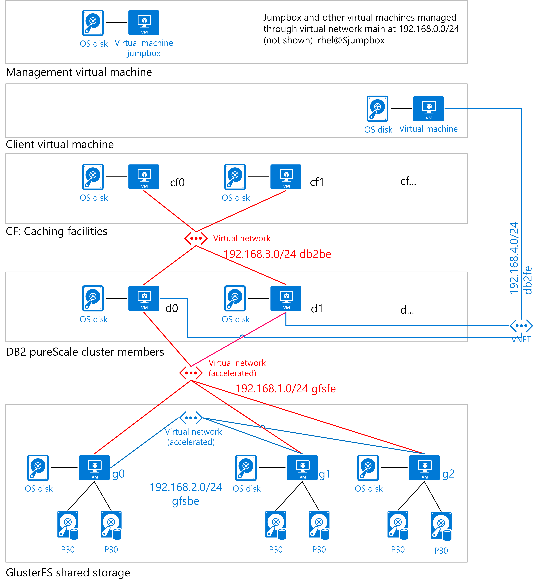

# IBM DB2 pureScale on Azure

The IBM DB2 pureScale environment provides a database cluster for Azure with high availability and scalability on Linux operating systems. This article shows an architecture for running DB2 pureScale on Azure.

## Overview

Enterprises have long used traditional relational database management system (RDBMS) platforms to cater to their online transaction processing (OLTP) needs. These days, many are migrating their mainframe-based database environments to Azure as a way to expand capacity, reduce costs, and maintain a steady operational cost structure. Migration is often the first step in modernizing a legacy platform. 

Recently, an enterprise customer rehosted its IBM DB2 environment running on z/OS to IBM DB2 pureScale on Azure. The Db2 pureScale database cluster solution provides high availability and scalability on Linux operating systems. The customer ran Db2 successfully as a standalone, scale-up instance on a single virtual machine (VM) in a large scale-up system on Azure prior to installing Db2 pureScale. 

Though not identical to the original environment, IBM DB2 pureScale on Linux delivers similar high-availability and scalability features as IBM DB2 for z/OS running in a Parallel Sysplex configuration on the mainframe. In this scenario, the cluster is connected via iSCSI to a shared storage cluster. We used the GlusterFS file system, a free, scalable, open source distributed file system specifically optimized for cloud storage. However, IBM no longer supports this solution. To maintain your support from IBM, you need to use a supported iSCSI-compatible file system. Microsoft offers Storage Spaces Direct (S2D) as an option

This article describes the architecture used for this Azure migration. The customer used Red Hat Linux 7.4 to test the configuration. This version is available from the Azure Marketplace. Before you choose a Linux distribution, make sure to verify the currently supported versions. For details, see the documentation for [IBM DB2 pureScale](https://www.ibm.com/support/knowledgecenter/SSEPGG) and [GlusterFS](https://docs.gluster.org/en/latest/).

This article is a starting point for your DB2 implementation plan. Your business requirements will differ, but the same basic pattern applies. You can also use this architectural pattern for online analytical processing (OLAP) applications on Azure.

This article doesn't cover differences and possible migration tasks for moving an IBM DB2 for z/OS database to IBM DB2 pureScale running on Linux. And it doesn't provide sizing estimations and workload analyses for moving from DB2 z/OS to DB2 pureScale. 

To help you decide on the best DB2 pureScale architecture for your environment, we recommend that you fully estimate sizing and make a hypothesis. On the source system, make sure to consider DB2 z/OS Parallel Sysplex with data-sharing architecture, Coupling Facility configuration, and distributed data facility (DDF) usage statistics.

> [!NOTE]
> This article describes one approach to DB2 migration, but there are others. For example, DB2 pureScale can also run in virtualized on-premises environments. IBM supports DB2 on Microsoft Hyper-V in various configurations. For more information, see [DB2 pureScale virtualization architecture](https://www.ibm.com/support/knowledgecenter/en/SSEPGG_11.1.0/com.ibm.db2.luw.qb.server.doc/doc/r0061462.html) in the IBM Knowledge Center.

## Architecture

To support high availability and scalability on Azure, you can use a scale-out, shared data architecture for DB2 pureScale. The customer migration used the following example architecture.

The diagram shows the logical layers needed for a DB2 pureScale cluster. These include virtual machines for a client, for management, for caching, for the database engine, and for shared storage. 

In addition to the database engine nodes, the diagram includes two nodes used for cluster caching facilities (CFs). A minimum of two nodes are used for the database engine itself. A DB2 server that belongs to a pureScale cluster is called a member. 

The cluster is connected via iSCSI to a three-node shared storage cluster to provide scale-out storage and high availability. DB2 pureScale is installed on Azure virtual machines running Linux.

This approach is a template that you can modify for the size and scale of your organization. It's based on the following:

-   Two or more database members are combined with at least two CF nodes. The nodes manage a global buffer pool (GBP) for shared memory and global lock manager (GLM) services to control shared access and lock contention from active members. One CF node acts as the primary and the other as the secondary, failover CF node. To avoid a single point of failure in the environment, a DB2 pureScale cluster requires at least four nodes.

-   High-performance shared storage (shown in P30 size in the diagram). Each node uses this storage.

-   High-performance networking for the data members and shared storage.

### Compute considerations

This architecture runs the application, storage, and data tiers on Azure virtual machines. The [deployment setup scripts](https://aka.ms/db2onazure) create the following:

-   A DB2 pureScale cluster. The type of compute resources you need on Azure depends on your setup. In general, you can use two approaches:

    -   Use a multi-node, high-performance computing (HPC)-style network where small to medium-sized instances access shared storage. For this HPC type of configuration, Azure memory-optimized E-series or storage-optimized L-series [virtual machines](https://docs.microsoft.com/azure/virtual-machines/windows/sizes) provide the needed compute power.

    -   Use fewer large virtual machine instances for the data engines. For large instances, the largest memory-optimized [M-series](https://azure.microsoft.com/pricing/details/virtual-machines/series/) virtual machines are ideal for heavy in-memory workloads. You might need a dedicated instance, depending on the size of the logical partition (LPAR) that's used to run DB2.

-   The DB2 CF uses memory-optimized virtual machines, such as E-series or L-series.

-   A shared storage cluster that uses Standard\_DS4\_v2 virtual machines running Linux.

-   The management jumpbox is a Standard\_DS2\_v2 virtual machine running Linux.  An alternative is Azure Bastion, a service that provides a secure RDP/SSH experience for all the VMs in your virtual network.

-   The client is a Standard\_DS3\_v2 virtual machine running Windows (used for testing).

-   *Optional*. A witness server. This is needed only with certain earlier versions of Db2 pureScale. This example uses a Standard\_DS3\_v2 virtual machine running Linux (used for DB2 pureScale).

> [!NOTE]
> A DB2 pureScale cluster requires at least two DB2 instances. It also requires a cache instance and a lock manager instance.

### Storage considerations

Like Oracle RAC, DB2 pureScale is a high-performance block I/O, scale-out database. We recommend using the largest [Azure premium SSD](disks-types.md) option that suits your needs. Smaller storage options might be suitable for development and test environments, while production environments often need more storage capacity. The example architecture uses [P30](https://azure.microsoft.com/pricing/details/managed-disks/) because of its ratio of IOPS to size and price. Regardless of size, use Premium Storage for best performance.

DB2 pureScale uses a shared-everything architecture, where all data is accessible from all cluster nodes. Premium storage must be shared across multiple instances, whether on demand or on dedicated instances.

A large DB2 pureScale cluster can require 200 terabytes (TB) or more of premium shared storage, with IOPS of 100,000. DB2 pureScale supports an iSCSI block interface that you can use on Azure. The iSCSI interface requires a shared storage cluster that you can implement with S2D or another tool. This type of solution creates a virtual storage area network (vSAN) device in Azure. DB2 pureScale uses the vSAN to install the clustered file system that's used to share data among virtual machines.

### Networking considerations

IBM recommends InfiniBand networking for all members in a DB2 pureScale cluster. DB2 pureScale also uses remote direct memory access (RDMA), where available, for the CFs.

During setup, you create an Azure [resource group](https://docs.microsoft.com/azure/azure-resource-manager/resource-group-overview) to contain all the virtual machines. In general, you group resources based on their lifetime and who will manage them. The virtual machines in this architecture require [accelerated networking](https://azure.microsoft.com/blog/maximize-your-vm-s-performance-with-accelerated-networking-now-generally-available-for-both-windows-and-linux/). It's an Azure feature that provides consistent, ultra-low network latency via single-root I/O virtualization (SR-IOV) to a virtual machine.

Every Azure virtual machine is deployed into a virtual network that has subnets: main, Gluster FS front end (gfsfe), Gluster FS back end (bfsbe), DB2 pureScale (db2be), and DB2 pureScale front end (db2fe). The installation script also creates the primary [NICs](https://docs.microsoft.com/azure/virtual-machines/linux/multiple-nics) on the virtual machines in the main subnet.

Use [network security groups](https://docs.microsoft.com/azure/virtual-network/virtual-networks-nsg) to restrict network traffic within the virtual network and to
isolate the subnets.

On Azure, DB2 pureScale needs to use TCP/IP as the network connection for storage.

## Next steps

-   [Deploy this architecture on Azure](deploy-ibm-db2-purescale-azure.md)
