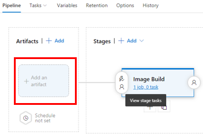
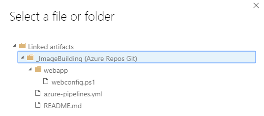

# Azure Image Builder Service DevOps Task

This article shows you how to use a Azure DevOps task to inject build artifacts into a VM image so you can install and configure your application and OS.

## Prerequisites

* Install the [DevOps Task from Visual Studio Marketplace](https://marketplace.visualstudio.com/items?itemName=AzureImageBuilder.devOps-task-for-azure-image-builder).
* You must have a VSTS DevOps account, and a Build Pipeline created
* Create a Standard Azure Storage Account in the source image Resource Group, you can use other Resource Group/Storage accounts, but you must ensure the Image Builder has contributor permissions to the Storage account. This is used transfer the build artifacts from the DevOps task to the image.
* Register and enable requirements, as per below:
```bash
az feature register --namespace Microsoft.VirtualMachineImages --name VirtualMachineTemplatePreview

az feature show --namespace Microsoft.VirtualMachineImages --name VirtualMachineTemplatePreview | grep state

# register and enable for shared image gallery
az feature register --namespace Microsoft.Compute --name GalleryPreview

# wait until it says registered

# check you are registered for the providers
az provider show -n Microsoft.VirtualMachineImages | grep registrationState
az provider show -n Microsoft.Storage | grep registrationState
az provider show -n Microsoft.Compute | grep registrationState
az provider show -n Microsoft.KeyVault | grep registrationState
```

If they do not saw registered, run the commented out code below.
```bash
## az provider register -n Microsoft.VirtualMachineImages
## az provider register -n Microsoft.Storage
## az provider register -n Microsoft.Compute
## az provider register -n Microsoft.KeyVault

```
```bash
# create storage account and blob in resource group
subscriptionID=<INSERT YOUR SUBSCRIPTION ID HERE>
z account set -s $subscriptionID
strResourceGroup=<ResourceGroupName>
location=westus
scriptStorageAcc=aibstordot$(date +'%s')
az storage account create -n $scriptStorageAcc -g $strResourceGroup -l $location --sku Standard_LRS
```
## Add Task to Release Pipeline

1. Select **Release Pipeline** > **Edit**
1. On the User Agent, select *+* to add then search for **Image Builder**. Select **Add**.

Set the following task properties:

### Azure Subscription

Select from the drop down menu which subscription you want the Image Builder to run. Use the same subscription where your source images are located and where the images are to be distributed. You need to authorize the image builder contributor access to the Subscription or Resource Group.

### Resource Group

Use the resource group where the temporary image template artifact will be stored. When creating a template artifact, an additional temporary Image Builder resource group `IT_<DestinationResourceGroup>_<TemplateName>` is created. The temporary resource group stores the image metadata, such as scripts. At the end of the task, the image template artifact and temporary Image Builder resource group is deleted.
 
### Location

The location is where the Image Builder will run. Only a set amount of locations are supported. The source images must be present in this location. For example, if you are using Shared Image Gallery, a replica must exist in that region.

### Source

The source images must be of the supported Image Builder OS's. You can choose existing custom images in the same region as Image Builder is running from:
* Managed Image - You need to pass in the resourceId, for example:
    ```json
    /subscriptions/<subscriptionID>/resourceGroups/<rgName>/providers/Microsoft.Compute/images/<imageName>
    ```
* Azure Shared Image Gallery - You need to pass in the resourceId of the image version, for example:
    ```json
    /subscriptions/$subscriptionID/resourceGroups/$sigResourceGroup/providers/Microsoft.Compute/galleries/$sigName/images/$imageDefName/versions/<versionNumber>
    ```

    If you need to get the latest Shared Image Gallery version, you can have an AZ PowerShell or AZ CLI task before that will get the latest version and set a DevOps variable. Use the variable in the AZ VM Image Builder DevOps task. For more information, see the [examples](https://github.com/danielsollondon/azvmimagebuilder/tree/master/solutions/8_Getting_Latest_SIG_Version_ResID#getting-the-latest-image-version-resourceid-from-shared-image-gallery).

* Marketplace Base Images

    Image Builder will defaults to using the 'latest' version of the supported OS's, you can specify an image version (optional).

### Customize

#### Provisioner

Initially, two customerizers are supported - **Shell** and **PowerShell**. Only inline is supported. If you want to download scripts, then you can pass inline commands to do so.

For your OS, select PowerShell or Shell.

#### Windows Update Task

For Windows only, the task runs Windows Update at the end of the customizations. It handles the required reboots.

The following is the Windows Update configuration that is executed:
```json
    "type": "WindowsUpdate",
    "searchCriteria": "IsInstalled=0",
    "filters": [
        "exclude:$_.Title -like '*Preview*'",
        "include:$true"
```
It installs important and recommended Windows Updates that are not preview.

#### Build Path

The task is designed to be able to inject DevOps Build release artifacts into the image. To make this work, you need to setup a build pipeline. In the setup of the release pipeline, you must add the repo of the build artifacts.



Select the **Build Path** button to choose the build folder you want to be placed on the image. The Image Builder task copies all files and directories within it. When the image is being created, Image Builder deploys the files and directories into different paths, depending on OS.

> [!IMPORTANT]
> When adding a repo artifact, you may find the directory is prefixed with an underscore *_*. The underscore can cause issues with the inline commands. Use the appropriate quotes in the commands.
> 

The following is an example to explain how this works:



* Windows - Files exist in `C:\`. A directory named `buildArtifacts` is created which includes the `webapp` directory.

* Linux - Files exist in  `/tmp`. The `webapp` directory is created which includes all files and directories. You must move the files from this directory. Otherwise, they will be deleted since it is in the temporary directory.

#### Inline customization script

* Windows - You can enter PowerShell inline commands separated by commas. If you want to run a script in your build directory, you can use:

    ```PowerShell
    & 'c:\buildArtifacts\webapp\webconfig.ps1'
    ```

* Linux - On Linux systems the build artifacts are put into the `/tmp` directory. However, on many Linux OS's, on a reboot, the /tmp directory contents are deleted. If you want these to exist in the image, you must create another directory and copy them over.  For example:

    ```bash
    sudo mkdir /lib/buildArtifacts
    sudo cp -r "/tmp/_ImageBuilding/webapp" /lib/buildArtifacts/.
    ```
    
    If you are ok using the "/tmp" directory, then you can use the code below to execute the script.
    
    ```bash
    # grant execute permissions to execute scripts
    sudo chmod +x "/tmp/_ImageBuilding/webapp/coreConfig.sh"
    echo "running script"
    sudo . "/tmp/AppsAndImageBuilderLinux/_WebApp/coreConfig.sh"
    ```
    
#### What happens to the build artifacts after the image build?

> [!NOTE]
> Image Builder does not automatically remove the build artifacts, it is strongly suggested that you always have code to remove the build artifacts.
> 

* Windows - Image builder deploys files to the `c:\buildArtifacts` directory. The directory is persisted you must remove the directory. You can remove it in the  script you execute. For example:

    ```PowerShell
    # Clean up buildArtifacts directory
    Remove-Item -Path "C:\buildArtifacts\*" -Force -Recurse
    
    # Delete the buildArtifacts directory
    Remove-Item -Path "C:\buildArtifacts" -Force 
    ```
    
* Linux - The build artifacts are put into the `/tmp` directory. However, on many Linux OS's, on a reboot, the `/tmp` directory contents are deleted. It is suggested that you have code to remove the contents and not rely on the OS to remove the contents. For example:

    ```bash
    sudo rm -R "/tmp/AppsAndImageBuilderLinux"
    ```
    
#### Total length of image build

This cannot be changed in the DevOps pipeline task yet, so it uses the default of 240 minutes. If you want to increase the [buildTimeoutInMinutes](https://github.com/danielsollondon/azvmimagebuilder/blob/2834d0fcbc3e0a004b247f24692b64f6ef661dac/quickquickstarts/0_Creating_a_Custom_Windows_Managed_Image/helloImageTemplateWin.json#L12), then you can use an AZ CLI task in the Release Pipeline. Configure the task to copy a template and submit it. For an example, see this [solution](https://github.com/danielsollondon/azvmimagebuilder/tree/master/solutions/4_Using_ENV_Variables#using-environment-variables-and-parameters-with-image-builder).


#### Storage Account

Select the storage account you created in the prerequisites. If you do not see it in the list, Image Builder does not have permissions to it.

When the build starts, Image Builder will create a container called `imagebuilder-vststask`, The container is where the build artifacts from the repo are stored.

> [!NOTE]
> You need to manually delete the storage account or container after each build.
>

### Distribute

There are 3 distribute types supported:
* Managed Image
    * ResourceID:
    ```bash
    /subscriptions/<subscriptionID>/resourceGroups/<rgName>/providers/Microsoft.Compute/images/<imageName>
    ```
    * Locations
* Azure Shared Image Gallery - this MUST already exist!  
    * ResourceID: 
    ```bash
    /subscriptions/<subscriptionID>/resourceGroups/<rgName>/providers/Microsoft.Compute/galleries/<galleryName>/images/<imageDefName>
    ```
    * Regions: list of regions, comma separated, e.g. westus, eastus, centralus
* VHD
    * You cannot pass any values to this, Image Builder will emit the VHD to the temporary Image Builder resource group, ‘'IT_<DestinationResourceGroup>_<TemplateName>', in the 'vhds' container. When you start the release build, image builder will emit logs, and when it has finished, it will emit the VHD URL.

### Optional Settings
* [VM Size](https://docs.microsoft.com/en-us/azure/virtual-machines/linux/image-builder-json#vmprofile) - You can override the VM size, from the default of *Standard_D1_v2*. You may do this to reduce total customization time, or because you want to create the images that depend on certain VM sizes, such as GPU / HPC etc.

## How it works
When you create the release, the task will:
1) Create a container in the storage account, named 'imagebuilder-vststask', it will zip and upload your build artifacts, and create a SAS Token on the that zip file.
2) Use the properties passed to the task, to create the Image Builder Template artifact, this will in turn:
    * Download the build artifact zip file, and any other associated scripts, and these are all saved in a storage account in the temporary Image Builder resource group, ‘'IT_<DestinationResourceGroup>_<TemplateName>'.
    * Create a template prefixed 't_' 10 digit monotonic integer, this is saved to your Resource Group you selected, you will see it for the duration of the build in the resource group. 
You can see the output in the 
```bash
start reading task parameters...
found build at:  /home/vsts/work/r1/a/_ImageBuilding/webapp
end reading parameters
getting storage account details for aibstordot1556933914
created archive /home/vsts/work/_temp/temp_web_package_21475337782320203.zip
Source for image:  { type: 'SharedImageVersion',
  imageVersionId: '/subscriptions/<subscriptionID>/resourceGroups/<rgName>/providers/Microsoft.Compute/galleries/<galleryName>/images/<imageDefName>/versions/<imgVersionNumber>' }
template name:  t_1556938436xxx
starting put template...
```
3) Start the image build, when this happens, you will see this in the release logs, whilst the build is running:
```bash
starting run template...
```
4) When the image build completes you will see the following:
```bash
2019-05-06T12:49:52.0558229Z starting run template...
2019-05-06T13:36:33.8863094Z run template:  Succeeded
2019-05-06T13:36:33.8867768Z getting runOutput for  SharedImage_distribute
2019-05-06T13:36:34.6652541Z ==============================================================================
2019-05-06T13:36:34.6652925Z ## task output variables ##
2019-05-06T13:36:34.6658728Z $(imageUri) =  /subscriptions/<subscriptionID>/resourceGroups/aibwinsig/providers/Microsoft.Compute/galleries/my22stSIG/images/winWAppimages/versions/0.23760.13763
2019-05-06T13:36:34.6659989Z ==============================================================================
2019-05-06T13:36:34.6663500Z deleting template t_1557146959485...
2019-05-06T13:36:34.6673713Z deleting storage blob imagebuilder-vststask\webapp/18-1/webapp_1557146958741.zip
2019-05-06T13:36:34.9786039Z blob imagebuilder-vststask\webapp/18-1/webapp_1557146958741.zip is deleted
2019-05-06T13:38:37.4884068Z delete template:  Succeeded
```
The image template, and ‘'IT_<DestinationResourceGroup>_<TemplateName>' will be deleted.

You can take the '$(imageUri)' VSTS variable and use this in the next task, or just take its value and build a VM.

## Output DevOps Variables
* Pub/offer/SKU/Version of the source marketplace image:
    * $(pirPublisher)
    * $(pirOffer)
    * $(pirSku)
    * $(pirVersion)
* Image URI - The ResourceID of the distributed image:
    * $(imageUri)
## FAQ
1. Can i use an existing image template i have already created, outside of DevOps?
No, but stay tuned!!

2. Can i specifiy the image template name?
No, we generate a unique template name, then destroy it after.

3. The image builder failed, how can i troubleshoot?
* If there is a build failure the DevOps task will not delete the staging resource group, this is so you can access the staging resource group, that contains the build customization log.
* You will see an error in the DevOps Log for the VM Image Builder task, and see the customization.log location, as per below:

* Review the [troubleshooting guide](https://github.com/danielsollondon/azvmimagebuilder/blob/master/troubleshootingaib.md) to see common issues and resolutions. 
* After investigating the failure, to delete the staging resource group, delete the Image Template Resource artifact, this is prefixed with 't_', and can be found in the DevOps task build log:

```text
...
Source for image:  { type: 'SharedImageVersion',
  imageVersionId: '/subscriptions/<subscriptionID>/resourceGroups/<rgName>/providers/Microsoft.Compute/galleries/<galleryName>/images/<imageDefName>/versions/<imgVersionNumber>' }
...
template name:  t_1556938436xxx
...
```
The Image Template Resource artifact will be in the resource group specified initially in the task, you just need to delete it. Note, if deleting via the Azure Portal, when in the resource group, select 'Show Hidden Types', to view the artifact.

