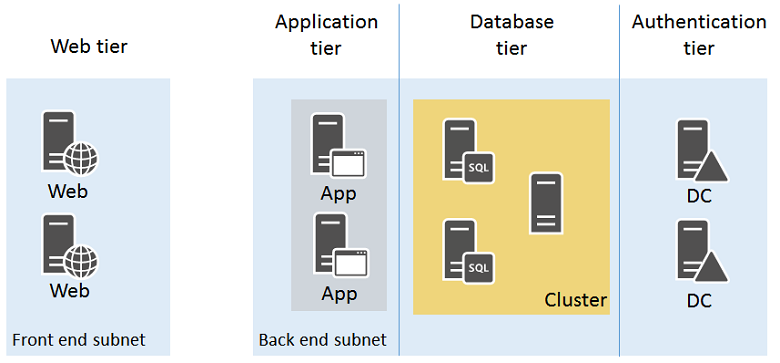

# Example Azure infrastructure walkthrough for Linux VMs
This article walks through building out an example application infrastructure. We detail designing an infrastructure for a simple on-line store that brings together all the guidelines and decisions around naming conventions, availability sets, virtual networks and load balancers, and actually deploying your virtual machines (VMs).

## Example workload
Adventure Works Cycles wants to build an on-line store application in Azure that consists of:

* Two nginx servers running the client front-end in a web tier
* Two nginx servers processing data and orders in an application tier
* Two MongoDB servers part of a sharded cluster for storing product data and orders in a database tier
* Two Active Directory domain controllers for customer accounts and suppliers in an authentication tier
* All the servers are located in two subnets:
  * a front-end subnet for the web servers 
  * a back-end subnet for the application servers, MongoDB cluster, and domain controllers

Incoming secure web traffic must be load-balanced among the web servers as customers browse the on-line store. Order processing traffic in the form of HTTP requests from the web servers must be load-balanced among the application servers. Additionally, the infrastructure must be designed for high availability.

The resulting design must incorporate:

* An Azure subscription and account
* A single resource group
* Azure Managed Disks
* A virtual network with two subnets
* Availability sets for the VMs with a similar role
* Virtual machines

All the above follow these naming conventions:

* Adventure Works Cycles uses **[IT workload]-[location]-[Azure resource]** as a prefix
  * For this example, "**azos**" (Azure On-line Store) is the IT workload name and "**use**" (East US 2) is the location
* Virtual networks use AZOS-USE-VN<strong>[number]</strong>
* Availability sets use azos-use-as-**[role]**
* Virtual machine names use azos-use-vm-**[vmname]**

## Azure subscriptions and accounts
Adventure Works Cycles is using their Enterprise subscription, named Adventure Works Enterprise Subscription, to provide billing for this IT workload.

## Storage
Adventure Works Cycles determined that they should use Azure Managed Disks. When creating VMs, both storage available storage tiers are used:

* **Standard storage** for the web servers, application servers, and domain controllers and their data disks.
* **Premium storage** for the MongoDB sharded cluster servers and their data disks.

## Virtual network and subnets
Because the virtual network does not need ongoing connectivity to the Adventure Work Cycles on-premises network, they decided on a cloud-only virtual network.

They created a cloud-only virtual network with the following settings using the Azure portal:

* Name: AZOS-USE-VN01
* Location: East US 2
* Virtual network address space: 10.0.0.0/8
* First subnet:
  * Name: FrontEnd
  * Address space: 10.0.1.0/24
* Second subnet:
  * Name: BackEnd
  * Address space: 10.0.2.0/24

## Availability sets
To maintain high availability of all four tiers of their on-line store, Adventure Works Cycles decided on four availability sets:

* **azos-use-as-web** for the web servers
* **azos-use-as-app** for the application servers
* **azos-use-as-db** for the servers in the MongoDB sharded cluster
* **azos-use-as-dc** for the domain controllers

## Virtual machines
Adventure Works Cycles decided on the following names for their Azure VMs:

* **azos-use-vm-web01** for the first web server
* **azos-use-vm-web02** for the second web server
* **azos-use-vm-app01** for the first application server
* **azos-use-vm-app02** for the second application server
* **azos-use-vm-db01** for the first MongoDB server in the cluster
* **azos-use-vm-db02** for the second MongoDB server in the cluster
* **azos-use-vm-dc01** for the first domain controller
* **azos-use-vm-dc02** for the second domain controller

Here is the resulting configuration.

This configuration incorporates:

* A cloud-only virtual network with two subnets (FrontEnd and BackEnd)
* Azure Managed Disks using both Standard and Premium disks
* Four availability sets, one for each tier of the on-line store
* The virtual machines for the four tiers
* An external load balanced set for HTTPS-based web traffic from the Internet to the web servers
* An internal load balanced set for unencrypted web traffic from the web servers to the application servers
* A single resource group
