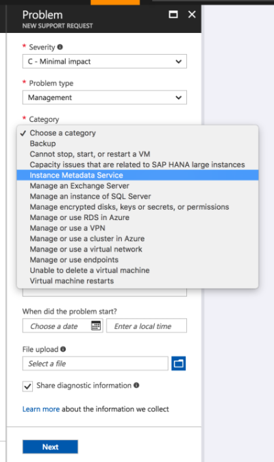

# Azure Instance Metadata service


The Azure Instance Metadata Service provides information about running virtual machine instances that can be used to manage and configure your virtual machines.
This includes information such as SKU, network configuration, and upcoming maintenance events. For more information on what type of information is available, see [metadata categories](#instance-metadata-data-categories).

Azure's Instance Metadata Service is a REST Endpoint accessible to IaaS VMs created via the [Azure Resource Manager](https://docs.microsoft.com/rest/api/resources/). 
The endpoint is available at a well-known non-routable IP address (`169.254.169.254`) that can be accessed only from within the VM.

> [!IMPORTANT]
> This service is  **generally available** in Azure Regions.  It regularly receives updates to expose new information about virtual machine instances. This page reflects the up-to-date [data categories](#instance-metadata-data-categories) available.

## Service availability
The service is available in generally available Azure regions. Not all API version may be available in all Azure Regions.

Regions                                        | Availability?                                 | Supported Versions
-----------------------------------------------|-----------------------------------------------|-----------------
[All Generally Available Global Azure Regions](https://azure.microsoft.com/regions/)     | Generally Available   | 2017-04-02, 2017-08-01, 2017-12-01, 2018-02-01, 2018-04-02
[Azure Government](https://azure.microsoft.com/overview/clouds/government/)              | Generally Available | 2017-04-02, 2017-08-01, 2017-12-01, 2018-02-01
[Azure China](https://www.azure.cn/)                                                           | Generally Available | 2017-04-02, 2017-08-01, 2017-12-01, 2018-02-01
[Azure Germany](https://azure.microsoft.com/overview/clouds/germany/)                    | Generally Available | 2017-04-02, 2017-08-01, 2017-12-01, 2018-02-01

This table is updated when there are service updates and or new supported versions are available

To try out the Instance Metadata Service, create a VM from [Azure Resource Manager](https://docs.microsoft.com/rest/api/resources/) or the [Azure portal](http://portal.azure.com) in the above regions and follow the examples below.

## Usage

### Versioning
The Instance Metadata Service is versioned. Versions are mandatory and the current version on Global Azure is `2018-04-02`. Current supported versions are (2017-04-02, 2017-08-01, 2017-12-01, 2018-02-01, 2018-04-02)

> [!NOTE] 
> Previous preview releases of scheduled events supported {latest} as the api-version. This format is no longer supported and will be deprecated in the future.

As newer versions are added, older versions can still be accessed for compatibility if your scripts have dependencies on specific data formats. However, the previous preview version (2017-03-01) may not be available once the service is generally available.

### Using headers
When you query the Instance Metadata Service, you must provide the header `Metadata: true` to ensure the request was not unintentionally redirected.

### Retrieving metadata

Instance metadata is available for running VMs created/managed using [Azure Resource Manager](https://docs.microsoft.com/rest/api/resources/). 
Access all data categories for a virtual machine instance using the following request:

```bash
curl -H Metadata:true "http://169.254.169.254/metadata/instance?api-version=2017-08-01"
```

> [!NOTE] 
> All instance metadata queries are case-sensitive.

### Data output
By default, the Instance Metadata Service returns data in JSON format (`Content-Type: application/json`). However, different APIs return data in different formats if requested.
The following table is a reference of other data formats APIs may support.

API | Default Data Format | Other Formats
--------|---------------------|--------------
/instance | json | text
/scheduledevents | json | none

To access a non-default response format, specify the requested format as a querystring parameter in the request. For example:

```bash
curl -H Metadata:true "http://169.254.169.254/metadata/instance?api-version=2017-08-01&format=text"
```

### Security
The Instance Metadata Service endpoint is accessible only from within the running virtual machine instance on a non-routable IP address. In addition, any request with a `X-Forwarded-For` header is rejected by the service.
Requests must also contain a `Metadata: true` header to ensure that the actual request was directly intended and not a part of unintentional redirection. 

### Error
If there is a data element not found or a malformed request, the Instance Metadata Service returns standard HTTP errors. For example:

HTTP Status Code | Reason
----------------|-------
200 OK |
400 Bad Request | Missing `Metadata: true` header
404 Not Found | The requested element doesn't exist 
405 Method Not Allowed | Only `GET` and `POST` requests are supported
429 Too Many Requests | The API currently supports a maximum of 5 queries per second
500 Service Error     | Retry after some time

### Examples

> [!NOTE] 
> All API responses are JSON strings. All following example responses  are pretty-printed for readability.

#### Retrieving network information

**Request**

```bash
curl -H Metadata:true "http://169.254.169.254/metadata/instance/network?api-version=2017-08-01"
```

**Response**

> [!NOTE] 
> The response is a JSON string. The following example response is pretty-printed for readability.

```json
{
  "interface": [
    {
      "ipv4": {
        "ipAddress": [
          {
            "privateIpAddress": "10.1.0.4",
            "publicIpAddress": "X.X.X.X"
          }
        ],
        "subnet": [
          {
            "address": "10.1.0.0",
            "prefix": "24"
          }
        ]
      },
      "ipv6": {
        "ipAddress": []
      },
      "macAddress": "000D3AF806EC"
    }
  ]
}

```

#### Retrieving public IP address

```bash
curl -H Metadata:true "http://169.254.169.254/metadata/instance/network/interface/0/ipv4/ipAddress/0/publicIpAddress?api-version=2017-08-01&format=text"
```

#### Retrieving all metadata for an instance

**Request**

```bash
curl -H Metadata:true "http://169.254.169.254/metadata/instance?api-version=2017-12-01"
```

**Response**

> [!NOTE] 
> The response is a JSON string. The following example response is pretty-printed for readability.

```json
{
  "compute": {
    "location": "westus",
    "name": "avset2",
    "offer": "UbuntuServer",
    "osType": "Linux",
    "placementGroupId": "",
    "platformFaultDomain": "1",
    "platformUpdateDomain": "1",
    "publisher": "Canonical",
    "resourceGroupName": "myrg",
    "sku": "16.04-LTS",
    "subscriptionId": "xxxxx-xxxx-xxxx-xxxx-xxxxxxxxxxx",
    "tags": "",
    "version": "16.04.201708030",
    "vmId": "13f56399-bd52-4150-9748-7190aae1ff21",
    "vmScaleSetName": "",
    "vmSize": "Standard_D1",
    "zone": "1"
  },
  "network": {
    "interface": [
      {
        "ipv4": {
          "ipAddress": [
            {
              "privateIpAddress": "10.1.2.5",
              "publicIpAddress": "X.X.X.X"
            }
          ],
          "subnet": [
            {
              "address": "10.1.2.0",
              "prefix": "24"
            }
          ]
        },
        "ipv6": {
          "ipAddress": []
        },
        "macAddress": "000D3A36DDED"
      }
    ]
  }
}
```

#### Retrieving metadata in Windows Virtual Machine

**Request**

Instance metadata can be retrieved in Windows via the PowerShell utility `curl`: 

```bash
curl -H @{'Metadata'='true'} http://169.254.169.254/metadata/instance?api-version=2017-08-01 | select -ExpandProperty Content
```

Or through the `Invoke-RestMethod` cmdlet:
    
```powershell
Invoke-RestMethod -Headers @{"Metadata"="true"} -URI http://169.254.169.254/metadata/instance?api-version=2017-08-01 -Method get 
```

**Response**

> [!NOTE] 
> The response is a JSON string. The following example response  is pretty-printed for readability.

```json
{
  "compute": {
    "location": "westus",
    "name": "SQLTest",
    "offer": "SQL2016SP1-WS2016",
    "osType": "Windows",
    "platformFaultDomain": "0",
    "platformUpdateDomain": "0",
    "publisher": "MicrosoftSQLServer",
    "sku": "Enterprise",
    "version": "13.0.400110",
    "vmId": "453945c8-3923-4366-b2d3-ea4c80e9b70e",
    "vmSize": "Standard_DS2"
  },
  "network": {
    "interface": [
      {
        "ipv4": {
          "ipAddress": [
            {
              "privateIpAddress": "10.0.1.4",
              "publicIpAddress": "X.X.X.X"
            }
          ],
          "subnet": [
            {
              "address": "10.0.1.0",
              "prefix": "24"
            }
          ]
        },
        "ipv6": {
          "ipAddress": [
            
          ]
        },
        "macAddress": "002248020E1E"
      }
    ]
  }
}
```

## Instance metadata data categories
The following data categories are available through the Instance Metadata Service:

Data | Description | Version Introduced 
-----|-------------|-----------------------
location | Azure Region the VM is running in | 2017-04-02 
name | Name of the VM | 2017-04-02
offer | Offer information for the VM image. This value is only present for images deployed from Azure image gallery. | 2017-04-02
publisher | Publisher of the VM image | 2017-04-02
sku | Specific SKU for the VM image | 2017-04-02
version | Version of the VM image | 2017-04-02
osType | Linux or Windows | 2017-04-02
platformUpdateDomain |  [Update domain](manage-availability.md) the VM is running in | 2017-04-02
platformFaultDomain | [Fault domain](manage-availability.md) the VM is running in | 2017-04-02
vmId | [Unique identifier](https://azure.microsoft.com/blog/accessing-and-using-azure-vm-unique-id/) for the VM | 2017-04-02
vmSize | [VM size](sizes.md) | 2017-04-02
subscriptionId | Azure subscription for the Virtual Machine | 2017-08-01
tags | [Tags](../../azure-resource-manager/resource-group-using-tags.md) for your Virtual Machine  | 2017-08-01
resourceGroupName | [Resource group](../../azure-resource-manager/resource-group-overview.md) for your Virtual Machine | 2017-08-01
placementGroupId | [Placement Group](../../virtual-machine-scale-sets/virtual-machine-scale-sets-placement-groups.md) of your virtual machine scale set | 2017-08-01
plan | [Plan] (https://docs.microsoft.com/en-us/rest/api/compute/virtualmachines/createorupdate#plan) for a VM in its a Azure Marketplace Image, contains name, product and publisher | 2017-04-02
publicKeys | Collection of Public Keys[https://docs.microsoft.com/en-us/rest/api/compute/virtualmachines/createorupdate#sshpublickey] assigned to the VM and paths | 2017-04-02
vmScaleSetName | [Virtual Machine ScaleSet Name] (../../virtual-machine-scale-sets/virtual-machine-scale-sets-overview.md) of your virtual machine scale set | 2017-12-01
zone | [Availability Zone](../../availability-zones/az-overview.md) of your virtual machine | 2017-12-01 
ipv4/privateIpAddress | Local IPv4 address of the VM | 2017-04-02
ipv4/publicIpAddress | Public IPv4 address of the VM | 2017-04-02
subnet/address | Subnet address of the VM | 2017-04-02 
subnet/prefix | Subnet prefix, example 24 | 2017-04-02 
ipv6/ipAddress | Local IPv6 address of the VM | 2017-04-02 
macAddress | VM mac address | 2017-04-02 
scheduledevents | See [Scheduled Events](scheduled-events.md) | 2017-08-01
identity | (Preview) Managed identities for Azure resources. See [acquire an access token](../../active-directory/managed-identities-azure-resources/how-to-use-vm-token.md) | 2018-02-01 

## Example scenarios for usage  

### Tracking VM running on Azure

As a service provider, you may require to track the number of VMs running your software or have agents that need to track uniqueness of the VM. To be able to get a unique ID for a VM, use the `vmId` field from Instance Metadata Service.

**Request**

```bash
curl -H Metadata:true "http://169.254.169.254/metadata/instance/compute/vmId?api-version=2017-08-01&format=text"
```

**Response**

```
5c08b38e-4d57-4c23-ac45-aca61037f084
```

### Placement of containers, data-partitions based fault/update domain 

For certain scenarios, placement of different data replicas is of prime importance. For example, [HDFS replica placement](https://hadoop.apache.org/docs/stable/hadoop-project-dist/hadoop-hdfs/HdfsDesign.html#Replica_Placement:_The_First_Baby_Steps)
or container placement via an [orchestrator](https://kubernetes.io/docs/user-guide/node-selection/) may you require to know the `platformFaultDomain` and `platformUpdateDomain` the VM is running on.
You can also leverage [Availability Zones](../../availability-zones/az-overview.md) for the instances to make these decisions. 
You can query this data directly via the Instance Metadata Service.

**Request**

```bash
curl -H Metadata:true "http://169.254.169.254/metadata/instance/compute/platformFaultDomain?api-version=2017-08-01&format=text" 
```

**Response**

```
0
```

### Getting more information about the VM during support case 

As a service provider, you may get a support call where you would like to know more information about the VM. Asking the customer to share the compute metadata can provide basic information for the support professional to know about the kind of VM on Azure. 

**Request**

```bash
curl -H Metadata:true "http://169.254.169.254/metadata/instance/compute?api-version=2017-08-01"
```

**Response**

> [!NOTE] 
> The response is a JSON string. The following example response is pretty-printed for readability.

```json
{
  "compute": {
    "location": "CentralUS",
    "name": "IMDSCanary",
    "offer": "RHEL",
    "osType": "Linux",
    "platformFaultDomain": "0",
    "platformUpdateDomain": "0",
    "publisher": "RedHat",
    "sku": "7.2",
    "version": "7.2.20161026",
    "vmId": "5c08b38e-4d57-4c23-ac45-aca61037f084",
    "vmSize": "Standard_DS2"
  }
}
```

### Getting Azure Environment where the VM is running 

Azure has various sovereign clouds like [Azure Government](https://azure.microsoft.com/overview/clouds/government/). Sometimes you need the Azure Environment to make some runtime decisions. The following sample will show you how you can achieve this.

**Request**

> [!NOTE] 
> Requires jq to be installed. 

```bash
  metadata=$(curl "http://169.254.169.254/metadata/instance/compute?api-version=2018-02-01" -H "Metadata:true")
  endpoints=$(curl "https://management.azure.com/metadata/endpoints?api-version=2017-12-01")
 
  location=$(echo $metadata | jq .location -r)
 
  is_ww=$(echo $endpoints | jq '.cloudEndpoint.public.locations[]' -r | grep -w $location)
  is_us=$(echo $endpoints | jq '.cloudEndpoint.usGovCloud.locations[]' -r | grep -w $location)
  is_cn=$(echo $endpoints | jq '.cloudEndpoint.chinaCloud.locations[]' -r | grep -w $location)
  is_de=$(echo $endpoints | jq '.cloudEndpoint.germanCloud.locations[]' -r | grep -w $location)
 
  environment="Unknown"
  if [ ! -z $is_ww ]; then environment="AzureCloud"; fi
  if [ ! -z $is_us ]; then environment="AzureUSGovernment"; fi
  if [ ! -z $is_cn ]; then environment="AzureChinaCloud"; fi
  if [ ! -z $is_de ]; then environment="AzureGermanCloud"; fi
 
  echo $environment
```


### Examples of calling metadata service using different languages inside the VM 

Language | Example 
---------|----------------
Ruby     | https://github.com/Microsoft/azureimds/blob/master/IMDSSample.rb
Go  | https://github.com/Microsoft/azureimds/blob/master/imdssample.go            
Python   | https://github.com/Microsoft/azureimds/blob/master/IMDSSample.py
C++      | https://github.com/Microsoft/azureimds/blob/master/IMDSSample-windows.cpp
C#       | https://github.com/Microsoft/azureimds/blob/master/IMDSSample.cs
JavaScript | https://github.com/Microsoft/azureimds/blob/master/IMDSSample.js
PowerShell | https://github.com/Microsoft/azureimds/blob/master/IMDSSample.ps1
Bash       | https://github.com/Microsoft/azureimds/blob/master/IMDSSample.sh
Perl       | https://github.com/Microsoft/azureimds/blob/master/IMDSSample.pl
Java       | https://github.com/Microsoft/azureimds/blob/master/imdssample.java
Visual Basic | https://github.com/Microsoft/azureimds/blob/master/IMDSSample.vb
Puppet | https://github.com/keirans/azuremetadata
    

## FAQ
1. I am getting the error `400 Bad Request, Required metadata header not specified`. What does this mean?
   * The Instance Metadata Service requires the header `Metadata: true` to be passed in the request. Passing this header in the REST call allows access to the Instance Metadata Service. 
2. Why am I not getting compute information for my VM?
   * Currently the Instance Metadata Service only supports instances created with Azure Resource Manager. In the future, support for  Cloud Service VMs might be added.
3. I created my Virtual Machine through Azure Resource Manager a while back. Why am I not see compute metadata information?
   * For any VMs created after Sep 2016, add a [Tag](../../azure-resource-manager/resource-group-using-tags.md) to start seeing compute metadata. For older VMs (created before Sep 2016), add/remove extensions or data disks to the VM to refresh metadata.
4. I am not seeing all data populated for new version
   * For any VMs created after Sep 2016, add a [Tag](../../azure-resource-manager/resource-group-using-tags.md) to start seeing compute metadata. For older VMs (created before Sep 2016), add/remove extensions or data disks to the VM to refresh metadata.
5. Why am I getting the error `500 Internal Server Error`?
   * Retry your request based on exponential back off system. If the issue persists contact  Azure support.
6. Where do I share additional questions/comments?
   * Send your comments on http://feedback.azure.com.
7. Would this work for Virtual Machine Scale Set Instance?
   * Yes Metadata service is available for Scale Set Instances. 
8. How do I get support for the service?
   * To get support for the service, create a support issue in Azure portal for the VM where you are not able to get metadata response after long retries 
9. I get request timed out for my call to the service?
   * Metadata calls must be made from the primary IP address assigned to the network card of the VM , in addition in case you have changed your routes there must be a route for 169.254.0.0/16 address out of your network card.
10. I updated my tags in Virutal Machine Scale set but they dont appear in the instances unlike VMs?
   * Currently for ScaleSets tags only show to the VM on a reboot/reimage/or a disk change to the instance. 

   
    
## Next steps

- Learn more about [Scheduled Events](scheduled-events.md)

