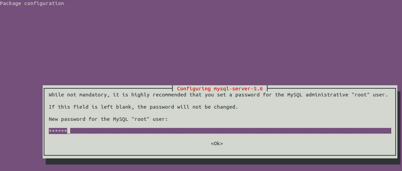

# How to install MySQL on Azure
In this article, you will learn how to install and configure MySQL on an Azure virtual machine running Linux.


> [!NOTE]
> You must already have a Microsoft Azure virtual machine running Linux in order to complete this tutorial. Please see the
> [Azure Linux VM tutorial](quick-create-cli.md?toc=%2fazure%2fvirtual-machines%2flinux%2ftoc.json) to create and set up a Linux VM with `mysqlnode` as the VM name and `azureuser` as user before proceeding.
> 
> 

In this case, use 3306 port as the MySQL port.  

We will use repository package to install MySQL5.6 as an example in this article. Actually, MySQL5.6 has more improvement in performance than MySQL5.5.  More information [here](http://www.mysqlperformanceblog.com/2013/02/18/is-mysql-5-6-slower-than-mysql-5-5/).

## Install MySQL5.6 on Ubuntu
We will use a Linux VM running Ubuntu.


### Install MySQL

Install MySQL Server 5.6 by switching to the `root` user:

```bash  
sudo su -
```

Install mysql-server 5.6:

```bash  
apt-get update
apt-get -y install mysql-server-5.6
```

  
During installation, you will see a dialog window appear to ask you to set MySQL root password below, and you need set the password here.
  


Input the password again to confirm.


### Sign in
  
When MySQL server installation finished, MySQL service will be started automatically. You can sign in to MySQL Server with the `root` user, and enter your password.

```bash  
mysql -uroot -p
```


### Manage the MySQL service

Get status of MySQL service

```bash   
service mysql status
```
  
Start MySQL Service

```bash  
service mysql start
```
  
Stop MySQL service

```bash  
service mysql stop
```
  
Restart the MySQL service

```bash  
service mysql restart
```

## Install MySQL on Red Hat OS, CentOS, Oracle Linux
We will use Linux VM with CentOS or Oracle Linux here.

### Add the MySQL yum repository
    
Switch to `root` user:

```bash  
sudo su -
```

Download and install the MySQL release package:

```bash  
wget https://repo.mysql.com/mysql-community-release-el6-5.noarch.rpm
yum localinstall -y mysql-community-release-el6-5.noarch.rpm
```

### Enable the MySQL repository
Edit below file to enable the MySQL repository for downloading the MySQL5.6 package.

```bash  
vim /etc/yum.repos.d/mysql-community.repo
```

  
Update each value of this file to below:

```  
\# *Enable to use MySQL 5.6*
  
[mysql56-community]
name=MySQL 5.6 Community Server
  
baseurl=http://repo.mysql.com/yum/mysql-5.6-community/el/6/$basearch/
  
enabled=1
  
gpgcheck=1
  
gpgkey=file:/etc/pki/rpm-gpg/RPM-GPG-KEY-mysql
```

### Install MySQL 

Install MySQL from the repository.

```bash  
yum install mysql-community-server
```
  
The MySQL RPM package and all related packages will be installed.


## Manage the MySQL service
  
Check the service status of the MySQL server:

```bash  
service mysqld status\
```
  
Check whether the default port of  MySQL server is running:

```bash  
netstat  –tunlp|grep 3306
```

Start the MySQL server:

```bash
service mysqld start
```

Stop the MySQL server:

```bash
service mysqld stop
```

Set MySQL to start when the system boot-up:

```bash
chkconfig mysqld on
```

## Install MySQL on SUSE Linux

We will use Linux VM with OpenSUSE here.

### Download and install MySQL Server
  
Switch to `root` user through below command:  

```bash  
sudo su -
```
  
Download and install MySQL package:

```bash  
zypper update
zypper install mysql-server mysql-devel mysql
```

### Manage the MySQL service
  
Check the status of the MySQL server:

```bash  
rcmysql status
```
  
Check whether the default port of the MySQL server:

```bash  
netstat  –tunlp|grep 3306
```

Start the MySQL server:

```bash
rcmysql start
```

Stop the MySQL server:

```bash
rcmysql stop
```

Set MySQL to start when the system boot-up:

```bash
insserv mysql
```

## Next step
For more information, see the [MySQL](https://www.mysql.com/) website.

