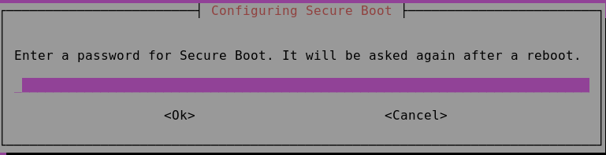

# Install NVIDIA GPU drivers on N-series VMs running Linux

**Applies to:** :heavy_check_mark: Linux VMs 

To take advantage of the GPU capabilities of Azure N-series VMs backed by NVIDIA GPUs, you must install NVIDIA GPU drivers. The [NVIDIA GPU Driver Extension](../extensions/hpccompute-gpu-linux.md) installs appropriate NVIDIA CUDA or GRID drivers on an N-series VM. Install or manage the extension using the Azure portal or tools such as the Azure CLI or Azure Resource Manager templates. See the [NVIDIA GPU Driver Extension documentation](../extensions/hpccompute-gpu-linux.md) for supported distributions and deployment steps.

If you choose to install NVIDIA GPU drivers manually, this article provides supported distributions, drivers, and installation and verification steps. Manual driver setup information is also available for [Windows VMs](../windows/n-series-driver-setup.md).

For N-series VM specs, storage capacities, and disk details, see [GPU Linux VM sizes](../sizes-gpu.md?toc=/azure/virtual-machines/linux/toc.json). 

[!INCLUDE [virtual-machines-n-series-linux-support](../../../includes/virtual-machines-n-series-linux-support.md)]

## Install CUDA drivers on N-series VMs

Here are steps to install CUDA drivers from the NVIDIA CUDA Toolkit on N-series VMs. 

C and C++ developers can optionally install the full Toolkit to build GPU-accelerated applications. For more information, see the [CUDA Installation Guide](https://docs.nvidia.com/cuda/cuda-installation-guide-linux/index.html).

To install CUDA drivers, make an SSH connection to each VM. To verify that the system has a CUDA-capable GPU, run the following command:

```bash
lspci | grep -i NVIDIA
```
Output is similar to the following example (showing an NVIDIA Tesla K80 card):


lspci lists the PCIe devices on the VM, including the InfiniBand NIC and GPUs, if any. If lspci doesn't return successfully, you may need to install LIS on CentOS/RHEL.

Then run installation commands specific for your distribution.

### Ubuntu 

1. Download and install the CUDA drivers from the NVIDIA website. 
    > [!NOTE]
   >  The example shows the CUDA package path for Ubuntu 20.04. Replace the path specific to the version you plan to use. 
   >  
   >  Visit the [NVIDIA Download Center](https://developer.download.nvidia.com/compute/cuda/repos/) or the [NVIDIA CUDA Resources page](https://developer.nvidia.com/cuda-downloads?target_os=Linux&target_arch=x86_64&Distribution=Ubuntu&target_version=20.04&target_type=deb_network) for the full path specific to each version.
   > 
   ```bash
   wget https://developer.download.nvidia.com/compute/cuda/repos/ubuntu2004/x86_64/cuda-keyring_1.0-1_all.deb 
   sudo dpkg -i cuda-keyring_1.0-1_all.deb
   sudo apt-get update
   sudo apt-get -y install cuda-drivers

   ```

   The installation can take several minutes.

2. Reboot the VM and proceed to verify the installation.

#### CUDA driver updates

We recommend that you periodically update CUDA drivers after deployment.

```bash
sudo apt-get update
sudo apt-get upgrade -y
sudo apt-get dist-upgrade -y
sudo apt-get install cuda-drivers

sudo reboot
```

#### Install CUDA driver on Ubuntu with Secure Boot enabled

With Secure Boot enabled, all Linux kernel modules are required to be signed by the key trusted by the system.

1. Install pre-built Azure Linux kernel based NVIDIA modules and drivers

   ```bash
   sudo apt-get update
   sudo apt install -y linux-modules-nvidia-525-azure nvidia-driver-525
   ```

2. Change preference of NVIDIA packages to prefer NVIDIA repository

   ```bash
   sudo tee /etc/apt/preferences.d/cuda-repository-pin-600 > /dev/null <<EOL
   Package: nsight-compute
   Pin: origin *ubuntu.com*
   Pin-Priority: -1
   Package: nsight-systems
   Pin: origin *ubuntu.com*
   Pin-Priority: -1
   Package: nvidia-modprobe
   Pin: release l=NVIDIA CUDA
   Pin-Priority: 600
   Package: nvidia-settings
   Pin: release l=NVIDIA CUDA
   Pin-Priority: 600
   Package: *
   Pin: release l=NVIDIA CUDA
   Pin-Priority: 100
   EOL
   ```

3. Add CUDA repository

   ```bash
   sudo apt-key adv --fetch-keys https://developer.download.nvidia.com/compute/cuda/repos/$distro/$arch/3bf863cc.pub
   ```

   ```bash
   sudo add-apt-repository "deb https://developer.download.nvidia.com/compute/cuda/repos/$distro/$arch/ /"
   ```
   
   where `$distro/$arch` should be replaced by one of the following:

   ```
   ubuntu2004/arm64
   ubuntu2004/x86_64
   ubuntu2204/arm64
   ubuntu2204/x86_64
   ```
   
   If `add-apt-repository` command is not found, run `sudo apt-get install software-properties-common` to install it.

4. Install kernel headers and development packages, and remove outdated signing key

   ```bash
   sudo apt-get install linux-headers-$(uname -r)
   sudo apt-key del 7fa2af80
   ```

5. Install the new cuda-keyring package

   ```bash
   wget https://developer.download.nvidia.com/compute/cuda/repos/$distro/$arch/cuda-keyring_1.1-1_all.deb
   sudo dpkg -i cuda-keyring_1.1-1_all.deb
   ```

   Note: When prompt on different versions of cuda-keyring, select `Y or I  : install the package maintainer's version` to proceed.
   
6. Update APT repository cache and install NVIDIA GPUDirect Storage

   ```bash
   sudo apt-get update
   sudo apt-get install -y nvidia-gds
   ```

   Note that during the installation you will be prompted for password when configuring secure boot, a password of your choice needs to be provided and then proceed.

   

7. Reboot the VM

   ```bash
   sudo reboot
   ```

8. Verify NVIDIA drivers are installed and loaded
    
   ```bash
   dpkg -l | grep -i nvidia
   nvidia-smi
   ```


### CentOS or Red Hat Enterprise Linux

1. Update the kernel (recommended). If you choose not to update the kernel, ensure that the versions of `kernel-devel`, and `dkms` are appropriate for your kernel.

   ```
   sudo yum install kernel kernel-tools kernel-headers kernel-devel
   sudo reboot
   ```

2. Install the latest [Linux Integration Services for Hyper-V and Azure](https://www.microsoft.com/download/details.aspx?id=55106). Check if LIS is required by verifying the results of lspci. If all GPU devices are listed as expected, installing LIS isn't required.

   LIS is applicable to Red Hat Enterprise Linux, CentOS, and the Oracle Linux Red Hat Compatible Kernel 5.2-5.11, 6.0-6.10, and 7.0-7.7. Refer to the [Linux Integration Services documentation](https://www.microsoft.com/en-us/download/details.aspx?id=55106) for more details. 
   Skip this step if you plan to use CentOS/RHEL 7.8 (or higher versions) as LIS is no longer required for these versions.

   ```bash
   wget https://aka.ms/lis
   tar xvzf lis
   cd LISISO

   sudo ./install.sh
   sudo reboot
   ```

3. Reconnect to the VM and continue installation with the following commands:
   
   ```bash
   sudo rpm -Uvh https://dl.fedoraproject.org/pub/epel/epel-release-latest-7.noarch.rpm
   sudo yum-config-manager --add-repo https://developer.download.nvidia.com/compute/cuda/repos/rhel7/x86_64/cuda-rhel7.repo
   sudo yum clean all
   sudo yum -y install nvidia-driver-latest-dkms cuda-drivers
   ```

   The installation can take several minutes. 
   
   > [!NOTE]
   >  Visit [Fedora](https://dl.fedoraproject.org/pub/epel/) and [Nvidia CUDA repo](https://developer.download.nvidia.com/compute/cuda/repos/) to pick the correct package for the CentOS or RHEL version you want to use.
   >  

For example, CentOS 8 and RHEL 8 need the following steps.

   ```bash
   sudo rpm -Uvh https://dl.fedoraproject.org/pub/epel/epel-release-latest-8.noarch.rpm
   sudo yum install dkms
   
   sudo wget https://developer.download.nvidia.com/compute/cuda/repos/rhel8/x86_64/cuda-rhel8.repo -O /etc/yum.repos.d/cuda-rhel8.repo

   sudo yum install cuda-drivers
   ```

4. To optionally install the complete CUDA toolkit, type:

   ```bash
   sudo yum install cuda
   ```
   > [!NOTE]
   >  If you see an error message related to missing packages like vulkan-filesystem then you may need to edit /etc/yum.repos.d/rh-cloud , look for optional-rpms and set enabled     to 1
   >  

5. Reboot the VM and proceed to verify the installation.

### Verify driver installation

To query the GPU device state, SSH to the VM and run the [nvidia-smi](https://developer.nvidia.com/nvidia-system-management-interface) command-line utility installed with the driver. 

If the driver is installed, Nvidia SMI lists the **GPU-Util** as 0% until you run a GPU workload on the VM. Your driver version and GPU details may be different from the ones shown.


## RDMA network connectivity

RDMA network connectivity can be enabled on RDMA-capable N-series VMs such as NC24r deployed in the same availability set or in a single placement group in a virtual machine (VM) scale set. The RDMA network supports Message Passing Interface (MPI) traffic for applications running with Intel MPI 5.x or a later version:

### Distributions

Deploy RDMA-capable N-series VMs from one of the images in the Azure Marketplace that supports RDMA connectivity on N-series VMs:
  
* **Ubuntu 16.04 LTS** - Configure RDMA drivers on the VM and register with Intel to download Intel MPI:

  [!INCLUDE [virtual-machines-common-ubuntu-rdma](../../../includes/virtual-machines-common-ubuntu-rdma.md)]

* **CentOS-based 7.4 HPC** - RDMA drivers and Intel MPI 5.1 are installed on the VM.

* **CentOS-based HPC** - CentOS-HPC 7.6 and later (for SKUs where InfiniBand is supported over SR-IOV). These images have Mellanox OFED and MPI libraries pre-installed.

> [!NOTE]
> CX3-Pro cards are supported only through LTS versions of Mellanox OFED. Use LTS Mellanox OFED version (4.9-0.1.7.0) on the N-series VMs with ConnectX3-Pro cards. For more information, see [Linux Drivers](https://www.mellanox.com/products/infiniband-drivers/linux/mlnx_ofed).
>
> Also, some of the latest Azure Marketplace HPC images have Mellanox OFED 5.1 and later, which don't support ConnectX3-Pro cards. Check the Mellanox OFED version in the HPC image before using it on VMs with ConnectX3-Pro cards.
>
> The following images are the latest CentOS-HPC images that support ConnectX3-Pro cards:
>
> - OpenLogic:CentOS-HPC:7.6:7.6.2020062900
> - OpenLogic:CentOS-HPC:7_6gen2:7.6.2020062901
> - OpenLogic:CentOS-HPC:7.7:7.7.2020062600
> - OpenLogic:CentOS-HPC:7_7-gen2:7.7.2020062601
> - OpenLogic:CentOS-HPC:8_1:8.1.2020062400
> - OpenLogic:CentOS-HPC:8_1-gen2:8.1.2020062401
>

## Install GRID drivers on NV or NVv3-series VMs

To install NVIDIA GRID drivers on NV or NVv3-series VMs, make an SSH connection to each VM and follow the steps for your Linux distribution. 

### Ubuntu 

1. Run the `lspci` command. Verify that the NVIDIA M60 card or cards are visible as PCI devices.

2. Install updates.

   ```bash
   sudo apt-get update
   sudo apt-get upgrade -y
   sudo apt-get dist-upgrade -y
   sudo apt-get install build-essential ubuntu-desktop -y
   sudo apt-get install linux-azure -y
   ```
3. Disable the Nouveau kernel driver, which is incompatible with the NVIDIA driver. (Only use the NVIDIA driver on NV or NVv2 VMs.) To disable the driver, create a file in `/etc/modprobe.d` named `nouveau.conf` with the following contents:

   ```
   blacklist nouveau
   blacklist lbm-nouveau
   ```

4. Reboot the VM and reconnect. Exit X server:

   ```bash
   sudo systemctl stop lightdm.service
   ```

5. Download and install the GRID driver:

   ```bash
   wget -O NVIDIA-Linux-x86_64-grid.run https://go.microsoft.com/fwlink/?linkid=874272  
   chmod +x NVIDIA-Linux-x86_64-grid.run
   sudo ./NVIDIA-Linux-x86_64-grid.run
   ``` 

6. When you're asked whether you want to run the nvidia-xconfig utility to update your X configuration file, select **Yes**.

7. After installation completes, copy /etc/nvidia/gridd.conf.template to a new file gridd.conf at location /etc/nvidia/

   ```bash
   sudo cp /etc/nvidia/gridd.conf.template /etc/nvidia/gridd.conf
   ```

8. Add the following to `/etc/nvidia/gridd.conf`:
 
   ```
   IgnoreSP=FALSE
   EnableUI=FALSE
   ```
   
9. Remove the following from `/etc/nvidia/gridd.conf` if it is present:
 
   ```
   FeatureType=0
   ```
   
10. Reboot the VM and proceed to verify the installation.

#### Install GRID driver on Ubuntu with Secure Boot enabled

The GRID driver installation process does not offer any options to skip kernel module build and installation and select a different source of signed kernel modules, so secure boot has to be disabled in Linux VMs in order to use them with GRID, after installing signed kernel modules.


### CentOS or Red Hat Enterprise Linux 

1. Update the kernel and DKMS (recommended). If you choose not to update the kernel, ensure that the versions of `kernel-devel` and `dkms` are appropriate for your kernel.
 
   ```bash  
   sudo yum update
   sudo yum install kernel-devel
   sudo rpm -Uvh https://dl.fedoraproject.org/pub/epel/epel-release-latest-7.noarch.rpm
   sudo yum install dkms
   sudo yum install hyperv-daemons
   ```

2. Disable the Nouveau kernel driver, which is incompatible with the NVIDIA driver. (Only use the NVIDIA driver on NV or NV3 VMs.) To do this, create a file in `/etc/modprobe.d` named `nouveau.conf` with the following contents:

   ```
   blacklist nouveau
   blacklist lbm-nouveau
   ```

3. Reboot the VM, reconnect, and install the latest [Linux Integration Services for Hyper-V and Azure](https://www.microsoft.com/download/details.aspx?id=55106). Check if LIS is required by verifying the results of lspci. If all GPU devices are listed as expected, installing LIS isn't required. 

   Skip this step if you plan to use CentOS/RHEL 7.8 (or higher versions) as LIS is no longer required for these versions.

   ```bash
   wget https://aka.ms/lis
   tar xvzf lis
   cd LISISO

   sudo ./install.sh
   sudo reboot

   ```
 
4. Reconnect to the VM and run the `lspci` command. Verify that the NVIDIA M60 card or cards are visible as PCI devices.
 
5. Download and install the GRID driver:

   ```bash
   wget -O NVIDIA-Linux-x86_64-grid.run https://go.microsoft.com/fwlink/?linkid=874272  
   chmod +x NVIDIA-Linux-x86_64-grid.run

   sudo ./NVIDIA-Linux-x86_64-grid.run
   ```
   
6. When you're asked whether you want to run the nvidia-xconfig utility to update your X configuration file, select **Yes**.

7. After installation completes, copy /etc/nvidia/gridd.conf.template to a new file gridd.conf at location /etc/nvidia/
  
   ```bash
   sudo cp /etc/nvidia/gridd.conf.template /etc/nvidia/gridd.conf
   ```
  
8. Add two lines to `/etc/nvidia/gridd.conf`:
 
   ```
   IgnoreSP=FALSE
   EnableUI=FALSE 
   ```
   
9. Remove one line from `/etc/nvidia/gridd.conf` if it is present:
 
   ```
   FeatureType=0
   ```
   
10. Reboot the VM and proceed to verify the installation.


### Verify driver installation


To query the GPU device state, SSH to the VM and run the [nvidia-smi](https://developer.nvidia.com/nvidia-system-management-interface) command-line utility installed with the driver. 

If the driver is installed, Nvidia SMI will list the **GPU-Util** as 0% until you run a GPU workload on the VM. Your driver version and GPU details may be different from the ones shown.


 

### X11 server
If you need an X11 server for remote connections to an NV or NVv2 VM, [x11vnc](https://wiki.archlinux.org/title/X11vnc) is recommended because it allows hardware acceleration of graphics. The BusID of the M60 device must be manually added to the X11 configuration file (usually, `etc/X11/xorg.conf`). Add a `"Device"` section similar to the following:
 
```
Section "Device"
    Identifier     "Device0"
    Driver         "nvidia"
    VendorName     "NVIDIA Corporation"
    BoardName      "Tesla M60"
    BusID          "PCI:0@your-BusID:0:0"
EndSection
```
 
Additionally, update your `"Screen"` section to use this device.
 
The decimal BusID can be found by running

```bash
nvidia-xconfig --query-gpu-info | awk '/PCI BusID/{print $4}'
```
 
The BusID can change when a VM gets reallocated or rebooted. Therefore, you may want to create a script to update the BusID in the X11 configuration when a VM is rebooted. For example, create a script named `busidupdate.sh` (or another name you choose) with contents similar to the following:

```bash 
#!/bin/bash
XCONFIG="/etc/X11/xorg.conf"
OLDBUSID=`awk '/BusID/{gsub(/"/, "", $2); print $2}' ${XCONFIG}`
NEWBUSID=`nvidia-xconfig --query-gpu-info | awk '/PCI BusID/{print $4}'`

if [[ "${OLDBUSID}" == "${NEWBUSID}" ]] ; then
        echo "NVIDIA BUSID not changed - nothing to do"
else
        echo "NVIDIA BUSID changed from \"${OLDBUSID}\" to \"${NEWBUSID}\": Updating ${XCONFIG}" 
        sed -e 's|BusID.*|BusID          '\"${NEWBUSID}\"'|' -i ${XCONFIG}
fi
```

Then, create an entry for your update script in `/etc/rc.d/rc3.d` so the script is invoked as root on boot.

## Troubleshooting

* You can set persistence mode using `nvidia-smi` so the output of the command is faster when you need to query cards. To set persistence mode, execute `nvidia-smi -pm 1`. Note that if the VM is restarted, the mode setting goes away. You can always script the mode setting to execute upon startup.
* If you updated the NVIDIA CUDA drivers to the latest version and find RDMA connectivity is no longer working, [reinstall the RDMA drivers](#rdma-network-connectivity) to reestablish that connectivity. 
* During installation of LIS, if a certain CentOS/RHEL OS version (or kernel) is not supported for LIS, an error “Unsupported kernel version” is thrown. Please report this error along with the OS and kernel versions.
* If jobs are interrupted by ECC errors on the GPU (either correctable or uncorrectable), first check to see if the GPU meets any of Nvidia's [RMA criteria for ECC errors](https://docs.nvidia.com/deploy/dynamic-page-retirement/index.html#faq-pre). If the GPU is eligible for RMA, please contact support about getting it serviced; otherwise, reboot your VM to reattach the GPU as described [here](https://docs.nvidia.com/deploy/dynamic-page-retirement/index.html#bl_reset_reboot). Less invasive methods such as `nvidia-smi -r` don't work with the virtualization solution deployed in Azure. 

## Next steps

* To capture a Linux VM image with your installed NVIDIA drivers, see [How to generalize and capture a Linux virtual machine](capture-image.md).
