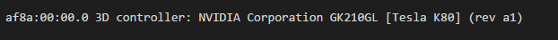
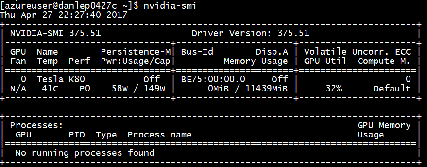
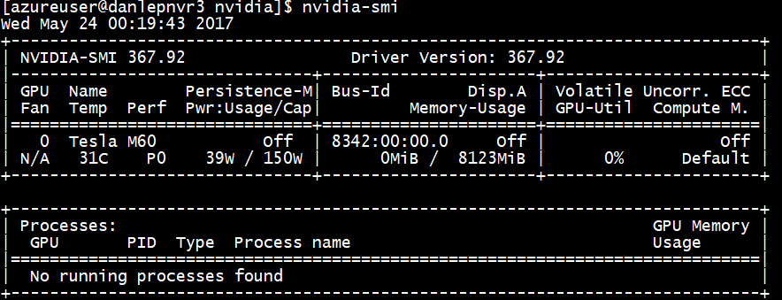

# Install NVIDIA GPU drivers on N-series VMs running Linux

To take advantage of the GPU capabilities of Azure N-series VMs backed by NVIDIA GPUs, you must install NVIDIA GPU drivers. The [NVIDIA GPU Driver Extension](../extensions/hpccompute-gpu-linux.md) installs appropriate NVIDIA CUDA or GRID drivers on an N-series VM. Install or manage the extension using the Azure portal or tools such as the Azure CLI or Azure Resource Manager templates. See the [NVIDIA GPU Driver Extension documentation](../extensions/hpccompute-gpu-linux.md) for supported distributions and deployment steps.

If you choose to install NVIDIA GPU drivers manually, this article provides supported distributions, drivers, and installation and verification steps. Manual driver setup information is also available for [Windows VMs](../windows/n-series-driver-setup.md?toc=%2fazure%2fvirtual-machines%2fwindows%2ftoc.json).

For N-series VM specs, storage capacities, and disk details, see [GPU Linux VM sizes](sizes-gpu.md?toc=%2fazure%2fvirtual-machines%2flinux%2ftoc.json). 

[!INCLUDE [virtual-machines-n-series-linux-support](../../../includes/virtual-machines-n-series-linux-support.md)]

## Install CUDA drivers on N-series VMs

Here are steps to install CUDA drivers from the NVIDIA CUDA Toolkit on N-series VMs. 


C and C++ developers can optionally install the full Toolkit to build GPU-accelerated applications. For more information, see the [CUDA Installation Guide](https://docs.nvidia.com/cuda/cuda-installation-guide-linux/index.html).

To install CUDA drivers, make an SSH connection to each VM. To verify that the system has a CUDA-capable GPU, run the following command:

```bash
lspci | grep -i NVIDIA
```
You will see output similar to the following example (showing an NVIDIA Tesla K80 card):



Then run installation commands specific for your distribution.

### Ubuntu 

1. Download and install the CUDA drivers from the NVIDIA website. For example, for Ubuntu 16.04 LTS:
   ```bash
   CUDA_REPO_PKG=cuda-repo-ubuntu1604_10.0.130-1_amd64.deb

   wget -O /tmp/${CUDA_REPO_PKG} http://developer.download.nvidia.com/compute/cuda/repos/ubuntu1604/x86_64/${CUDA_REPO_PKG} 

   sudo dpkg -i /tmp/${CUDA_REPO_PKG}

   sudo apt-key adv --fetch-keys https://developer.download.nvidia.com/compute/cuda/repos/ubuntu1604/x86_64/7fa2af80.pub 

   rm -f /tmp/${CUDA_REPO_PKG}

   sudo apt-get update

   sudo apt-get install cuda-drivers

   ```

   The installation can take several minutes.

2. To optionally install the complete CUDA toolkit, type:

   ```bash
   sudo apt-get install cuda
   ```

3. Reboot the VM and proceed to verify the installation.

#### CUDA driver updates

We recommend that you periodically update CUDA drivers after deployment.

```bash
sudo apt-get update

sudo apt-get upgrade -y

sudo apt-get dist-upgrade -y

sudo apt-get install cuda-drivers

sudo reboot
```

### CentOS or Red Hat Enterprise Linux

1. Update the kernel (recommended). If you choose not to update the kernel, ensure that the versions of `kernel-devel` and `dkms` are appropriate for your kernel.

   ```
   sudo yum install kernel kernel-tools kernel-headers kernel-devel
  
   sudo reboot

2. Install the latest [Linux Integration Services for Hyper-V and Azure](https://www.microsoft.com/download/details.aspx?id=55106).

   ```bash
   wget https://aka.ms/lis
 
   tar xvzf lis
 
   cd LISISO
 
   sudo ./install.sh
 
   sudo reboot
   ```
 
3. Reconnect to the VM and continue installation with the following commands:

   ```bash
   sudo rpm -Uvh https://dl.fedoraproject.org/pub/epel/epel-release-latest-7.noarch.rpm

   sudo yum install dkms

   CUDA_REPO_PKG=cuda-repo-rhel7-10.0.130-1.x86_64.rpm

   wget http://developer.download.nvidia.com/compute/cuda/repos/rhel7/x86_64/${CUDA_REPO_PKG} -O /tmp/${CUDA_REPO_PKG}

   sudo rpm -ivh /tmp/${CUDA_REPO_PKG}

   rm -f /tmp/${CUDA_REPO_PKG}

   sudo yum install cuda-drivers
   ```

   The installation can take several minutes. 

4. To optionally install the complete CUDA toolkit, type:

   ```bash
   sudo yum install cuda
   ```

5. Reboot the VM and proceed to verify the installation.

### Verify driver installation

To query the GPU device state, SSH to the VM and run the [nvidia-smi](https://developer.nvidia.com/nvidia-system-management-interface) command-line utility installed with the driver. 

If the driver is installed, you will see output similar to the following. Note that **GPU-Util** shows 0% unless you are currently running a GPU workload on the VM. Your driver version and GPU details may be different from the ones shown.



## RDMA network connectivity

RDMA network connectivity can be enabled on RDMA-capable N-series VMs such as NC24r deployed in the same availability set or in a single placement group in a virtual machiine (VM) scale set. The RDMA network supports Message Passing Interface (MPI) traffic for applications running with Intel MPI 5.x or a later version. Additional requirements follow:

### Distributions

Deploy RDMA-capable N-series VMs from one of the images in the Azure Marketplace that supports RDMA connectivity on N-series VMs:
  
* **Ubuntu 16.04 LTS** - Configure RDMA drivers on the VM and register with Intel to download Intel MPI:

  [!INCLUDE [virtual-machines-common-ubuntu-rdma](../../../includes/virtual-machines-common-ubuntu-rdma.md)]

* **CentOS-based 7.4 HPC** - RDMA drivers and Intel MPI 5.1 are installed on the VM.

## Install GRID drivers on NV or NVv3-series VMs

To install NVIDIA GRID drivers on NV or NVv3-series VMs, make an SSH connection to each VM and follow the steps for your Linux distribution. 

### Ubuntu 

1. Run the `lspci` command. Verify that the NVIDIA M60 card or cards are visible as PCI devices.

2. Install updates.

   ```bash
   sudo apt-get update

   sudo apt-get upgrade -y

   sudo apt-get dist-upgrade -y

   sudo apt-get install build-essential ubuntu-desktop -y
   
   sudo apt-get install linux-azure -y
   ```
3. Disable the Nouveau kernel driver, which is incompatible with the NVIDIA driver. (Only use the NVIDIA driver on NV or NVv2 VMs.) To do this, create a file in `/etc/modprobe.d` named `nouveau.conf` with the following contents:

   ```
   blacklist nouveau

   blacklist lbm-nouveau
   ```


4. Reboot the VM and reconnect. Exit X server:

   ```bash
   sudo systemctl stop lightdm.service
   ```

5. Download and install the GRID driver:

   ```bash
   wget -O NVIDIA-Linux-x86_64-grid.run https://go.microsoft.com/fwlink/?linkid=874272  

   chmod +x NVIDIA-Linux-x86_64-grid.run

   sudo ./NVIDIA-Linux-x86_64-grid.run
   ``` 

6. When you're asked whether you want to run the nvidia-xconfig utility to update your X configuration file, select **Yes**.

7. After installation completes, copy /etc/nvidia/gridd.conf.template to a new file gridd.conf at location /etc/nvidia/

   ```bash
   sudo cp /etc/nvidia/gridd.conf.template /etc/nvidia/gridd.conf
   ```

8. Add the following to `/etc/nvidia/gridd.conf`:
 
   ```
   IgnoreSP=FALSE
   EnableUI=FALSE
   ```
   
9. Remove the following from `/etc/nvidia/gridd.conf` if it is present:
 
   ```
   FeatureType=0
   ```
10. Reboot the VM and proceed to verify the installation.


### CentOS or Red Hat Enterprise Linux 

1. Update the kernel and DKMS (recommended). If you choose not to update the kernel, ensure that the versions of `kernel-devel` and `dkms` are appropriate for your kernel.
 
   ```bash  
   sudo yum update
 
   sudo yum install kernel-devel
 
   sudo rpm -Uvh https://dl.fedoraproject.org/pub/epel/epel-release-latest-7.noarch.rpm
 
   sudo yum install dkms
   
   sudo yum install hyperv-daemons
   ```

2. Disable the Nouveau kernel driver, which is incompatible with the NVIDIA driver. (Only use the NVIDIA driver on NV or NV2 VMs.) To do this, create a file in `/etc/modprobe.d` named `nouveau.conf` with the following contents:

   ```
   blacklist nouveau

   blacklist lbm-nouveau
   ```
 
3. Reboot the VM, reconnect, and install the latest [Linux Integration Services for Hyper-V and Azure](https://www.microsoft.com/download/details.aspx?id=55106).
 
   ```bash
   wget https://aka.ms/lis

   tar xvzf lis

   cd LISISO

   sudo ./install.sh

   sudo reboot

   ```
 
4. Reconnect to the VM and run the `lspci` command. Verify that the NVIDIA M60 card or cards are visible as PCI devices.
 
5. Download and install the GRID driver:

   ```bash
   wget -O NVIDIA-Linux-x86_64-grid.run https://go.microsoft.com/fwlink/?linkid=874272  

   chmod +x NVIDIA-Linux-x86_64-grid.run

   sudo ./NVIDIA-Linux-x86_64-grid.run
   ``` 
6. When you're asked whether you want to run the nvidia-xconfig utility to update your X configuration file, select **Yes**.

7. After installation completes, copy /etc/nvidia/gridd.conf.template to a new file gridd.conf at location /etc/nvidia/
  
   ```bash
   sudo cp /etc/nvidia/gridd.conf.template /etc/nvidia/gridd.conf
   ```
  
8. Add the following to `/etc/nvidia/gridd.conf`:
 
   ```
   IgnoreSP=FALSE
   EnableUI=FALSE 
   ```
9. Remove the following from `/etc/nvidia/gridd.conf` if it is present:
 
   ```
   FeatureType=0
   ```
10. Reboot the VM and proceed to verify the installation.


### Verify driver installation


To query the GPU device state, SSH to the VM and run the [nvidia-smi](https://developer.nvidia.com/nvidia-system-management-interface) command-line utility installed with the driver. 

If the driver is installed, you will see output similar to the following. Note that **GPU-Util** shows 0% unless you are currently running a GPU workload on the VM. Your driver version and GPU details may be different from the ones shown.


 

### X11 server
If you need an X11 server for remote connections to an NV or NVv2 VM, [x11vnc](http://www.karlrunge.com/x11vnc/) is recommended because it allows hardware acceleration of graphics. The BusID of the M60 device must be manually added to the X11 configuration file (usually, `etc/X11/xorg.conf`). Add a `"Device"` section similar to the following:
 
```
Section "Device"
    Identifier     "Device0"
    Driver         "nvidia"
    VendorName     "NVIDIA Corporation"
    BoardName      "Tesla M60"
    BusID          "PCI:0@your-BusID:0:0"
EndSection
```
 
Additionally, update your `"Screen"` section to use this device.
 
The decimal BusID can be found by running

```bash
nvidia-xconfig --query-gpu-info | awk '/PCI BusID/{print $4}'
```
 
The BusID can change when a VM gets reallocated or rebooted. Therefore, you may want to create a script to update the BusID in the X11 configuration when a VM is rebooted. For example, create a script named `busidupdate.sh` (or another name you choose) with contents similar to the following:

```bash 
#!/bin/bash
XCONFIG="/etc/X11/xorg.conf"
OLDBUSID=`awk '/BusID/{gsub(/"/, "", $2); print $2}' ${XCONFIG}`
NEWBUSID=`nvidia-xconfig --query-gpu-info | awk '/PCI BusID/{print $4}'`

if [[ "${OLDBUSID}" == "${NEWBUSID}" ]] ; then
        echo "NVIDIA BUSID not changed - nothing to do"
else
        echo "NVIDIA BUSID changed from \"${OLDBUSID}\" to \"${NEWBUSID}\": Updating ${XCONFIG}" 
        sed -e 's|BusID.*|BusID          '\"${NEWBUSID}\"'|' -i ${XCONFIG}
fi
```

Then, create an entry for your update script in `/etc/rc.d/rc3.d` so the script is invoked as root on boot.

## Troubleshooting

* You can set persistence mode using `nvidia-smi` so the output of the command is faster when you need to query cards. To set persistence mode, execute `nvidia-smi -pm 1`. Note that if the VM is restarted, the mode setting goes away. You can always script the mode setting to execute upon startup.
* If you updated the NVIDIA CUDA drivers to the latest version and find RDMA connectivity is no longer working, [reinstall the RDMA drivers](https://docs.microsoft.com/azure/virtual-machines/linux/n-series-driver-setup#rdma-network-connectivity) to reestablish that connectivity. 

## Next steps

* To capture a Linux VM image with your installed NVIDIA drivers, see [How to generalize and capture a Linux virtual machine](capture-image.md?toc=%2fazure%2fvirtual-machines%2flinux%2ftoc.json).
