# Configure prerequisites

Before using the Marketplace offer to deploy a self-managed OpenShift Container Platform cluster in Azure, a few prerequisites must be configured.  Read the [OpenShift prerequisites](https://docs.microsoft.com/azure/virtual-machines/linux/openshift-prerequisites) article for instructions to create an ssh key (without a passphrase), Azure key vault, key vault secret, and a service principal.

 
## Deploy using the Marketplace offer

The simplest way to deploy a self-managed OpenShift Container Platform cluster into Azure is to use the [Azure Marketplace offer](https://azuremarketplace.microsoft.com/marketplace/apps/redhat.openshift-container-platform?tab=Overview).

This option is the simplest, but it also has limited customization capabilities. The Marketplace offer deploys OpenShift Container Platform 3.11.82 and includes the following configuration options:

- **Master Nodes**: Three (3) Master Nodes with configurable instance type.
- **Infra Nodes**: Three (3) Infra Nodes with configurable instance type.
- **Nodes**: The number of Nodes (between 1 and 9) and the instance type are configurable.
- **Disk Type**: Managed Disks are used.
- **Networking**: Support for new or existing Network and custom CIDR range.
- **CNS**: CNS can be enabled.
- **Metrics**: Hawkular Metrics can be enabled.
- **Logging**: EFK Logging can be enabled.
- **Azure Cloud Provider**: Enabled by default, can be disabled.

In the upper left of the Azure portal, click **Create a resource**, enter 'openshift container platform' into the search box and hit Enter.

     
<br>

The Results page will open with **Red Hat OpenShift Container Platform Self-Managed** in the list. 

     
<br>

Click the offer to view details of the offer. To deploy this offer, click **Create**. The UI to enter necessary parameters will appear. The first screen is the **Basics** blade.

   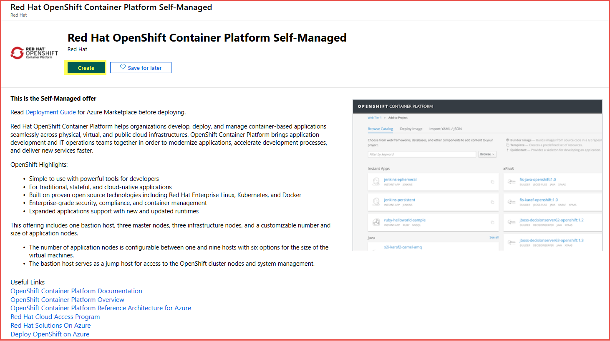  
<br>

**Basics**

To get help on any of the input parameters, hover over the ***i*** next to the parameter name.

Enter values for the input parameters and click **OK**.

| Input Parameter | Parameter Description |
|-----------------------|-----------------|
| VM Admin User Name | The administrator user to be created on all VM instances |
| SSH Public Key for Admin User | SSH public key used to log into VM - must not have a passphrase |
| Subscription | Azure subscription to deploy cluster into |
| Resource Group | Create a new resource group or select an existing empty resource group for cluster resources |
| Location | Azure region to deploy cluster into |

   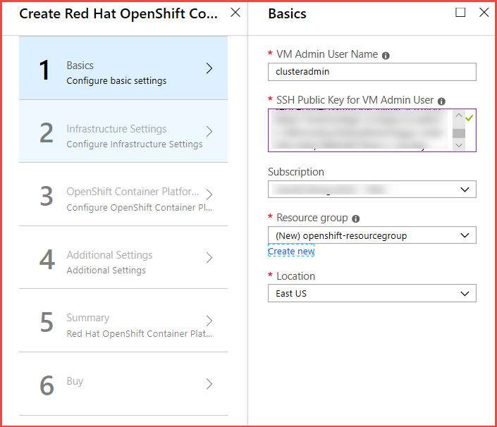  
<br>

**Infrastructure Settings**

Enter values for the input parameters and click **OK**.

| Input Parameter | Parameter Description |
|-----------------------|-----------------|
| OCP Cluster Name Prefix | Cluster Prefix used to configure hostnames for all nodes. Between 1 and 20 characters |
| Master Node Size | Accept the default VM size or click **Change size** to select a different VM size.  Select appropriate VM size for your work load |
| Infrastructure Node Size | Accept the default VM size or click **Change size** to select a different VM size.  Select appropriate VM size for your work load |
| Number of Application Nodes | Accept the default VM size or click **Change size** to select a different VM size.  Select appropriate VM size for your work load |
| Application Node Size | Accept the default VM size or click **Change size** to select a different VM size.  Select appropriate VM size for your work load |
| Bastion Host Size | Accept the default VM size or click **Change size** to select a different VM size.  Select appropriate VM size for your work load |
| New or Existing Virtual Network | Create a new vNet (Default) or use an existing vNet |
| Choose Default CIDR Settings or customize IP Range (CIDR) | Accept default CIDR ranges or Select **Custom IP Range** and enter custom CIDR information.  Default Settings will create vNet with CIDR of 10.0.0.0/14, master subnet with 10.1.0.0/16, infra subnet with 10.2.0.0/16, and compute and cns subnet with 10.3.0.0/16 |
| Key Vault Resource Group Name | The name of the Resource Group that contains the Key Vault |
| Key Vault Name | The name of the Key Vault that contains the secret with the ssh private key.  Only alphanumeric characters and dashes are allowed, and be between 3 and 24 characters |
| Secret Name | The name of the secret that contains the ssh private key.  Only alphanumeric characters and dashes are allowed |

   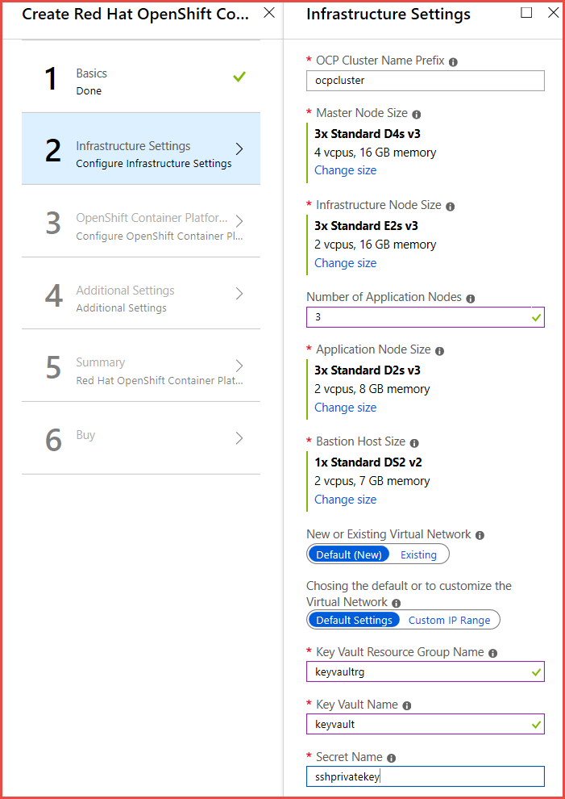  
<br>

**Change size**

To select a different VM size, click ***Change size***.  The VM selection window will open.  Select the VM size you want and click **Select**.

   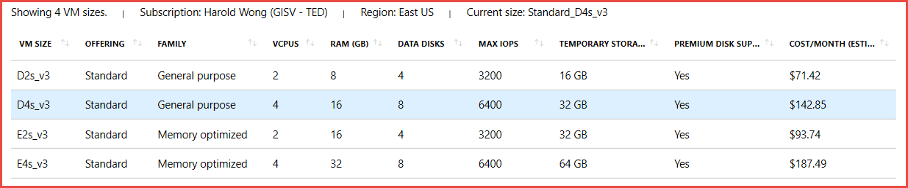  
<br>

**Existing Virtual Network**

| Input Parameter | Parameter Description |
|-----------------------|-----------------|
| Existing Virtual Network Name | Name of the existing vNet |
| Subnet name for master nodes | Name of existing subnet for master nodes.  Needs to contain at least 16 IP addresses and follow RFC 1918 |
| Subnet name for infra nodes | Name of existing subnet for infra nodes.  Needs to contain at least 32 IP addresses and follow RFC 1918 |
| Subnet name for compute and cns nodes | Name of existing subnet for compute and cns nodes.  Needs to contain at least 32 IP addresses and follow RFC 1918 |
| Resource Group for the existing Virtual Network | Name of resource group that contains the existing vNet |

   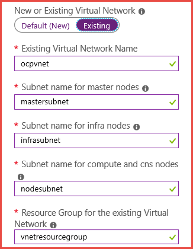  
<br>

**Custom IP Range**

| Input Parameter | Parameter Description |
|-----------------------|-----------------|
| Address Range for the Virtual Network | Custom CIDR for the vNet |
| Address Range for the subnet containing the master nodes | Custom CIDR for master subnet |
| Address Range for the subnet containing the infrastructure nodes | Custom CIDR for infrastructure subnet |
| Address Range for subnet containing the compute and cns nodes | Custom CIDR for the compute and cns nodes |

   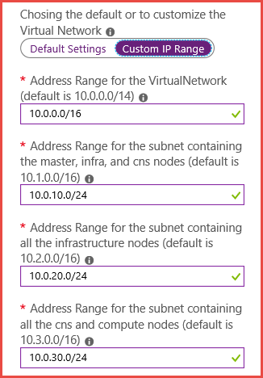  
<br>

**OpenShift Container Platform**

Enter values for the Input Parameters and click **OK**

| Input Parameter | Parameter Description |
|-----------------------|-----------------|
| OpenShift Admin User Password | Password for the initial OpenShift user.  This user will also be the cluster admin |
| Confirm OpenShift Admin User Password | Retype the OpenShift Admin User Password |
| Red Hat Subscription Manager User Name | User Name to access your Red Hat Subscription or Organization ID.  This credential is used to register the RHEL instance to your subscription and will not be stored by Microsoft or Red Hat |
| Red Hat Subscription Manager User Password | Password to access your Red Hat Subscription or Activation Key.  This credential is used to register the RHEL instance to your subscription and will not be stored by Microsoft or Red Hat |
| Red Hat Subscription Manager OpenShift Pool ID | Pool ID that contains OpenShift Container Platform entitlement. Ensure you have enough entitlements of OpenShift Container Platform for the installation of the cluster |
| Red Hat Subscription Manager OpenShift Pool ID for Broker / Master Nodes | Pool ID that contains OpenShift Container Platform entitlements for Broker / Master Nodes. Ensure you have enough entitlements of OpenShift Container Platform for the installation of the cluster. If not using broker / master pool ID, enter the pool ID for Application Nodes |
| Configure Azure Cloud Provider | Configure OpenShift to use Azure Cloud Provider. Necessary if using Azure disk attach for persistent volumes.  Default is Yes |
| Azure AD Service Principal Client ID GUID | Azure AD Service Principal Client ID GUID - also known as AppID. Only needed if Configure Azure Cloud Provider set to **Yes** |
| Azure AD Service Principal Client ID Secret | Azure AD Service Principal Client ID Secret. Only needed if Configure Azure Cloud Provider set to **Yes** |
 
   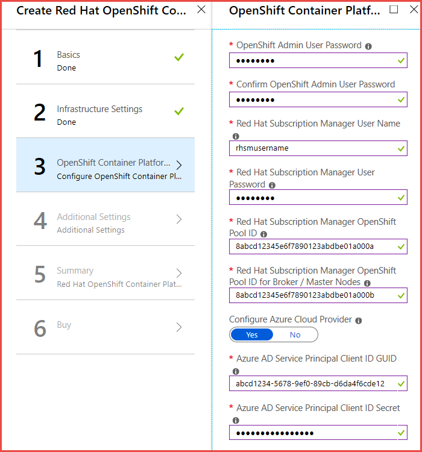  
<br>

**Additional Settings**

The Additional Settings blade allows the configuration of CNS for glusterfs storage, Logging, Metrics, and Router Sub domain.  The default won't install any of these options and will use nip.io as the router sub domain for testing purposes. Enabling CNS will install three additional compute nodes with three additional attached disks that will host glusterfs pods.  

Enter values for the Input Parameters and click **OK**

| Input Parameter | Parameter Description |
|-----------------------|-----------------|
| Configure Container Native Storage (CNS) | Installs CNS in the OpenShift cluster and enable it as storage. Will be default if Azure Provider is disabled |
| Configure Cluster Logging | Installs EFK logging functionality into the cluster.  Size infra nodes appropriately to host EFK pods |
| Configure Metrics for the Cluster | Installs Hawkular metrics into the OpenShift cluster.  Size infra nodes appropriately to host Hawkular metrics pods |
| Default Router Sub domain | Select nipio for testing or custom to enter your own sub domain for production |
 
   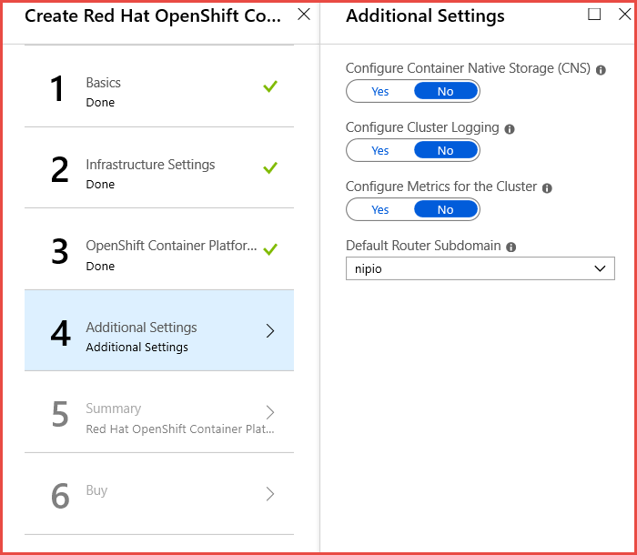  
<br>

**Additional Settings - Extra Parameters**

| Input Parameter | Parameter Description |
|-----------------------|-----------------|
| (CNS) Node Size | Accept the default node size or select **Change size** to select a new VM size |
| Enter your custom subdomain | The custom routing domain to be used for exposing applications via the router on the OpenShift cluster.  Be sure to create the appropriate wildcard DNS entry] |
 
   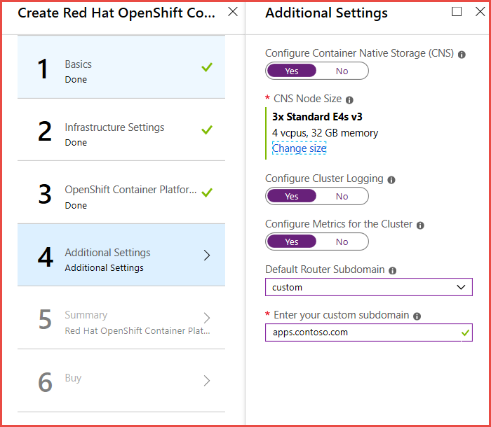  
<br>

**Summary**

Validation occurs at this stage to check core quota is sufficient to deploy the total number of VMs selected for the cluster.  Review all the parameters that were entered.  If the inputs are acceptable, click **OK** to continue.

   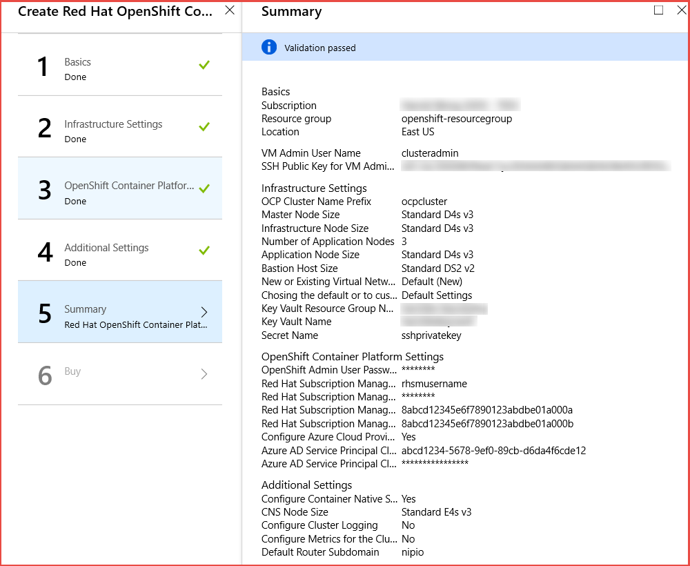  
<br>

**Buy**

Confirm contact information on the Buy page and click **Purchase** to accept the terms of use and start deployment of the OpenShift Container Platform cluster.

   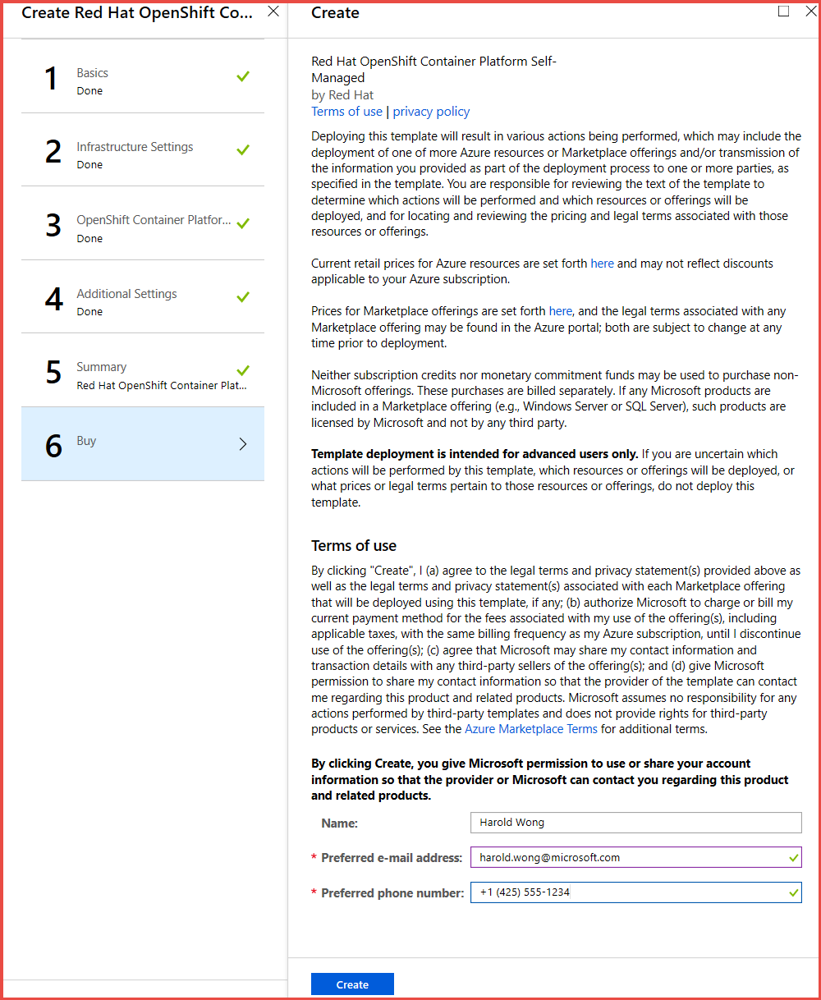  
<br>


## Connect to the OpenShift cluster

When the deployment finishes, retrieve the connection from the output section of the deployment. Connect to the OpenShift console with your browser by using the **OpenShift Console URL**. you can also SSH to the Bastion host. Following is an example where the admin username is clusteradmin and the bastion public IP DNS FQDN is bastiondns4hawllzaavu6g.eastus.cloudapp.azure.com:

```bash
$ ssh clusteradmin@bastiondns4hawllzaavu6g.eastus.cloudapp.azure.com
```

## Clean up resources

Use the [az group delete](/cli/azure/group) command to remove the resource group, OpenShift cluster, and all related resources when they're no longer needed.

```azurecli 
az group delete --name openshiftrg
```

## Next steps

- [Post-deployment tasks](./openshift-post-deployment.md)
- [Troubleshoot OpenShift deployment in Azure](./openshift-troubleshooting.md)
- [Getting started with OpenShift Container Platform](https://docs.openshift.com/container-platform)

