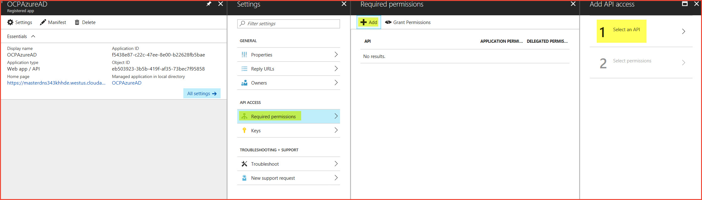
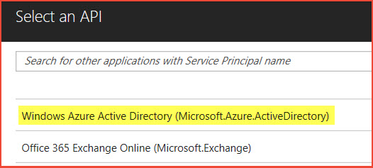
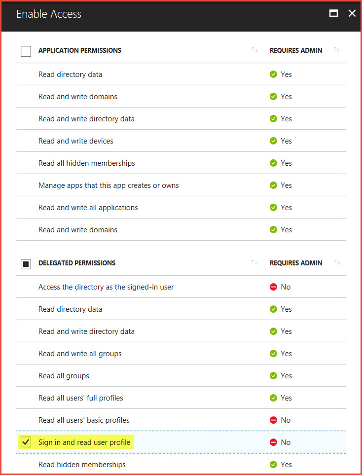

# Post-deployment tasks

After you deploy an OpenShift cluster, you can configure additional items. This article covers:

- How to configure single sign-on by using Azure Active Directory (Azure AD)
- How to configure Azure Monitor logs to monitor OpenShift
- How to configure metrics and logging
- How to install Open Service Broker for Azure (OSBA)

## Configure single sign-on by using Azure Active Directory

To use Azure Active Directory for authentication, first you need to create an Azure AD app registration. This process involves two steps: creating the app registration, and configuring permissions.

### Create an app registration

These steps use the Azure CLI to create the app registration, and the GUI (portal) to set the permissions. To create the app registration, you need the following five pieces of information:

- Display name: App registration name (for example, OCPAzureAD)
- Home page: OpenShift console URL (for example, https://masterdns343khhde.westus.cloudapp.azure.com/console)
- Identifier URI: OpenShift console URL (for example, https://masterdns343khhde.westus.cloudapp.azure.com/console)
- Reply URL: Master public URL and the app registration name (for example, https://masterdns343khhde.westus.cloudapp.azure.com/oauth2callback/OCPAzureAD)
- Password: Secure password (use a strong password)

The following example creates an app registration by using the preceding information:

```azurecli
az ad app create --display-name OCPAzureAD --homepage https://masterdns343khhde.westus.cloudapp.azure.com/console --reply-urls https://masterdns343khhde.westus.cloudapp.azure.com/oauth2callback/hwocpadint --identifier-uris https://masterdns343khhde.westus.cloudapp.azure.com/console --password {Strong Password}
```

If the command is successful, you get a JSON output similar to:

```json
{
  "appId": "12345678-ca3c-427b-9a04-ab12345cd678",
  "appPermissions": null,
  "availableToOtherTenants": false,
  "displayName": "OCPAzureAD",
  "homepage": "https://masterdns343khhde.westus.cloudapp.azure.com/console",
  "identifierUris": [
    "https://masterdns343khhde.westus.cloudapp.azure.com/console"
  ],
  "objectId": "62cd74c9-42bb-4b9f-b2b5-b6ee88991c80",
  "objectType": "Application",
  "replyUrls": [
    "https://masterdns343khhde.westus.cloudapp.azure.com/oauth2callback/OCPAzureAD"
  ]
}
```

Take note of the appId property returned from the command for a later step.

In the Azure portal:

1. Select **Azure Active Directory** > **App Registration**.
2. Search for your app registration (for example, OCPAzureAD).
3. In the results, click the app registration.
4. Under **Settings**, select **Required permissions**.
5. Under **Required Permissions**, select **Add**.

   

6. Click Step 1: Select API, and then click **Windows Azure Active Directory (Microsoft.Azure.ActiveDirectory)**. Click **Select** at the bottom.

   

7. On Step 2: Select Permissions, select **Sign in and read user profile** under **Delegated Permissions**, and then click **Select**.

   

8. Select **Done**.

### Configure OpenShift for Azure AD authentication

To configure OpenShift to use Azure AD as an authentication provider, the /etc/origin/master/master-config.yaml file must be edited on all master nodes.

Find the tenant ID by using the following CLI command:

```azurecli
az account show
```

In the yaml file, find the following lines:

```yaml
oauthConfig:
  assetPublicURL: https://masterdns343khhde.westus.cloudapp.azure.com/console/
  grantConfig:
    method: auto
  identityProviders:
  - challenge: true
    login: true
    mappingMethod: claim
    name: htpasswd_auth
    provider:
      apiVersion: v1
      file: /etc/origin/master/htpasswd
      kind: HTPasswdPasswordIdentityProvider
```

Insert the following lines immediately after the preceding lines:

```yaml
  - name: <App Registration Name>
    challenge: false
    login: true
    mappingMethod: claim
    provider:
      apiVersion: v1
      kind: OpenIDIdentityProvider
      clientID: <appId>
      clientSecret: <Strong Password>
      claims:
        id:
        - sub
        preferredUsername:
        - unique_name
        name:
        - name
        email:
        - email
      urls:
        authorize: https://login.microsoftonline.com/<tenant Id>/oauth2/authorize
        token: https://login.microsoftonline.com/<tenant Id>/oauth2/token
```

Make sure the text aligns correctly under identityProviders. Find the tenant ID by using the following CLI command: ```az account show```

Restart the OpenShift master services on all master nodes:

```bash
sudo /usr/local/bin/master-restart api
sudo /usr/local/bin/master-restart controllers
```

In the OpenShift console, you now see two options for authentication: htpasswd_auth and [App Registration].

## Monitor OpenShift with Azure Monitor logs

There are three ways to add the Log Analytics agent to OpenShift.
- Install the Log Analytics agent for Linux directly on each OpenShift node
- Enable Azure Monitor VM Extension on each OpenShift node
- Install the Log Analytics agent as an OpenShift daemon-set

Read the full [instructions](https://docs.microsoft.com/azure/log-analytics/log-analytics-containers#configure-a-log-analytics-agent-for-red-hat-openshift) for more details.

## Configure metrics and logging

Based on the branch, the Azure Resource Manager templates for OpenShift Container Platform and OKD may provide input parameters for enabling metrics and logging as part of the installation.

The OpenShift Container Platform Marketplace offer also provides an option to enable metrics and logging during cluster installation.

If metrics / logging wasn't enabled during the installation of the cluster, they can easily be enabled after the fact.

### Azure Cloud Provider in use

SSH to the bastion node or first master node (based on template and branch in use) using the credentials provided during deployment. Issue the following command:

```bash
ansible-playbook /usr/share/ansible/openshift-ansible/playbooks/openshift-metrics/config.yml \
-e openshift_metrics_install_metrics=True \
-e openshift_metrics_cassandra_storage_type=dynamic

ansible-playbook /usr/share/ansible/openshift-ansible/playbooks/openshift-logging/config.yml \
-e openshift_logging_install_logging=True \
-e openshift_logging_es_pvc_dynamic=true
```

### Azure Cloud Provider not in use

```bash
ansible-playbook /usr/share/ansible/openshift-ansible/playbooks/openshift-metrics/config.yml \
-e openshift_metrics_install_metrics=True

ansible-playbook /usr/share/ansible/openshift-ansible/playbooks/openshift-logging/config.yml \
-e openshift_logging_install_logging=True
```

## Install Open Service Broker for Azure (OSBA)

Open Service Broker for Azure, or OSBA, lets you provision Azure Cloud Services directly from OpenShift. OSBA in an Open Service Broker API implementation for Azure. The Open Service Broker API is a spec that defines a common language for cloud providers that cloud native applications can use to manage cloud services without lock-in.

To install OSBA on OpenShift, follow the instructions located here: https://github.com/Azure/open-service-broker-azure#openshift-project-template. 
> [!NOTE]
> Only complete the steps in the OpenShift Project Template section and not the entire Installing section.

## Next steps

- [Getting started with OpenShift Container Platform](https://docs.openshift.com/container-platform)
