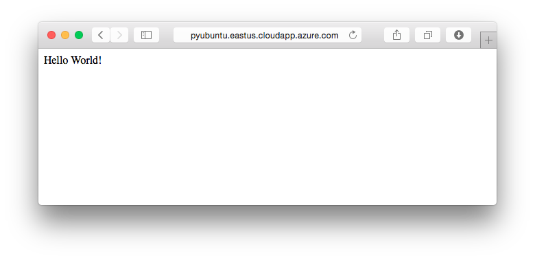

# Django Hello World web app on a Linux VM
> [!div class="op_single_selector"]
> * [Windows](../windows/classic/python-django-web-app.md?toc=%2fazure%2fvirtual-machines%2fwindows%2fclassic%2ftoc.json)
> * [Mac/Linux](../windows/classic/python-django-web-app.md?toc=%2fazure%2fvirtual-machines%2flinux%2ftoc.json)
> 
> 

 

This tutorial shows you how to host a Django-based website in Linux in Azure Virtual Machines. In the tutorial, we assume no prior experience with Azure. When you finish the tutorial, you can have a Django-based application up and running in the cloud.

Learn how to:

* Set up an Azure virtual machine to host Django. Although this tutorial explains how to do this for **Linux**, you can do the same for a Windows Server VM hosted in Azure. 
* Create a new Django application in Linux.

The tutorial shows you how to build a basic Hello World web
application. The application is hosted in an Azure virtual machine.

The following screenshot shows the completed application:

[!INCLUDE [create-account-and-vms-note](../../../includes/create-account-and-vms-note.md)]

## Create and set up an Azure virtual machine to host Django

1. To create an Azure virtual machine with the Ubuntu Server 14.04 LTS distribution, see [Create a Linux virtual machine in the Azure portal](quick-create-portal.md?toc=%2fazure%2fvirtual-machines%2flinux%2ftoc.json). You also can choose password authentication instead of using an SSH public key.
2. To edit the network security group to allow incoming HTTP traffic to port 80, see [Create network security groups in the Azure portal](../../virtual-network/virtual-networks-create-nsg-arm-pportal.md).
3. (Optional) By default, your new virtual machine doesn't have a fully qualified domain name (FQDN).  To create a VM with an FQDN, see [Create an FQDN in the Azure portal for a Windows VM](../windows/portal-create-fqdn.md?toc=%2fazure%2fvirtual-machines%2flinux%2ftoc.json). This step is not required for completing this tutorial.

## Set up the development environment
> [!NOTE]
> If you need to install Python or want to use the client libraries, see the [Python installation guide](../../python-how-to-install.md).

The Ubuntu Linux VM has Python 2.7 preinstalled, but it doesn't come with Apache or Django. Complete the following steps to connect to your VM and install Apache and Django:

1. Open a new Terminal window.
2. To connect to the Azure VM, enter the following command. If you didn't create an FQDN, you can connect by using the public IP address that's displayed in the virtual machine summary in the Azure portal.
   
       $ ssh yourusername@yourVmUrl
3. To install Django, enter the following commands:
   
       $ sudo apt-get install python-setuptools python-pip
       $ sudo pip install django
4. To install Apache with mod-wsgi, enter the following command:
   
       $ sudo apt-get install apache2 libapache2-mod-wsgi

## Create a new Django app
1. To use SSH to access your VM, open the Terminal window you used in the preceding section.
2. To create a new Django project, enter the following commands:
   
       $ cd /var/www
       $ sudo django-admin.py startproject helloworld
   
   The `django-admin.py` script generates a basic structure for Django-based websites:
   
   * `helloworld/manage.py` helps you start hosting and stop hosting your Django-based website.
   * `helloworld/helloworld/settings.py` has Django settings for your application.
   * `helloworld/helloworld/urls.py` has the mapping code between each URL and its view.
3. In the /var/www/helloworld/helloworld directory, create a new file named views.py. This file has the view that renders the "hello world" page. In your code editor, enter the following commands:
   
       from django.http import HttpResponse
       def home(request):
           html = "<html><body>Hello World!</body></html>"
           return HttpResponse(html)
4. Replace the contents of the urls.py file with the following commands:
   
       from django.conf.urls import patterns, url
       urlpatterns = patterns('',
           url(r'^$', 'helloworld.views.home', name='home'),
       )

## Set up Apache
1. In the /etc/apache2/sites-available/helloworld.conf folder, create an Apache virtual host configuration file. Set the contents to the following values. Replace *yourVmName* with the actual name of the machine you are using (for example, *pyubuntu*).
   
       <VirtualHost *:80>
       ServerName yourVmName
       </VirtualHost>
       WSGIScriptAlias / /var/www/helloworld/helloworld/wsgi.py
       WSGIPythonPath /var/www/helloworld
2. To activate the site, use the following command:
   
       $ sudo a2ensite helloworld
3. To restart Apache, use the following command:
   
       $ sudo service apache2 reload
4. Load the webpage in your browser:
   
   

## Shut down your Azure virtual machine
When you're done with this tutorial, we recommend that you shut down or remove the Azure VM you created for the tutorial. This frees up resources for other tutorials, and you can avoid incurring Azure usage charges.

