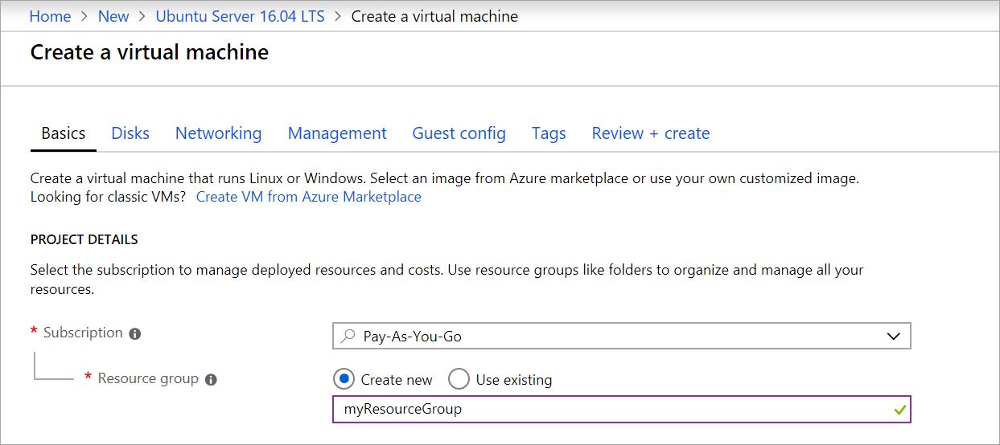
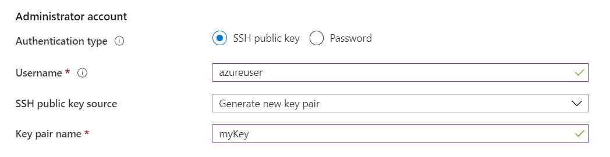
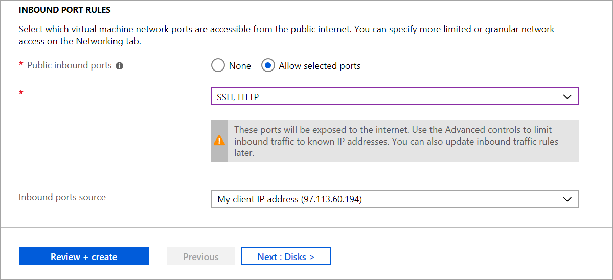

# Quickstart: Create a Linux virtual machine in the Azure portal

**Applies to:** :heavy_check_mark: Linux VMs

Azure virtual machines (VMs) can be created through the Azure portal. The Azure portal is a browser-based user interface to create Azure resources. This quickstart shows you how to use the Azure portal to deploy a Linux virtual machine (VM) running Ubuntu 18.04 LTS. To see your VM in action, you also SSH to the VM and install the NGINX web server.

If you don't have an Azure subscription, create a [free account](https://azure.microsoft.com/free/?WT.mc_id=A261C142F) before you begin.

## Sign in to Azure

Sign in to the [Azure portal](https://portal.azure.com).

## Create virtual machine

1. Enter *virtual machines* in the search.
1. Under **Services**, select **Virtual machines**.
1. In the **Virtual machines** page, select **Create** and then **Virtual machine**.  The **Create a virtual machine** page opens.

1. In the **Basics** tab, under **Project details**, make sure the correct subscription is selected and then choose to **Create new** resource group. Enter *myResourceGroup* for the name.*. 

	

1. Under **Instance details**, enter *myVM* for the **Virtual machine name**, and choose *Ubuntu 18.04 LTS - Gen2* for your **Image**. Leave the other defaults. The default size and pricing is only shown as an example. Size availability and pricing are dependent on your region and subscription.

    :::image type="content" source="media/quick-create-portal/instance-details.png" alt-text="Screenshot of the Instance details section where you provide a name for the virtual machine and select its region, image, and size.":::

    > [!NOTE]
    > Some users will now see the option to create VMs in multiple zones. To learn more about this new capability, see [Create virtual machines in an availability zone](../create-portal-availability-zone.md).
    > :::image type="content" source="../media/create-portal-availability-zone/preview.png" alt-text="Screenshot showing that you have the option to create virtual machines in multiple availability zones.":::


1. Under **Administrator account**, select **SSH public key**.

1. In **Username** enter *azureuser*.

1. For **SSH public key source**, leave the default of **Generate new key pair**, and then enter *myKey* for the **Key pair name**.

    

1. Under **Inbound port rules** > **Public inbound ports**, choose **Allow selected ports** and then select **SSH (22)** and **HTTP (80)** from the drop-down. 

	

1. Leave the remaining defaults and then select the **Review + create** button at the bottom of the page.

1. On the **Create a virtual machine** page, you can see the details about the VM you are about to create. When you are ready, select **Create**.

1. When the **Generate new key pair** window opens, select **Download private key and create resource**. Your key file will be download as **myKey.pem**. Make sure you know where the `.pem` file was downloaded; you will need the path to it in the next step.

1. When the deployment is finished, select **Go to resource**.

1. On the page for your new VM, select the public IP address and copy it to your clipboard.


	


## Connect to virtual machine

Create an [SSH connection](/azure/virtual-machines/linux-vm-connect) with the VM.

1. If you are on a Mac or Linux machine, open a Bash prompt and set read-only permission on the .pem file using `chmod 400 ~/Downloads/myKey.pem`. If you are on a Windows machine, open a PowerShell prompt. 

1. At your prompt, open an SSH connection to your virtual machine. Replace the IP address with the one from your VM, and replace the path to the `.pem` with the path to where the key file was downloaded.

```console
ssh -i ~/Downloads/myKey.pem azureuser@10.111.12.123
```

> [!TIP]
> The SSH key you created can be used the next time your create a VM in Azure. Just select the **Use a key stored in Azure** for **SSH public key source** the next time you create a VM. You already have the private key on your computer, so you won't need to download anything.

## Install web server

To see your VM in action, install the NGINX web server. From your SSH session, update your package sources and then install the latest NGINX package.

# [Ubuntu](#tab/ubuntu)

```bash
sudo apt-get -y update
sudo apt-get -y install nginx
```

# [SUSE Linux (SLES)](#tab/SLES)

```bash
sudo zypper --non-interactive update
sudo zypper --non-interactive install nginx
```

# [Red Hat Enterprise Linux (RHEL)](#tab/rhel)

```bash
sudo dnf update
sudo dnf install nginx
```
---
When done, type `exit` to leave the SSH session.


## View the web server in action

Use a web browser of your choice to view the default NGINX welcome page. Type the public IP address of the VM as the web address. The public IP address can be found on the VM overview page or as part of the SSH connection string you used earlier.


## Clean up resources

When no longer needed, you can delete the resource group, virtual machine, and all related resources. To do so, select the resource group for the virtual machine, select **Delete**, then confirm the name of the resource group to delete.

## Next steps

In this quickstart, you deployed a simple virtual machine, created a Network Security Group and rule, and installed a basic web server. To learn more about Azure virtual machines, continue to the tutorial for Linux VMs.

> [!div class="nextstepaction"]
> [Azure Linux virtual machine tutorials](./tutorial-manage-vm.md)
