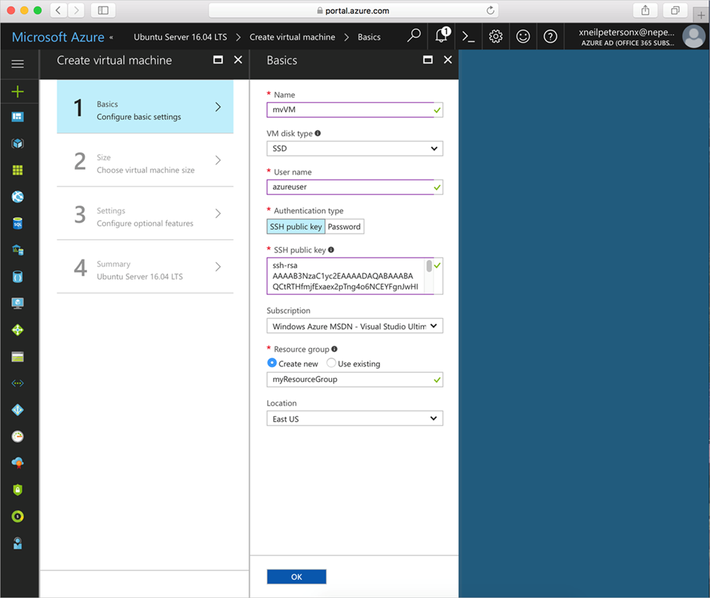
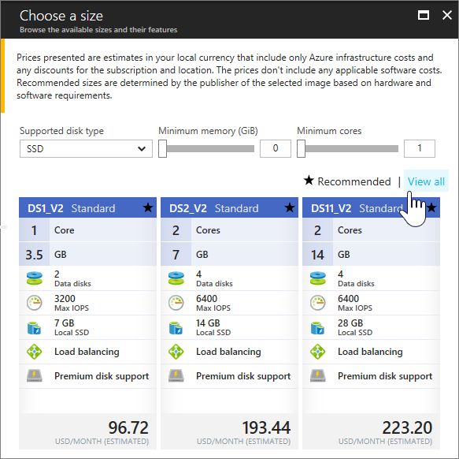

# Create a Linux virtual machine with the Azure portal

Azure virtual machines can be created through the Azure portal. This method provides a browser-based user interface for creating and configuring virtual machines and all related resources. This Quickstart steps through creating a virtual machine and installing a webserver on the VM.

If you don't have an Azure subscription, create a [free account](https://azure.microsoft.com/free/?WT.mc_id=A261C142F) before you begin.

## Create SSH key pair

You need an SSH key pair to complete this quick start. If you have an existing SSH key pair, this step can be skipped.

From a Bash shell, run this command and follow the on-screen directions. The command output includes the file name of the public key file. Copy the contents of the public key file to the clipboard.

```bash
ssh-keygen -t rsa -b 2048
```

## Log in to Azure 

Log in to the Azure portal at http://portal.azure.com.

## Create virtual machine

1. Click the **New** button found on the upper left-hand corner of the Azure portal.

2. Select **Compute**, select **Ubuntu Server 16.04 LTS**, and ensure that **Resource Manager** is the selected deployment model. Click the **Create** button. 

3. Enter the virtual machine information. For **Authentication type**, select **SSH public key**. When pasting in your SSH public key, take care to remove any leading or trailing white space. When complete, click **OK**.

    

4. Select a size for the VM. To see more sizes, select **View all** or change the **Supported disk type** filter. 

      

5. On the settings blade, select **Yes** under **Use managed disks**, keep the defaults for the rest of the settings, and click **OK**.

6. On the summary page, click **Ok** to start the virtual machine deployment.

7. The VM will be pinned to the Azure portal dashboard. Once the deployment has completed, the VM summary blade automatically opens.


## Connect to virtual machine

Create an SSH connection with the virtual machine.

1. Click the **Connect** button on the virtual machine blade. The connect button displays an SSH connection string that can be used to connect to the virtual machine.

     

2. Run the following command to create an SSH session. Replace the connection string with the one you copied from the Azure portal.

```bash 
ssh azureuser@40.112.21.50
```

## Install NGINX

Use the following bash script to update package sources and install the latest NGINX package. 

```bash 
#!/bin/bash

# update package source
sudo apt-get -y update

# install NGINX
sudo apt-get -y install nginx
```

When done, exit the SSH session and return the VM properties in the Azure portal.


## Open port 80 for web traffic 

A Network security group (NSG) secures inbound and outbound traffic. When a VM is created from the Azure portal, an inbound rule is created on port 22 for SSH connections. Because this VM hosts a webserver, an NSG rule needs to be created for port 80.

1. On the virtual machine, click the name of the **Resource group**.
2. Select the **network security group**. The NSG can be identified using the **Type** column. 
3. On the left-hand menu, under settings, click **Inbound security rules**.
4. Click on **Add**.
5. In **Name**, type **http**. Make sure **Port range** is set to 80 and **Action** is set to **Allow**. 
6. Click **OK**.


## View the NGINX welcome page

With NGINX installed, and port 80 open to your VM, the webserver can now be accessed from the internet. Open a web browser, and enter the public IP address of the VM. The public IP address can be found on the VM blade in the Azure portal.

 

## Clean up resources

When no longer needed, delete the resource group, virtual machine, and all related resources. To do so, select the resource group from the virtual machine blade and click **Delete**.

## Next steps

In this quick start, you’ve deployed a simple virtual machine, a network security group rule, and installed a web server. To learn more about Azure virtual machines, continue to the tutorial for Linux VMs.

> [!div class="nextstepaction"]
> [Azure Linux virtual machine tutorials](./tutorial-manage-vm.md)
