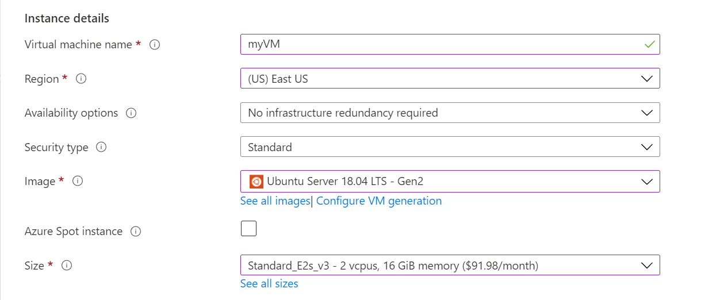
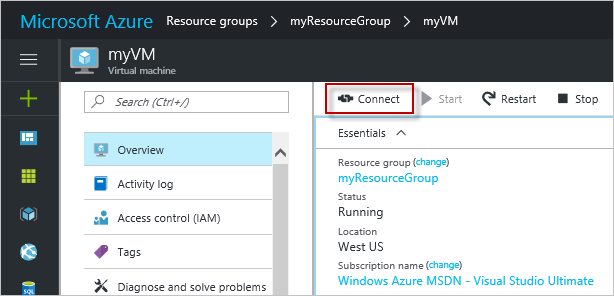

# Quickstart: Create a Linux virtual machine in the Azure portal

Azure virtual machines (VMs) can be created through the Azure portal. The Azure portal is a browser-based user interface to create VMs and their associated resources. This quickstart shows you how to use the Azure portal to deploy a Linux virtual machine (VM) running Ubuntu 16.04 LTS. To see your VM in action, you also SSH to the VM and install the NGINX web server.

If you don't have an Azure subscription, create a [free account](https://azure.microsoft.com/free/?WT.mc_id=A261C142F) before you begin.

## Create SSH key pair

You need an SSH key pair to complete this quickstart. If you already have an SSH key pair, you can skip this step.

Open a bash shell and use [ssh-keygen](https://www.ssh.com/ssh/keygen/) to create an SSH key pair. If you don't have a bash shell on your local computer, you can use the [Azure Cloud Shell](https://shell.azure.com/bash).  

```bash
ssh-keygen -t rsa -b 2048
```

The above command generates public and private keys with the default name of `id_rsa` in the `~/.ssh directory`. The command returns the full path to the public key. Use the path to the public key to display its contents with `cat`.

```bash 
cat ~/.ssh/id_rsa.pub
```

Save the output of this command. You will need it when configuring your administrator account to log in to your VM.

For more detailed information on how to create SSH key pairs, including the use of PuTTy, see [How to use SSH keys with Windows](ssh-from-windows.md).

If you create your SSH key pair using the Cloud Shell, it will be stored in an Azure File Share that is [automatically mounted by the Cloud Shell](https://docs.microsoft.com/azure/cloud-shell/persisting-shell-storage). Don't delete this file share or storage account until after you have retrieved your keys or you will lose access to the VM. 

## Sign in to Azure

Sign in to the [Azure portal](https://portal.azure.com).

## Create virtual machine

1. Choose **Create a resource** in the upper left corner of the Azure portal.

1. In the search box above the list of Azure Marketplace resources, search for and select **Ubuntu Server 16.04 LTS** by Canonical, then choose **Create**.

1. In the **Basics** tab, under **Project details**, make sure the correct subscription is selected and then choose to **Create new** under **Resource group**. In the pop-up, type *myResourceGroup* for the name of the resource group and then choose **OK**. 

	

1. Under **Instance details**, type *myVM* for the **Virtual machine name** and choose *East US* for your **Region**. Leave the other defaults.

	

1. Under **Administrator account**, select **SSH public key**, type your user name, then paste your public key into the text box. Remove any leading or trailing white space in your public key.

    

1. Under **Inbound port rules** > **Public inbound ports**, choose **Allow selected ports** and then select **SSH (22)** and **HTTP (80)** from the drop-down. 

	

1. Leave the remaining defaults and then select the **Review + create** button at the bottom of the page.

1. On the **Create a virtual machine** page, you can see the details about the VM you are about to create. When you are ready, select **Create**.

It will take a few minutes for your VM to be deployed. When the deployment is finished, move on to the next section.

	
## Connect to virtual machine

Create an SSH connection with the VM.

1. Select the **Connect** button on the overview page for your VM. 

    

2. In the **Connect to virtual machine** page, keep the default options to connect by IP address over port 22. In **Login using VM local account** a connection command is shown. Click the button to copy the command. The following example shows what the SSH connection command looks like:

    ```bash
    ssh azureuser@10.111.12.123
    ```

3. Using the same bash shell you used to create your SSH key pair (like the [Azure Cloud Shell](https://shell.azure.com/bash) or your local bash shell) paste the SSH connection command into the shell to create an SSH session. 

## Install web server

To see your VM in action, install the NGINX web server. From your SSH session, update your package sources and then install the latest NGINX package.

```bash
sudo apt-get -y update
sudo apt-get -y install nginx
```

When done, type `exit` to leave the SSH session.


## View the web server in action

Use a web browser of your choice to view the default NGINX welcome page. Enter the public IP address of the VM as the web address. The public IP address can be found on the VM overview page or as part of the SSH connection string you used earlier.


## Clean up resources

When no longer needed, you can delete the resource group, virtual machine, and all related resources. To do so, select the resource group for the virtual machine, select **Delete**, then confirm the name of the resource group to delete.

## Next steps

In this quickstart, you deployed a simple virtual machine, created a Network Security Group and rule, and installed a basic web server. To learn more about Azure virtual machines, continue to the tutorial for Linux VMs.

> [!div class="nextstepaction"]
> [Azure Linux virtual machine tutorials](./tutorial-manage-vm.md)
