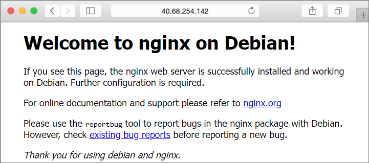

# Quickstart: Create a Linux virtual machine in Azure with PowerShell

**Applies to:** :heavy_check_mark: Linux VMs 

The Azure PowerShell module is used to create and manage Azure resources from the PowerShell command line or in scripts. This quickstart shows you how to use the Azure PowerShell module to deploy a Linux virtual machine (VM) in Azure. This quickstart uses the latest Debian marketplace image. To see your VM in action, you'll also SSH to the VM and install the NGINX web server.

If you don't have an Azure subscription, create a [free account](https://azure.microsoft.com/free/?WT.mc_id=A261C142F) before you begin.

## Launch Azure Cloud Shell

The Azure Cloud Shell is a free interactive shell that you can use to run the steps in this article. It has common Azure tools preinstalled and configured to use with your account. 

To open the Cloud Shell, just select **Try it** from the upper right corner of a code block. Select **Copy** to copy the blocks of code, paste it into the Cloud Shell, and press enter to run it.


## Create a resource group

Create an Azure resource group with [New-AzResourceGroup](/powershell/module/az.resources/new-azresourcegroup). A resource group is a logical container into which Azure resources are deployed and managed:

```azurepowershell-interactive
New-AzResourceGroup -Name 'myResourceGroup' -Location 'EastUS'
```

## Create a virtual machine

We will be automatically generating an SSH key pair to use for connecting to the VM. The public key that is created using `-GenerateSshKey` will be stored in Azure as a resource, using the name you provide as `SshKeyName`. The SSH key resource can be reused for creating additional VMs. Both the public and private keys will also be downloaded for you. When you create your SSH key pair using the Cloud Shell, the keys are stored in a [storage account that is automatically created by Cloud Shell](../../cloud-shell/persisting-shell-storage.md). Don't delete the storage account, or the file share in it, until after you have retrieved your keys or you will lose access to the VM.

You will be prompted for a user name that will be used when you connect to the VM. You will also be asked for a password, which you can leave blank. Password log in for the VM is disabled when using an SSH key.

In this example, you create a VM named *myVM*, in *East US*, using the *Standard_B2s* VM size.

```azurepowershell-interactive
New-AzVm `
    -ResourceGroupName 'myResourceGroup' `
    -Name 'myVM' `
    -Location 'East US' `
    -image Debian11 `
    -size Standard_B2s `
    -PublicIpAddressName myPubIP `
    -OpenPorts 80 `
    -GenerateSshKey `
    -SshKeyName mySSHKey
```

The output will give you the location of the local copy of the SSH key. For example:

```output
Private key is saved to /home/user/.ssh/1234567891
Public key is saved to /home/user/.ssh/1234567891.pub
```

It will take a few minutes for your VM to be deployed. When the deployment is finished, move on to the next section.

## Install NGINX

To see your VM in action, install the NGINX web server.

```azurepowershell-interactive
Invoke-AzVMRunCommand `
   -ResourceGroupName 'myResourceGroup' `
   -Name 'myVM' `
   -CommandId 'RunShellScript' `
   -ScriptString 'sudo apt-get update && sudo apt-get install -y nginx'
```

The `-ScriptString` parameter requires version `4.27.0` or later of the `Az.Compute` module.

## View the web server in action

Get the public IP address of your VM:

```azurepowershell-interactive
Get-AzPublicIpAddress -Name myPubIP -ResourceGroupName myResourceGroup | select "IpAddress" 
```

Use a web browser of your choice to view the default NGINX welcome page. Enter the public IP address of the VM as the web address.



## Clean up resources

When no longer needed, you can use the [Remove-AzResourceGroup](/powershell/module/az.resources/remove-azresourcegroup) cmdlet to remove the resource group, VM, and all related resources:

```azurepowershell-interactive
Remove-AzResourceGroup -Name 'myResourceGroup'
```

## Next steps

In this quickstart, you deployed a simple virtual machine, created a Network Security Group and rule, and installed a basic web server. To learn more about Azure virtual machines, continue to the tutorial for Linux VMs.

> [!div class="nextstepaction"]
> [Azure Linux virtual machine tutorials](./tutorial-manage-vm.md)
