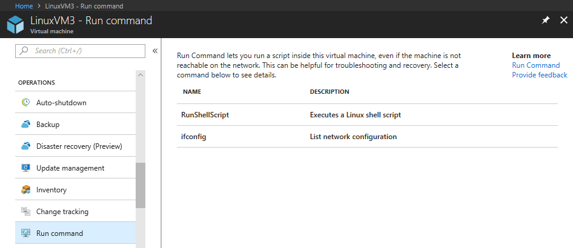
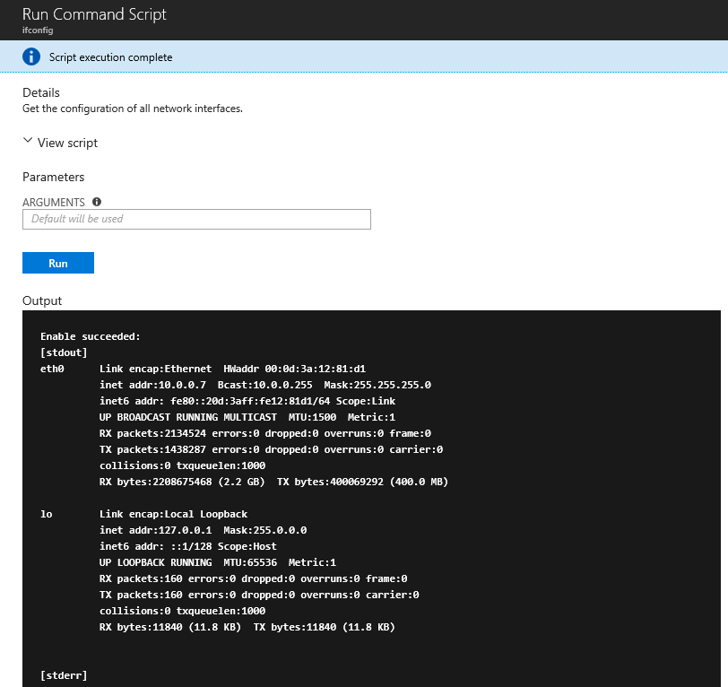

# Run shell scripts in your Linux VM with Run Command

Run Command uses the VM agent to run shell scripts within an Azure Linux VM. These scripts can be used for general machine or application management, and can be used to quickly diagnose and remediate VM access and network issues and get the VM back to a good state.

## Benefits

There are multiple options that can be used to access your virtual machines. Run Command can run scripts on your virtual machines remotely using the VM agent. Run Command can be used through the Azure portal, [REST API](/rest/api/compute/virtual%20machines%20run%20commands/runcommand), or [Azure CLI](/cli/azure/vm/run-command?view=azure-cli-latest#az-vm-run-command-invoke) for Linux VMs.

This capability is useful in all scenarios where you want to run a script within a virtual machines, and is one of the only ways to troubleshoot and remediate a virtual machine that doesn't have the RDP or SSH port open due to improper network or administrative user configuration.

## Restrictions

The following are a list of restrictions that are present when using Run Command.

* Output is limited to the last 4096 bytes
* The minimum time to run a script about 20 seconds
* Scripts run by default as elevated user on Linux
* One script at a time may run
* Scripts that prompt for information (interactive mode) are not supported.
* You cannot cancel a running script
* The maximum time a script can run is 90 minutes, after which it will time out
* Outbound connectivity from the VM is required to return the results of the script.

## Azure CLI

The following is an example using the [az vm run-command](/cli/azure/vm/run-command?view=azure-cli-latest#az-vm-run-command-invoke) command to run a shell script on an Azure Linux VM.

```azurecli-interactive
az vm run-command invoke -g myResourceGroup -n myVm --command-id RunShellScript --scripts "sudo apt-get update && sudo apt-get install -y nginx"
```

> [!NOTE]
> To run commands as a different user, you can use `sudo -u` to specify a user account to use.

## Azure portal

Navigate to a VM in [Azure](https://portal.azure.com) and select **Run command** under **OPERATIONS**. You are presented with a list of the available commands to run on the VM.



Choose a command to run. Some of the commands may have optional or required input parameters. For those commands the parameters are presented as text fields for you to provide the input values. For each command you can view the script that is being run by expanding **View script**. **RunShellScript** is different from the other commands as it allows you to provide your own custom script. 

> [!NOTE]
> The built-in commands are not editable.

Once the command is chosen, click **Run** to run the script. The script runs and when complete, returns the output and any errors in the output window. The following screenshot shows an example output from running the **ifconfig** command.



## Available Commands

This table shows the list of commands available for Linux VMs. The **RunShellScript** command can be used to run any custom script you want.

|**Name**|**Description**|
|---|---|
|**RunShellScript**|Executes a Linux shell script.|
|**ifconfig**| Get the configuration of all network interfaces.|

## Limiting access to Run Command

Listing the run commands or showing the details of a command require the `Microsoft.Compute/locations/runCommands/read` permission, which the built-in [Reader](../../role-based-access-control/built-in-roles.md#reader) role and higher have.

Running a command requires the `Microsoft.Compute/virtualMachines/runCommand/action` permission, which the [Contributor](../../role-based-access-control/built-in-roles.md#virtual-machine-contributor) role and higher have.

You can use one of the [built-in](../../role-based-access-control/built-in-roles.md) roles or create a [custom](../../role-based-access-control/custom-roles.md) role to use Run Command.

## Next steps

See, [Run scripts in your Linux VM](run-scripts-in-vm.md) to learn about other ways to run scripts and commands remotely in your VM.
