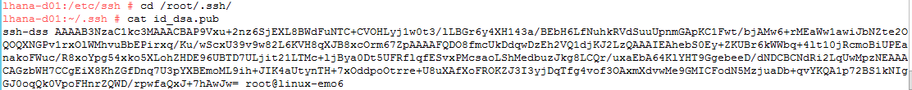
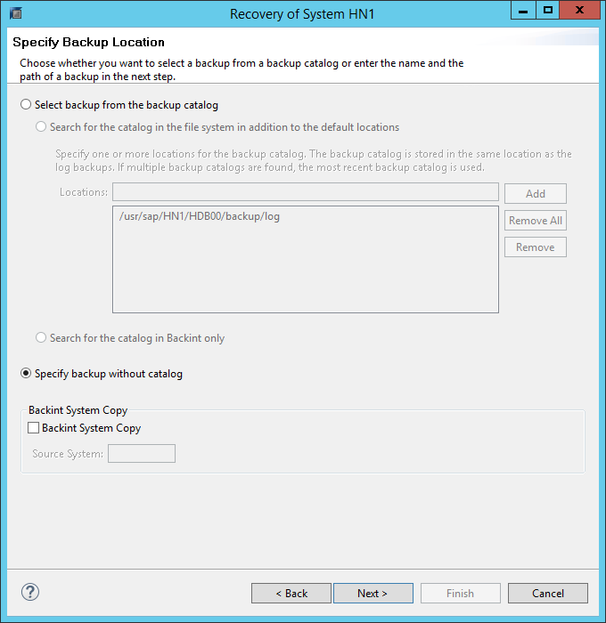
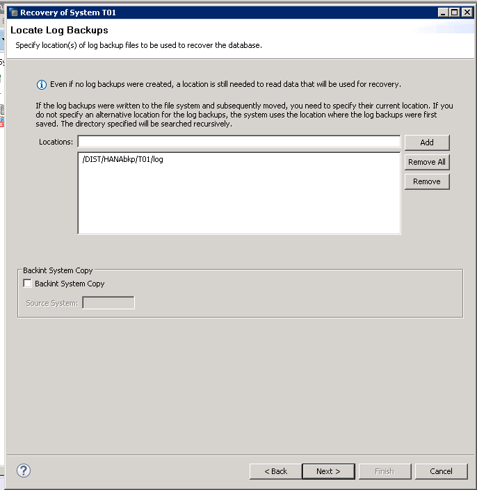
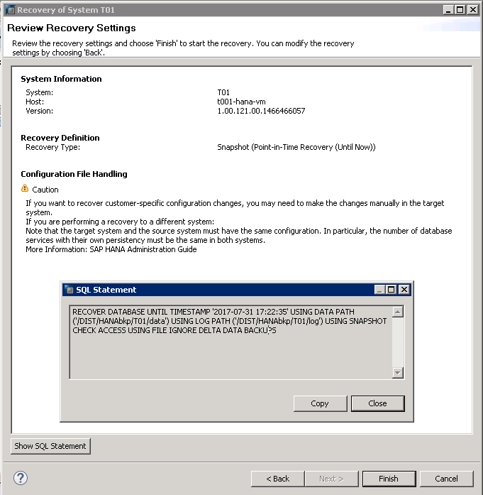

# High Availability and Disaster Recovery of SAP HANA on Azure (Large Instances)

High Availability (HA) and Disaster Recovery (DR) are important aspects of running your mission-critical SAP HANA on Azure (Large Instances) server(s). It's import to work with SAP, your system integrator, and/or Microsoft to properly architect and implement the right HA/DR strategy for you. Important considerations like Recovery Point Objective (RPO) and Recovery Time Objective (RTO), specific to your environment, must be considered.

## High Availability

Microsoft supports the SAP HANA High Availability methods &quot;out of the box&quot;, which include:

- **Storage Replication:** Ability for the storage system itself to replicate all data to another location (within, or separate, from the same data center). SAP HANA operates independently from this method.
- **System Replication:** Replication of all data in SAP HANA to a separate SAP HANA system. RTO is minimized through data replicating at regular intervals. SAP HANA supports asynchronous, synchronous in-memory, and synchronous modes (recommended for only SAP HANA systems within the same data center or less than 100 km apart).
- **Host Auto-Failover:** One or more standby SAP HANA nodes are configured in &quot;scale out&quot; mode and SAP HANA automatically &quot;fails over&quot; to another node when the master node becomes unavailable.

For more information on SAP HANA High Availability, see the following SAP information:

- [SAP HANA High-Availability Whitepaper](http://go.sap.com/documents/2016/05/f8e5eeba-737c-0010-82c7-eda71af511fa.html)
- [SAP HANA Administration Guide](http://help.sap.com/hana/SAP_HANA_Administration_Guide_en.pdf)
- [SAP Academy Video on SAP HANA System Replication](http://scn.sap.com/community/hana-in-memory/blog/2015/05/19/sap-hana-system-replication)
- [SAP Support Note #1999880 – FAQ on SAP HANA System Replication](https://bcs.wdf.sap.corp/sap/support/notes/1999880)
- [SAP Support Note #2165547 – SAP HANA Backup and Restore within SAP HANA System Replication Environment](https://websmp230.sap-ag.de/sap(bD1lbiZjPTAwMQ==)/bc/bsp/sno/ui_entry/entry.htm?param=69765F6D6F64653D3030312669765F7361706E6F7465735F6E756D6265723D3231363535343726)
- [SAP Support Note #1984882 – Using SAP HANA System Replication for Hardware Exchange with Minimum/Zero Downtime](https://websmp230.sap-ag.de/sap(bD1lbiZjPTAwMQ==)/bc/bsp/sno/ui_entry/entry.htm?param=69765F6D6F64653D3030312669765F7361706E6F7465735F6E756D6265723D3139383438383226)

## Disaster Recovery

SAP HANA on Azure (Large Instances) is offered in two Azure regions in a geo-political region. Between the two Large Instance stamps of two different regions is a direct network connectivity for replicating data during Disaster Recovery. The replication of the data is storage infrastructure based. The replication of the data is not done by default—it is done for customer configurations that ordered Disaster Recovery.

However, to take advantage of the Disaster Recovery, you need to start to design the network connectivity to the two different Azure regions accordingly. This means you would need an ExpressRoute circuit connecting from on-premises in your main Azure region, and another circuit connecting from on-premises into your DR region. This measure would cover a situation in which a complete Azure region, including MSEE location, has an issue.

As a second measure, you ideally would need to connect all Azure VNets that connect to SAP HANA on Azure (Large Instances) in one of the regions to both of those ExpressRoute circuits. This would address the case of just one of the MSEE locations that connects your on-premises location with Azure going off duty.

The figure below shows the optimal configuration for Disaster Recovery:


The optimal case for a DR configuration of the network is to have two ExpressRoute circuits from on-premises to the two different Azure regions. One circuit goes to region #1, running a production instance. The second ExpressRoute circuit goes to region #2, running some non-production HANA instances (this is important in case an entire Azure region, including MSEE and Large Instance stamp, goes off the grid).

As a second measure, all the different VNets are connected to the different ExpressRoute circuits connecting to SAP HANA on Azure (Large Instances). You can bypass the location where an MSEE is failing, or you can lower RPO for Disaster Recovery, as you will see later.

The next requirements for a DR setup are:

- You need SAP HANA on Azure (Large Instances) SKUs of the same size as your production SKUs ordered and deployed in the DR region. These instances can be used to run test, sandbox or QA HANA instances.
- Additionally, you need to order a DR profile for each of your SAP HANA on Azure (Large Instances) SKUs that you want to recover in the DR site, if necessary. This leads to the allocation of storage volumes, which are the target of the storage replication from your production region into the DR region.

After this is all set-up, it is then your responsibility to start the storage replication. In the storage infrastructure used for SAP HANA on Azure (Large Instances), the basis of storage replication is storage snapshots. To start the DR replication, you need to perform:

- A snapshot of your boot LUN as described earlier.
- A snapshot of your HANA-related volumes as described earlier.

After the execution of these snapshots, an initial replica of the volumes is seeded on the volumes associated with your DR profile in the DR region.

Subsequently every hour the latest storage snapshot is leveraged to replicate the delta that developed on the storage volumes in the meantime.

The RPO achieved with this configuration is between 60–90 minutes. To achieve a better RPO in the DR case, you need to copy the HANA transaction log backups off of SAP HANA on Azure (large Instances) and into the other Azure region. To achieve this, you would:

- Back up the HANA Transaction Log as frequently as possible into /hana/log/backup.
- Then, copy the transaction log backups when they are finished to an Azure VM, which is in a VNet that is connected to the SAP HANA on Azure (Large Instances) server.
- From that VM, copy the backup to a VM which is in a VNet in the DR region.
- Keep the transaction log backups in that region in the VM.

In case of disaster, after the DR profile has been deployed on an actual server, copy the transaction log backups from the VM in to the SAP HANA on Azure (Large Instances) that is now the primary in the DR region, and restore those backups. This is possible because the state of HANA the on DR disks is that of a HANA snapshot. This is the offset point for further restores of transaction log backups.

## Backup and restore

One of the most important aspects to operating databases is making sure the database can be protected from several different types of catastrophic events. These events can be caused by anything from natural disasters to simple user errors.

Backing up a database, with the ability to restore to any point in time (such as before somebody deleted critical data), allows restoration to a state that is as close as possible to the way it was before the disruption occurred.

Two types of backups must be performed for best results:

- Database backups
- Transaction Log backups

In addition to full database backups performed at an application-level, you can be even more thorough by performing backups with storage snapshots. Performing log backups is also important for restoring the database (and to empty the logs from already committed transactions).

There are two backup and restore options for SAP HANA on Azure (Large Instances):

- DIY (Do It Yourself). After calculating and ensuring enough disk space, perform full database and log backups using disk backup methods (to those disks). Over time, the backups are copied to Azure Storage (after setting up an Azure-based file server with virtually unlimited standard storage), or use Azure Backup Vault or Azure Cold Storage. Another option could be to use a third-party data protection tool, such as Commvault, to store the backups once they are copied to Azure standard storage. The DIY backup option may also be necessary for data that needs to be stored for longer periods due to compliancy and auditing purposes.
- Use the backup and restore functionality that the underlying infrastructure of SAP HANA on Azure (Large Instances) provides. This option fulfills the need for backups, and it makes manual backups nearly obsolete (except in cases where data backups are required for compliance purposes). The rest of this section addresses the backup and restore functionality offered with HANA Large Instances.   
PLEASE NOTE: The snapshot technology that is used by the underlying infrastructure of HANA Large Instances has a dependency on SAP HANA Snapshots. SAP HANA Snapshots do not work in conjunction with SAP HANA Multitenant Database Containers. As a result this method of backup can not be leveraged for SAP HANA Multitenant Database Container deployments!!

### Using storage snapshots of SAP HANA on Azure (Large Instances)

The storage infrastructure underlying SAP HANA on Azure (Large Instances) supports the notion of a storage snapshot of volumes. Both backup and restoration of a particular volume is supported with the following considerations:

- Instead of database backups, storage volume snapshots are taken on a frequent basis.
- The storage snapshot initiates an SAP HANA snapshot before executing the storage snapshot. This HANA snapshot will be the point to set up eventual log restores after recovery of the storage snapshot.
- At the point where the storage snapshot is executed successfully, the SAP HANA snapshot will be deleted.
- Log backups are taken frequently and stored in the log backup volume or in Azure.
- If the database must be restored to a certain point in time, a request is made to Microsoft Azure Support (production outage) or SAP HANA on Azure Service Management to restore to a certain storage snapshot (for example, a planned restore of a sandbox system to its original state).
- The SAP HANA snapshot included in the storage snapshot is an offset point for applying log backups that have been executed and stored after the storage snapshot was taken.
- These log backups are taken to restore the database back to a certain point in time.

Specifying the backup\_name will snapshot the following volumes:

- hana/data
- hana/log
- hana/log\_backup (mounted as backup into hana/log)
- hana/shared

### Storage snapshot considerations

>[!NOTE] 
>Storage snapshots are _not_ provided free of charge as additional storage space must be allocated.

Specific mechanics of storage snapshots for SAP HANA on Azure (Large Instances):

- A specific storage snapshot (at the point in time it is taken) consumes very little storage.
- As data content changes and the content in SAP HANA data files change on the storage volume, the snapshot needs to store the original block content.
- The storage snapshot increases in size. The longer the snapshot exists, the larger the storage snapshot becomes.
- The more changes made to the SAP HANA database volume over the lifetime of a storage snapshot, the larger the space consumption of the storage snapshot.

SAP HANA on Azure (Large Instances) comes with fixed volume sizes for the SAP HANA data and log volume. Performing snapshots of those volumes will eat into your volume space, so it is your responsibility to schedule storage snapshots (within the SAP HANA on Azure Large Instances process).

The following sections provide information for performing these snapshots including general recommendations:

- Though the hardware can sustain 255 snapshots per volume, it is highly recommended to stay well below this number.
- Free space must be monitored and known before performing storage snapshots.
- Lower the number of storage snapshots based on free space. The number of snapshots kept might need to be lowered or the volumes might need to be extended (additional storage can be ordered in 1 TB units).
- During activities like moving data into SAP HANA with system migration tools (with R3Load, or restoring SAP HANA databases from backups), it is highly recommended to not perform any storage snapshots. (Usually a system migration is being done on a new SAP HANA system, so storage snapshots would not need to be performed in that case.)
- During larger reorganizations of SAP HANA tables, storage snapshots should be avoided if possible.
- Also, storage snapshots are a pre-requisite to engage the DR capabilities of SAP HANA on Azure (Large Instances).

### Setting up storage snapshots

1. Make sure that Perl is installed in the Linux operating system on the HANA Large Instances server.

2. Modify /etc/ssh/ssh\_config to add the line _MACs hmac-sha1_.

3. Create an SAP HANA backup user account on the master node for each SAP HANA instance you are running (if applicable).

4. The SAP HANA HDB client must be installed on all HANA Large Instances servers.

5. On the first HANA Large Instances server of each region, a public key must be created to access the underlying storage infrastructure that controls snapshot creation.

6. Copy the script azure\_hana\_backup.pl from /scripts to the location of **hdbsql** of the SAP HANA installation.

7. Copy the HANABackupDetails.txt file from /scripts to same location as the Perl script.

8. Modify the HANABackupDetails.txt file as necessary for the appropriate customer specifications.

### Detailed storage snapshot steps

**Step 1: Install SAP HANA HDBClient**

The Linux installed on SAP HANA on Azure (Large Instances) includes the folders and scripts necessary to execute SAP HANA storage snapshots for backup and Disaster Recovery purposes. However, it is your responsibility to install SAP HANA HDBclient while installing SAP HANA.  (Microsoft will not install the HDBclient nor SAP HANA.)

**Step 2: Change /etc/ssh/ssh\_config**

Change /etc/ssh/ssh\_config by adding _MACs hmac-sha1_ line as shown below.
Edit the section below to add **MACs hmac-sha1**:
```
#   RhostsRSAAuthentication no
#   RSAAuthentication yes
#   PasswordAuthentication yes
#   HostbasedAuthentication no
#   GSSAPIAuthentication no
#   GSSAPIDelegateCredentials no
#   GSSAPIKeyExchange no
#   GSSAPITrustDNS no
#   BatchMode no
#   CheckHostIP yes
#   AddressFamily any
#   ConnectTimeout 0
#   StrictHostKeyChecking ask
#   IdentityFile ~/.ssh/identity
#   IdentityFile ~/.ssh/id_rsa
#   IdentityFile ~/.ssh/id_dsa
#   Port 22
Protocol 2
#   Cipher 3des
#   Ciphers aes128-ctr,aes192-ctr,aes256-ctr,arcfour256,arcfour128,aes128-cbc,3des-cbc
#   MACs hmac-md5,hmac-sha1,umac-64@openssh.com,hmac-ripemd160
MACs hmac-sha1
#   EscapeChar ~
#   Tunnel no
#   TunnelDevice any:any
#   PermitLocalCommand no
#   VisualHostKey no
#   ProxyCommand ssh -q -W %h:%p gateway.example.com
```

**Step 3: Create a public key**

On the first SAP HANA on Azure (Large Instances) server in each Azure region, a public key needs to be created that is used to access the storage infrastructure allowing creation of snapshots. The public key ensures a password is not required to login to the storage and that password credentials are not maintained. In Linux on the HANA Large Instances server, execute the following command to generate the public key:
```
  ssh-keygen –t dsa –b 1024
```
The new location is _/root/.ssh/id\_dsa.pub.__Do not_ enter an actual passphrase or else each login will require you to enter the passphrase before proceeding. Instead, hit **Enter** twice to remove the enter passphrase requirement upon login.

Check to make sure the public key was corrected as expected by changing folders to /root/.ssh/ and then executing the **ls** command_._ If the key is present, the public key is copied by running the following command and then the entire string is copied:



At this point, contact SAP HANA on Azure Service Management and provide the key. They will use the public key to register it in the underlying storage infrastructure.

**Step 4: Create an SAP HANA user account**

Create an SAP HANA user account within SAP HANA Studio for backup purposes. This account must have the following privileges: BACKUP ADMIN and CATALOG READ. In this example, the user account of SCADMIN is created.


**Step 5: Authorize the SAPA HANA user account**

Authorize the SAPA HANA user account (to be used by the scripts without requiring authorization every time the script is run). The SAP HANA command **hdbuserstore** allows the creation of an SAP HANA user key stored on one or more SAP HANA nodes and allows the user to access SAP HANA without having to manage passwords from within the scripting process discussed below.

>[!IMPORTANT]
>The command below must be run as _root_. Otherwise the script will not work properly.

The **hdbuserstore** command is entered as follows below:


In the following example, where the user is SCADMIN01 and the hostname is lhanad01, the command is:
```
hdbuserstore set SCADMIN01 lhanad01:30115 <backup username> <password>
```
Choose to manage all scripting from a single server for scale-out HANA instances. In this example, the SAP HANA key of SCADMIN01 must be altered for each host in a way that reflects the host that is related to the key (that is, the SAP HANA backup account is amended with the instance number of the HANA DB **lhanad**). The key must have administrative privileges on the host it is assigned to and the backup user for scale-out must have access rights to all SAP HANA instances.
```
hdbuserstore set SCADMIN01 lhanad:30015 SCADMIN <password>
hdbuserstore set SCADMIN02 lhanad:30115 SCADMIN <password>
hdbuserstore set SCADMIN03 lhanad:30215 SCADMIN <password>
```

**Step 6: Copy items from the /scripts folder**

Copy either the following items from the /scripts folder, included on the gold image of the installation, to the working directory for **hdbsql**. For current HANA installs, this is /hana/shared/D01/exe/linuxx86\_64/hdb.
```
azure\_hana\_backup.pl
testHANAConnection.pl
testStorageSnapshotConnection.pl
removeTestStorageSnapshot.pl
HANABackupCustomerDetails.txt
```
or the following items if they are running scale-out or OLAP:
```
azure\_hana\_backup\_bw.pl
testHANAConnectionBW.pl
testStorageSnapshotConnectionBW.pl
removeTestStorageSnapshotBW.pl
HANABackupCustomerDetailsBW.txt
```
The HANABackupCustomerDetails.txt file is modifiable as follows for a scale-up deployment. It basically is the control and configuration file for the script that will run the storage snapshots. Please note that you should have received the _Storage Backup Name_ and _Storage IP Address_ from SAP HANA on Azure Service Management when your instances were deployed. You _cannot_ modify the sequence, ordering, or spacing of any of the variables, or the script will not run properly.

For a scale-up deployment, the configuration file would look like:
```
#Provided by Microsoft Service Management
Storage Backup Name: lhanad01backup
Storage IP Address: 10.250.20.21
#Created by customer using hdbuserstore
HANA Backup Name: SCADMIND01
```
For a scale-out configuration, the HANABackupCustomerDetailsBW.txt file would look like:
```
#Provided by Microsoft Service Management
Storage Backup Name: lhanad01backup
Storage IP Address: 10.250.20.21
#Node IP addresses, instance numbers, and HANA backup name
#provided by customer.  HANA backup name created using
#hdbuserstore utility.
Node 1 IP Address: 10.254.15.21
Node 1 HANA instance number: 01
Node 1 HANA Backup Name: SCADMIN01
Node 2 IP Address: 10.254.15.22
Node 2 HANA instance number: 02
Node 2 HANA Backup Name: SCADMIN02
Node 3 IP Address: 10.254.15.23
Node 3 HANA instance number: 03
Node 3 HANA Backup Name: SCADMIN03
Node 4 IP Address: 10.254.15.24
Node 4 HANA instance number: 04
Node 4 HANA Backup Name: SCADMIN04
Node 5 IP Address: 10.254.15.25
Node 5 HANA instance number: 05
Node 5 HANA Backup Name: SCADMIN05
Node 6 IP Address: 10.254.15.26
Node 6 HANA instance number: 06
Node 6 HANA Backup Name: SCADMIN06
Node 7 IP Address: 10.254.15.27
Node 7 HANA instance number: 07
Node 7 HANA Backup Name: SCADMIN07
Node 8 IP Address: 10.254.15.28
Node 8 HANA instance number: 08
Node 8 HANA Backup Name: SCADMIN08
```
It is important to note that only Node 1 details are used in the actual HANA storage snapshot script currently, but it is recommended that you test access to/from all HANA nodes so that, if the master backup node must ever change, you already have ensured any other node can take its place by modifying the details in Node 1.

To check for the correct configurations in the configuration file or proper connectivity to the HANA instances, you should run the first script (independent on SAP workload) listed blow for a scale-up configuration, and the second script in the list for a scale-out configuration.
```
testHANAConnection.pl
```
or for scale-out configurations:
```
testHANAConnectionBW.pl
```
Ensure that the master HANA instance has access to all required HANA servers. There are no parameters to the script, but the appropriate HANABackupCustomerDetails/ HANABackupCustomerDetailsBW file must be completed for the script to run properly. While it is not possible for the script to error-check every particular instance, as only the shell command error codes are returned, the script does provide some helpful comments for you to double check.

To run the script:
```
 ./testHANAConnection.pl
```
The script will output the message that the HANA connection was successful if the script is successful in obtaining the status of the HANA instance.

Additionally, there is a second type of script to check the master HANA instance server&#39;s ability to login to the storage. It is required that you to execute the following script before executing the azure\_hana\_backup(\_bw).pl script. Whenever no snapshots exist in a volume, it is impossible to determine the difference between a volume that contains no snapshots or an ssh failure in obtaining the snapshot details.  For this reason, the following script execution executes two steps:

- Verifies that the storage console is accessible.
- Creates a test, or dummy, snapshot for each volume by HANA instance.

For this reason, the HANA instance is included as an argument. Again, it is not possible to provide error checking as it relates to the connection of the storage, but the script provides helpful hints if the execution fails.

The script is run as:
```
 ./testStorageSnapshotConnection.pl <hana instance>
```
Or
```
./testStorageSnapshotConnectionBW.pl <hana instance>
```
The script will also output the message that you are able to login appropriately to your deployed storage tenant that is organized around your LUNs used by the server instances you own.

Before you execute the first storage snapshot-based backups, you should run these scripts to make sure the configuration is correct.

After running these scripts, you should delete the snapshots by executing:
```
./removeTestStorageSnapshot.pl <hana instance>
```
Or
```
./removeTestStorageSnapshot.pl <hana instance>
```

**Step 7: Perform on-demand snapshots**

Perform on-demand snapshots (as well as scheduling of regular snapshots using cron) as described below, by executing the following script for scale-up configurations:
```
./azure_hana_backup.pl lhanad01 customer 20
```
Or execute it as follows for scale-out configurations:
```
./azure_hana_backup_bw.pl lhanad01 customer 20
```
The scale-out script does some additional checking to make sure all HANA servers can be accessed, and all HANA instances return appropriate status of the instance before proceeding with creating SAP HANA or storage snapshots.

The following arguments are required:

- The HANA instance requiring backup.
- The snapshot prefix for the storage snapshot.
- The number of snapshots to be kept for the specific prefix.
```
./azure_hana_backup.pl lhanad01 customer 20
```
The execution of the script creates the storage snapshot in these three distinct phases:

- Execute a HANA snapshot.
- Execute a storage snapshot.
- Remove the HANA snapshot.

Execute the script by calling it from the HDB executable folder that it was copied into. It will back up at least the following volumes, but will also back up any volume that has the explicit SAP HANA instance name in the volume name.
```
hana_data_<hana instance>_prod_t020_vol
hana_log_<hana instance>_prod_t020_vol
hana_log_backup_<hana instance>_prod_t020_vol
hana_shared_<hana instance>_prod_t020_vol
```
The retention period is strictly administrated with the number of snapshots submitted as a parameter when executing the script (such as 20, shown above). So the amount of time is a function of the period of execution, and the number of snapshots in the call of the script. If the number of snapshots that are kept exceeds the number named as a parameter in the call of the script, the oldest storage snapshot of this label (in our case above, _custom_), will be deleted before executing a new snapshot. This means the number you give as the last parameter of the call is the number you can use to control the number of snapshots.

>[!NOTE] 
>As soon as you change the label, the counting starts again.

You need to include the HANA instance name provided by SAP HANA on Azure Service Management as an argument if they are snapshotting multi-node environments. In single-node environments, the name of the SAP HANA on Azure (Large Instance) unit is sufficient, but the HANA instance name is still recommended.

Additionally, the ability is provided to backup boot volumes\luns using the same script. You must back up your boot volume at least once when you first get HANA running, although a weekly or nightly backup schedule for boot in cron is recommended. Rather than adding an SAP HANA instance name, just insert _boot_ as the argument into the script as follows:
```
./azure_hana_backup boot customer 20
```
The same retention policy is afforded to the boot volume as well. On-demand snapshots, as described above, should be used for special cases only (such as during an SAP EHP upgrade, or at times when you need to create a distinct storage snapshot).

You are highly encouraged to perform scheduled storage snapshots using cron, and it is recommended that the same script is used for all backups and Disaster Recovery needs (modifying the inputs of the script to match the different backup times requested). These are all scheduled differently in cron depending on their execution time: hourly, 12-hour, daily, or weekly (depending on circumstances). The cron schedule is designed to create storage snapshots that match the retention labeling discussed earlier for long-term off-site backup. The script includes commands to backup all production volumes depending on requested frequency (data and log files are backed up hourly, whereas the boot volume is only backed up daily).

The entries in the following cron script run every hour at the tenth minute, every 12 hours at the tenth minute, and daily at the tenth minute. The cron jobs are created in such a way that only one SAP HANA storage snapshot takes place during any given hour, so that both an hourly and daily backup does not occur at the same time (12:10AM). SAP HANA on Azure Service Management will provide the recommended time for you to run your backups to optimize your snapshot creation and replication.

The default cron scheduling in /etc/crontab is as follows:
```
10 1-11,13-23 * * * ./azure_hana_backup.pl lhanad01 hourly 66
10 12 * * *  ./azure_hana_backup.pl lhanad01 12hour 14
```
In the cron instructions above, the HANA volumes (without boot volume), get a snapshot with the label hourly. Of these snapshots, 66 are retained. Additionally, 14 snapshots with the label 12hour are retained, so you basically have the possibility of hourly snapshots of three days, plus 12hour snapshots for another four days, so you cover a whole week with these snapshots. (The hourly snapshots are not scheduled at each of the full 12 hours. Only one snapshot is created at the 12hour, rather than both an hourly and a 12hour snapshot.)

Scheduling within cron can be tricky, as only one script should be executed at any given time unless the script is staggered by several minutes. If you want daily backups for long-term retention, either a daily is kept along with a 12hour (with a retention count of seven each), or the hourly snapshot is staggered to take place ten minutes later, but only one daily snapshot is kept in the production volume.
```
10 1-11,13-23 * * * ./azure_hana_backup.pl lhanad01 hourly 66
10 12 * * *  ./azure_hana_backup.pl lhanad01 12hour 7 
10 0 * * * ./azure_hana_backup.pl lhanad01 daily 7
```
The frequencies listed are just examples. You need to get to your optimum number of snapshots based on the following criteria:

- Requirements in RTO for point-in-time recovery.
- Space usage.
- Requirements in RPO and RTO for potential disaster recovery.
- Eventual execution of HANA full database backups against disks. Whenever a full database backup against disks, or _backint_ interface, is performed, the execution of storage snapshots will fail. If you plan to execute full database backups on top of storage snapshots, you would need to make sure the execution of storage snapshots is disabled during this time.

>[!IMPORTANT]
> The usage of storage snapshots for SAP HANA backups is only valid when performed in conjunction with SAP HANA log backups. These log backups need to be able to cover the time periods between the storage snapshots. If a commitment to users has been set for a point in time recovery of 30 days, the following is needed:

- Ability to access a storage snapshot that is 30 days old.
- Contiguous log backups over the last 30 days.

In the range of log backups, snapshot the backup log volume as well. However, you must ensure that regular log backups are performed in order to:

- Have the contiguous log backups needed to perform point-in-time recoveries.
- Prevent the SAP Hana log volume from running out of space.

One of the last steps is to schedule SAP HANA backup logs in SAP HANA Studio. The SAP HANA backup log target destination is the specially created hana/log\_backups volume with the mount point of /hana/log/backups.


Backups more frequent than every 15 minutes can be chosen. Some users even perform log backups every minute, however going _over_ 15 minutes is not recommended.

The last step is to create a file-based backup (after the initial installation of SAP HANA) to create a single backup entry that must exist within the backup catalog. Otherwise SAP HANA will not initiate the specified log backups as previously set.


### Monitoring number and size of snapshots on disk volume

On a particular storage volume, you can monitor the number of snapshots and the storage consumption of snapshots. The **ls** command will not show the snapshot directory or files. However, the Linux OS command **du** will, with the following commands:
```
- du –sh .snapshot will provide a total of all snapshots within the snapshot directory.
- du –sh --max-depth=1 will list all snapshots saved in the .snapshot folder and the size of each snapshot.
- du –hc will just provide the total size used by all snapshots.
```
Use these commands to make sure that the snapshots taken and stored are not consuming all the storage on the volumes.

### Reducing the number of snapshots on a server

As explained earlier, you can reduce the number stored of a certain label of snapshots. The last two parameters of the command to initiate a snapshot are a label and the number of snapshots you want to retain.
```
./azure_hana_backup.pl lhanad01 customer 20
```
In the example above the snapshot label is _customer_ and the number of snapshots with this label to be retained is _20_. As you respond to disk space consumption you might want to reduce the number of snapshots stored. The easy way to reduce the snapshots is to run the script with the last parameter set to 5:
```
./azure_hana_backup.pl lhanad01 customer 5
```
As a result of running the script with setting above, the snapshots are getting reduced, so, that the number of snapshots including the new storage snapshot is 5. Be aware:

- A reduction can only be achieved if the last snapshot created before the run with the reduced number is more than one hour old.
- The script also fails to delete snapshots that are younger than one hour.

These restrictions are related to the optional DR functionality offered.

Suppose you are no longer interested in maintaining a set of snapshots with that prefix, you can execute the script with _0_ as the retention number and the script will remove all snapshots matching that prefix, and then the script will exit. However, this will impact the capabilities of Disaster Recovery.

### Recovering to the latest HANA snapshot

In the event you experience a production down scenario, the process of recovering from a storage snapshot can be initiated as a Customer Incident with SAP HANA on Azure Service Management. In some cases, this would be an unexpected, high urgency matter if data was deleted in a production system and the only way is to get that data back through a restore of the production database.

On the other hand, a point-in-time recovery could be low urgency and planned ahead for days in advance. You can plan this with the SAP HANA on Azure Service Management instead of raising a high priority issue. This would be the case if you plan to try an upgrade of the SAP software by applying a new Enhancement Package, and then need to revert back to a snapshot that represents the state before the EHP upgrade.

There are some preparations you have to do before issuing the request, as shown below. SAP HANA on Azure Service Management team will then be able to handle the request and provide the restored volumes. It is then up to you to restore the HANA database based on the snapshots.

>[!NOTE]  
>The screenshots shown below might vary based on the SAP HANA release you use.

1. Decide which snapshot to restore. Only the hana/data volume would be restored unless instructed otherwise.

2. Shut down the HANA instance.


3. Unmount the data volumes on each HANA database node. The restore of the snapshot will fail if the data volumes are not unmounted.


4. Open an Azure support request to instruct the restore of a specific snapshot.

    **While restoring the storage snapshot,** SAP HANA on Azure Service Management is restoring the snapshots for the volumes, might ask you to attend a conference call in order to ensure that no data is getting lost.

    **After restoring storage snapshot,** SAP HANA on Azure Service Management will notify you when the storage snapshot has been restored. 

5. Once the restore process is complete, remount all data volumes.


6. Select recover options within SAP HANA studio, if those do not automatically come up upon reconnecting to HANA DB through HANA Studio. The following example shows a restore to the last HANA snapshot. A storage snapshot embeds one HANA snapshot, and if you are restoring to last the storage snapshot, it should be the most recent HANA snapshot. (If you are restoring to older storage snapshots, you need to locate the HANA snapshot based on the time the storage snapshot was taken.)


7. Select the recovery type **Recover the database to a specific data backup or storage snapshot**.


8. Choose the option **Specify backup without catalog**.


9. Choose **Destination Type: Snapshot**.


10. Click **Finish** to start recovery process.


11. The HANA database is restored and recovered to the HANA snapshot included by the storage snapshot.


### Recovering to most recent state

This process restores back to a HANA snapshot that is included in the storage snapshot, and then restores the transaction log backups to latest state of the database before restoring the storage snapshot.

>[!Important] 
>Make sure that you have a complete and contiguous chain of transaction log backups before you proceed. Without that you are not going to be able to get back to the current state of the database.

Follow Steps 1 to 6 of the procedure for recovering to the latest HANA snapshot described above.

1. Choose **Recover the database to its most recent state**.


2. Specify the location of the latest HANA log backups. The location specified needs to contain all HANA transaction log backups from the HANA snapshot to most recent state.


3. Choose a backup as a base from which to recover the database. In our example, this is the HANA snapshot that was included in the storage snapshot. (Only one of those snapshots was done in the following screenshot.)


4. Deselect **Use Delta Backups** if those do not exist between the time of the HANA snapshot and the most recent state.


5. Click **Finish** on the summary screen to start the restore procedure.


To recover to a point time between the HANA snapshot (included in the storage snapshot) and one that is later than the HANA snapshot, point-in-time recovery:

- Make sure that you have all transaction log backups from the HANA snapshot to the time you want to recover.
- Choose **Recover the database to the following point in time** (see _Restore to most recent state_, Step 1).
- The remaining steps are the same as above.

## Monitoring snapshot execution

The execution of Storage Snapshots needs to be monitored by you. The script that executes a storage snapshot writes output into a file, and saves in the same location as the Perl scripts. A separate file is written for each snapshot. The output of that file shows clearly the different phases the snapshot script will execute, which are:

- Finding the volumes that need to create a snapshot.
- Finding the snapshots taken from these volumes.
- Deleting eventual existing snapshots to match the number of snapshots you specified.
- Creating a HANA snapshot.
- Creating the storage snapshot over the volumes.
- Deleting the HANA snapshot.
- Renaming the most recent snapshot to **.0**.

The most important part of the script is this:
```
**********************Creating HANA snapshot**********************
Creating the HANA snapshot with command: "./hdbsql -n localhost -i 01 -U SCADMIN01 "backup data create snapshot"" ...
HANA snapshot created successfully.
**********************Creating Storage snapshot**********************
Taking snapshot hourly.recent for hana_data_lhanad01_t020_vol ...
Snapshot created successfully.
Taking snapshot hourly.recent for hana_log_backup_lhanad01_t020_vol ...
Snapshot created successfully.
Taking snapshot hourly.recent for hana_log_lhanad01_t020_vol ...
Snapshot created successfully.
Taking snapshot hourly.recent for hana_shared_lhanad01_t020_vol ...
Snapshot created successfully.
Taking snapshot hourly.recent for sapmnt_lhanad01_t020_vol ...
Snapshot created successfully.
**********************Deleting HANA snapshot**********************
Deleting the HANA snapshot with command: "./hdbsql -n localhost -i 01 -U SCADMIN01 "backup data drop snapshot"" ...
HANA snapshot deletion successfully.
```
You can see from this sample how the script records the creation of the HANA snapshot. In the scale-out case, this is initiated on the master node. The master node will initiate the synchronous creation of the snapshots on each of the worker nodes.

Then the storage snapshot is taken. After the successful execution of the storage snapshots, the HANA snapshot is deleted.
