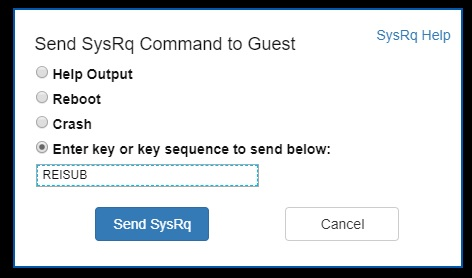

# Use Serial Console for SysRq and NMI calls

## System Request (SysRq)
A SysRq is a sequence of keys understood by the Linux operation system kernel, which can trigger a set of pre-defined actions. These commands are often used when virtual machine troubleshooting or recovery can't be performed through traditional administration (for example, if the VM is not responding). Using the SysRq feature of Azure Serial Console will mimic pressing of the SysRq key and characters entered on a physical keyboard.

Once the SysRq sequence is delivered, the kernel configuration will control how the system responds. For information on enabling and disabling SysRq, see the *SysRq Admin Guide* [text](https://aka.ms/kernelorgsysreqdoc) | [markdown](https://aka.ms/linuxsysrq).  

The Azure Serial Console can be used to send a SysRq to an Azure virtual machine using the keyboard icon in the command bar shown below.


Choosing "Send SysRq Command" will open a dialog, which will provide common SysRq options or accept a sequence of SysRq commands entered into the dialog.  This allows for series of SysRq's to perform a high-level operation such as a safe reboot using: `REISUB`.



The SysRq command can't be used on virtual machines that are stopped or whose kernel is in a non-responsive state. (for example a kernel panic).

### Enable SysRq 
As described in the *SysRq Admin Guide* above, SysRq can be configured such that all, none, or only certain commands are available. You can enable all SysRq commands using the step below but it will not survive a reboot:
```
echo "1" >/proc/sys/kernel/sysrq
```
To make the SysReq configuration persistent, you can do the following to enable all SysRq commands
1. Adding this line to */etc/sysctl.conf* <br>
    `kernel.sysrq = 1`
1. Rebooting or updating sysctl by running <br>
    `sysctl -p`

### Command Keys 
From the SysRq Admin Guide above:

|Command| Function
| ------| ----------- |
|``b``  |   Will immediately reboot the system without syncing or unmounting your disks.
|``c``  |   Will perform a system crash by a NULL pointer dereference. A crashdump will be taken if configured.
|``d``  |   Shows all locks that are held.
|``e``  |   Send a SIGTERM to all processes, except for init.
|``f``  |   Will call the oom killer to kill a memory hog process, but do not panic if nothing can be killed.
|``g``  |   Used by kgdb (kernel debugger)
|``h``  |   Will display help (any other key than those listed here will also display help, but ``h`` is easy to remember :-)
|``i``  |    Send a SIGKILL to all processes, except for init.
|``j``  |    Forcibly "Just thaw it" - filesystems frozen by the FIFREEZE ioctl.
|``k``  |    Secure Access Key (SAK) Kills all programs on the current virtual console. NOTE: See important comments below in SAK section.
|``l``  |    Shows a stack backtrace for all active CPUs.
|``m``  |    Will dump current memory info to your console.
|``n``  |    Used to make RT tasks nice-able
|``o``  |    Will shut off your system (if configured and supported).
|``p``  |    Will dump the current registers and flags to your console.
|``q``  |    Will dump per CPU lists of all armed hrtimers (but NOT regular timer_list timers) and detailed information about all clockevent devices.
|``r``  |    Turns off keyboard raw mode and sets it to XLATE.
|``s``  |    Will attempt to sync all mounted filesystems.
|``t``  |    Will dump a list of current tasks and their information to your console.
|``u``  |    Will attempt to remount all mounted filesystems read-only.
|``v``  |    Forcefully restores framebuffer console
|``v``  |    Causes ETM buffer dump [ARM-specific]
|``w``  |    Dumps tasks that are in uninterruptible (blocked) state.
|``x``  |    Used by xmon interface on ppc/powerpc platforms. Show global PMU Registers on sparc64. Dump all TLB entries on MIPS.
|``y``  |    Show global CPU Registers [SPARC-64 specific]
|``z``  |    Dump the ftrace buffer
|``0``-``9`` | Sets the console log level, controlling which kernel messages will be printed to your console. (``0``, for example would make it so that only emergency messages like PANICs or OOPSes would make it to your console.)

### Distribution-specific documentation ###
For distribution-specific documentation on SysRq and steps to configure Linux to create a crash dump when it receives a SysRq "Crash" command, see the links below:

#### Ubuntu ####
 - [Kernel Crash Dump](https://help.ubuntu.com/lts/serverguide/kernel-crash-dump.html)

#### Red Hat ####
- [What is the SysRq Facility and how do I use it?](https://access.redhat.com/articles/231663)
- [How to use the SysRq facility to collect information from a RHEL server](https://access.redhat.com/solutions/2023)

#### SUSE ####
- [Configure kernel core dump capture](https://www.suse.com/support/kb/doc/?id=3374462)

#### CoreOS ####
- [Collecting crash logs](https://coreos.com/os/docs/latest/collecting-crash-logs.html)

## Non-Maskable Interrupt (NMI) 
A non-maskable interrupt (NMI) is designed to create a signal that software on a virtual machine will not ignore. Historically, NMIs have been used to monitor for hardware issues on systems that required specific response times.  Today, programmers and system administrators often use NMI as a mechanism to debug or troubleshoot systems that are not responding.

The Serial Console can be used to send a NMI to an Azure virtual machine using the keyboard icon in the command bar shown below. Once the NMI is delivered, the virtual machine configuration will control how the system responds.  Linux operating systems can be configured to crash and create a memory dump the operating system receives an NMI.

 <br>

For Linux systems which support sysctl for configuring kernel parameters, you can enable a panic when receiving this NMI by using the following:
1. Adding this line to */etc/sysctl.conf* <br>
    `kernel.panic_on_unrecovered_nmi=1`
1. Rebooting or updating sysctl by running <br>
    `sysctl -p`

For more information on Linux kernel configurations, including `unknown_nmi_panic`, `panic_on_io_nmi`, and `panic_on_unrecovered_nmi`, see: [Documentation for /proc/sys/kernel/*](https://www.kernel.org/doc/Documentation/sysctl/kernel.txt). For distribution-specific documentation  on NMI and steps to configure Linux to create a crash dump when it receives an NMI, see the links below:
 
### Ubuntu 
 - [Kernel Crash Dump](https://help.ubuntu.com/lts/serverguide/kernel-crash-dump.html)

### Red Hat 
 - [What is an NMI and what can I use it for?](https://access.redhat.com/solutions/4127)
 - [How can I configure my system to crash when NMI switch is pushed?](https://access.redhat.com/solutions/125103)
 - [Crash Dump Admin Guide](https://access.redhat.com/documentation/en-us/red_hat_enterprise_linux/7/pdf/kernel_crash_dump_guide/kernel-crash-dump-guide.pdf)

### SUSE 
- [Configure kernel core dump capture](https://www.suse.com/support/kb/doc/?id=3374462)

### CoreOS 
- [Collecting crash logs](https://coreos.com/os/docs/latest/collecting-crash-logs.html)

## Next steps
* The main Serial Console Linux documentation page is located [here](serial-console.md).
* Use Serial Console to boot into [GRUB and enter single user mode](serial-console-grub-single-user-mode.md)
* The Serial Console is also available for [Windows](../windows/serial-console.md) VMs
* Learn more about [boot diagnostics](boot-diagnostics.md)