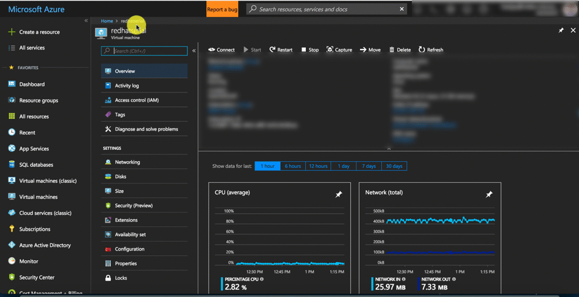

# Virtual machine serial console (preview) 

The virtual machine serial console on Azure provides access to a text-based console for Linux and Windows virtual machines. This serial connection is to COM1 serial port of the virtual machine and provides access to the virtual machine and are not related to virtual machine's network / operating system state. Access to the serial console for a virtual machine can be done only via Azure portal currently and allowed only for those users who have VM Contributor or above access to the virtual machine. 

> [!Note] 
> Previews are made available to you on the condition that you agree to the terms of use. For more information, see [Microsoft Azure Supplemental Terms of Use for Microsoft Azure Previews.] (https://azure.microsoft.com/support/legal/preview-supplemental-terms/)
> Currently this service is in **public preview** and access to the serial console for virtual machines is available to global Azure regions. At this point serial console is not available Azure Government, Azure Germany, and Azure China cloud.

## Prerequisites 

* Virtual machine  MUST have [boot diagnostics](boot-diagnostics.md) enabled 
* The account using the serial console must have [Contributor role](../../active-directory/role-based-access-built-in-roles.md) for VM and the [boot diagnostics](boot-diagnostics.md) storage account. 
* For settings specific to Linux distro, see [Accessing the serial console for Linux](#accessing-serial-console-for-linux)

## Open the serial console
serial console for virtual machines is only accessible via [Azure portal](https://portal.azure.com). Below are the steps to access serial console for virtual machines via portal 

  1. Open the Azure portal
  2. In the left menu, select virtual machines.
  3. Click on the VM in the list. The overview page for the VM will open.
  4. Scroll down to the Support + Troubleshooting section and click on serial console (Preview) option. A new pane with the serial console will open and start the connection.

> [!NOTE] 
> Serial console requires a local user with a password configured. At this time, VMs only configured with SSH public key will not have access to the serial console. To create a local user with password, follow [VM Access Extension](https://docs.microsoft.com/azure/virtual-machines/linux/using-vmaccess-extension) and create local user with password.

### Disable feature
The serial console functionality can be deactivated for specific VMs by disabling that VM's boot diagnostics setting.

## Serial console security 

### Access security 
Access to Serial console is limited to users who have [VM Contributors](../../active-directory/role-based-access-built-in-roles.md#virtual-machine-contributor) or above access to the virtual machine. If your AAD tenant requires Multi-Factor Authentication then access to the serial console will also need MFA as its access is via [Azure portal](https://portal.azure.com).

### Channel security
All data is sent back and forth is encrypted on the wire.

### Audit logs
All access to the serial console is currently logged in the [boot diagnostics](https://docs.microsoft.com/azure/virtual-machines/linux/boot-diagnostics) logs of the virtual machine. Access to these logs are owned and controlled by the Azure virtual machine administrator.  

>[!CAUTION] 
While no access passwords for the console are logged, if commands run within the console contain or output passwords, secrets, user names or any other form of Personally Identifiable Information (PII), those will be written to the virtual machine boot diagnostics logs, along with all other visible text, as part of the implementation of the serial console's scrollback functionality. These logs are circular and only individuals with read permissions to the diagnostics storage account have access to them, however we recommend following the best practice of using the SSH console for anything that may involve secrets and/or PII. 

### Concurrent usage
If a user is connected to serial console and another user successfully requests access to that same virtual machine, the first user will be disconnected and the second user connected in a manner akin to the first user standing up and leaving the physical console and a new user sitting down.

>[!CAUTION] 
This means that the user who gets disconnected will not be logged out! The ability to enforce a logout upon disconnect (via SIGHUP or similar mechanism) is still in the roadmap. For Windows there is an automatic timeout enabled in SAC, however for Linux you can configure terminal timeout setting. To do this simply add `export TMOUT=600` in your .bash_profile or .profile for the user you logon in the console with, to timeout the session after 10 minutes.

### Disable feature
The serial console functionality can be deactivated for specific VMs by disabling that VM's boot diagnostics setting.

## Common scenarios for accessing serial console 
Scenario          | Actions in serial console                |  OS Applicability 
:------------------|:-----------------------------------------|:------------------
Broken FSTAB file | Enter key to continue and fix fstab file using a text editor. See [how to fix fstab issues](https://support.microsoft.com/help/3206699/azure-linux-vm-cannot-start-because-of-fstab-errors) | Linux 
Incorrect firewall rules | Access serial console and fix iptables or Windows firewall rules | Linux/Windows 
Filesystem corruption/check | Access serial console and recover filesystem | Linux/Windows 
SSH/RDP configuration issues | Access serial console and change settings | Linux/Windows 
Network lock down system| Access serial console via portal to manage system | Linux/Windows 
Interacting with bootloader | Access GRUB/BCD via the serial console | Linux/Windows 

## Accessing serial console for Linux
In order for serial console to function properly, the guest operating system must be configured to read and write console messages to the serial port. Most [Endorsed Azure Linux Distributions](https://docs.microsoft.com/azure/virtual-machines/linux/endorsed-distros) have the serial console configured by default. Just by clicking in the portal on the Serial console section will provide access to the console. 

### Access for RedHat 
RedHat Images available on Azure have console access enabled by default. Single user mode in Red Hat requires root user to be enabled, which is disabled by default. If you have a need to enable single user mode, use the following instructions:

1. Log in to the Red Hat system via SSH
2. Enable password for root user 
 * `passwd root` (set a strong root password)
3. Ensure root user can only log in via ttyS0
 * `edit /etc/ssh/sshd_config` and ensure PermitRootLog in is set to no
 * `edit /etc/securetty file` to only allow log in via ttyS0 

Now if the system boots into single user mode you can log in via root password.

Alternatively for RHEL 7.4+ or 6.9+ you can enable single user mode in the GRUB prompts, see instructions [here](https://access.redhat.com/documentation/en-us/red_hat_enterprise_linux/5/html/installation_guide/s1-rescuemode-booting-single)

### Access for Ubuntu 
Ubuntu images available on Azure have console access enabled by default. If the system boots into Single User Mode you can access without additional credentials. 

### Access for CoreOS
CoreOS images available on Azure have console access enabled by default. If necessary system can be booted into Single User Mode via changing GRUB parameters and adding `coreos.autologin=ttyS0` would enable core user to log in and available in serial console. 

### Access for SUSE
SLES images available on Azure have console access enabled by default. If you are using older versions of SLES on Azure, follow the [KB article](https://www.novell.com/support/kb/doc.php?id=3456486) to enable serial console. Newer Images of SLES 12 SP3+ also allows access via the serial console in case the system boots into emergency mode.

### Access for CentOS
CentOS images available on Azure have console access enabled by default. For Single User Mode, follow instructions similar to Red Hat Images above. 

### Access for Oracle Linux
Oracle Linux images available on Azure have console access enabled by default. For Single User Mode, follow instructions similar to Red Hat Images above.

### Access for custom Linux image
To enable serial console for your custom Linux VM image, enable console access in /etc/inittab to run a terminal on ttyS0. Below is an example to add this in the inittab file 

`S0:12345:respawn:/sbin/agetty -L 115200 console vt102` 

## Errors
Most errors are transient in nature and retrying connection address these. Below table shows a list of errors and mitigation 

Error                            |   Mitigation 
:---------------------------------|:--------------------------------------------|
Unable to retrieve boot diagnostics settings for '<VMNAME>'. To use the serial console, ensure that boot diagnostics is enabled for this VM. | Ensure that the VM has [boot diagnostics](boot-diagnostics.md) enabled. 
The VM is in a stopped deallocated state. Start the VM and retry the serial console connection. | Virtual machine must be in a started state to access the serial console
You do not have the required permissions to use this VM the serial console. Ensure you have at least VM Contributor role permissions.| Serial console access requires certain permission to access. See [access requirements](#prerequisites) for details
Unable to determine the resource group for the boot diagnostics storage account '<STORAGEACCOUNTNAME>'. Verify that boot diagnostics is enabled for this VM and you have access to this storage account. | Serial console access requires certain permission to access.See [access requirements](#prerequisites) for details

## Known issues 
As we are still in the preview stages for serial console access, we are working through some known issues, below is the list of these with possible workarounds 

Issue                           |   Mitigation 
:---------------------------------|:--------------------------------------------|
There is no option with virtual machine scale set instance serial console |  At the time of preview, access to the serial console for virtual machine scale set instances is not supported.
Hitting enter after the connection banner does not show a log in prompt | [Hitting enter does nothing](https://github.com/Microsoft/azserialconsole/blob/master/Known_Issues/Hitting_enter_does_nothing.md)

## Frequently asked questions 
**Q. How can I send feedback?**

A. Provide feedback as an issue by going to https://aka.ms/serialconsolefeedback. Alternatively (less preferred) Send feedback via azserialhelp@microsoft.com or in the virtual machine category of http://feedback.azure.com

**Q.I get an Error "Existing console has conflicting OS type "Windows" with the requested OS type of Linux?**

A. This is a known issue to fix this, simply open [Azure Cloud Shell](https://docs.microsoft.com/azure/cloud-shell/overview) in bash mode and retry.

**Q. I am not able to access the serial console, where can I file a support case?**

A. This preview feature is covered via Azure Preview Terms. Support for this is best handled via channels mentioned above. 

## Next steps
* The the serial console is also available for [Windows](../windows/serial-console.md) VMs
* Learn more about [bootdiagnostics](boot-diagnostics.md)