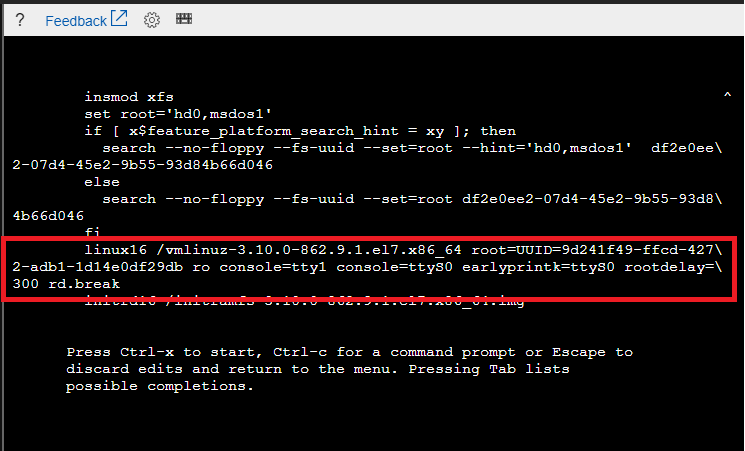
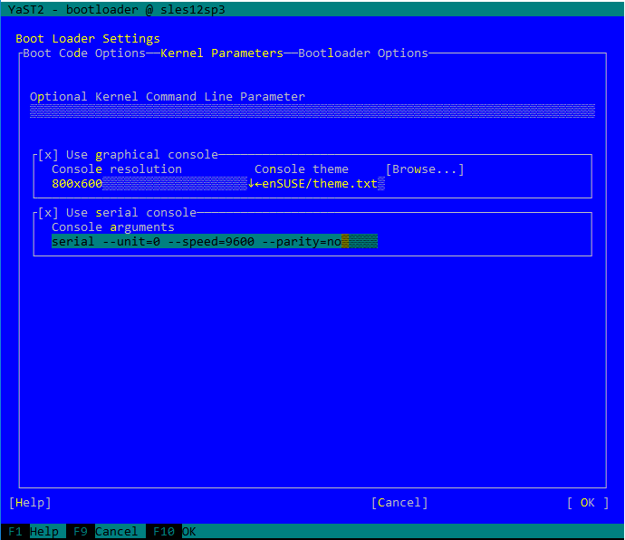

# Virtual machine serial console (preview) 

The virtual machine serial console on Azure provides access to a text-based console for Linux and Windows virtual machines. This serial connection is to COM1 serial port of the virtual machine and provides access to the virtual machine and are not related to virtual machine's network / operating system state. Access to the serial console for a virtual machine can be done only via Azure portal currently and allowed only for those users who have VM Contributor or above access to the virtual machine. 

> [!Note] 
> Previews are made available to you on the condition that you agree to the terms of use. For more information, see [Microsoft Azure Supplemental Terms of Use for Microsoft Azure Previews.] (https://azure.microsoft.com/support/legal/preview-supplemental-terms/)
> Currently this service is in **public preview** and access to the serial console for virtual machines is available to global Azure regions. At this point serial console is not available Azure Government, Azure Germany, and Azure China cloud.

## Prerequisites 

* Virtual machine  MUST have [boot diagnostics](boot-diagnostics.md) enabled 
* The account using the serial console must have [Contributor role](../../role-based-access-control/built-in-roles.md) for VM and the [boot diagnostics](boot-diagnostics.md) storage account. 
* For settings specific to Linux distro, see [Accessing the serial console for Linux](#accessing-serial-console-for-linux)

## Open the serial console
serial console for virtual machines is only accessible via [Azure portal](https://portal.azure.com). Below are the steps to access serial console for virtual machines via portal 

  1. Open the Azure portal
  2. In the left menu, select virtual machines.
  3. Click on the VM in the list. The overview page for the VM will open.
  4. Scroll down to the Support + Troubleshooting section and click on serial console (Preview) option. A new pane with the serial console will open and start the connection.

> [!NOTE] 
> Serial console requires a local user with a password configured. At this time, VMs only configured with SSH public key will not have access to the serial console. To create a local user with password, follow [VM Access Extension](https://docs.microsoft.com/azure/virtual-machines/linux/using-vmaccess-extension) and create local user with password.

### Disable feature
The serial console functionality can be deactivated for specific VMs by disabling that VM's boot diagnostics setting.

## Serial console security 

### Access security 
Access to Serial console is limited to users who have [VM Contributors](../../role-based-access-control/built-in-roles.md#virtual-machine-contributor) or above access to the virtual machine. If your AAD tenant requires Multi-Factor Authentication then access to the serial console will also need MFA as its access is via [Azure portal](https://portal.azure.com).

### Channel security
All data that is sent back and forth is encrypted on the wire.

### Audit logs
All access to the serial console is currently logged in the [boot diagnostics](https://docs.microsoft.com/azure/virtual-machines/linux/boot-diagnostics) logs of the virtual machine. Access to these logs are owned and controlled by the Azure virtual machine administrator.  

>[!CAUTION] 
While no access passwords for the console are logged, if commands run within the console contain or output passwords, secrets, user names or any other form of Personally Identifiable Information (PII), those will be written to the virtual machine boot diagnostics logs, along with all other visible text, as part of the implementation of the serial console's scrollback functionality. These logs are circular and only individuals with read permissions to the diagnostics storage account have access to them, however we recommend following the best practice of using the SSH console for anything that may involve secrets and/or PII. 

### Concurrent usage
If a user is connected to serial console and another user successfully requests access to that same virtual machine, the first user will be disconnected and the second user connected in a manner akin to the first user standing up and leaving the physical console and a new user sitting down.

>[!CAUTION] 
This means that the user who gets disconnected will not be logged out! The ability to enforce a logout upon disconnect (via SIGHUP or similar mechanism) is still in the roadmap. For Windows there is an automatic timeout enabled in SAC, however for Linux you can configure terminal timeout setting. To do this simply add `export TMOUT=600` in your .bash_profile or .profile for the user you logon in the console with, to timeout the session after 10 minutes.

### Disable feature
The serial console functionality can be deactivated for specific VMs by disabling that VM's boot diagnostics setting.

## Common scenarios for accessing serial console 
Scenario          | Actions in serial console                |  OS Applicability 
:------------------|:-----------------------------------------|:------------------
Broken FSTAB file | Enter key to continue and fix fstab file using a text editor. See [how to fix fstab issues](https://support.microsoft.com/help/3206699/azure-linux-vm-cannot-start-because-of-fstab-errors) | Linux 
Incorrect firewall rules | Access serial console and fix iptables or Windows firewall rules | Linux/Windows 
Filesystem corruption/check | Access serial console and recover filesystem | Linux/Windows 
SSH/RDP configuration issues | Access serial console and change settings | Linux/Windows 
Network lock down system| Access serial console via portal to manage system | Linux/Windows 
Interacting with bootloader | Access GRUB/BCD via the serial console | Linux/Windows 

## Accessing Serial console for Linux
In order for serial console to function properly, the guest operating system must be configured to read and write console messages to the serial port. Most [Endorsed Azure Linux Distributions](https://docs.microsoft.com/azure/virtual-machines/linux/endorsed-distros) have the serial console configured by default. Simply clicking Serial Console section in the Azure Portal will provide access to the console. 

Distro      | Serial Console access
:-----------|:---------------------
Red Hat Enterprise Linux    | Red Hat Enterprise Linux Images available on Azure have console access enabled by default. 
CentOS      | CentOS images available on Azure have console access enabled by default. 
Ubuntu      | Ubuntu images available on Azure have console access enabled by default.
CoreOS      | CoreOS images available on Azure have console access enabled by default.
SUSE        | Newer SLES images available on Azure have console access enabled by default. If you are using older versions (10 or below) of SLES on Azure, follow the [KB article](https://www.novell.com/support/kb/doc.php?id=3456486) to enable serial console. 
Oracle Linux        | Oracle Linux images available on Azure have console access enabled by default.
Custom Linux images     | To enable serial console for your custom Linux VM image, enable console access in /etc/inittab to run a terminal on ttyS0. Here is an example to add this in the inittab file: `S0:12345:respawn:/sbin/agetty -L 115200 console vt102` 

## GRUB access and Single User Mode access
Single user mode is a minimal environment minimal functionality. It can be useful for investigating boot issues or network issues. Some distros will automatically drop you into single user mode or emergency mode if the VM is unable to boot. Others, however, require additional setup before they can drop you into single-user or emergency mode automatically.

You will want to ensure that GRUB is enabled on your VM in order to be able to access single user mode. Depending on your distro, there may be some setup work to ensure that GRUB is enabled. 

### Access for Red Hat Enterprise Linux (RHEL)
RHEL will drop you into single user mode automatically if it cannot boot normally. However, if you have not set up root access for single user mode, you will not have a root password and will be unable to log in. There is a workaround (See 'Manually entering single user mode' below), but the suggestion is to set up root access initially.

#### GRUB access
RHEL comes with GRUB enabled out of the box. To enter GRUB, reboot your VM with `sudo reboot` and press any key. You will see the GRUB screen show up.

#### Setting up root access for single user mode
Single-user mode in RHEL requires the root user to be enabled, which is disabled by default. If you have a need to enable single user mode, use the following instructions:

1. Log in to the Red Hat system via SSH
1. Switch to root
1. Enable password for root user 
    * `passwd root` (set a strong root password)
1. Ensure root user can only log in via ttyS0
    * `edit /etc/ssh/sshd_config` and ensure PermitRootLogIn is set to no
    * `edit /etc/securetty file` to only allow log in via ttyS0 

Now if the system boots into single user mode you can log in via root password.

Alternatively for RHEL 7.4+ or 6.9+ you can enable single user mode in the GRUB prompts, see instructions [here](https://access.redhat.com/documentation/en-us/red_hat_enterprise_linux/5/html/installation_guide/s1-rescuemode-booting-single)

#### Manually entering single user mode
If you have set up GRUB and root access with the instructions above, then you can enter single user mode with the following instructions:

1. Press 'Esc' while restarting the VM to enter GRUB
1. In GRUB, press 'e' to edit the selected OS you want to boot into (usually the first line)
1. Find the kernel line - in Azure, this will start with `linux16`
1. Press Ctrl + E to go to the end of the line
1. Add the following to the end of the line: `systemd.unit=rescue.target`
    * This will boot you into single user mode. If you want to use emergency mode, add `systemd.unit=emergency.target` to the end of the line instead of `systemd.unit=rescue.target`
1. Press Ctrl + X to exit and reboot with the applied settings
1. You will be prompted for the administrator password before being able to enter single user mode - this is the same password you created in the instructions above

#### Single user mode without root account enabled
If you did not go through the steps above to enable the root user, you can still reset your  root password. Use the following instructions:

1. Press 'Esc' while restarting the VM to enter GRUB
1. In GRUB, press 'e' to edit the selected OS you want to boot into (usually the first line)
1. Find the kernel line - in Azure, this will start with `linux16`
1. Add `rd.break` to the end of the line, ensuring there is a space before `rd.break` (see example below)
    - This will interrupt the boot process before control is passed from `initramfs` to `systemd`. ([Source](https://access.redhat.com/documentation/en-us/red_hat_enterprise_linux/7/html/system_administrators_guide/sec-terminal_menu_editing_during_boot#sec-Changing_and_Resetting_the_Root_Password))

1. Press Ctrl + X to exit and reboot with the applied settings
1. Once you boot, you will be dropped into emergency mode with a read-only file system. Enter  `mount -o remount,rw /sysroot` into the shell to remount the root file system with read/write permissions
1. Once you boot into single user mode, type in `chroot /sysroot` to switch into the `sysroot` jail
1. You are now root. You can reset your root password with `passwd` and then use the instructions above to enter single user mode. Type `reboot -f` to reboot once you are done

> Note that running through the instructions above will drop you into emergency shell, so you can also perform tasks such as editing fstab. However, the generally accepted suggestion is to reset your root password and use that to enter single user mode. 

### Access for CentOS
Much like Red Hat Enterprise Linux, single user mode in CentOS requires GRUB and the root user to be enabled. 

#### GRUB access
CentOS comes with GRUB enabled out of the box. To enter GRUB, reboot your VM with `sudo reboot` and press any key. You will see the GRUB screen show up.

#### Single user mode
Follow the instructions for RHEL above to enable single user mode in CentOS.

### Access for Ubuntu 
Ubuntu images do not require a root password. If the system boots into single user mode, you can use it without additional credentials. 

#### GRUB access
To access GRUB, press and hold 'Esc' while the VM is booting up.

#### Single user mode
Ubuntu will drop you into single user mode automatically if it cannot boot normally. To manually enter single user mode, use the following instructions:

1. From GRUB, press 'e' to edit your boot entry (the Ubuntu entry)
1. Look for the line that starts with `linux`, then look for `ro`
1. Add `single` after `ro`, ensuring there is a space before and after `single`
1. Press Ctrl + X to reboot with these settings and enter single user mode

### Access for CoreOS
Single user mode in CoreOS requires GRUB to be enabled. 

#### GRUB access
To access GRUB, press any key when your VM is booting up.

#### Single user mode
CoreOS will drop you into single user mode automatically if it cannot boot normally. To manually enter single user mode, use the following instructions:
1. From GRUB, press 'e' to edit your boot entry
1. Look for the line that starts with `linux$`. There should be 2, encapsulated in different if/else clauses
1. Append `coreos.autologin=ttyS0` to the end of the both `linux$` lines
    * Technically, just the second `linux$` will suffice
1. Press Ctrl + X to reboot with these settings and enter single user mode

### Access for SUSE
Newer images of SLES 12 SP3+ allow access via the serial console in case the system boots into emergency mode. 

#### GRUB access
GRUB access in SLES requires bootloader configuration via YaST. To do this, follow these instructions:

1. ssh into your SLES VM and run `sudo yast bootloader`. Use the `tab` key, `enter` key, and arrow keys to navigate through the menu. 
1. Navigate to `Kernel Parameters`, and check `Use serial console`. 
1. Add `serial --unit=0 --speed=9600 --parity=no` to the Console arguments

1. Press F10 to save your settings and exit
1. To enter GRUB, reboot your VM and press any key during boot sequence to make GRUB stay on screen
    - The default timeout for GRUB is 1s. You can modify this by changing the `GRUB_TIMEOUT` variable in `/etc/default/grub`

#### Single user mode
You will be automatically dropped into emergency shell if SLES cannot boot normally. To manually enter the emergency shell, use the following instructions:

1. From GRUB, press 'e' to edit your boot entry (the SLES entry)
1. Look for the kernel line it will start with `linux`
1. Append `systemd.unit=emergency.target` to the end of the line
1. Press Ctrl + X to reboot with these settings and enter emergency shell
> You will be dropped into emergency shell with a read-only filesystem. If you want to make any edits to any files, you will need to remount the filesystem with read-write permissions. To do this, enter `mount -o remount,rw /` into the shell

### Access for Oracle Linux
Much like Red Hat Enterprise Linux, single user mode in Oracle Linux requires GRUB and the root user to be enabled. 

#### GRUB access
Oracle Linux comes with GRUB enabled out of the box. To enter GRUB, reboot your VM with `sudo reboot` and press 'Esc'. You will see the GRUB screen show up.

#### Single user mode
Follow the instructions for RHEL above to enable single user mode in Oracle Linux.

## Errors
Most errors are transient in nature and retrying the serial console connection often addresses these. Below table shows a list of errors and mitigation 

Error                            |   Mitigation 
:---------------------------------|:--------------------------------------------|
Unable to retrieve boot diagnostics settings for '<VMNAME>'. To use the serial console, ensure that boot diagnostics is enabled for this VM. | Ensure that the VM has [boot diagnostics](boot-diagnostics.md) enabled. 
The VM is in a stopped deallocated state. Start the VM and retry the serial console connection. | Virtual machine must be in a started state to access the serial console
You do not have the required permissions to use this VM the serial console. Ensure you have at least VM Contributor role permissions.| Serial console access requires certain permission to access. See [access requirements](#prerequisites) for details
Unable to determine the resource group for the boot diagnostics storage account '<STORAGEACCOUNTNAME>'. Verify that boot diagnostics is enabled for this VM and you have access to this storage account. | Serial console access requires certain permission to access.See [access requirements](#prerequisites) for details

## Known issues 
As we are still in the preview stages for serial console access, we are working through some known issues, below is the list of these with possible workarounds 

Issue                           |   Mitigation 
:---------------------------------|:--------------------------------------------|
There is no option with virtual machine scale set instance serial console |  At the time of preview, access to the serial console for virtual machine scale set instances is not supported.
Hitting enter after the connection banner does not show a log in prompt | [Hitting enter does nothing](https://github.com/Microsoft/azserialconsole/blob/master/Known_Issues/Hitting_enter_does_nothing.md)

## Frequently asked questions 
**Q. How can I send feedback?**

A. Provide feedback as an issue by going to https://aka.ms/serialconsolefeedback. Alternatively (less preferred) Send feedback via azserialhelp@microsoft.com or in the virtual machine category of http://feedback.azure.com

**Q.I get an Error "Existing console has conflicting OS type "Windows" with the requested OS type of Linux?**

A. This is a known issue to fix this, simply open [Azure Cloud Shell](https://docs.microsoft.com/azure/cloud-shell/overview) in bash mode and retry.

**Q. I am not able to access the serial console, where can I file a support case?**

A. This preview feature is covered via Azure Preview Terms. Support for this is best handled via channels mentioned above. 

## Next steps
* The the serial console is also available for [Windows](../windows/serial-console.md) VMs
* Learn more about [bootdiagnostics](boot-diagnostics.md)