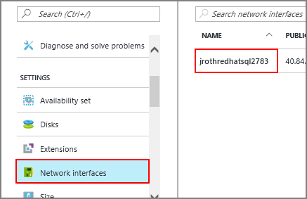
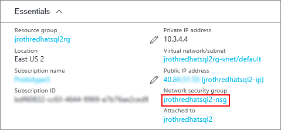

# Create a Linux SQL Server 2017 virtual machine with the Azure portal

Azure provides Linux virtual machine images that have SQL Server 2017 installed. This topic provides a short walkthrough on how to use the Azure portal to create a Linux SQL Server virtual machine.

## Create a Linux VM with SQL Server installed

Open the [Azure portal](https://portal.azure.com/).

1. Click **New** on the left.

1. In the **New** blade, click **Compute**.

1. Click **See All** next to the **Featured Apps** heading.

   

1. In the search box, type **SQL Server 2017**, and press **Enter** to start the search.

    

    > [!TIP]
    > This filter shows the available Linux virtual machine image(s) for SQL Server 2017. Over time, SQL Server 2017 images for other supported Linux distributions will be listed. You can also click this [link](https://ms.portal.azure.com/#blade/Microsoft_Azure_Marketplace/GalleryFeaturedMenuItemBlade/selectedMenuItemId/home/searchQuery/sql%20server%202017) to go directly to the search results for SQL Server 2017. 

1. Select a SQL Server 2017 image from the search results.

1. Click **Create**.

1. On the **Basics** blade, fill in the details for your Linux VM. 

    

    > [!Note]
    > You have the choice of using an SSH public key or a Password for authentication. SSH is more secure. For instructions on how to generate an SSH key, see [Create SSH keys on Linux and Mac for Linux VMs in Azure](https://docs.microsoft.com/azure/virtual-machines/virtual-machines-linux-mac-create-ssh-keys). 

1. Click **OK**.

1. On the **Size** blade, choose a machine size. For development and functional testing, we recommend a VM size of **DS2** or higher. For performance testing, use **DS13** or higher.

    

    To see other sizes, select **View all**. For more information about VM machine sizes, see [Linux VM sizes](https://docs.microsoft.com/azure/virtual-machines/virtual-machines-linux-sizes).

1. Click **Select**.

1. On the **Settings** blade, you can make changes to the settings or keep the default settings.

1. Click **OK**.

1. On the **Summary** page, click **OK** to create the VM.

> [!NOTE]
> The Azure VM pre-configures the firewall to open the SQL Server port 1433 for remote connections. But to remotely connect, you also need to add a network security group rule as described in the next section.

## <a id="remote"></a> Configure for remote connections

To be able to remotely connect to SQL Server on an Azure VM, you must configure an inbound rule on the network security group. The rule allows traffic on the port on which SQL Server listens (default of 1433). The following steps show how to use the Azure portal for this step. 

1. In the portal, select **Virtual machines**, and then select your SQL Server VM.

1. In the list of properties, select **Network interfaces**.

1. Then select the Network Interface for your VM.

    

1. Click the Network security group link.

    

1. In the properties of the Network Security Group, selct **Inbound security rules**.

1. Click the **+Add** button.

1. Provide a Name of "SQLServerRemoteConnections".

1. In the **Service** list, select **MS SQL**.

    

1. Click **OK** to save the rule for your VM.

## <a id="connect"></a> Connect to the Linux VM

If you already use a BASH shell, connect to the Azure VM using the **ssh** command. In the following command, replace the VM user name and IP address to connect to your Linux VM.

```bash
ssh -l AzureAdmin 100.55.555.555
```

You can find the IP address of your VM in the Azure portal.


If you are running on Windows and do not have a BASH shell, you can install an SSH client, such as PuTTY.

1. [Download and install PuTTY](http://www.chiark.greenend.org.uk/~sgtatham/putty/download.html).

1. Run PuTTY.

1. On the PuTTY configuration screen enter your VM's public IP address.

1. Click Open and enter your username and password at the prompts.

For more information about connecting to Linux VMs, see [Create a Linux VM on Azure using the Portal](https://docs.microsoft.com/azure/virtual-machines/virtual-machines-linux-quick-create-portal#ssh-to-the-vm).

## Configure SQL Server

1. After connecting to your Linux VM, open a new command terminal.

1. Set up SQL Server with the following command.

   ```bash
   sudo /opt/mssql/bin/mssql-conf setup
   ```

   Accept the License and enter a password for the system administrator account. You can start the server when prompted.

1. Optionally, [install the SQL Server Tools](https://docs.microsoft.com/sql/linux/sql-server-linux-setup-tools).

## Next steps

Now that you have a SQL Server 2017 virtual machine in Azure, you can connect locally with **sqlcmd** to run Transact-SQL queries.

If you configured the Azure VM for remote SQL Server connections, you should also be able to connect remotely. For an example of connecting to SQL Server on Linux from a remote Windows machine, see [Use SSMS on Windows to connect to SQL Server on Linux](https://docs.microsoft.com/sql/linux/sql-server-linux-develop-use-ssms).

For more general information about SQL Server on Linux, see the [Overview of SQL Server 2017 on Linux](https://docs.microsoft.com/sql/linux/sql-server-linux-overview). For more information about using SQL Server 2017 Linux virtual machines, see [Overview of SQL Server 2017 virtual machines on Azure](sql-server-linux-virtual-machines-overview.md).
