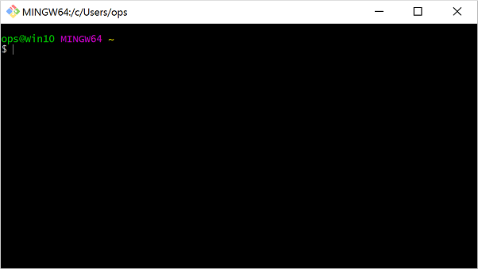
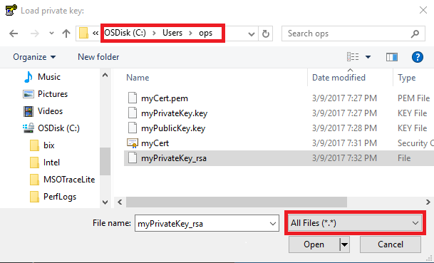
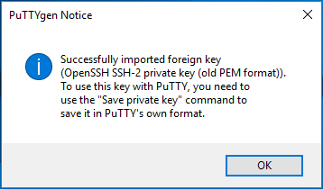
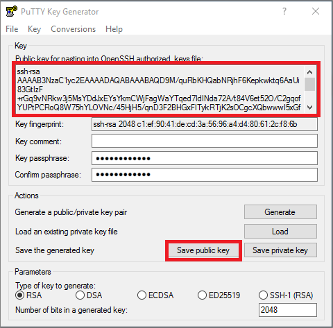
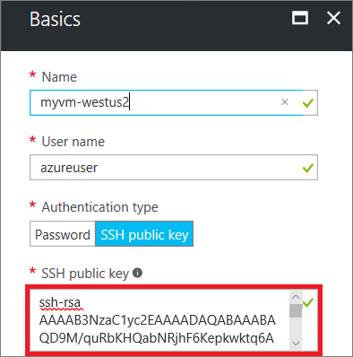
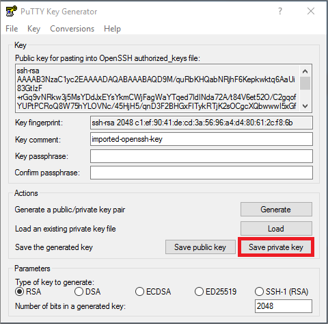
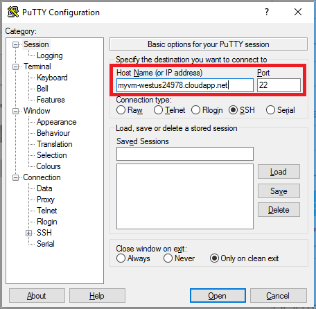
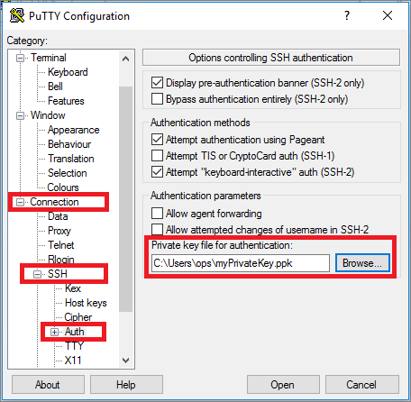

# How to Use SSH keys with Windows on Azure
> [!div class="op_single_selector"]
> * [Windows](ssh-from-windows.md?toc=%2fazure%2fvirtual-machines%2flinux%2ftoc.json)
> * [Linux/Mac](mac-create-ssh-keys.md?toc=%2fazure%2fvirtual-machines%2flinux%2ftoc.json)
>
>

When you connect to Linux virtual machines (VMs) in Azure, you should use [public-key cryptography](https://wikipedia.org/wiki/Public-key_cryptography) to provide a more secure way to log in to your Linux VM. This process involves a public and private key exchange using the secure shell (SSH) command to authenticate yourself rather than a username and password. Passwords are vulnerable to brute-force attacks, especially on Internet-facing VMs such as web servers. This article provides an overview of SSH keys and how to generate the appropriate keys on a Windows computer.

## Overview of SSH and keys
You can securely log in to your Linux VM by using public and private keys:

* The **public key** is placed on your Linux VM, or any other service that you wish to use with public-key cryptography.
* The **private key** is what you present to your Linux VM when you log in, to verify your identity. Protect this private key. Do not share it.

These public and private keys can be used on multiple VMs and services. You do not need a pair of keys for each VM or service you wish to access. For a more detailed overview, see [public-key cryptography](https://wikipedia.org/wiki/Public-key_cryptography).

SSH is an encrypted connection protocol that allows secure logins over unsecured connections. It is the default connection protocol for Linux VMs hosted in Azure. Although SSH itself provides an encrypted connection, using passwords with SSH connections still leaves the VM vulnerable to brute-force attacks or guessing of passwords. A more secure and preferred method of connecting to a VM using SSH is by using these public and private keys, also known as SSH keys.

If you do not wish to use SSH keys, you can still log in to your Linux VMs using a password. If your VM is not exposed to the Internet, using passwords may be sufficient. However, you still need to manage your passwords for each Linux VM and maintain healthy password policies and practices, such as minimum password length and regularly updating them. The use of SSH keys reduces the complexity of managing individual credentials across multiple VMs.

## Windows packages and SSH clients
You connect to and manage Linux VMs in Azure using an **SSH client**. Windows computers do not typically have an SSH client installed. The Windows 10 Anniversary Update added Bash for Windows, and the latest Windows 10 Creators Update provides additional updates. This Windows Subsystem for Linux allows you to run and access utilities such as an SSH client natively within a Bash shell. You can then follow any of the Linux docs, such as [How to generate SSH key pairs for Linux](mac-create-ssh-keys.md). Bash for Windows is still under development, and is considered a beta release. For more information about Bash for Windows, see [Bash on Ubuntu on Windows](https://msdn.microsoft.com/commandline/wsl/about).

If you wish to use something other than Bash for Windows, common Windows SSH clients you can install are included in the following packages:

* [Git For Windows](https://git-for-windows.github.io/)
* [puTTY](http://www.chiark.greenend.org.uk/~sgtatham/putty/)
* [MobaXterm](http://mobaxterm.mobatek.net/)
* [Cygwin](https://cygwin.com/)


## Which key files do you need to create?
Azure requires at least 2048-bit, **ssh-rsa** formatted public and private keys. If you are managing Azure resources using the Classic deployment model, you also need to generate a PEM (`.pem` file).

Here are the deployment scenarios, and the types of files you use in each:

1. **ssh-rsa** keys are required for any deployment using the [Azure portal](https://portal.azure.com), and Resource Manager deployments using the [Azure CLI](../../cli-install-nodejs.md).
   * These keys are usually all most people need.
2. A `.pem` file is required to create VMs using the Classic deployment. These keys are supported in Classic deployments when using the [Azure portal](https://portal.azure.com) or [Azure CLI](../../cli-install-nodejs.md).
   * You only need to create these additional keys and certificates if you are managing resources created using the Classic deployment model.

## Install Git for Windows
The preceding section listed several packages that include the `openssl` tool for Windows. This tool is needed to create public and private keys. The following examples detail how to install and use **Git for Windows**, though you can choose whichever package you prefer. **Git for Windows** gives you access to some additional open-source software ([OSS](https://en.wikipedia.org/wiki/Open-source_software)) tools and utilities that may be useful as you work with Linux VMs.

1. Download and install **Git for Windows** from the following location: [https://git-for-windows.github.io/](https://git-for-windows.github.io/).
2. Accept the default options during the install process unless you specifically need to change them.
3. Run **Git Bash** from the **Start Menu** > **Git** > **Git Bash**. The console looks similar to the following example:

    

## Create a private key
1. In your **Git Bash** window, use `openssl.exe` to create a private key. The following example creates a key named `myPrivateKey` and certificate named `myCert.pem`:

    ```bash
    openssl.exe req -x509 -nodes -days 365 -newkey rsa:2048 \
        -keyout myPrivateKey.key -out myCert.pem
    ```

    The output looks similar to the following example:

    ```bash
    Generating a 2048 bit RSA private key
    .......................................+++
    .......................+++
    writing new private key to 'myPrivateKey.key'
    -----
    You are about to be asked to enter information that will be incorporated
    into your certificate request.
    What you are about to enter is what is called a Distinguished Name or a DN.
    There are quite a few fields but you can leave some blank
    For some fields there will be a default value,
    If you enter '.', the field will be left blank.
    -----
    Country Name (2 letter code) [AU]:
    ```

   If bash reports an error, try opening a new **Git Bash** window with elevated privileges. Then, rerun the `openssl` command.

2. Answer the prompts for country name, location, organization name, etc.
3. Your new private key and certificate are created in your current working directory. As a security measure, you should set the permissions on your private key so that only you can access it:

    ```bash
    chmod 0600 myPrivateKey.key
    ```

4. The [next section](#create-a-private-key-for-putty) details using PuTTYgen to both view and use the public key, and create a private key specific for using PuTTY to SSH to Linux VMs. The following command generates a public key file named `myPublicKey.key` that you can use right away:

    ```bash
    openssl.exe rsa -pubout -in myPrivateKey.key -out myPublicKey.key
    ```

5. If you also need to manage Classic resources, convert the `myCert.pem` to `myCert.cer` (DER encoded X509 certificate). Perform this optional step only if you need to specifically manage older Classic resources.

    Convert the certificate using the following command:

    ```bash
    openssl.exe  x509 -outform der -in myCert.pem -out myCert.cer
    ```

## Create a private key for PuTTY
PuTTY is a common SSH client for Windows. You are free to use any SSH client that you wish. To use PuTTY, you need to create an additional type of key - a PuTTY Private Key (PPK). If you do not wish to use PuTTY, skip this section.

The following example creates this additional private key specifically for PuTTY to use:

1. Use **Git Bash** to convert your private key into an RSA private key that PuTTYgen can understand. The following example creates a key named `myPrivateKey_rsa` from the existing key named `myPrivateKey`:

    ```bash
    openssl rsa -in ./myPrivateKey.key -out myPrivateKey_rsa
    ```

    As a security measure, you should set the permissions on your private key so that only you can access it:

    ```bash
    chmod 0600 myPrivateKey_rsa
    ```
2. Download and run PuTTYgen from the following location: [http://www.chiark.greenend.org.uk/~sgtatham/putty/download.html](http://www.chiark.greenend.org.uk/~sgtatham/putty/download.html)
3. Click the menu: **File** > **Load Private Key**
4. Locate your private key (`myPrivateKey_rsa` in the previous example). The default directory when you start **Git Bash** is `C:\Users\%username%`. Change the file filter to show **All Files (\*.\*)**:

    
5. Click **Open**. A prompt indicates that the key has been successfully imported:

    
6. Click **OK** to close the prompt.
7. The public key is displayed at the top of the **PuTTYgen** window. You copy and paste this public key into the Azure portal or Azure Resource Manager template when you create a Linux VM. You can also click **Save public key** to save a copy to your computer:

    

    The following example shows how you would copy and paste this public key into the Azure portal when you create a Linux VM. The public key is typically then stored in `~/.ssh/authorized_keys` on your new VM.

    
8. Back in **PuTTYgen**, Click **Save private Key**:

    

   > [!WARNING]
   > A prompt asks if you wish to continue without entering a passphrase for your key. A passphrase is like a password attached to your private key. Even if someone were to obtain your private key, they still would not be able to authenticate using just the key. They would also need the passphrase. Without a passphrase, if someone obtains your private key, they can log in to any VM or service that uses that key. We recommend you create a passphrase. However, if you forget the passphrase, there is no way to recover it.
   >
   >

    If you wish to enter a passphrase, click **No**, enter a passphrase in the main PuTTYgen window, and then click **Save private key** again. Otherwise, click **Yes** to continue without providing the optional passphrase.
9. Enter a name and location to save your PPK file.

## Use Putty to SSH to a Linux Machine
Again, PuTTY is a common SSH client for Windows. You are free to use any SSH client that you wish. The following steps detail how to use your private key to authenticate with your Azure VM using SSH. The steps are similar in other SSH key clients in terms of needing to load your private key to authenticate the SSH connection.

1. Download and run putty from the following location: [http://www.chiark.greenend.org.uk/~sgtatham/putty/download.html](http://www.chiark.greenend.org.uk/~sgtatham/putty/download.html)
2. Fill in the host name or IP address of your VM from the Azure portal:

    
3. Before selecting **Open**, click **Connection** > **SSH** > **Auth** tab. Browse to and select your private key:

    
4. Click **Open** to connect to your virtual machine

## Next steps
You can also generate the public and private keys [using OS X and Linux](mac-create-ssh-keys.md?toc=%2fazure%2fvirtual-machines%2flinux%2ftoc.json).

For more information about Bash for Windows and the benefits of having OSS tools readily available on your Windows computer, see [Bash on Ubuntu on Windows](https://msdn.microsoft.com/commandline/wsl/about).

If you have trouble using SSH to connect to your Linux VMs, see [Troubleshoot SSH connections to an Azure Linux VM](troubleshoot-ssh-connection.md?toc=%2fazure%2fvirtual-machines%2flinux%2ftoc.json).
