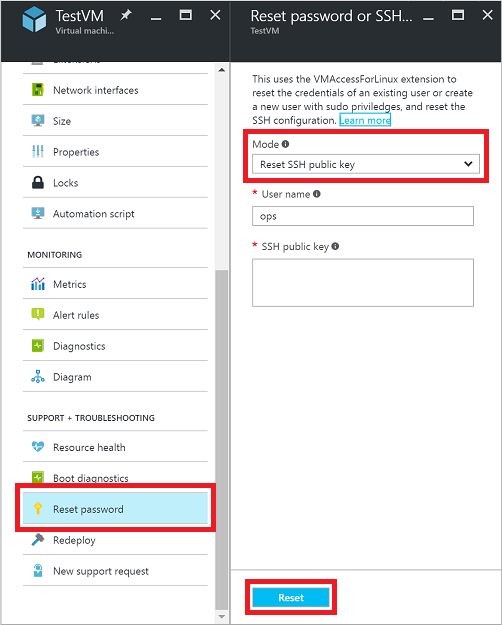
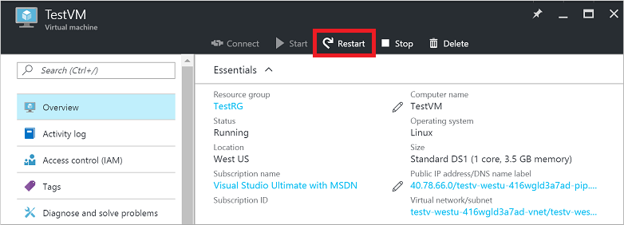
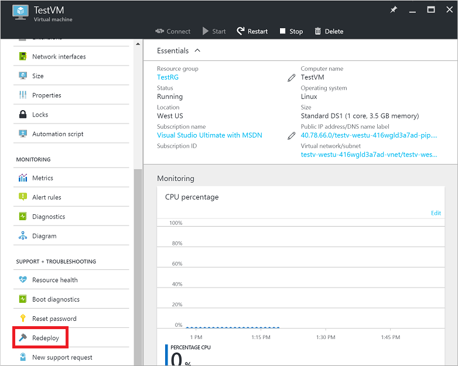

# Troubleshoot SSH connections to an Azure Linux VM that fails, errors out, or is refused
There are various reasons that you encounter Secure Shell (SSH) errors, SSH connection failures, or SSH is refused when you try to connect to a Linux virtual machine (VM). This article helps you find and correct the problems. You can use the Azure portal, Azure CLI, or VM Access Extension for Linux to troubleshoot and resolve connection problems.

[!INCLUDE [learn-about-deployment-models](../../../includes/learn-about-deployment-models-both-include.md)]

If you need more help at any point in this article, you can contact the Azure experts on [the MSDN Azure and Stack Overflow forums](http://azure.microsoft.com/support/forums/). Alternatively, you can file an Azure support incident. Go to the [Azure support site](http://azure.microsoft.com/support/options/) and select **Get support**. For information about using Azure Support, read the [Microsoft Azure support FAQ](http://azure.microsoft.com/support/faq/).

## Quick troubleshooting steps
After each troubleshooting step, try reconnecting to the VM.

1. Reset the SSH configuration.
2. Reset the credentials for the user.
3. Verify the [Network Security Group](../../virtual-network/virtual-networks-nsg.md) rules permit SSH traffic.
   * Ensure that a Network Security Group rule exists to permit SSH traffic (by default, TCP port 22).
   * You cannot use port redirection / mapping without using an Azure load balancer.
4. Check the [VM resource health](../../resource-health/resource-health-overview.md). 
   * Ensure that the VM reports as being healthy.
   * If you have boot diagnostics enabled, verify the VM is not reporting boot errors in the logs.
5. Restart the VM.
6. Redeploy the VM.

Continue reading for more detailed troubleshooting steps and explanations.

## Available methods to troubleshoot SSH connection issues
You can reset credentials or SSH configuration using one of the following methods:

* [Azure portal](#use-the-azure-portal) - great if you need to quickly reset the SSH configuration or SSH key and you don't have the Azure tools installed.
* [Azure CLI 2.0](#use-the-azure-cli-20) - if you are already on the command line, quickly reset the SSH configuration or credentials. You can also use the [Azure CLI 1.0](#use-the-azure-cli-10)
* [Azure VMAccessForLinux extension](#use-the-vmaccess-extension) - create and reuse json definition files to reset the SSH configuration or user credentials.

After each troubleshooting step, try connecting to your VM again. If you still cannot connect, try the next step.

## Use the Azure portal
The Azure portal provides a quick way to reset the SSH configuration or user credentials without installing any tools on your local computer.

Select your VM in the Azure portal. Scroll down to the **Support + Troubleshooting** section and select **Reset password** as in the following example:



### Reset the SSH configuration
As a first step, select `Reset SSH configuration only` from the **Mode** drop-down menu as in the preceding screenshot, then click the **Reset** button. Once this action has completed, try to access your VM again.

### Reset SSH credentials for a user
To reset the credentials of an existing user, select either `Reset SSH public key` or `Reset password` from the **Mode** drop-down menu as in the preceding screenshot. Specify the username and an SSH key or new password, then click the **Reset** button.

You can also create a user with sudo privileges on the VM from this menu. Enter a new username and associated password or SSH key, and then click the **Reset** button.

## Use the Azure CLI 2.0
If you haven't already, install the latest [Azure CLI 2.0](/cli/azure/install-az-cli2) and log in to an Azure account using [az login](/cli/azure/#login).

If you created and uploaded a custom Linux disk image, make sure the [Microsoft Azure Linux Agent](../windows/agent-user-guide.md?toc=%2fazure%2fvirtual-machines%2flinux%2ftoc.json) version 2.0.5 or later is installed. For VMs created using Gallery images, this access extension is already installed and configured for you.

### Reset SSH credentials for a user
The following example uses [az vm access set-linux-user](/cli/azure/vm/access#set-linux-user) to reset the credentials for `myUsername` to the value specified in `myPassword`, on the VM named `myVM` in `myResourceGroup`. Use your own values as follows:

```azurecli
az vm access set-linux-user --resource-group myResourceGroup --name myVM \
     --username myUsername --password myPassword
```

If using SSH key authentication, you can reset the SSH key for a given user. The following example uses **az vm access set-linux-user** to update the SSH key stored in `~/.ssh/id_rsa.pub` for the user named `myUsername`, on the VM named `myVM` in `myResourceGroup`. Use your own values as follows:

```azurecli
az vm access set-linux-user --resource-group myResourceGroup --name myVM \
    --username myUsername --ssh-key-value ~/.ssh/id_rsa.pub
```

## Use the VMAccess extension
The VM Access Extension for Linux reads in a json file that defines actions to carry out. These actions include resetting SSHD, resetting an SSH key, or adding a user. You still use the Azure CLI to call the VMAccess extension, but you can reuse the json files across multiple VMs if desired. This approach allows you to create a repository of json files that can then be called for given scenarios.

### Reset SSHD
Create a file named `PrivateConf.json` with the following content:

```json
{  
    "reset_ssh":"True"
}
```

Using the Azure CLI, you then call the `VMAccessForLinux` extension to reset your SSHD connection by specifying your json file. The following example resets SSHD on the VM named `myVM` in `myResourceGroup`. Use your own values as follows:

```azurecli
azure vm extension set myResourceGroup myVM \
    VMAccessForLinux Microsoft.OSTCExtensions "1.2" \
    --private-config-path PrivateConf.json
```

### Reset SSH credentials for a user
If SSHD appears to function correctly, you can reset the credentials for a giver user. To reset the password for a user, create a file named `PrivateConf.json`. The following example resets the credentials for `myUsername` to the value specified in `myPassword`. Enter the following lines into your `PrivateConf.json` file, using your own values:

```json
{
    "username":"myUsername", "password":"myPassword"
}
```

Or to reset the SSH key for a user, first create a file named `PrivateConf.json`. The following example resets the credentials for `myUsername` to the value specified in `myPassword`, on the VM named `myVM` in `myResourceGroup`. Enter the following lines into your `PrivateConf.json` file, using your own values:

```json
{
    "username":"myUsername", "ssh_key":"mySSHKey"
}
```

After creating your json file, use the Azure CLI to call the `VMAccessForLinux` extension to reset your SSH user credentials by specifying your json file. The following example resets credentials on the VM named `myVM` in `myResourceGroup`. Use your own values as follows:

```azurecli
azure vm extension set myResourceGroup myVM \
    VMAccessForLinux Microsoft.OSTCExtensions "1.2" \
    --private-config-path PrivateConf.json
```

## Use the Azure CLI 1.0
If you haven't already, [install the Azure CLI 1.0 and connect to your Azure subscription](../../cli-install-nodejs.md). Make sure that you are using Resource Manager mode as follows:

```azurecli
azure config mode arm
```

If you created and uploaded a custom Linux disk image, make sure the [Microsoft Azure Linux Agent](../windows/agent-user-guide.md?toc=%2fazure%2fvirtual-machines%2flinux%2ftoc.json) version 2.0.5 or later is installed. For VMs created using Gallery images, this access extension is already installed and configured for you.

### Reset SSH configuration
The SSHD configuration itself may be misconfigured or the service encountered an error. You can reset SSHD to make sure the SSH configuration itself is valid. Resetting SSHD should be the first troubleshooting step you take.

The following example resets SSHD on a VM named `myVM` in the resource group named `myResourceGroup`. Use your own VM and resource group names as follows:

```azurecli
azure vm reset-access --resource-group myResourceGroup --name myVM \
    --reset-ssh
```

### Reset SSH credentials for a user
If SSHD appears to function correctly, you can reset the password for a giver user. The following example resets the credentials for `myUsername` to the value specified in `myPassword`, on the VM named `myVM` in `myResourceGroup`. Use your own values as follows:

```azurecli
azure vm reset-access --resource-group myResourceGroup --name myVM \
     --user-name myUsername --password myPassword
```

If using SSH key authentication, you can reset the SSH key for a given user. The following example updates the SSH key stored in `~/.ssh/id_rsa.pub` for the user named `myUsername`, on the VM named `myVM` in `myResourceGroup`. Use your own values as follows:

```azurecli
azure vm reset-access --resource-group myResourceGroup --name myVM \
    --user-name myUsername --ssh-key-file ~/.ssh/id_rsa.pub
```


## Restart a VM
If you have reset the SSH configuration and user credentials, or encountered an error in doing so, you can try restarting the VM to address underlying compute issues.

### Azure portal
To restart a VM using the Azure portal, select your VM and click the **Restart** button as in the following example:



### Azure CLI 1.0
The following example restarts the VM named `myVM` in the resource group named `myResourceGroup`. Use your own values as follows:

```azurecli
azure vm restart --resource-group myResourceGroup --name myVM
```

### Azure CLI 2.0
The following example uses [az vm restart](/cli/azure/vm#restart) to restart the VM named `myVM` in the resource group named `myResourceGroup`. Use your own values as follows:

```azurecli
az vm restart --resource-group myResourceGroup --name myVM
```


## Redeploy a VM
You can redeploy a VM to another node within Azure, which may correct any underlying networking issues. For information about redeploying a VM, see [Redeploy virtual machine to new Azure node](../windows/redeploy-to-new-node.md?toc=%2fazure%2fvirtual-machines%2fwindows%2ftoc.json).

> [!NOTE]
> After this operation finishes, ephemeral disk data will be lost and dynamic IP addresses that are associated with the virtual machine will be updated.
> 
> 

### Azure portal
To redeploy a VM using the Azure portal, select your VM and scroll down to the **Support + Troubleshooting** section. Click the **Redeploy** button as in the following example:



### Azure CLI 1.0
The following example redeploys the VM named `myVM` in the resource group named `myResourceGroup`. Use your own values as follows:

```azurecli
azure vm redeploy --resource-group myResourceGroup --name myVM
```

### Azure CLI 2.0
The following example use [az vm redeploy](/cli/azure/vm#redeploy) to redeploy the VM named `myVM` in the resource group named `myResourceGroup`. Use your own values as follows:

```azurecli
az vm redeploy --resource-group myResourceGroup --name myVM
```

## VMs created by using the Classic deployment model
Try these steps to resolve the most common SSH connection failures for VMs that were created by using the classic deployment model. After each step, try reconnecting to the VM.

* Reset remote access from the [Azure portal](https://portal.azure.com). On the Azure portal, select your VM and click the **Reset Remote...** button.
* Restart the VM. On the [Azure portal](https://portal.azure.com), select your VM and click the **Restart** button.
    
* Redeploy the VM to a new Azure node. For information about how to redeploy a VM, see [Redeploy virtual machine to new Azure node](../windows/redeploy-to-new-node.md?toc=%2fazure%2fvirtual-machines%2fwindows%2ftoc.json).
  
    After this operation finishes, ephemeral disk data will be lost and dynamic IP addresses that are associated with the virtual machine will be updated.
* Follow the instructions in [How to reset a password or SSH for Linux-based virtual machines](classic/reset-access.md?toc=%2fazure%2fvirtual-machines%2flinux%2fclassic%2ftoc.json) to:
  
  * Reset the password or SSH key.
  * Create a *sudo* user account.
  * Reset the SSH configuration.
* Check the VM's resource health for any platform issues.<br>
     Select your VM and scroll down **Settings** > **Check Health**.

## Additional resources
* If you are still unable to SSH to your VM after following the after steps, see [more detailed troubleshooting steps](detailed-troubleshoot-ssh-connection.md?toc=%2fazure%2fvirtual-machines%2flinux%2ftoc.json) to review additional steps to resolve your issue.
* For more information about troubleshooting application access, see [Troubleshoot access to an application running on an Azure virtual machine](../windows/troubleshoot-app-connection.md?toc=%2fazure%2fvirtual-machines%2flinux%2ftoc.json)
* For more information about troubleshooting virtual machines that were created by using the classic deployment model, see [How to reset a password or SSH for Linux-based virtual machines](classic/reset-access.md?toc=%2fazure%2fvirtual-machines%2flinux%2fclassic%2ftoc.json).

