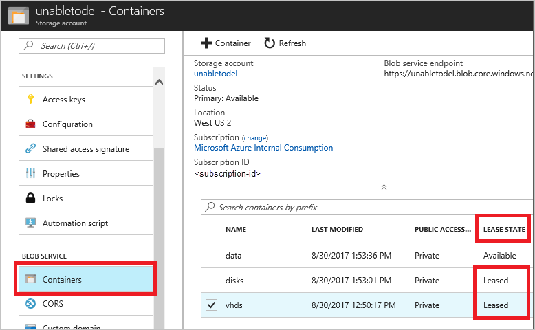
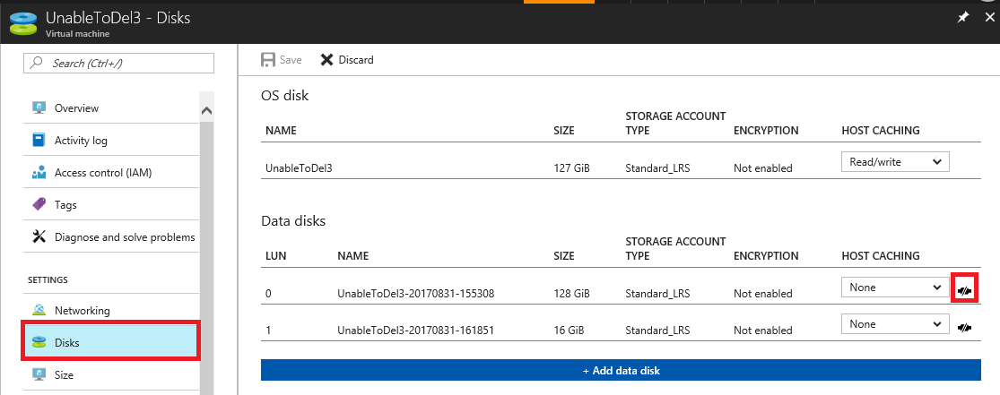

# Troubleshoot attached VHDs on Azure Linux virtual machines

Azure Virtual Machines rely on Virtual Hard Disks (VHDs) for the OS disk and any attached data disks. VHDs are stored as page blobs in one or more Azure Storage accounts. This article describes how to troubleshoot common issues that may arise with VHDs. 

  * [Unexpected reboots of VMs with attached VHDs]
  * [Storage deletion errors in Resource Manager deployment]

## Unexpected reboots of VMs with attached VHDs

If an Azure Virtual Machine (VM) has a large number of attached VHDs that are in the same storage account, you may exceed the scalability targets for an individual storage account causing the VM to fail. Check the minute metrics for the storage account (**TotalRequests**/**TotalIngress**/**TotalEgress**) for spikes that exceed the scalability targets for a storage account. See the section "[Metrics show an increase in PercentThrottlingError]" for assistance in determining if throttling has occurred on your storage account.

In general, each individual input or output operation on a VHD from a Virtual Machine translates to **Get Page** or **Put Page** operations on the underlying page blob. Therefore, you can use the estimated IOPS for your environment to tune how many VHDs you can have in a single storage account based on the specific behavior of your application. Microsoft recommends having 40 or fewer disks in a single storage account. See [Azure Storage Scalability and Performance Targets](../../storage/common/storage-scalability-targets.md) for details about scalability targets for storage accounts, in particular the total request rate and the total bandwidth for the type of storage account you are using.

If you are exceeding the scalability targets for your storage account, place your VHDs in multiple storage accounts to reduce the activity in each individual account.

## Storage deletion errors in Resource Manager deployment

This section provides troubleshooting guidance when one of the following errors occur while you are trying to delete an Azure storage account, container, or blob in an Azure Resource Manager deployment.

>**Failed to delete storage account 'StorageAccountName'. Error: The storage account cannot be deleted due to its artifacts being in use.**

>**Failed to delete # out of # container(s): vhds: There is currently a lease on the container and no lease ID was specified in the request.**

>**Failed to delete # out of # blobs: BlobName.vhd: There is currently a lease on the blob and no lease ID was specified in the request.**

The VHDs used in Azure VMs are .vhd files stored as page blobs in a standard or premium storage account in Azure.  More information about Azure disks can be found [here](../../virtual-machines/windows/about-disks-and-vhds.md). Azure prevents deletion of a disk that is attached to a VM to prevent corruption. It also prevents deletion of containers and storage accounts that have a page blob that is attached to a VM. 

The process to delete a storage account, container, or blob when receiving one of these errors is: 
1. [Identify blobs attached to a VM](#step-1-identify-blobs-attached-to-a-vm)
2. [Delete VMs with attached **OS disk**](#step-2-delete-vm-to-detach-os-disk)
3. [Detach all **data disk(s)** from remaining VM(s)](#step-3-detach-data-disk-from-the-vm)

Retry deleting storage account, container, or blob after these steps are completed.

### Step 1: Identify blob attached to a VM

#### Scenario 1: Deleting a blob – identify attached VM
1. Sign in to the [Azure portal](https://portal.azure.com).
2. On the Hub menu, select **All resources**. Go to the storage account, under **Blob Service** select **Containers**, and navigate to the blob to delete.
3. If the blob **Lease State** is **Leased**, then right-click and select **Edit Metadata** to open Blob metadata pane. 

    

4. In Blob metadata pane, check and record the value for **MicrosoftAzureCompute_VMName**. This value is the name of the VM that the VHD is attached to. (See **important** if this field does not exist)
5. In Blob metadata pane, check and record the value of **MicrosoftAzureCompute_DiskType**. This value identifies if the attached disk is OS or data disk (See **important** if this field does not exist). 

     

6. If the blob disk type is **OSDisk** follow [Step 2: Delete VM to detach OS disk](#step-2-delete-vm-to-detach-os-disk). Otherwise, if the blob disk type is **DataDisk** follow the steps in [Step 3: Detach data disk from the VM](#step-3-detach-data-disk-from-the-vm). 

> [!IMPORTANT]
> If **MicrosoftAzureCompute_VMName** and **MicrosoftAzureCompute_DiskType** do not appear in the blob metadata, it indicates that the blob is explicitly leased and is not attached to a VM. Leased blobs cannot be deleted without breaking the lease first. To break lease, right-click on the blob and select **Break lease**. Leased blobs that are not attached to a VM prevent deletion of the blob, but do not prevent deletion of container or storage account.

#### Scenario 2: Deleting a container - identify all blob(s) within container that are attached to VMs
1. Sign in to the [Azure portal](https://portal.azure.com).
2. On the Hub menu, select **All resources**. Go to the storage account, under **Blob Service** select **Containers**, and find the container to be deleted.
3. Click to open the container and the list of blobs inside it will appear. Identify all the blobs with Blob Type = **Page blob** and Lease State = **Leased** from this list. Follow [Scenario 1](#step-1-identify-blobs-attached-to-a-vm) to identify the VM associated with each of these blobs.

    

4. Follow [Step 2](#step-2-delete-vm-to-detach-os-disk) and [Step 3](#step-3-detach-data-disk-from-the-vm) to delete VM(s) with **OSDisk** and detach **DataDisk**. 

#### Scenario 3: Deleting storage account - identify all blob(s) within storage account that are attached to VMs
1. Sign in to the [Azure portal](https://portal.azure.com).
2. On the Hub menu, select **All resources**. Go to the storage account, under **Blob Service** select **Containers**.

    

3. In **Containers** pane, identify all containers where **Lease State** is **Leased** and follow [Scenario 2](#scenario-2-deleting-a-container---identify-all-blobs-within-container-that-are-attached-to-vms) for each **Leased** container.
4. Follow [Step 2](#step-2-delete-vm-to-detach-os-disk) and [Step 3](#step-3-detach-data-disk-from-the-vm) to delete VM(s) with **OSDisk** and detach **DataDisk**. 

### Step 2: Delete VM to detach OS disk
If the VHD is an OS disk, you must delete the VM before the attached VHD can be deleted. No additional action will be required for data disks attached to the same VM once these steps are completed:

1. Sign in to the [Azure portal](https://portal.azure.com).
2. On the Hub menu, select **Virtual Machines**.
3. Select the VM that the VHD is attached to.
4. Make sure that nothing is actively using the virtual machine, and that you no longer need the virtual machine.
5. At the top of the **Virtual Machine details** pane, select **Delete**, and then click **Yes** to confirm.
6. The VM should be deleted, but the VHD can be retained. However, the VHD should no longer be attached to a VM or have a lease on it. It may take a few minutes for the lease to be released. To verify that the lease is released, browse to the blob location and in the **Blob properties** pane, the **Lease Status** should be **Available**.

### Step 3: Detach data disk from the VM
If the VHD is a data disk, detach the VHD from the VM to remove the lease:

1. Sign in to the [Azure portal](https://portal.azure.com).
2. On the Hub menu, select **Virtual Machines**.
3. Select the VM that the VHD is attached to.
4. Select **Disks** on the **Virtual Machine details** pane.
5. Select the data disk to be deleted the VHD is attached to. You can determine which blob is attached in the disk by checking the URL of the VHD.
6. You can verify the blob location by clicking on the disk to check the path in **VHD URI** field.
7. Select **Edit** on the top of **Disks** pane.
8. Click **detach icon** of the data disk to be deleted.

     

9. Select **Save**. The disk is now detached from the VM, and the VHD is no longer leased. It may take a few minutes for the lease to be released. To verify that the lease has been released, browse to the blob location and in the **Blob properties** pane, the **Lease Status** value should be **Unlocked** or **Available**.

[Unexpected reboots of VMs with attached VHDs]: #you-are-experiencing-unexpected-reboots
[Storage deletion errors in Resource Manager deployment]: #storage-delete-errors-in-rm