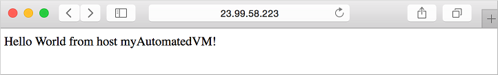
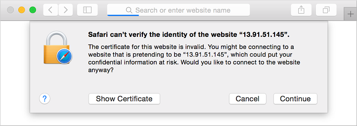
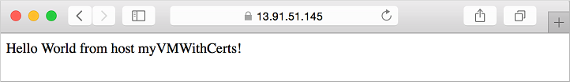

# Tutorial - How to use cloud-init to customize a Linux virtual machine in Azure on first boot

In a previous tutorial, you learned how to SSH to a virtual machine (VM) and manually install NGINX. To create VMs in a quick and consistent manner, some form of automation is typically desired. A common approach to customize a VM on first boot is to use [cloud-init](https://cloudinit.readthedocs.io). In this tutorial you learn how to:

> [!div class="checklist"]
> * Create a cloud-init config file
> * Create a VM that uses a cloud-init file
> * View a running Node.js app after the VM is created
> * Use Key Vault to securely store certificates
> * Automate secure deployments of NGINX with cloud-init

If you choose to install and use the CLI locally, this tutorial requires that you are running the Azure CLI version 2.0.30 or later. Run `az --version` to find the version. If you need to install or upgrade, see [Install Azure CLI]( /cli/azure/install-azure-cli).

## Cloud-init overview
[Cloud-init](https://cloudinit.readthedocs.io) is a widely used approach to customize a Linux VM as it boots for the first time. You can use cloud-init to install packages and write files, or to configure users and security. As cloud-init runs during the initial boot process, there are no additional steps or required agents to apply your configuration.

Cloud-init also works across distributions. For example, you don't use **apt-get install** or **yum install** to install a package. Instead you can define a list of packages to install. Cloud-init automatically uses the native package management tool for the distro you select.

We are working with our partners to get cloud-init included and working in the images that they provide to Azure. For detailed information cloud-init support for each distribution, see [Cloud-init support for VMs in Azure](using-cloud-init.md).


## Create cloud-init config file
To see cloud-init in action, create a VM that installs NGINX and runs a simple 'Hello World' Node.js app. The following cloud-init configuration installs the required packages, creates a Node.js app, then initialize and starts the app.

At your bash prompt or in the Cloud Shell, create a file named *cloud-init.txt* and paste the following configuration. For example, type `sensible-editor cloud-init.txt` to create the file and see a list of available editors. Make sure that the whole cloud-init file is copied correctly, especially the first line:

```yaml
#cloud-config
package_upgrade: true
packages:
  - nginx
  - nodejs
  - npm
write_files:
  - owner: www-data:www-data
    path: /etc/nginx/sites-available/default
    content: |
      server {
        listen 80;
        location / {
          proxy_pass http://localhost:3000;
          proxy_http_version 1.1;
          proxy_set_header Upgrade $http_upgrade;
          proxy_set_header Connection keep-alive;
          proxy_set_header Host $host;
          proxy_cache_bypass $http_upgrade;
        }
      }
  - owner: azureuser:azureuser
    path: /home/azureuser/myapp/index.js
    content: |
      var express = require('express')
      var app = express()
      var os = require('os');
      app.get('/', function (req, res) {
        res.send('Hello World from host ' + os.hostname() + '!')
      })
      app.listen(3000, function () {
        console.log('Hello world app listening on port 3000!')
      })
runcmd:
  - service nginx restart
  - cd "/home/azureuser/myapp"
  - npm init
  - npm install express -y
  - nodejs index.js
```

For more information about cloud-init configuration options, see [cloud-init config examples](https://cloudinit.readthedocs.io/en/latest/topics/examples.html).

## Create virtual machine
Before you can create a VM, create a resource group with [az group create](/cli/azure/group#az_group_create). The following example creates a resource group named *myResourceGroupAutomate* in the *eastus* location:

```azurecli-interactive
az group create --name myResourceGroupAutomate --location eastus
```

Now create a VM with [az vm create](/cli/azure/vm#az_vm_create). Use the `--custom-data` parameter to pass in your cloud-init config file. Provide the full path to the *cloud-init.txt* config if you saved the file outside of your present working directory. The following example creates a VM named *myVM*:

```azurecli-interactive
az vm create \
    --resource-group myResourceGroupAutomate \
    --name myAutomatedVM \
    --image UbuntuLTS \
    --admin-username azureuser \
    --generate-ssh-keys \
    --custom-data cloud-init.txt
```

It takes a few minutes for the VM to be created, the packages to install, and the app to start. There are background tasks that continue to run after the Azure CLI returns you to the prompt. It may be another couple of minutes before you can access the app. When the VM has been created, take note of the `publicIpAddress` displayed by the Azure CLI. This address is used to access the Node.js app via a web browser.

To allow web traffic to reach your VM, open port 80 from the Internet with [az vm open-port](/cli/azure/vm#az_vm_open_port):

```azurecli-interactive
az vm open-port --port 80 --resource-group myResourceGroupAutomate --name myAutomatedVM
```

## Test web app
Now you can open a web browser and enter *http:\/\/\<publicIpAddress>* in the address bar. Provide your own public IP address from the VM create process. Your Node.js app is displayed as shown in the following example:




## Inject certificates from Key Vault
This optional section shows how you can securely store certificates in Azure Key Vault and inject them during the VM deployment. Rather than using a custom image that includes the certificates baked-in, this process ensures that the most up-to-date certificates are injected to a VM on first boot. During the process, the certificate never leaves the Azure platform or is exposed in a script, command-line history, or template.

Azure Key Vault safeguards cryptographic keys and secrets, such as certificates or passwords. Key Vault helps streamline the key management process and enables you to maintain control of keys that access and encrypt your data. This scenario introduces some Key Vault concepts to create and use a certificate, though is not an exhaustive overview on how to use Key Vault.

The following steps show how you can:

- Create an Azure Key Vault
- Generate or upload a certificate to the Key Vault
- Create a secret from the certificate to inject in to a VM
- Create a VM and inject the certificate

### Create an Azure Key Vault
First, create a Key Vault with [az keyvault create](/cli/azure/keyvault#az_keyvault_create) and enable it for use when you deploy a VM. Each Key Vault requires a unique name, and should be all lower case. Replace `mykeyvault` in the following example with your own unique Key Vault name:

```azurecli-interactive
keyvault_name=mykeyvault
az keyvault create \
    --resource-group myResourceGroupAutomate \
    --name $keyvault_name \
    --enabled-for-deployment
```

### Generate certificate and store in Key Vault
For production use, you should import a valid certificate signed by trusted provider with [az keyvault certificate import](/cli/azure/keyvault/certificate#az_keyvault_certificate_import). For this tutorial, the following example shows how you can generate a self-signed certificate with [az keyvault certificate create](/cli/azure/keyvault/certificate#az_keyvault_certificate_create) that uses the default certificate policy:

```azurecli-interactive
az keyvault certificate create \
    --vault-name $keyvault_name \
    --name mycert \
    --policy "$(az keyvault certificate get-default-policy --output json)"
```


### Prepare certificate for use with VM
To use the certificate during the VM create process, obtain the ID of your certificate with [az keyvault secret list-versions](/cli/azure/keyvault/secret#az_keyvault_secret_list_versions). The VM needs the certificate in a certain format to inject it on boot, so convert the certificate with [az vm secret format](/cli/azure/vm). The following example assigns the output of these commands to variables for ease of use in the next steps:

```azurecli-interactive
secret=$(az keyvault secret list-versions \
          --vault-name $keyvault_name \
          --name mycert \
          --query "[?attributes.enabled].id" --output tsv)
vm_secret=$(az vm secret format --secret "$secret" --output json)
```


### Create cloud-init config to secure NGINX
When you create a VM, certificates and keys are stored in the protected */var/lib/waagent/* directory. To automate adding the certificate to the VM and configuring NGINX, you can use an updated cloud-init config from the previous example.

Create a file named *cloud-init-secured.txt* and paste the following configuration. If you use the Cloud Shell, create the cloud-init config file there and not on your local machine. For example, type `sensible-editor cloud-init-secured.txt` to create the file and see a list of available editors. Make sure that the whole cloud-init file is copied correctly, especially the first line:

```yaml
#cloud-config
package_upgrade: true
packages:
  - nginx
  - nodejs
  - npm
write_files:
  - owner: www-data:www-data
    path: /etc/nginx/sites-available/default
    content: |
      server {
        listen 80;
        listen 443 ssl;
        ssl_certificate /etc/nginx/ssl/mycert.cert;
        ssl_certificate_key /etc/nginx/ssl/mycert.prv;
        location / {
          proxy_pass http://localhost:3000;
          proxy_http_version 1.1;
          proxy_set_header Upgrade $http_upgrade;
          proxy_set_header Connection keep-alive;
          proxy_set_header Host $host;
          proxy_cache_bypass $http_upgrade;
        }
      }
  - owner: azureuser:azureuser
    path: /home/azureuser/myapp/index.js
    content: |
      var express = require('express')
      var app = express()
      var os = require('os');
      app.get('/', function (req, res) {
        res.send('Hello World from host ' + os.hostname() + '!')
      })
      app.listen(3000, function () {
        console.log('Hello world app listening on port 3000!')
      })
runcmd:
  - secretsname=$(find /var/lib/waagent/ -name "*.prv" | cut -c -57)
  - mkdir /etc/nginx/ssl
  - cp $secretsname.crt /etc/nginx/ssl/mycert.cert
  - cp $secretsname.prv /etc/nginx/ssl/mycert.prv
  - service nginx restart
  - cd "/home/azureuser/myapp"
  - npm init
  - npm install express -y
  - nodejs index.js
```

### Create secure VM
Now create a VM with [az vm create](/cli/azure/vm#az_vm_create). The certificate data is injected from Key Vault with the `--secrets` parameter. As in the previous example, you also pass in the cloud-init config with the `--custom-data` parameter:

```azurecli-interactive
az vm create \
    --resource-group myResourceGroupAutomate \
    --name myVMWithCerts \
    --image UbuntuLTS \
    --admin-username azureuser \
    --generate-ssh-keys \
    --custom-data cloud-init-secured.txt \
    --secrets "$vm_secret"
```

It takes a few minutes for the VM to be created, the packages to install, and the app to start. There are background tasks that continue to run after the Azure CLI returns you to the prompt. It may be another couple of minutes before you can access the app. When the VM has been created, take note of the `publicIpAddress` displayed by the Azure CLI. This address is used to access the Node.js app via a web browser.

To allow secure web traffic to reach your VM, open port 443 from the Internet with [az vm open-port](/cli/azure/vm#az_vm_open_port):

```azurecli-interactive
az vm open-port \
    --resource-group myResourceGroupAutomate \
    --name myVMWithCerts \
    --port 443
```

### Test secure web app
Now you can open a web browser and enter *https:\/\/\<publicIpAddress>* in the address bar. Provide your own public IP address as shown in the output of the previous VM create process. Accept the security warning if you used a self-signed certificate:



Your secured NGINX site and Node.js app is then displayed as in the following example:




## Next steps
In this tutorial, you configured VMs on first boot with cloud-init. You learned how to:

> [!div class="checklist"]
> * Create a cloud-init config file
> * Create a VM that uses a cloud-init file
> * View a running Node.js app after the VM is created
> * Use Key Vault to securely store certificates
> * Automate secure deployments of NGINX with cloud-init

Advance to the next tutorial to learn how to create custom VM images.

> [!div class="nextstepaction"]
> [Create custom VM images](./tutorial-custom-images.md)
