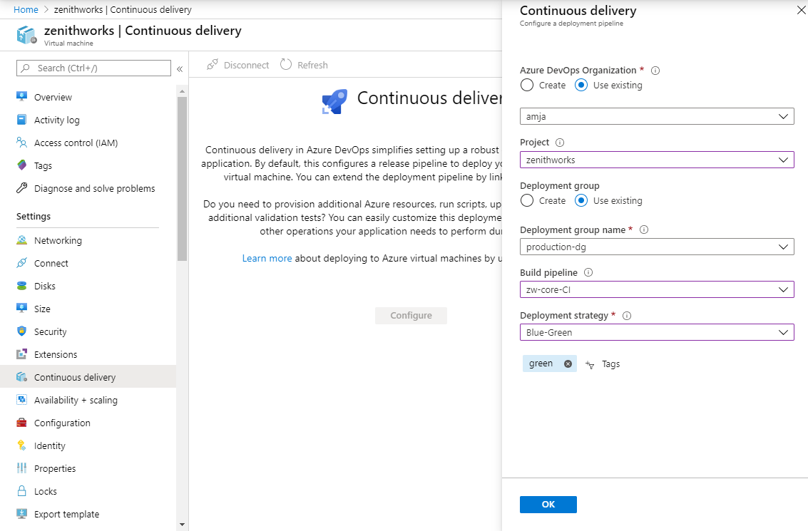
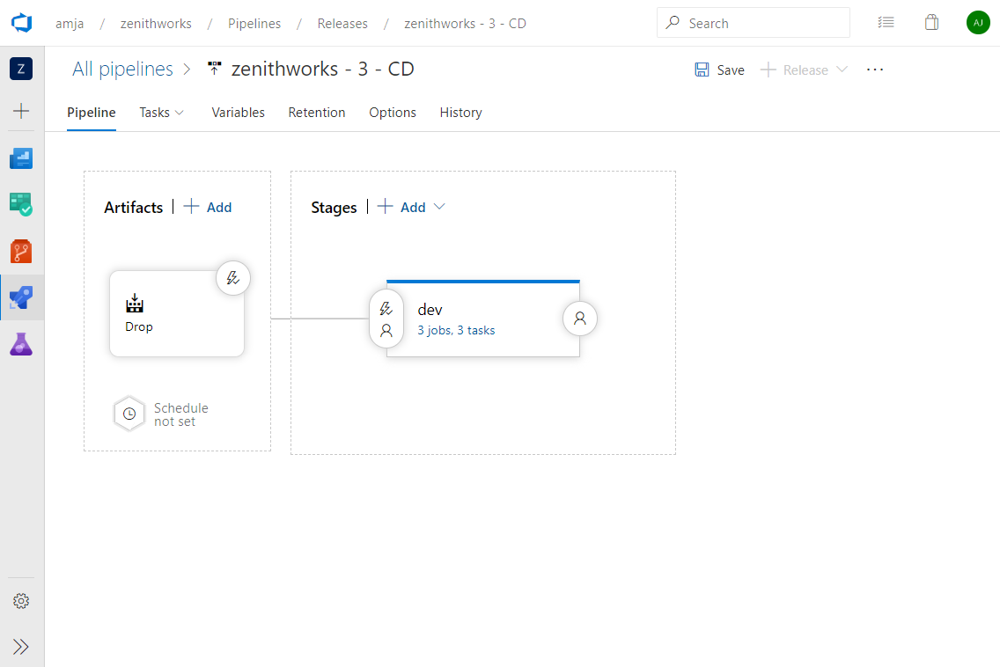
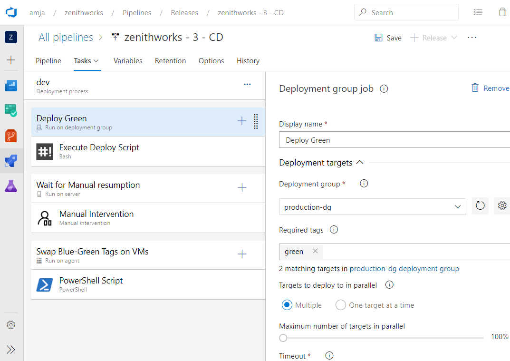

# Tutorial - Configure the blue-green deployment strategy for Azure Linux virtual machines

## Infrastructure as a service (IaaS) - Configure CI/CD

Azure Pipelines provides a fully featured set of CI/CD automation tools for deployments to virtual machines. You can configure a continuous-delivery pipeline for an Azure VM from the Azure portal.

This article shows how to set up a CI/CD pipeline that uses the blue-green strategy for multimachine deployments. The Azure portal also supports other strategies like [rolling](https://aka.ms/AA7jlh8) and [canary](https://aka.ms/AA7jdrz).

### Configure CI/CD on virtual machines

You can add virtual machines as targets to a [deployment group](https://docs.microsoft.com/azure/devops/pipelines/release/deployment-groups). You can then target them for multimachine updates. After you deploy to machines, view **Deployment History** within a deployment group. This view lets you trace from VM to the pipeline and then to the commit.

### Blue-green deployments

A blue-green deployment reduces downtime by having an identical standby environment. Only one environment is live at any time.

As you prepare for a new release, complete the final stage of testing in the green environment. After the software works in the green environment, switch traffic so that all incoming requests go to the green environment. The blue environment is idle.

Using the continuous-delivery option, you can configure blue-green deployments to your virtual machines from the Azure portal. Here is the step-by-step walk-through:

1. Sign in to the Azure portal and navigate to a virtual machine.
1. In the leftmost pane of the VM settings, select **Continuous delivery**. Then select **Configure**.

   

1. In the configuration panel, select **Azure DevOps Organization** to choose an existing account or create a new one. Then select the project under which you want to configure the pipeline.  

   

1. A deployment group is a logical set of deployment target machines that represent the physical environments. Dev, Test, UAT, and Production are examples. You can create a new deployment group or select an existing one.
1. Select the build pipeline that publishes the package to be deployed to the virtual machine. The published package should have a deployment script named deploy.ps1 or deploy.sh in the deployscripts folder in the package's root folder. The pipeline runs this deployment script.
1. In **Deployment strategy**, select **Blue-Green**.
1. Add a "blue" or "green" tag to VMs that are to be part of blue-green deployments. If a VM is for a standby role, tag it as "green". Otherwise, tag it as "blue".

   

1. Select **OK** to configure the continuous-delivery pipeline to deploy to the virtual machine.

   

1. The deployment details for the virtual machine are displayed. You can select the link to go to the release pipeline in Azure DevOps. In the release pipeline, select **Edit** to view the pipeline configuration. The pipeline has these three phases:

   1. This phase is a deployment-group phase. Applications are deployed to standby VMs, which are tagged as "green".
   1. In this phase, the pipeline pauses and waits for manual intervention to resume the run. Users can resume the pipeline run once they have manually ensured stability of deployment to VMs tagged as "green".
   1. This phase swaps the "blue" and "green" tags in the VMs. This ensures that VMs with older application versions are now tagged as "green". During the next pipeline run, applications will be deployed to these VMs.

      

1. The Execute Deploy Script task by default runs the deployment script deploy.ps1 or deploy.sh. The script is in the deployscripts folder in the root folder of the published package. Ensure that the selected build pipeline publishes the deployment in the root folder of the package.

   

## Other deployment strategies

- [Configure the rolling deployment strategy](https://aka.ms/AA7jlh8)
- [Configure the canary deployment strategy](https://aka.ms/AA7jdrz)

## Azure DevOps Projects

You can get started with Azure easily. With Azure DevOps Projects, start running your application on any Azure service in just three steps by selecting:

- An application language
- A runtime
- An Azure service

[Learn more](https://azure.microsoft.com/features/devops-projects/).

## Additional resources

- [Deploy to Azure virtual machines by using Azure DevOps Projects](https://docs.microsoft.com/azure/devops-project/azure-devops-project-vms)
- [Implement continuous deployment of your app to an Azure virtual machine scale set](https://docs.microsoft.com/azure/devops/pipelines/apps/cd/azure/deploy-azure-scaleset)
