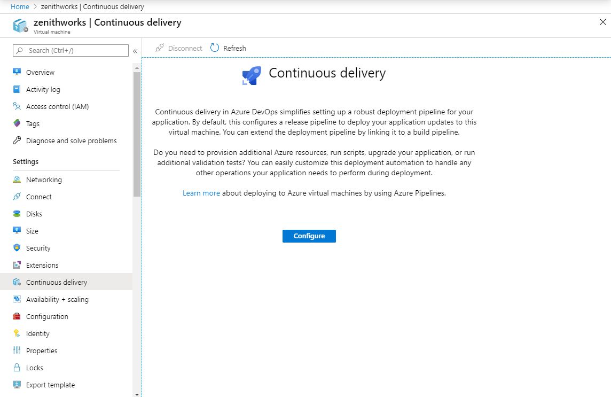
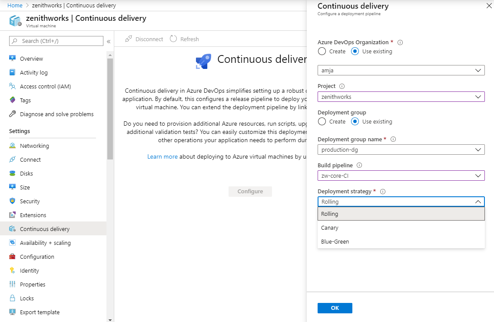
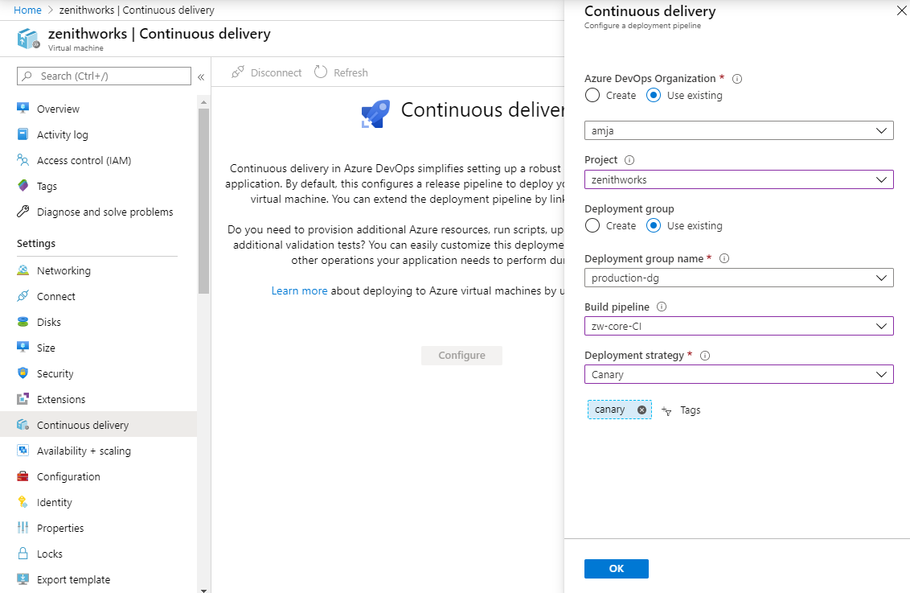
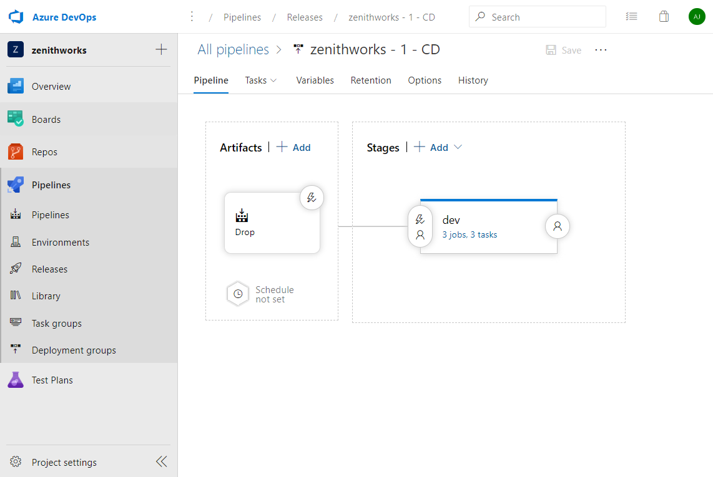
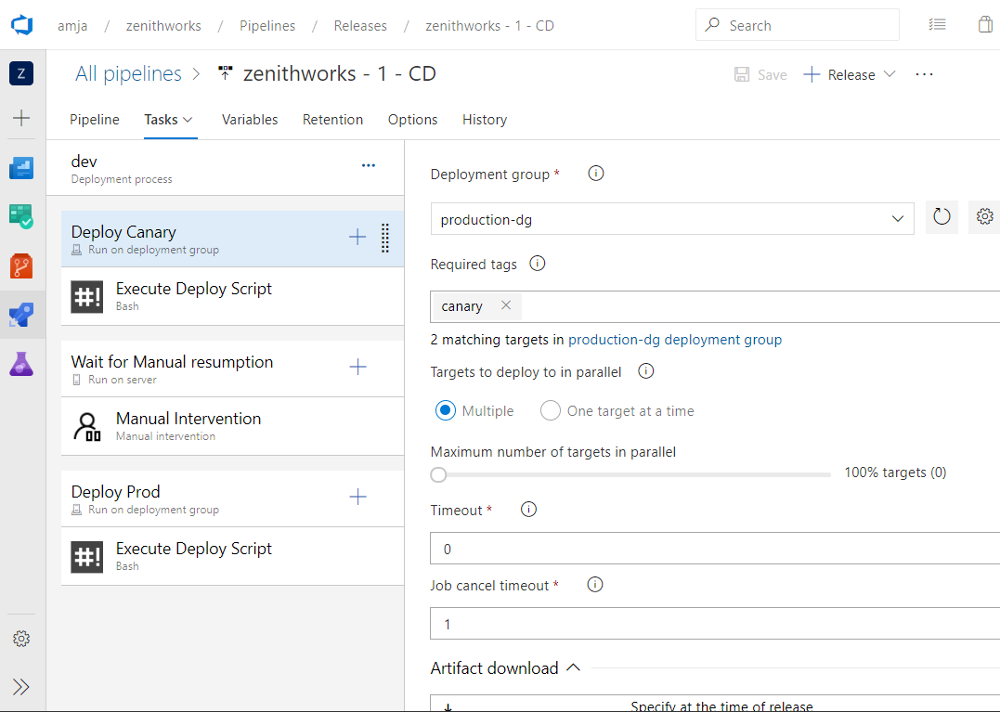
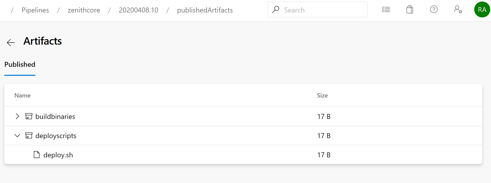

# Tutorial - Configure the canary deployment strategy for Azure Linux Virtual Machines

## Infrastructure as a service (IaaS) - Configure CI/CD

Azure Pipelines provides a fully featured set of CI/CD automation tools for deployments to virtual machines. You can configure a continuous-delivery pipeline for an Azure VM from the Azure portal.

This article shows how to set up a CI/CD pipeline that uses the canary strategy for multimachine deployments. The Azure portal also supports other strategies like [rolling](https://aka.ms/AA7jlh8) and [blue-green](https://aka.ms/AA83fwu).

### Configure CI/CD on virtual machines

You can add virtual machines as targets to a [deployment group](https://docs.microsoft.com/azure/devops/pipelines/release/deployment-groups). You can then target them for multimachine updates. After you deploy to machines, view **Deployment History** within a deployment group. This view lets you trace from VM to the pipeline and then to the commit.

### Canary deployments

A canary deployment reduces risk by slowly rolling out changes to a small subset of users. As you gain confidence in the new version, you can release it to more servers in your infrastructure and route more users to it.

Using the continuous-delivery option, you can configure canary deployments to your virtual machines from the Azure portal. Here is the step-by-step walk-through:

1. Sign in to the Azure portal and navigate to a virtual machine.
1. In the leftmost pane of the VM settings, select **Continuous delivery**. Then select **Configure**.

   

1. In the configuration panel, select **Azure DevOps Organization** to choose an existing account or create a new one. Then select the project under which you want to configure the pipeline.  

   

1. A deployment group is a logical set of deployment target machines that represent the physical environments. Dev, Test, UAT, and Production are examples. You can create a new deployment group or select an existing one.
1. Select the build pipeline that publishes the package to be deployed to the virtual machine. The published package should have a deployment script named deploy.ps1 or deploy.sh in the deployscripts folder in the package's root folder. The pipeline runs this deployment script.
1. In **Deployment strategy**, select **Canary**.
1. Add a "canary" tag to VMs that are to be part of canary deployments. Add a "prod" tag to VMs that are part of deployments made after canary deployment succeeds. Tags help you target only VMs that have a specific role.

   

1. Select **OK** to configure the continuous-delivery pipeline to deploy to the virtual machine.

   

1. The deployment details for the virtual machine are displayed. You can select the link to go to the release pipeline in Azure DevOps. In the release pipeline, select **Edit** to view the pipeline configuration. The pipeline has these three phases:

   1. This phase is a deployment-group phase. Applications are deployed to VMs that are tagged as "canary".
   1. In this phase, the pipeline pauses and waits for manual intervention to resume the run.
   1. This is again a deployment group phase. The update is now deployed to VMs tagged as "prod".

      

1. Before resuming the pipeline run, ensure that at least one VM is tagged as "prod". In the third phase of the pipeline, applications are deployed to only those VMs that have the "prod" tag.

1. The Execute Deploy Script task by default runs the deployment script deploy.ps1 or deploy.sh. The script is in the deployscripts folder in the root folder of the published package. Ensure that the selected build pipeline publishes the deployment in the root folder of the package.

   

## Other deployment strategies
- [Configure the rolling deployment strategy](https://aka.ms/AA7jlh8)
- [Configure the blue-green deployment strategy](https://aka.ms/AA83fwu)

## Azure DevOps Projects

You can get started with Azure easily. With Azure DevOps Projects, start running your application on any Azure service in just three steps by selecting:

- An application language
- A runtime
- An Azure service

[Learn more](https://azure.microsoft.com/features/devops-projects/).

## Additional resources

- [Deploy to Azure virtual machines by using Azure DevOps Projects](https://docs.microsoft.com/azure/devops-project/azure-devops-project-vms)
- [Implement continuous deployment of your app to an Azure virtual machine scale set](https://docs.microsoft.com/azure/devops/pipelines/apps/cd/azure/deploy-azure-scaleset)
